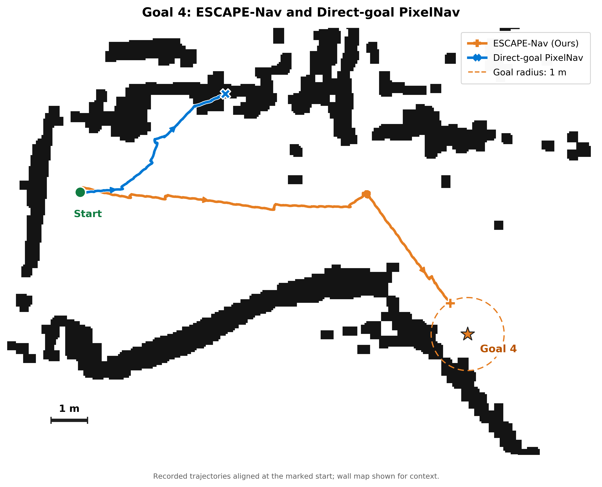

# Goal 4: ESCAPE-Nav / Direct-goal PixelNav 비교 그림

사용자가 지정한 `2dmap/0913/fig6_wall_only_trajectories.png`의 벽 지도와 축 배치를 바탕으로, **Goal 4와 두 개의 실제 기록 궤적만 표시**했다. 축척 막대는 **1m**다. 기존 5-goal 그림은 보존했다.



- [300dpi PNG](../fig6_goal4_ours_vs_pixnav.png)
- [PDF](../fig6_goal4_ours_vs_pixnav.pdf)
- [편집용 SVG](../fig6_goal4_ours_vs_pixnav.svg)
- [PixelNav 5회 후보 비교](pixnav_candidates.png)

## 선택한 회차

| 표시 | 원본 회차 | 로그상 종료 | 최종 목표 거리 | 주행 경로 길이¹ | 시간 |
|---|---|---|---:|---:|---:|
| 주황 | `original5/full-goal-4-009` | `GOAL_DISTANCE_REACHED` | 0.984m | 14.97m | 302.35s |
| 파랑 | `recaptured5/direct_goal-goal-4-004` | `PIXNAV_TERMINAL_BEFORE_GOAL` | 9.345m | 6.01m | 70.54s |

¹ 연속 odom XY를 10Hz로 보간해 집계한 기존 분석값. 그림 자체에는 보간·평활화를 적용하지 않고 각각 5,359개, 1,243개의 원본 내보내기 좌표를 그대로 연결했다.

Ours는 요청한 기존 Fig.6의 Goal 4 회차다. PixelNav는 002~006 다섯 회차를 비교한 뒤, **초기 전진 이후 지속해서 왼쪽으로 꺾이는 구간이 뚜렷한 004**를 선택했다. 003은 더 멀리 갔지만 방향 변화가 상대적으로 작고, 006은 비슷하게 왼쪽으로 향하지만 꺾인 뒤 구간이 짧다. 이는 사용자가 요청한 꺾임의 시각적 가독성을 위한 정성 사례 선택이며 전체 성능의 대표값으로 선발한 것이 아니다. 다섯 후보를 `pixnav_candidates.png`와 `figure_metadata.json`에 함께 남겼다.

별은 Goal 4, 점선 원은 1m 도착 반경, 녹색 원은 표시 시작점이다. 주황 `+`와 파랑 `×`는 각 기록의 주행 종료 지점이며, 선 위 화살표는 기록 순서를 따른 이동 방향이다. 저장된 goal yaw는 최종 제어·평가 대상이 아니므로 도착 방향 화살표를 넣지 않았다.

## 좌표와 재현 근거

- 두 회차의 Goal 4 좌표는 동일한 `(10.613861243952254, -3.886405544069355)m`다. 원점 직선거리는 11.303m이며 최단 통행 경로 거리가 아니다.
- 두 회차의 지도 DB 해시는 `38348c5458ce632851c628f53a51f3fee40cf1678e5fb982361bd1f50fb16ad9`로 동일하다.
- `experiments/0914/night_log_review/episodes/.../trajectory.csv`는 각 회차의 목표 발송 시 odom 시작 위치·방향을 빼서 변환한 `episode_start` 좌표다. 서로 다른 부팅의 raw odom 좌표를 그대로 겹치지 않았다.
- 지도는 원래 템플릿의 `2d_wall_only.png`와 `2d_metadata.json`을 그대로 사용했다. 픽셀 변환도 원래 코드의 `column=(x-min_x)/0.05`, `row=(max_y-y)/0.05`를 유지했다. 1m는 지도 20픽셀이고, 가로·세로 축척이 동일함을 검사했다.
- 원본 템플릿은 `control_pose` 전체 기록을 사용했다. 새 그림은 두 방법 모두 동일하게 목표 발송부터 최초 정지 요청까지의 연속 `odom` 기록을 사용했다. 따라서 Ours의 미세한 흔들림·끝점은 기존 그림과 조금 다를 수 있지만 동일 회차의 실측 로그이며, 경로를 보기 좋게 변형한 것이 아니다.
- 벽을 새로 그리거나 지우지 않았고, 궤적을 벽 밖으로 이동시키거나 형태를 수정하지 않았다. 지도 배경 범위만 해당 두 궤적과 Goal 4가 잘 보이도록 잘랐다.
- 기존 증거 묶음의 해시와 사용한 회차 자료 36개를 대조했다. 실제 사용 파일 해시와 크기는 `input_provenance.json`에 있다.

## 공유 시 설명할 범위

> 같은 표시 시작점과 Goal 4를 사용하는 실로봇 정성 비교. ESCAPE-Nav는 방향을 바꾸어 목표의 오도메트리 기반 1m 반경에 도달한 반면, 선택한 Direct-goal PixelNav 회차는 초기 전진 후 왼쪽으로 꺾이고 목표에 도달하기 전에 STOP했다. 궤적은 시작점에 정렬한 오도메트리이며 벽 지도는 공간 문맥을 보여준다.

두 회차 모두 이 내보내기 자료의 현장 개입·접촉·방해 여부는 미확인이다. 지도 위 궤적 겹침만으로 실제 벽 접촉을 단정하지 않는다. 원점·방향 재배치 오차와 odom 누적 오차가 포함될 수 있으며 새 ICP 정합이나 외부 Ground Truth를 얻은 것은 아니다. 두 회차의 navigation 이미지 버전도 다르므로 이 한 그림으로 동일 버전 통제 실험이나 통계적 우월성을 주장하지 않는다.

기존 템플릿에 들어 있던 SPL 수치는 정식 최단 경로 검증값이 아니어서 새 범례에 옮기지 않았다. 기록된 도착 종료와 최종 거리만 위 표에 기재했다.

## 다시 생성

저장소 루트에서:

```bash
python3 2dmap/0913/goal4_comparison/build_figure.py
```

다른 디렉터리에 생성하려면 `--output-dir /tmp/goal4-figure`를 추가한다. ROS·GPU·로봇 본체 없이 실행할 수 있다. 원본 실험 기록과 런타임 코드는 수정하지 않는다.
