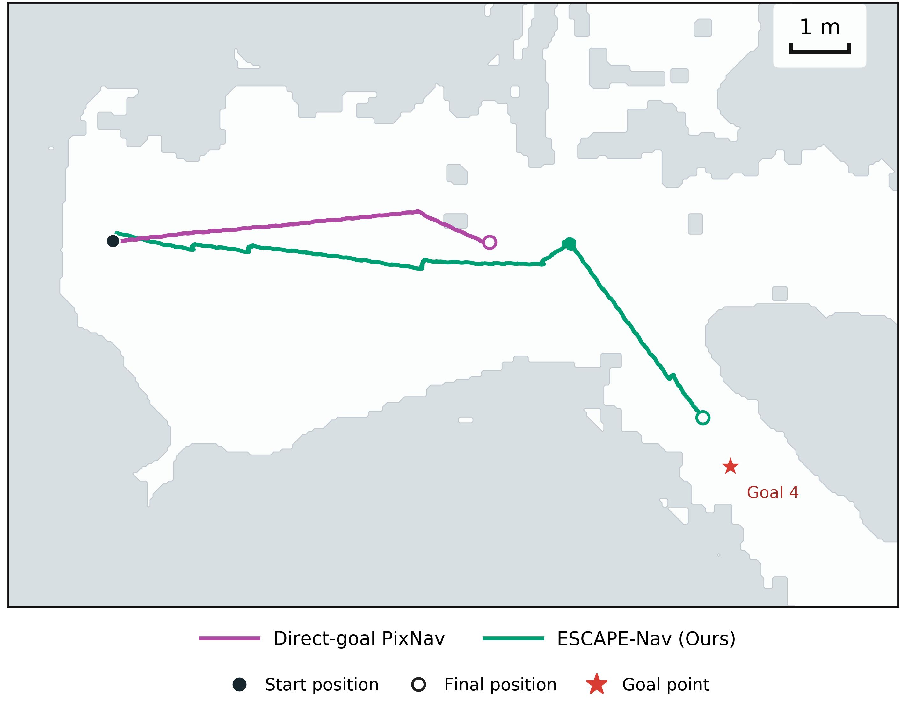

# Goal 4 실로봇 궤적 — 논문 ObjectNav 그림 스타일

논문의 **“Matched ObjectNav example: … PixNav and VOCA remain locally confined”** 그림과 색상·지도 표현·범례 구성을 맞춘 실로봇 정성 비교다. Goal 4만 표시하고 축척은 **1m**다.



- [PNG](../fig6_goal4_ours_vs_pixnav_paper.png), [벡터 PDF](../fig6_goal4_ours_vs_pixnav_paper.pdf), [편집용 SVG](../fig6_goal4_ours_vs_pixnav_paper.svg)
- [다섯 PixelNav 후보 비교](pixnav_candidates.png)
- [기존 004 회차의 동일 스타일 대안](../fig6_goal4_ours_vs_pixnav_paper_alternate004.png)

## 회차 선택

| 방법 | 회차 | 로그상 종료 | 최종 목표 거리 | 주행 경로 길이¹ | 시간 |
|---|---|---|---:|---:|---:|
| ESCAPE-Nav (녹색) | `original5/full-goal-4-009` | `GOAL_DISTANCE_REACHED` | 0.984m | 14.97m | 302.35s |
| Direct-goal PixNav (보라색) | `recaptured5/direct_goal-goal-4-003` | `PIXNAV_TERMINAL_BEFORE_GOAL` | 5.661m | 7.06m | 59.34s |

¹ 10Hz로 재표본화하여 집계한 기존 odom 경로 길이. 그림의 선에는 재표본화나 평활화를 적용하지 않았다.

**003은 이전에 비교한 다섯 회차(002~006) 중 목표에 가장 가까이 간 회차**이며 경로 길이도 가장 길다. 전진 후 오른쪽으로 꺾이는 부분이 있고, 동작 로그에 전진 26회·우회전 4회가 기록되어 있다. 004는 꺾임은 더 크지만 초기에 목표 반대쪽으로 향해 최종 거리가 9.35m로 더 많이 남는다. 이번 기본 그림은 더 많이 진행한 003을 사용하고, 004와 전체 후보 비교도 남겼다. 선택된 두 사례를 보여주는 그림이며 전체 실험의 평균 성능 그림은 아니다.

## 논문 스타일과 좌표 보존

- 참고 파일: canonical 저장소 `paper` 브랜치의 `paper/figures/svg/fig6_scalebars.pdf`, commit `2ccd9e7761bb3e29384a8c4f3d02056e855cddd5`. 해당 그림과 설명을 `reference/`에 보존했다.
- 밝은 회색 비자유 영역, 거의 흰 자유 영역, 얇은 경계선을 사용했다. 검정 시작점, 방법별 색상의 빈 원 종료점, 빨간 별 Goal 4, 하단 두 줄 범례를 맞췄다. 이번 비교에 없는 VOCA는 표시하지 않는다.
- 지도는 기존 `2d_clean_publication.png`의 흰 자유 영역 마스크를 사용한다. **기존에 정리된 출판용 지도**이며 raw 점군 지도 자체는 아니다. 이번 작업에서 추가적인 영역 메우기·장애물 삭제·벽 재배치·수작업 윤곽 수정을 하지 않았다. 기존 마스크의 모든 구멍과 성분을 보존하고 0.5 등고선으로 벡터 경계를 그렸다. 원본 지도 파일도 그대로 보존했다.
- 지도 좌표 변환은 기존 0913 템플릿과 같다: `column=(x-min_x)/0.05`, `row=(max_y-y)/0.05`. 가로·세로는 같은 축척이며 막대 1m는 원 지도 20픽셀이다.
- 두 회차의 Goal 4는 동일한 `(10.613861243952254, -3.886405544069355)m`이고 지도 DB 해시도 같다. 궤적은 회차별 목표 발송 시 원점·방향을 뺀 `episode_start` odom 좌표다.
- Ours 5,359점, PixNav 003 1,045점을 순서대로 모두 연결했다. 원본 압축 이벤트 로그에서 좌표·시간을 다시 계산해 **내보낸 CSV와 최대 차이 0**을 확인했다. 004 대안도 같은 방식으로 검사한다. 구체적인 검사는 `validation.json`, 입력 해시는 `input_provenance.json`, 산출물 해시는 `SHA256SUMS`에 있다.

## 공유할 설명

> Marked-start real-robot Goal 4 example. ESCAPE-Nav turns toward the goal and reaches the odometry-based 1m success region. The selected Direct-goal PixNav run advances, turns right, and terminates with 5.66m remaining. Start-aligned odometry trajectories are overlaid on the recorded map for spatial context.

지도 중첩은 기존 템플릿과 같은 시작점 정렬이며 새 ICP 정합이나 외부 Ground Truth가 아니다. 두 선택 회차의 현장 개입·접촉·방해 여부는 자료상 미확인이고 navigation 이미지 버전도 다르다. 따라서 이 그림만으로 동일 버전 통제 비교나 물리적 접촉 여부를 단정하지 않는다. SPL은 최단 통행 경로가 검증되지 않아 넣지 않았다.

## 재생성

저장소 루트에서 아래 명령을 실행한다. 로봇 본체·ROS·GPU 없이 기존 자료만 읽는다.

```bash
python3 2dmap/0913/goal4_comparison_paper/build_figure.py
```

의존성은 Python 3, NumPy, Matplotlib, Pillow 및 같은 저장소의 기존 `goal4_comparison/build_figure.py`다. 원본 실험 자료·기존 그림·주행 코드는 변경하지 않는다.
