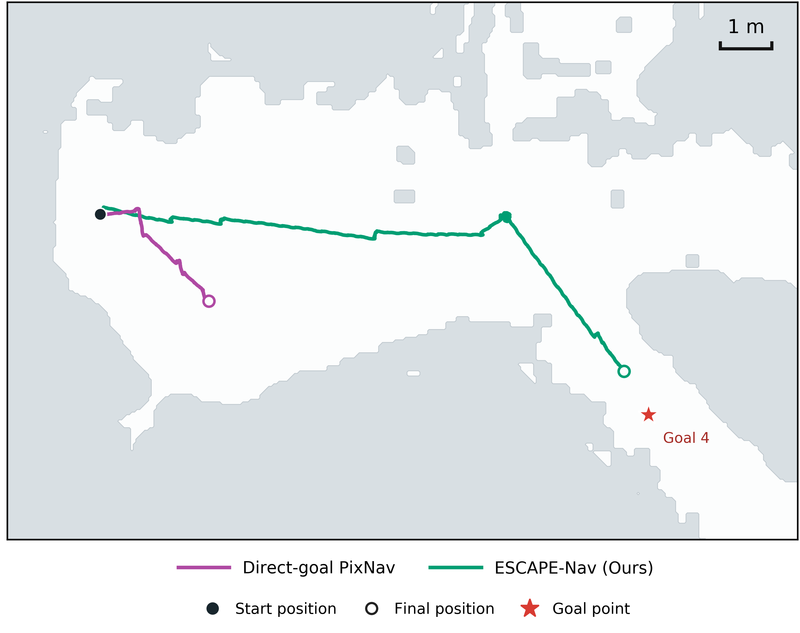

# 논문용 Goal 4 비교 그림

**현재 공유본: Ours `full-goal-4-009` + Direct-goal PixNav `direct_goal-goal-4-005`.** 여기서 005는 회차 번호이며 목적지는 두 방법 모두 **Goal 4**다. 사용자의 2026-09-14 요청에 따라 005 사례로 렌더링했다.

- [PNG](fig6_goal4_ours_vs_pixnav_run005.png)
- [논문용 벡터 PDF](fig6_goal4_ours_vs_pixnav_run005.pdf)
- [편집용 SVG](fig6_goal4_ours_vs_pixnav_run005.svg)
- [회차·검증 근거](goal4_run005/README.md)

`fig6_goal4_ours_vs_pixnav_paper.*`도 같은 005 그림으로 갱신했다. 우측 상단의 **1m 축척은 흰 바탕 상자 없이 기존 회색 영역에 직접 표시**한다. 글자·선 전체와 여유 공간에 흰 지도 영역이 겹치지 않는지 마스크로 검사했다. SVG의 축척 선과 텍스트는 `scale-bar-1m`, `scale-label-1m` ID로 각각 편집할 수 있다.

이 폴더의 `fig6_goal4_ours_vs_pixnav.*`는 이전 003 벽 지도 스타일이며, `_alternate004.*`는 이전 004 비교 자료다. **이번 공유에는 `run005` 또는 기본 `_paper` 파일을 사용한다.** 이전 003 논문 스타일은 상위 0913 폴더에 보존되어 있다.
