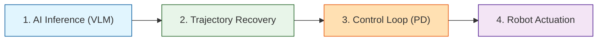
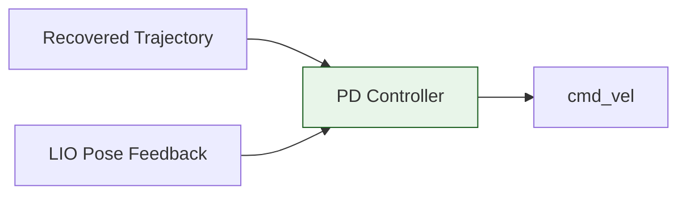
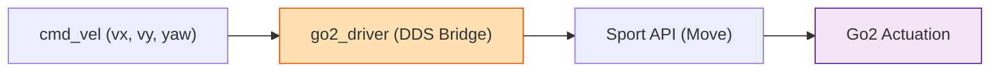
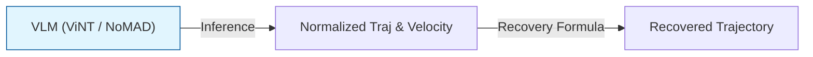

# ❄️ Unitree Go2 Antarctic Navigation Project

본 저장소는 남극 및 극한 지형 환경에서 사족보행 로봇 **Unitree Go2**의 자율주행을 제어하기 위한 ROS 2 Humble/Foxy 기반의 워크스페이스(`go2_ws`)임.

---

## 📌 1. 전체 프로세스 개요 (Process Overview)

모방 학습(IL) 모델의 경로 추론부터 실물 로봇의 최종 보행 구동까지의 핵심 4단계 흐름도.

---

## ⚙️ 2. 3대 핵심 모듈 및 프로세스 정의

### 1) Odometry Module (위치 및 상태 추정)
남극 환경(눈밭 반사광, 가시거리 결여, 빙판 슬립)을 고려하여 LIO 주축 및 Leg 보조 연동 구조 채택.

*   **VIO (Visual-Inertial)**: 추가 장착된 [Intel RealSense D435i](https://www.intelrealsense.com/depth-camera-d435i/) 카메라 기반 오도메트리.
*   **LIO (LiDAR-Inertial)**: 로봇 내장 4D LiDAR L1 + 내부 IMU 데이터를 통한 오도메트리 계산.
*   **Leg & Internal Odometry (Bridge 연동)**:
    *   `go2_driver` : 로봇 자체 LiDAR 기반 오도메트리(`/utlidar/robot_pose`) ➔ `/odom` 토픽으로 변환 및 발행.
    *   `go2_odom_bridge` : `lf/sportmodestate` (다리 기구학 상태) ➔ `/go2_odom` 및 TF 변환 발행.
*   *제안 전략*: 남극 지형 극복을 위해 오도메트리 추정은 **[FAST-LIO](https://github.com/hku-mars/FAST_LIO)** 사용 제안.

---

### 2) PID Controller (경로 추종기)
물리 복원된 궤적과 Pose 피드백 정보를 연산하여 속도 지령(`cmd_vel`)을 도출하는 모듈.

*   **Go2 자체 내장 기능**: Unitree SDK2 "Sport API"의 `TrajectoryFollow` 함수 (로컬 데드레커닝 기반 경로 추종).
*   **현재 사용 방식**: Go2의 Sport API를 ROS 2 Nav2로 주행하기 위한 오픈소스 연동 방식 사용 중 (Nav2의 Controller Server 플러그인 이용).
*   **ViNT / NoMAD 관련**: 
    *   [visualnav-transformer](https://github.com/robodhruv/visualnav-transformer) 공식 저장소의 `deployment/src/pd_controller.py` 내에 비례-미분(PD) 제어 모듈 확인 완료.
    *   입력된 $10 \times 2$ trajectory와 pose 데이터를 가공해 로봇 구동 명령으로 변환하는 조향 제어기로 활용 검토.

---

### 3) Unitree Go2 Action Command API (구동 인터페이스)
상위 제어 속도 지령을 로봇 모터 제어 명령으로 매핑 및 전송하는 드라이버 구조.

*   **실제 구동 API**: Unitree SDK2의 Sport API인 **`SportClient.Move(vx, vy, vyaw)`** (물리 모터 제어 및 보행).
*   **연동 오픈소스**: 아래 깃허브 오픈소스를 통해 ROS 2 `cmd_vel` 명령을 Sport API로 변환하여 주행 구현.
    *   [go2_robot (by IntelligentRoboticsLabs)](https://github.com/IntelligentRoboticsLabs/go2_robot)
    *   [go2_robot (Unitree-Go2-Robot Fork)](https://github.com/Unitree-Go2-Robot/go2_robot)

---

## 📈 3. Trajectory 정규화 및 복원 프로세스 (모방 학습 연동)

모델이 일정한 속도 스케일에 종속되지 않고 순수 **기하학적 궤적 형태(Geometric Path)**를 효과적으로 학습할 수 있도록 속도 성분을 분리하여 정규화함.

### 3.1 학습 단계: 정규화 (Normalization)
로봇이 이동한 실제 물리 궤적에서 속도 스케일을 소거함. ($\Delta t$는 기록 주기로, 5Hz 데이터셋의 경우 $0.2\text{ s}$ 반영)

$$\text{Normalized Trajectory} = \frac{\text{GT Trajectory}}{\Delta t \times v_{GT}}$$

### 3.2 제어 단계: 물리 궤적 복원 (Recovery)
추론 시 모델이 기하학적 궤적(Normalized Trajectory)과 속도 스케일($v_{pred}$)을 예측하면, 제어기에 인가하기 전 실제 물리적 좌표계로 복원함.

$$\text{Recovered Trajectory} = \text{Normalized Trajectory} \times \Delta t \times v_{pred}$$
