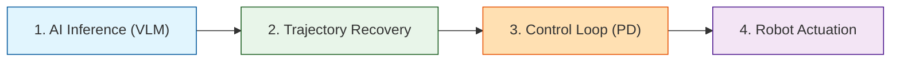
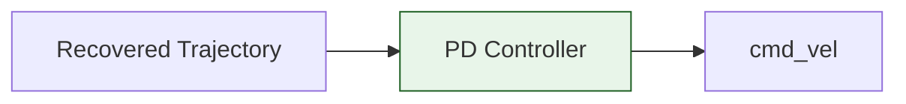
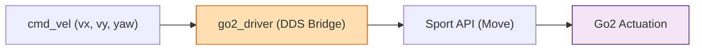
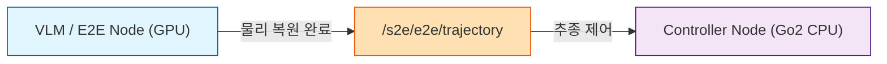
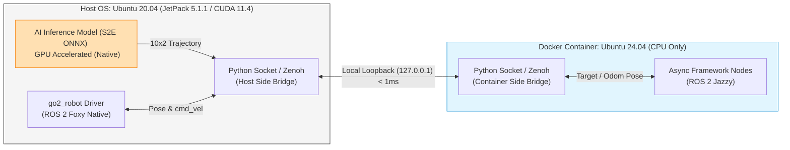
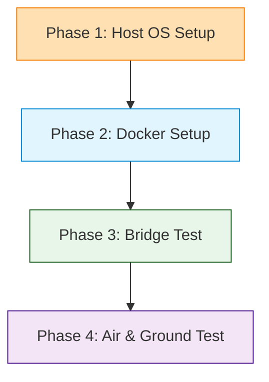

# ❄️ Unitree Go2 Antarctic Navigation Project

본 저장소는 남극 및 극한 지형 환경에서 사족보행 로봇 **Unitree Go2**의 자율주행을 제어하기 위한 ROS 2 Humble/Foxy 기반의 전용 워크스페이스(`go2_ws`)임. 
이 브랜치(`antarctica`)는 불필요한 기존 Nav2 템플릿 파일들을 제거하고, **LIO(라이다), ViNT(모방학습), Go2 SDK(구동)** 핵심 시스템으로만 구성된 클린 샌드박스 환경임.

---

## 📌 1. 전체 프로세스 개요 (Process Overview)

모방 학습(IL) 모델의 경로 추론부터 실물 로봇의 최종 보행 구동까지의 핵심 4단계 흐름도.



---

## 📊 2. 3대 핵심 모듈 정의

| 모듈명 | 분류 / 역할 | 주요 데이터 흐름 | 대상 소스코드 및 패키지 |
| :--- | :--- | :--- | :--- |
| **1) Odometry** | 위치 및 상태 추정 | LiDAR L2 + IMU ➔ 3D Pose | [FAST-LIO](https://github.com/hku-mars/FAST_LIO) (제안) / `go2_driver` |
| **2) Controller** | 경로 추종기 | 궤적 & Pose ➔ `cmd_vel` | [visualnav-transformer](https://github.com/robodhruv/visualnav-transformer) (`pd_controller.py`) |
| **3) Action API** | 로봇 구동 인터페이스 | `cmd_vel` ➔ Sport API | [go2_robot](https://github.com/IntelligentRoboticsLabs/go2_robot) (`go2_driver.cpp`) |

### 상세 정의 및 기술 전략

#### 1. Odometry Module (위치 추정)
*   **VIO (Visual-Inertial)**: 추가 장착된 [Intel RealSense D435i](https://www.intelrealsense.com/depth-camera-d435i/) 카메라 기반 오도메트리.
*   **LIO (LiDAR-Inertial)**: 로봇 내장 4D LiDAR L2 + 내부 IMU 데이터를 통한 오도메트리 계산.
*   **Leg & Internal Odometry**: `lf/sportmodestate` (다리 기구학 상태) ➔ `go2_odom_bridge`를 통해 `/go2_odom` 및 TF 변환 발행.
*   **제안 전략**: 남극 지형 극복을 위해 오도메트리 추정은 **FAST-LIO** 사용 제안.

#### 2. PID Controller (경로 추종기)

*   **ViNT / NoMAD 관련**: 
    *   `visualnav-transformer/deployment/src/pd_controller.py` 내의 비례-미분(PD) 제어 모듈 확인 완료.
    *   입력된 $10 \times 2$ trajectory와 pose 데이터를 가공해 로봇 구동 명령으로 변환하는 조향 제어기로 활용 검토.
*   **기타 제어 방식**: Go2 자체 내장 기능(`TrajectoryFollow`) 또는 ROS 2 Nav2 주행 환경.

#### 3. Unitree Go2 Action Command API (구동 인터페이스)

*   **실제 구동 API**: Unitree SDK2의 Sport API인 **`SportClient.Move(vx, vy, vyaw)`** (물리 모터 제어 및 보행).
*   **연동 오픈소스**: `go2_robot` 드라이버 패키지를 통해 ROS 2 `cmd_vel` 명령을 Sport API로 변환하여 주행 구현.

---

## 🔗 4. 소스코드 레벨 핵심 인터페이스 및 결합점 (Code-Level Bindings)

### 4.1 ViNT 제어 연산 결합점 (visualnav-transformer)
*   **관련 파일**: [pd_controller.py](file:///C:/Users/USER/Desktop/캡스톤/캡2-논문/go2_ws/visualnav-transformer/deployment/src/pd_controller.py)
*   **핵심 코드 라인 및 인터페이스**:
    *   **구독(Subscribe)**: `waypoint_sub = rospy.Subscriber(WAYPOINT_TOPIC, Float32MultiArray, callback_drive)` (Line 81)
        ➔ 모델 추론 패키지(`navigate.py`)가 연산하여 발행하는 로컬 좌표계 궤적 메시지(방향성 포함)를 수신함.
    *   **PD 제어 계산**: `v, w = pd_controller(waypoint.get())` (Line 93)
        ➔ 수신한 로컬 좌표 오차($dx, dy$)를 가공하여 모터 목표 선속도(`v`) 및 각속도(`w`)를 실시간 역산함.
    *   **발행(Publish)**: `vel_out.publish(vel_msg)` (Line 99)
        ➔ 계산된 속도를 하위 ROS 2 `/cmd_vel` 브릿지로 발행함.

### 4.2 Go2 SDK 구동 API 결합점 (go2_ws/src/go2_robot)
*   **관련 파일**: `go2_ws/src/go2_robot/go2_driver/src/go2_driver/go2_driver.cpp`
*   **핵심 코드 라인 및 인터페이스**:
    *   **구독(Subscribe)**: `cmd_vel_sub_`에서 ROS 2 표준 `/cmd_vel` 속도 토픽 구독 및 콜백(`cmd_vel_callback`) 실행.
    *   **명령 파싱**: 수신된 `geometry_msgs::msg::Twist` 메시지에서 X축 선속도(`linear.x`), Y축 선속도(`linear.y`), Z축 각속도(`angular.z`) 값을 각각 파싱함.
    *   **DDS API 전송 (Move)**: 파싱된 값들을 JSON 양식 데이터 파라미터(`x = vx`, `y = vy`, `z = vyaw`)로 직렬화하여 `/api/sport/request` 토픽(API ID: `Move`)으로 Unitree 모션 보드에 발행함.

---

## 📈 5. Trajectory 정규화 및 복원 프로세스 (모방 학습 연동)

모델이 일정한 속도 스케일에 종속되지 않고 순수 **기하학적 궤적 형태(Geometric Path)**를 효과적으로 학습할 수 있도록 속도 성분을 분리하여 정규화함.



### 5.1 학습 단계: 정규화 (Normalization)
로봇이 이동한 실제 물리 궤적에서 속도 스케일을 소거함. ($\Delta t$는 기록 주기로, 5Hz 데이터셋의 경우 $0.2\text{ s}$ 반영)

$$\text{Normalized Trajectory} = \frac{\text{GT Trajectory}}{\Delta t \times v_{GT}}$$

### 5.2 제어 단계: 물리 궤적 복원 (Recovery) - 주체 명확화
*   **연산 주체**: **E2E 모델 노드(외장 GPU/컨테이너 단)**가 추론 시 기하학적 궤적(Normalized Trajectory)과 속도 스케일($v_{pred}$)을 예측하여 물리 궤적으로 복원한 뒤 토픽을 발행함.

$$\text{Recovered Trajectory} = \text{Normalized Trajectory} \times \Delta t \times v_{pred}$$

*   **로봇 수신 데이터**: 실물 Go2 로봇 측 `controller_node`는 이미 물리 복원이 완료된 미터 단위의 실제 궤적 좌표(`Trajectory2D`)를 수신하므로, 추가적인 복원 연산 없이 즉시 PD/PID 주행 추종을 수행함.

---

## 📂 6. antarctica 브랜치 디렉토리 구조 (Clean Workspace)

```text
go2_ws/
├── README.md                  <- 본 가이드라인 문서
├── cyclonedds.xml             <- CycloneDDS 네트워크 바인딩 설정 파일
├── visualnav-transformer/     <- ViNT / NoMAD 모델 구현 및 pd_controller.py 코드
├── qwen_nav_memory_framework_v3/ <- 상위 VLM 기반 에피소딕 메모리 프레임워크 패키지
├── s2e-vlm-async-framework/   <- ROS 2 비동기 통합 프레임워크 패키지 (LIO/PID 실물 연동 노드 탑재)
└── src/
    ├── HesaiLidar_ROS_2.0/    <- Hesai 라이다 연동 ROS 2 드라이버
    ├── rtabmap_ros/           <- rtabmap SLAM 패키지
    └── go2_robot/             <- Unitree Go2 ROS 2 통신 패키지
        ├── go2_bringup/       <- 실행용 런칭 파일 폴더
        ├── go2_description/   <- 로봇 URDF 및 3D 메시 폴더
        ├── go2_driver/        <- cmd_vel to DDS Sport API 변환 노드 소스코드
        ├── go2_hardware/      <- 하드웨어 인터페이스 정의
        └── go2_interfaces/    <- 사용자 정의 토픽 및 서비스 정의
```

---

## ❓ 7. 질문: 과연 통신이 잘될까? (Network & DDS Issues)

실하드웨어(Jetson Orin NX)와 외부 서버를 학교망 및 Netbird VPN으로 연동하여 구동 시 발생할 구조적인 문제 시나리오 및 조치 방안.

### 1) CycloneDDS 인터페이스 바인딩 오류 (로컬 통신 두절)
*   **문제**: 로봇 onboard PC가 학교망(Wi-Fi 등)에 연결되거나 Netbird VPN 인터페이스(`netbird0`)가 생성되는 순간, CycloneDDS가 디폴트 바인딩 인터페이스를 외부망으로 임의 전환함. 이로 인해 로봇 내부 제어기(IP `192.168.123.161`)와의 기가비트 이더넷 로컬 DDS 통신이 즉시 두절됨.
*   **대책**: `cyclonedds.xml` 파일 내 `<NetworkInterfaceAddress>` 태그에 로봇 내부 LAN 포트인 `eth0`를 하드코딩 고정 바인딩해야 함.

### 2) 학교망/VPN의 멀티캐스트(Multicast) 차단 (원격 노드 검색 실패)
*   **문제**: ROS 2는 기본적으로 UDP 멀티캐스트 방식으로 노드를 탐색함. 그러나 공공 학교망이나 WireGuard 기반 Netbird VPN 터널은 멀티캐스트 통신을 기본 차단함. 따라서 물리 로봇 측 노드와 연산을 담당할 외부 서버 측 노드가 서로를 전혀 인지하지 못하는 차단 상황이 연출됨.
*   **대책**: 멀티캐스트를 차단하고 양단 PC의 고정 IP를 `cyclonedds.xml`의 유니캐스트 피어 주소 리스트(`<Peers>`)로 사전에 명기하여 다이렉트 매핑 구조로 전환함.

### 3) 대용량 센서 데이터 전송 시 Jetson CPU 과부하 (제어 주기 지연)
*   **문제**: 4D LiDAR 포인트 클라우드나 고해상도 카메라 원본 프레임을 Netbird 암호화 채널을 거쳐 외부 PC로 전송할 때, 암호화 연산(WireGuard 패킷 인코딩)으로 인해 Jetson Orin NX의 CPU 점유율이 100%를 초과하여 핵심 보행 제어 스레드가 지연되고 로봇이 다운될 수 있음.
*   **대책**: 원격 VPN 통로로는 모델이 요구하는 가벼운 제어 정보(10x2 Trajectory 및 Odom 데이터)만 송수신하고, 무거운 센서 데이터의 외부 다이렉트 원본 스트리밍을 원천 격리하는 대역폭 필터링 설계가 요구됨.

---

## 🏃 8. 화요일 연동 검증 시나리오 및 우회 전략 (Tuesday Test Plan)

화요일 실제 로봇(Foxy, 20.04) 접속 시, 도커 컨테이너(Jazzy, 24.04) 환경과의 통신 호환성을 검증하는 1순위 시나리오 및 통신 두절 시 우회 방안.

### 1) [1순위] CycloneDDS 루프백 다이렉트 검증 (가장 단순함)
*   **환경 설정 (호스트 및 도커 양측 선언)**:
    ```bash
    export RMW_IMPLEMENTATION=rmw_cyclonedds_cpp
    export ROS_DOMAIN_ID=0
    ```
    *(도커 컨테이너 구동 시 `--net=host` 옵션 필수 포함)*
*   **테스트 1 (Foxy ➔ Jazzy)**:
    *   호스트(Foxy) 터미널:
        ```bash
        ros2 topic pub /test_odom nav_msgs/msg/Odometry "{header: {frame_id: 'odom'}}" -r 10
        ```
    *   도커(Jazzy) 터미널:
        ```bash
        ros2 topic echo /test_odom
        ```
        *(DDS 패킷이 도커 격리망을 뚫고 Jazzy 내에서 역직렬화가 정상 작동하는지 모니터링)*
*   **테스트 2 (Jazzy ➔ Foxy)**:
    *   도커(Jazzy) 터미널:
        ```bash
        ros2 topic pub /cmd_vel geometry_msgs/msg/Twist "{linear: {x: 0.1}}" -r 10
        ```
    *   호스트(Foxy) 터미널:
        ```bash
        ros2 topic echo /cmd_vel
        ```
        *(Jazzy에서 보낸 속도 제어 메시지가 Foxy 호스트의 드라이버 단에 무손실 도달하는지 확인)*

### 2) [2순위] 통신 실패 시 우회 전략 (대안)
위 다이렉트 통신이 미들웨어 버전 불일치로 실패할 경우 시도할 우회로:
*   **Zenoh Bridge 연동**: 호스트와 도커 양측에 `zenoh-bridge-dds`를 켜서 버전 독립적인 고속 통신 터널 개설.
*   **파이썬 소켓 브릿지**: 양측에 ROS 2 통신망 영향이 없는 일반 Python 소켓 스크립트를 띄워 로우 바이트 데이터를 강제 전송 및 바이패스.

---

## 🧠 9. 비동기 프레임워크(s2e-vlm-async-framework) 설계 분석 및 의문 해소

클론한 비동기 주행 백엔드 프레임워크 저장소 분석을 통해, 기존 하드웨어 연동 시 가졌던 설계상 의문점을 해결한 매핑 내용 정리.

### 1) [의문 해결] Foxy(호스트) ↔ Jazzy(도커) 간 DDS 역직렬화 오류 우려 입증
*   **상황**: 서로 다른 ROS 2 배포판 간 다이렉트 DDS 통신 연결 시 데이터 깨짐 문제 의심.
*   **해결**: 프레임워크의 [README.md](file:///C:/Users/USER/Desktop/캡스톤/캡2-논문/go2_ws/s2e-vlm-async-framework/README.md#L7-L8)에서 Humble GPU 컨테이너와 Jazzy CPU 컨테이너 간의 DDS 통신에서도 실제 역직렬화(Deserialization) 오류를 목격했음을 보고함.
*   **결론**: 이에 따라 화요일 실물 테스트 시 Foxy-Jazzy 간 통신 불일치가 일어날 확률이 기정사실화되었으므로, **2순위 우회 전략인 Zenoh Bridge 활용**의 우선순위와 필요성이 한층 강화됨.

### 2) [의문 해결] 전역 지도(Global SLAM) 구축 필수성 여부 및 뷰 정합성
*   **상황**: 주행을 가동하기 위해 글로벌 Costmap 등 전역 공간 지도 프레임이 구축되어야 하거나, 항공뷰(드론)와 로봇 지상뷰의 정교한 정렬(Alignment)이 필요한가?
*   **해결**: 프레임워크 [README.md](file:///C:/Users/USER/Desktop/캡스톤/캡2-논문/go2_ws/s2e-vlm-async-framework/README.md#L45-L47)에 명시된 바와 같이, 모션 및 제어 인터페이스는 오직 로봇 몸체 기준의 **로컬 에고센트릭(Ego-centric) `base_link` 2D 좌표**만 사용함. E2E 노드가 이미지 상의 목표 좌표(`goal_uv`)를 `base_link`로 변환하여 궤적을 쏘면 제어기가 즉시 추종함.
*   **결론**: 본 주행계는 항공뷰와의 다이렉트 정렬을 필요로 하지 않으며, 전역 지도 없이 **로컬 상대 좌표계상에서 완전히 독립적인 클로즈드 루프**로 가동 가능함.

### 3) [의문 해결] 좌/우/후방(비정면 뷰) 타겟 탐색 시 로봇 구동 시나리오
*   **상황**: VLM이 전방이 아닌 좌/우/후방 공간으로 갈 것을 명령할 때, 다리 각도 조향(게걸음) 또는 몸체 회전 여부.
*   **해결**: 프레임워크 [interfaces.md](file:///C:/Users/USER/Desktop/캡스톤/캡2-논문/go2_ws/s2e-vlm-async-framework/docs/interfaces.md#L171-L172) 및 [Rotate Action](file:///C:/Users/USER/Desktop/캡스톤/캡2-논문/go2_ws/s2e-vlm-async-framework/docs/interfaces.md#L339-L357) 정의에 따라, VLM이 몸체를 틀도록 지시하면 `/s2e/controller/rotate` 액션을 쏘아 제자리에 돌려놓은 뒤, 정면 카메라에서 다시 깨끗한 전방 이미지를 획득하여 주행을 계속하는 **Rotate-to-Front** 가이드라인 정책을 적용함.

### 4) [의문 해결] LIO / VIO 오도메트리 결과 포즈의 기준 좌표 프레임
*   **상황**: 우리가 획득한 센서 기반 Pose 데이터 값을 어떤 프레임 좌표 기준으로 설계해서 가공해야 하는가?
*   **해결**: 프레임워크 [README.md](file:///C:/Users/USER/Desktop/캡스톤/캡2-논문/go2_ws/README.md#L45-L47) 및 [interfaces.md](file:///C:/Users/USER/Desktop/캡스톤/캡2-논문/go2_ws/s2e-vlm-async-framework/docs/interfaces.md#L112-L114)에 표기된 것처럼, 내부 오도메트리 연산은 IMU나 라이다 센서 축 좌표계로 이루어질지라도, 퍼블리시될 때는 반드시 **`base_link` 기준의 Pose** 형태로 변환되어 발행되어야 함.
*   **결론**: LIO/VIO 최종 퍼블리셔 작성 시 TF의 `child_frame_id`를 센서 렌즈가 아닌 `base_link`로 고정 매핑해야 함.

---

## 📋 10. 탑재 센서 하드웨어 세부 제원 (Sensor Specifications)

본 프로젝트 주행 및 오도메트리 연산에 실물로 결합되는 센서들의 핵심 하드웨어 사양 정리.

### 1) Unitree Go2 전면 내장 RGB 카메라
*   **해상도**: 1280 × 720 (HD급)
*   **화각 (FOV)**: 120° (초광각)
*   **역할**: VLM 데이터 입력 및 전방 노면 모니터링

### 2) Unitree Go2 내장 4D LiDAR L2
*   **수평 × 수직 화각 (FOV)**: 360° × 96° (수직 광화각을 통해 발끝 주변 사각지대 해소)
*   **포인트 샘플링 속도**: 64,000 points/s (유효)
*   **거리측정 정밀 오차**: 4.5mm 이내
*   **측정 범위 및 사각지대**: 최대 30m 측정 가능 / 최소 5cm 근방까지 감지
*   **역할**: FAST-LIO 기반 실시간 위치 추정(Pose) 및 3D 점군 데이터 제공

### 3) Intel RealSense D435i 깊이 카메라 (추가 탑재)
*   **센서 구성**: Active IR Stereo Depth Camera + RGB Camera + 6축 IMU
*   **RGB 해상도 / 화각**: 1280 × 720 @ 90fps / 수평 69° × 수직 42° (왜곡이 억제된 표준 화각)
*   **거리(Depth) 스캔 범위**: 0.11m ~ 10m+ (권장 거리: 0.5m ~ 3m)
*   **내장 IMU**: Bosch BMI055 (가속도 및 자이로스코프 내장)
*   **역할**: S2E(모방학습)용 11프레임 RGB 입력 공급 및 개인 비주얼 SLAM 연구(RTAB-Map Depth) 데이터 제공

---

## 🛠️ 11. 젯슨 온보드 하이브리드 분리 아키텍처 전략 (Jetson Hybrid Split Architecture)

JetPack 5 호스트 환경(Ubuntu 20.04 / CUDA 11.4)과 통합 패키지 요구 환경(Ubuntu 24.04 / ROS 2 Jazzy) 간의 **Tegra 드라이버 백포트 에러(Driver/Library Mismatch)**를 영리하게 회피하고 로봇 한 대에서 모든 연산을 종결하는 최적의 배포 전략.

### 1) 시스템 구조도 (Data Flow Diagram)



### 2) 세부 구동 전략

*   **GPU 트랙 (호스트 네이티브 구동)**:
    *   무거운 AI 모델(ViNT/NoMAD 및 S2E ONNX) 추론 루프는 호스트 OS 단에서 구동함.
    *   호스트에 탑재된 CUDA 11.4 및 TensorRT 8.5.2 드라이버를 직접 호출하므로 라이브러리 충돌 없이 하드웨어 가속 성능을 최대치로 뿜어냄.
*   **CPU 트랙 (Jazzy 도커 컨테이너 구동)**:
    *   상준님/현서님의 비동기 로직 및 메모리 그래프 연산(ROS 2 Jazzy)은 도커 안에서 실행함.
    *   도커 런칭 시 `--runtime=nvidia` 옵션을 주지 않는 **순수 CPU 모드**로 기동하여, Tegra GPU 드라이버 마운트로 인한 라이브러리 크래시 가능성을 원천 차단함.
*   **루프백 브릿징 (통신)**:
    *   두 환경 간의 실시간 제어 명령(Twist) 및 오도메트리 위치 정보(Pose)는 로컬 루프백(`127.0.0.1`) 네트워크 상에서 **Python Socket Bridge** 또는 **Zenoh Bridge**를 통해 실시간 바이패스함.
    *   이를 통해 외부 GPU 연산 PC 없이 **사족보행 로봇 내부 젯슨 단 단 한 대에서 안정적인 저지연(1ms 내외) AI 실물 주행 제어가 실현**됨.

---

## 🏃 12. 하이브리드 연동 및 배포 워크플로우 (Integration & Deployment Workflow)

화요일 실하드웨어 배포 시 각 단계별로 점검하며 실행할 연동 체크리스트.



### 1단계: 호스트 OS 준비 (Host Setup - Foxy 네이티브)
1.  **CUDA/TensorRT/JetPack 사양 검증**:
    ```bash
    # 젯팩 버전 확인
    cat /etc/nv_tegra_release
    
    # CUDA 컴파일러 버전 확인 (11.4 확인)
    nvcc --version
    
    # TensorRT 버전 확인 (8.5.2 확인)
    dpkg -l | grep nvinfer
    ```
2.  **GPU 가속 PyTorch/ONNX Runtime 수동 설치**:
    > [!NOTE]
    > **수동 설치가 필요한 기술적 사유 (우회 배포 전략)**
    > *   **공식 PyPI 패키지 부재**: 파이썬 공식 패키지 매니저(`pip`)는 ARM64(`aarch64`) 아키텍처용 CUDA 가속 PyTorch/ONNX 라이브러리를 배포하지 않습니다. 그냥 설치 시 그래픽카드 가속이 비활성화된 CPU 전용으로 깔려 주행 모델 추론 속도가 나오지 않습니다.
    > *   **컴파일 시간 최소화**: 소스코드 컴파일 시 10시간 이상 걸리므로, 엔비디아가 JetPack 5.1.1 사양에 맞춰 사전에 빌드해 배포하는 공식 가속 휠 파일(`.whl`)을 수동 설치하는 것이 정석 우회로입니다.
    ```bash
    # JetPack 5.1.1 전용 PyTorch ARM64 빌드 다운로드 및 설치
    wget https://developer.download.nvidia.com/compute/redist/jp/v511/pytorch/torch-2.0.0+nv23.05-cp38-cp38-linux_aarch64.whl
    pip3 install torch-2.0.0+nv23.05-cp38-cp38-linux_aarch64.whl
    
    # JetPack 5.1.1 (CUDA 11.4) 전용 ONNX Runtime GPU 버전을 수동 설치
    pip3 install onnxruntime-gpu --index-url https://aiinfra.pkgs.visualstudio.com/PublicPackages/_packaging/onnxruntime-cuda-11/pypi/simple/
    ```
3.  **로봇 구동 Foxy 네이티브 드라이버 실행**:
    ```bash
    cd ~/go2_ws
    colcon build --packages-select go2_robot go2_driver
    source install/setup.bash
    
    # 로봇 하드웨어 및 DDS 통신 개통
    ros2 launch go2_bringup go2.launch.py
    ```

### 2단계: 도커 컨테이너 준비 (Docker Setup - Jazzy CPU 전용)
1.  **Jazzy 공식 ARM64 이미지 Pull 및 기동**:
    ```bash
    # 1. ROS 2 Jazzy 공식 ARM64 베이스 이미지 다운로드
    docker pull arm64v8/ros:jazzy-ros-base
    
    # 2. CPU-only 컨테이너 기동 (--net=host로 호스트 DDS 통신망 루프백 공유)
    docker run -it --name go2_jazzy_cpu \
      --net=host \
      -v ~/go2_ws:/workspace/go2_ws \
      arm64v8/ros:jazzy-ros-base bash
    ```
2.  **도커 컨테이너 내부 환경 구축 및 비동기 프레임워크 빌드**:
    ```bash
    # 3. 도커 쉘 진입 후 필요한 패키지 빌더 설치
    apt-get update && apt-get install -y python3-colcon-common-extensions python3-pip
    
    # 4. 비동기 프레임워크 폴더로 이동 후 빌드
    cd /workspace/go2_ws/s2e-vlm-async-framework
    colcon build
    source install/setup.bash
    
    # 5. 유닛 테스트 작동 여부 검증 (23개 테스트 통과 확인)
    python3 -m unittest discover -s src/s2e_vlm_nodes/test -p "test_*.py" -v
    ```

### 3단계: 통신 브릿지 사전 테스트 (Bridge Integration Test)
*   **루프백 네트워크를 통한 데이터 전달 확인**:
    *   **옵션 A (Zenoh Bridge)**:
        양측에 `zenoh-bridge-dds` 빌드 파일을 기동하여 Foxy <-> Jazzy 간 데이터 변환을 활성화함.
        ```bash
        # 호스트 및 컨테이너 내부에서 각각 기동
        ./zenoh-bridge-dds -d 0
        ```
    *   **옵션 B (파이썬 소켓 송수신 스크립트 실행)**:
        양단에서 통신 타입이 없는 바이패스 소켓을 기동함.
        *   호스트 터미널: `python3 ~/go2_ws/scratch/host_bridge.py`
        *   도커 컨테이너 내부: `python3 /workspace/go2_ws/scratch/docker_bridge.py`

### 4단계: 실물 자율주행 제어 루프 검증 (Air & Ground Test)
1.  **공중 동작 검증 (거치대 실행)**:
    *   로봇 다리를 공중에 띄운 뒤, 도커 내에서 실물 제어 주기를 돌려 동작을 스캔함.
        ```bash
        # 도커 컨테이너 내부에서 실제 하드웨어 파라미터를 인가하여 컨트롤러 구동
        ros2 launch s2e_vlm_bringup robot_side.launch.py use_mock_hardware:=false
        ```
2.  **지상 최종 자율주행 (Ground Test)**:
    *   공중 테스트 완료 후 로봇을 평지에 두고 주행을 트리거하여 최종 Closed-loop 주행을 완료함.

---

## 🔗 13. Unitree Go2 공식 개발자 리소스 (Official Developer Resources)

화요일 현장 연동 및 비상 롤백 상황 시 즉시 코드 레퍼런스를 조회할 수 있는 공식 깃허브 일람.

### 1) 공식 레포지토리 링크
*   **[unitree_sdk2 (Core C++ SDK)](https://github.com/unitreerobotics/unitree_sdk2)**: 로봇 코어 DDS 통신 및 SportClient API 기저 정의서.
*   **[unitree_sdk2_python (Core Python SDK)](https://github.com/unitreerobotics/unitree_sdk2_python)**: 파이썬 기반 로봇 다이렉트 DDS 제어 인터페이스.
*   **[unitree_ros2 (Official ROS 2 Wrapper)](https://github.com/unitreerobotics/unitree_ros2)**: 조인트 상태, 센서 상태 및 보행 노드 통합 공식 패키지.

### 2) 🚨 비상 롤백 시나리오 (C++ 드라이버 빌드 실패 시)
만약 화요일 현장에서 C++ ROS 2 드라이버 종속성 문제로 `go2_robot` 컴파일이 불가능할 경우, ROS 2 Foxy 파이썬 노드와 공식 SDK 파이썬 모듈을 다이렉트로 결합해 구동하는 우회 명령어:

1.  **공식 파이썬 SDK 의존성 설치**:
    ```bash
    git clone https://github.com/unitreerobotics/unitree_sdk2_python.git
    cd unitree_sdk2_python
    pip3 install .
    ```
2.  **비상용 파이썬 다이렉트 드라이버 기동 (C++ 빌드 생략)**:
    호스트 OS 터미널에서 C++ 컴파일 빌드 없이 바로 파이썬 노드를 켜서 로봇 통신망을 개통함.
    ```bash
    # 로봇 유선 연결된 네트워크 카드 명칭(예: eth0)을 인자로 주어 실행
    python3 ~/go2_ws/scratch/python_direct_driver.py eth0
    ```
    *(수동 컴파일이 전혀 필요 없는 구조로, 기동 즉시 호스트의 `/cmd_vel`을 수신해 실물 로봇을 보행 제어함)*

3.  **기본 모션 개별 작동 여부 테스트**:
    ```bash
    # 2. 로봇 내부 LAN망 바인딩 인터페이스(예: eth0)를 지정하여 눕기/서기 기본 모션 다이렉트 테스트
    python3 example/stands/stand_up_down.py eth0
    ```

---

## 🎯 14. ViNT 궤적 제어 매핑 및 실물 구동 전략 (Control Mapping & Actuation Strategy)

AI 모델의 출력물(10x2 Waypoints)을 실물 Go2 로봇의 고해상도 모션(Sport API)으로 변환하는 최적의 운동학 매핑 및 필드 튜닝 전략.

### 1) 제어 알고리즘 비교분석 (순정 vs 개선 피드백)

*   **ViNT 순정 제어기 ([pd_controller.py](file:///C:/Users/USER/Desktop/캡스톤/캡2-논문/go2_ws/visualnav-transformer/deployment/src/pd_controller.py#L43-L62))**:
    *   수식: $v = \frac{dx}{DT}$ / $w = \frac{\arctan(dy/dx)}{DT}$
    *   한계: 위치 에러 변위를 제어 주기($DT \approx 0.11\text{ s}$)로 직접 나누므로, AI가 출력하는 미세한 Jitter에도 모터 속도가 급변하여 Go2의 관절에 심한 하드웨어 충격 및 흔들림을 유발함.
*   **개선된 피드백 PD 제어기 (`ros_mock_runtime.py` 탑재)**:
    *   선속도: $v = K_{p\_lin} \times \text{hypot}(dx, dy)$ (선속도 비례 제어)
    *   각속도: $w = K_{p\_ang} \times \text{atan2}(dy, dx) + K_{d\_ang} \times d\_heading$ (각속도 비례-미분 제어)
    *   장점: 급격한 회전각 발생 시 감속 제어가 자동 인가되며, 미분 제어기($K_{d\_ang}$)가 로봇의 엉덩이가 좌우로 요동치는 피쉬테일링(Fishtailing) 현상을 댐핑하여 억제함.

### 2) Go2 Sport API 매핑 및 보행 안정성 확보

로봇의 보행 구동을 담당하는 파이썬 드라이버(`python_direct_driver.py`) 및 C++ 드라이버는 수신된 속도 명령을 최종적으로 다음과 같이 Sport API에 매핑함.

$$\text{SportClient.Move}(v_x, v_y, v_{yaw}) \Longrightarrow (v, 0.0, w)$$

*   **측면 주행 제한 ($v_y = 0.0$)**: Go2는 게걸음(Strafing, 측면 이동) 보행 시 발끝의 지상고(Foot clearance) 마진이 줄어들어 미끄러운 바닥이나 장애물 환경에서 전도 위험이 급격히 증가함. 따라서 측면 속도는 의도적으로 $0.0$으로 하드코딩 격리하고, 회전($v_{yaw}$)과 전진($v_x$)만으로 곡선 궤적을 추종하도록 세팅함.

### 3) 화요일 필드 최적화 튜닝 가이드 (Tuesday Field Tuning)

현장에서 S2E 모델을 탑재하고 주행을 켰을 때, 로봇의 움직임이 비정상적일 경우 대응하는 매개변수 조절법.

1.  **로봇이 뱀처럼 구불구불 걸어갈 때 (Wobbling / Fishtailing)**:
    *   **원인**: 회전 반응도($K_{p\_ang}$)가 너무 크거나 제동 댐핑($K_{d\_ang}$)이 너무 약함.
    *   **조치**: `kp_angular` 값을 줄이거나 `kd_angular` 값을 서서히 높여가며 흔들림을 댐핑함.
2.  **경로 모퉁이를 돌 때 로봇이 회전을 안 하고 들이받을 때 (Understeering)**:
    *   **원인**: 룩어헤드 목표점(Lookahead Point)을 너무 먼 곳으로 잡았음.
    *   **조치**: 기본 룩어헤드 인덱스 `lookahead_index`를 `3`에서 `2` 또는 `1`로 줄여서, 로봇이 아주 가까운 곳에 반응해 즉각 꺾이도록 제어 주기를 조여줌.
3.  **직진 시 속도가 너무 느리거나 지나치게 과속할 때**:
    *   **원인**: 선속도 게인($K_{p\_lin}$) 밸런스 불일치.
    *   **조치**: `kp_linear` 값을 조절하여 로봇의 최대 안전 속도 한계선(`max_linear_speed`, 권장: $0.3 \sim 0.4\text{ m/s}$)을 락온함.
