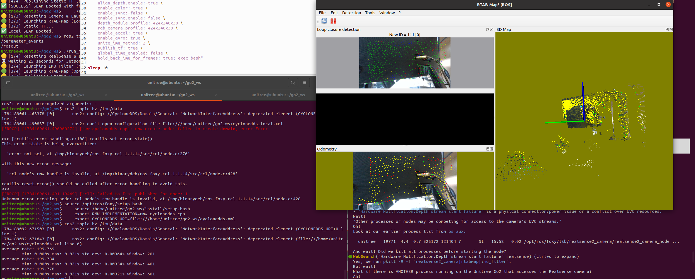

# Go2 D435i RTAB-Map SLAM

Intel RealSense D435i 카메라와 RTAB-Map을 활용한 Unitree Go2 로봇의 Visual-Inertial SLAM (VIO) 작업 환경 설정 및 이슈 해결 가이드입니다.



---

## 🛠️ 주요 해결 이슈 및 트러블슈팅 내역

그동안 기동 오류 및 데이터 전송 누수를 유발했던 핵심 문제들과 해결책들입니다.

### 1. USB 포트 전원 자동 절전 (USB Autosuspend) 해결
* **문제**: Jetson 보드의 전원 관리 정책으로 인해, 카메라 노드가 실행되면서 하드웨어 리셋을 유도할 때 USB 3.0 포트의 전원이 완전히 차단되어 `failed to set power state` 에러 및 `Device not found` 크래시 발생.
* **해결**: `/etc/udev/rules.d/99-realsense-libusb.rules` 규칙 파일 맨 아래에 USB 루트 허브 및 포트 전역에 대해 상시 전원 인가(`on`) 및 절전 모드 해제(`-1`)를 강제하는 규칙을 추가 배포함.

### 2. realsense2_camera 드라이버 내부 동기화 프레임 드롭 버그
* **문제**: ROS 2 Foxy의 RealSense 래퍼에서 `enable_sync:=true` 설정 시 이미지와 IMU 간의 미세한 지터(시간 편차)로 인해 RGB 이미지 `/camera/color/image_raw` 토픽이 0 Hz로 강제 드롭 및 차단됨.
* **해결**: 드라이버의 내부 물리 싱크를 끄고(`enable_sync:=false`), 대신 RTAB-Map의 고성능 근사 동기화 장치(`approx_sync:=true`, `approx_sync_max_interval:=1.0`)에 동기화 처리를 안전하게 위임하여 30fps 원본 송출을 보장함.

### 3. USB 3.0 대역폭 병목으로 인한 스트림 다운 현상
* **문제**: `640x480 @ 30fps` 고해상도로 RGB + Depth + 200Hz IMU를 동시에 송출할 때 USB 버스 대역폭 한계로 RGB 카메라 차단 발생.
* **해결**: 30프레임 속도는 그대로 유지하면서 해상도를 한 단계 경량화한 `424x240 @ 30fps` 프로파일로 튜닝하여 15 MB/s 대역폭으로 줄여 안정적인 VIO 기동 확보.

### 4. CycloneDDS IP 하드코딩 탈피 및 이더넷 포트 자동 매칭
* **문제**: `cyclonedds.xml`에 특정 IP인 `192.168.123.99`가 고정 매핑되어 있어서 인터넷 연결 모드(`set_lan.sh`)로 변경되어 IP가 바뀌면 모든 ROS 2 노드가 도메인 생성 오류로 즉각 마비됨.
* **해결**: CycloneDDS가 특정 IP가 아닌 이더넷 포트 이름 **`eth0`**를 바라보도록 스키마를 업데이트하여, 유선 인터넷망 상태에서도 도메인 크래시 없이 자유롭게 디버깅 및 토픽 검증을 수행할 수 있게 함.

---

## 🏃‍♂️ 실행 가이드

### 1. 네트워크 통신 모드 전환
* **로봇 주행 슬램 시 (로봇망 모드)**:
  ```bash
  ./set_robot.sh
  ```
* **인터넷 연결 및 코드 수정 시 (인터넷망 모드)**:
  ```bash
  ./set_lan.sh
  ```

### 2. SLAM 기동
```bash
# 1) 기존 백그라운드 프로세스 정리
pkill -9 -f "realsense2_camera|rtabmap|imu_filter"

# 2) SLAM 실행
./run_map.sh
```
*주의: 리얼센스가 물리 포트에서 재마운트 완료될 때까지 **25초**간의 슬립 시간이 지정되어 있습니다. 터미널 창이 모두 정상적으로 뜰 때까지 기다려 주세요.*
