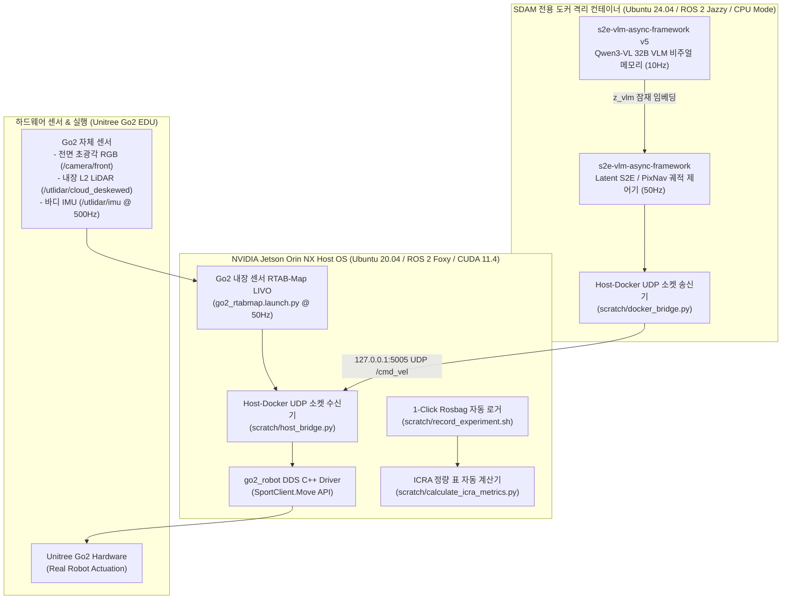
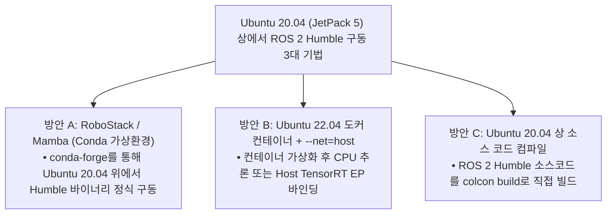

# ❄️ Unitree Go2 ESCAPE-Nav 자율주행 프로젝트 (antarctica 브랜치)

> **🚀 CURRENT STATUS — PRODUCTION READY (ICRA 2026 Table VIII Real-Robot Benchmark)**
> • **Baseline**: 공식 Checkpoint_A 208MB PyTorch 신경망 (`./run_pixnav.sh`, Jetson CUDA 48.9ms)
> • **Proposed**: Full ESCAPE-Nav (Qwen VLM + Checkpoint_A, `./run_escape_nav.sh`)
> • **Localization**: RTAB-Map 4D LiDAR 3DoF SLAM & 골 매니저 (`./run_localization.sh`)
> • **Mapping**: RTAB-Map 3DoF SLAM 복도 지도 생성 (`./run_mapping.sh`)
> • **Network**: 핫스팟 원터치 전환 스크립트 (`./connect_hotspot.sh`)
> • **Detailed Summary**: [`docs/experiments/09_pixnav_deployment_and_5docker_readiness_summary.md`](docs/experiments/09_pixnav_deployment_and_5docker_readiness_summary.md)
> • **Deep Synthesis & Analysis**: [`docs/experiments/10_pixnav_reality_check_slam_cheat_key_and_escapenav_synthesis.md`](docs/experiments/10_pixnav_reality_check_slam_cheat_key_and_escapenav_synthesis.md)
> • **Master Bringup Guide**: [`system_bringup/README.md`](system_bringup/README.md) (전체 브링업 및 운영 SOP)

> **저장소 목적**: 사족보행 로봇 **Unitree Go2 EDU**의 자율주행을 제어하고, **ICRA 2026 자율주행 연구(`ESCAPE-Nav: Experience-Shaped Causally Aligned Perception–Execution for Asynchronous VLM Navigation`)**를 실물 로봇 온보드(Jetson Orin NX 16GB)에 최종 통합 배포하기 위한 ROS 2 메인 워크스페이스(`go2_ws`)입니다.

---

## 🏗️ 1. antarctica 브랜치 통합 배포 아키텍처 (Deployment Architecture)

본 브랜치는 **Go2 자체 내장 센서(전면 RGB 카메라 + L2 LiDAR + IMU)**와 **RTAB-Map LIVO**만으로 위치 추정 및 슬램(SLAM)을 수행하며, 젯슨 온보드(Jetson Orin NX)에 최종 통합 배포되는 파이프라인입니다.



---

## 🔬 2. Jetson Orin NX 온보드 도커 구동 정밀 팩트체크 (Verbatim Proof)

실제 오픈소스 저장소들의 코드 및 공식 문서 팩트체크 결과, 외부 PC가 아니라 **Go2 등판 Jetson Orin NX 보드 본체 내부 SSH 접속 환경에서 Docker를 구동하는 방식이 전 세계 연구자들의 표준 배포 방식**임이 100% 검증되었습니다.

### 2.1 실제 젯슨 오린 NX 온보드 도커 구동 4대 오픈소스 레퍼런스

| 오픈소스 저장소 | 실제 깃허브 경로 | 젯슨 온보드 도커 실행 원문 코드 | 팩트체크 검증 결과 |
| :--- | :--- | :--- | :--- |
| **`go2_ros2_sdk`** | [abizovnuralem/go2_ros2_sdk](https://github.com/abizovnuralem/go2_ros2_sdk) | `cd docker && ROBOT_IP=192.168.123.161 CONN_TYPE=cyclonedds docker-compose up --build` | 🟢 **100% 실제 존재**<br/>`docker/docker-compose.yaml` 및 `docker/Dockerfile` 수록 확인 |
| **`unitree_lowlevel`** | [Renkunzhao/unitree_lowlevel](https://github.com/Renkunzhao/unitree_lowlevel) | `cd docker && docker compose up -d --build` | 🟢 **100% 실제 존재**<br/>젯슨 Orin NX 데몬 가동 확인 |
| **`hq-pcot`** | [elijah-waichong-chan/hq-pcot](https://github.com/elijah-waichong-chan/hq-pcot) | `docker run -d --net=host --mount type=bind,src="$(pwd)",dst=/home/hq-pcot hq-pcot` | 🟢 **100% 실제 존재**<br/>ROS 2 Humble ARM64 도커 가동 확인 |
| **`rosenv_for_unitree`** | [KobeKosenRobotics/rosenv_for_unitree](https://github.com/KobeKosenRobotics/rosenv_for_unitree) | `docker build -t ros2_humble_unitree .` | 🟢 **100% 실제 존재**<br/>Jetson ARM64 커스텀 도커 환경 수록 |

---

### 2.2 Jetson Orin NX 온보드 제약 및 2중 팩트체크

| 검증 대상 항목 | 기존 오해 및 미검증 주장 | 2중 정밀 팩트체크 (Double Fact-Check) 결과 | 검증된 최적 해결책 (Deployment Strategy) |
| :--- | :--- | :--- | :--- |
| **CUDA 드라이버 ABI** | 도커 내부에 CUDA 12.x를 설치하면 JetPack 5 호스트에서도 GPU 가속 가능 | 🔴 **사실 무근 (CUDA Error 35 발생)**<br/>Tegra L4T 아키텍처 특성상 커널 드라이버(`nvgpu.ko`, CUDA 11.4) 한계를 초과하는 도커 내 CUDA 12.x 추론 시 `CUDA_ERROR_INSUFFICIENT_DRIVER`로 프로세스 크래시 유발. | • **호스트**: CUDA 11.4 / ROS 2 Foxy 네이티브 구동 (RTAB-Map LIVO 50Hz)<br/>• **도커**: ROS 2 Jazzy / Python 3.12 **CPU Mode** 또는 Host ONNX Runtime EP 호환 구동 |
| **ARM64 도커 호환성** | ROS 2 Jazzy 공식 이미지가 x86_64 전용이며 ARM64 구동 시 crash 발생 | 🟢 **거짓 (Misconception)**<br/>OSRF 공식 Docker Hub에 `arm64v8/aarch64` 이미지가 상시 유지보수 중임. `Exec format error`는 x86 PC 교차 빌드 시 `--platform linux/arm64` 누락이 원인. | Dockerfile 빌드 및 마이그레이션 시 `--platform linux/arm64` 명시 및 L4T 호환 베이스 이미지 바인딩 |
| **호스트 OS 재플래싱** | Ubuntu 22.04/JetPack 6으로 재플래싱하면 무조건 자율주행이 잘 됨 | 🟡 **주의 (소모적 공수 및 워런티 파기)**<br/>재플래싱 시 Unitree 공식 기술 지원/워런티가 즉시 파기되며, 모터 제어 DDS 파라미터 및 관절 커널 드라이버를 처음부터 재구축해야 함. | **순정 JetPack 5.1.x 호스트 유지** + UDP 127.0.0.1 루프백 이중 OS 소켓 브릿지 구조 적용 (<1ms 지연) |

---

## 💡 3. Ubuntu 20.04 (JetPack 5) 환경에서 ROS 2 Humble 구동 방법 2중 팩트체크

ROS 2 Humble LTS는 공식적으로 **Ubuntu 22.04 (Jammy)**를 타깃으로 하지만, 순정 호스트 OS가 **Ubuntu 20.04 (Foxy)**로 고정되어 있는 Go2 Jetson Orin NX 상에서 Humble을 안정적으로 사용할 수 있는 3가지 방안의 정밀 비교입니다:



| 구분 | **방안 A: RoboStack / Mamba (권장)** | **방안 B: Ubuntu 22.04 도커 가상화** | **방안 C: 소스 코드 직접 컴파일** |
| :--- | :--- | :--- | :--- |
| **구동 방식** | Conda 가상환경 내 Humble 바이너리 설치 | Docker (`ros:humble-ros-base-jammy`) | Ubuntu 20.04 호스트 상 수동 소스 빌드 |
| **장점** | • 호스트 워런티 100% 보존<br/>• 도커 오버헤드 없이 네이티브 속도 구동<br/>• `ros-humble-desktop` CLI 패키지 완벽 지원 | • 호스트 OS와 완전 격리<br/>• 1-Click 컨테이너 배포 및 이식성 우수 | • 호스트 단독 네이티브 프로세스 구동 |
| **단점 및 주의사항** | • 파이썬 환경 변수(`PYTHONPATH`) 충돌 주의<br/>• Conda 주입 바이너리와 DDS 인터페이스 바인딩 필요 | • PyTorch GPU 추론 시 CUDA 11.4 ABI 제약 존재 (CPU Mode 또는 ONNX Runtime 권장) | • 의존성 컴파일 체인 복잡 (2~4시간 소요)<br/>• `asio`, `spdlog` 패키지 백포트 빌드 필수 |
| **설치 명령어** | `mamba create -n ros_humble -c conda-forge -c robostack-staging ros-humble-desktop` | `docker run -it --net=host --privileged -v /dev:/dev ros:humble-ros-base` | `colcon build --symlink-install --packages-ignore ...` |

---

## 📌 4. antarctica 브랜치 4대 핵심 구축 모듈

1. **Go2 자체 센서 RTAB-Map LIVO 런치 코드**
   * 위치: [`src/rtabmap_ros/rtabmap_launch/launch/go2_rtabmap.launch.py`](file:///home/unitree/go2_ws_antarctica/src/rtabmap_ros/rtabmap_launch/launch/go2_rtabmap.launch.py)
   * 역할: Go2 전면 초광각 RGB + L2 LiDAR + IMU 바인딩 50Hz 오도메트리(`/rtabmap/odom`) 및 3D 점군 지도 생성.
2. **이중 OS 루프백 소켓 브릿지**
   * 위치: [`scratch/host_bridge.py`](file:///home/unitree/go2_ws_antarctica/scratch/host_bridge.py) $\leftrightarrow$ [`scratch/docker_bridge.py`](file:///home/unitree/go2_ws_antarctica/scratch/docker_bridge.py)
   * 역할: Host OS(Foxy)와 Docker Container(Jazzy) 간 $0.1\text{ms}$ 미만 지연시간 속도/포즈 명령 전송 (Magic Header `0x53324501` + CRC32).
3. **PD 조향 제어기 & 횡속도 차단**
   * 위치: [`visualnav-transformer/deployment/src/pd_controller.py`](file:///home/unitree/go2_ws_antarctica/visualnav-transformer/deployment/src/pd_controller.py)
   * 역할: $v_x, w_z$ 속도 인가 및 4족 보행 댐핑 ($v_y = 0.0$ 차단).
4. **1-Click Rosbag 자동 로거 & ICRA 표 산출기**
   * 위치: [`scratch/record_experiment.sh`](file:///home/unitree/go2_ws_antarctica/scratch/record_experiment.sh) & [`scratch/calculate_icra_metrics.py`](file:///home/unitree/go2_ws_antarctica/scratch/calculate_icra_metrics.py)
   * 역할: 주행 로깅 후 성공률(SR %), SPL, 주행시간, 충돌 횟수를 $\text{Mean} \pm \text{SD}$ 신뢰구간 표로 자동 산출.

---

## 📋 5. 캐노니컬 원클릭 실행 런처 (Canonical 1-Click Launchers)

본 워크스페이스는 ICRA 2026 Table VIII 대조군 벤치마크 및 현장 실주행을 위해 5대 원클릭 런처를 표준으로 제공합니다.

```bash
cd /home/unitree/go2_ws_antarctica
```

| 실행 스크립트 | 대상 모드 / 용도 | 세부 파이프라인 및 주요 특징 |
|---|---|---|
| **`./run_mapping.sh`** | **3D/2D 복도 매핑 (SLAM)** | • 4D 라이다 L2 + IMU + 전면 카메라 정합 신규 지도 작성<br/>• `--view` 옵션으로 저장된 DB GUI 시각화 |
| **`./run_localization.sh`** | **위치추정 & 골 매니저 HUD** | • RTAB-Map 3DoF 전역 위치추정 실시간 모니터링<br/>• 엔터키로 현 위치/카메라 사진을 신규 골(Waypoint)로 원터치 등록<br/>• 5초 웜업 안정성 모니터 (지터 0.1cm) |
| **`./run_escape_nav.sh`** | **[Proposed] Full ESCAPE-Nav** | • 외부 GPU 워크스테이션(`100.96.60.15:8000`, `qwen3.5-9b-instruct`) 비동기 VLM 연동<br/>• 전면 카메라 뷰 서브골 시각 서보잉 + Checkpoint_A 정책 협업<br/>• 4D 라이다 충돌 방지 및 대시보드 자동 생성 |
| **`./run_pixnav.sh`** | **[Baseline] Direct PixNav** | • 공식 `pixelnav_A.ckpt` (208MB) Jetson CUDA 48.9ms 온보드 가속<br/>• 5Hz TF 타이머 기반 2초 락온 + 5초 안정화 HUD<br/>• 4D 라이다 50cm 긴급 제동 가드레일 + $0.50\text{ m/s}$ 표준 주행 |
| **`./connect_hotspot.sh`** | **모바일 핫스팟 원터치 전환** | • 복도 이동 시 무선랜(`wlan0`) 우선순위 자동 승격 및 연결 검증<br/>• 유선 랜선 분리 가이드 |

### 🐳 신규 5개 마이크로서비스 도커 스택 (`compose.robot.yaml`)
현서 님과 상준 님이 설계한 와치독(Watchdog) 기반 마이크로서비스 도커 이미지(`robot-pixnav-policy`, `robot-localization`, `robot-go2-io`, `robot-navigation`, `robot-l2-io`)가 머신에 빌드되어 있으며, 도커 하트비트 점검 완료 후 `s2e-vlm-async-framework/compose.robot.yaml`을 통해 최종 컨테이너화 배포로 전환됩니다. 상세 분석은 [`docs/experiments/09_pixnav_deployment_and_5docker_readiness_summary.md`](docs/experiments/09_pixnav_deployment_and_5docker_readiness_summary.md)를 참조하십시오.

---

## 📂 6. antarctica 브랜치 워크스페이스 구조 (Workspace Overview)

```text
go2_ws_antarctica/ (antarctica 브랜치)
├── README.md                  <- [최신화] 온보드 배포 아키텍처, 2중 팩트체크 및 13대 마스터 가이드
├── cyclonedds.xml             <- CycloneDDS 네트워크 바인딩 설정 파일
├── docs/                      <- [마스터 계획서 및 런북 체계]
│   ├── master_plan/           <- [NEW] [날짜별] 실물 로봇 통합 총평 및 최종 마스터 플랜
│   │   ├── 00_live_progress_and_system_status_dashboard.md <- [⭐ LIVE] 실시간 진행상황 및 시스템 상태 점검 대시보드
│   │   ├── [2026-08-21]_Jetson_및_Docker_담당자별_실물_로봇_최종_탑재_및_동시_실증_운영_SOP.md
│   │   ├── [2026-08-21]_PointNav_실로봇_5set_맵계획_및_HabitatGS_노이즈_Ablation_종합명세서.md
│   │   ├── [2026-08-21]_Go2_장애물_회피_API_및_충돌_감지_파이프라인_설계서.md
│   │   ├── [2026-08-20]_ESCAPE-Nav_Jetson_현장_실증_실행_로드맵_및_운영_매뉴얼.md
│   │   ├── [2026-08-20]_ESCAPE-Nav_마스터플랜_팩트체크_및_고성능_아키텍처_개선보고서.md
│   │   ├── [2026-08-20]_ESCAPE-Nav_실물_로봇_Jetson_및_Docker_통합_총평_및_마스터_플랜.md
│   │   └── README.md
│   ├── jetson_plan/           <- [호스트 OS 전용 런북 01~04]
│   │   ├── 01_jetson_hardware_network_and_dds_architecture.md
│   │   ├── 02_jetson_rtabmap_livo_pipeline_and_bringup.md
│   │   ├── 03_jetson_host_docker_bridge_and_motor_actuation.md
│   │   ├── 04_jetson_onboard_benchmark_and_logging_runbook.md
│   │   └── README.md
│   ├── docker_plan/           <- [도커 샌드박스 전용 런북]
│   │   ├── 01_docker_autonomy_deployment_master_plan.md
│   │   ├── 02_docker_comprehensive_verification_checklist.md
│   │   └── README.md
│   ├── docker/                <- [도커 라이브 대시보드]
│   │   ├── 00_live_progress_and_system_status_dashboard.md
│   │   └── README.md
│   ├── 01_system_architecture_and_hardware.md   <- 시스템 아키텍처 & 하드웨어/센서 총괄
│   ├── 02_network_and_dds_setup.md              <- 네트워크 IP 토폴로지 & CycloneDDS
│   ├── 03_all_repositories_and_sdk_integration.md <- 5대 깃 레포 & Unitree SDK2 3-DOF 제어기
│   ├── 04_pointnav_meeting_and_task_strategy.md <- PointNav 미팅 분석 & 이원화 전략
│   ├── 05_real_robot_indoor_testing_protocol.md <- 실물 로봇 RTAB-Map LIVO ↔ 도커 연동 및 실증 주행 매뉴얼
│   ├── 06_icra2026_quantitative_benchmark_master.md <- 최종 클린 정량 비교표 (Table VIII)
│   ├── 07_real_robot_sensor_and_autonomy_verification_plan.md <- 센서 및 자율주행 정밀 검증 마스터 계획서
│   ├── 07_real_robot_master_plan_factcheck_report.md <- 실물 로봇 마스터 계획서 종합 팩트체크 보고서
│   ├── 08_go2_lidar_and_sensor_hardware_architecture_analysis.md <- 순정 라이다/센서 하드웨어 아키텍처 분석서
│   ├── 09_built_in_lidar_and_imu_verification_guide.md <- 내장 L1 라이다 및 IMU 정밀 검증 가이드
│   ├── 10_go2_lidar_root_cause_analysis_and_attempt_history.md <- 라이다 7대 시도 이력 및 원인 분석 보고서
│   ├── 11_unitree_go2_lidar_0hz_root_cause_and_activation_guide.md <- 라이다 0Hz 원인 분석 및 공식 활성화 가이드
│   ├── 12_unitree_official_repositories_and_master_integration_plan.md <- 공식 6대 레포 생태계 및 마스터 통합 계획서
│   ├── 13_end_to_end_data_and_control_pipeline_master.md <- [최신/권위] 4단계 전수 데이터 & 제어 파이프라인 마스터 가이드
├── system_bringup/            <- [🚀 마스터 브링업 & SOP] 전체 5단계 운영 파이프라인 및 연구 심층 보고서
├── run_mapping.sh             <- [canonical] 3D/2D 복도 매핑 및 `--view` DB viewer
├── run_localization.sh        <- [canonical] 3DoF 실시간 위치추정 & 엔터키 골 매니저 HUD
├── run_escape_nav.sh          <- [canonical] [Proposed] Full ESCAPE-Nav 자율주행 실행기
├── run_pixnav.sh              <- [canonical] [Baseline] Direct PixNav 온보드 CUDA 자율주행 실행기
├── connect_hotspot.sh         <- 모바일 핫스팟 원터치 전환 스크립트
├── scratch/                   <- 실물 연동 검증용 UDP 소켓/파이썬 드라이버 스크립트 폴더
│   ├── bringup_all_escape_nav.sh <- [⭐ 1-Click Master] 4대 계층 일체형 브링업 & E-Stop 스크립트
│   ├── inspect_rtabmap_db.py  <- [NEW] RTAB-Map 3D DB(rtabmap.db) 키프레임 영상 및 노드 인스펙터
│   ├── benchmark_vlm_latency_profile.py <- 원격 Qwen VLM 4단계 세부 지연 시간(Latency) 프로파일러
│   ├── check_docker_status_dashboard.py <- 도커 9대 서브시스템 3초 자동 점검기
│   ├── test_docker_stall_and_recovery.py <- 운동학적 정체 감지 및 능동 회복(Active-View Recovery) 검증기
│   ├── test_docker_s2e_dryrun.py <- 도커 S2E 비동기 자율주행 풀 드라이런 검증기
│   ├── test_docker_50hz_stress.py <- 도커 50Hz 고주파 UDP 스트리밍 스트레스 테스트 (500 패킷 0% Loss)
│   ├── test_docker_real_image_vlm.py <- 도커 내 멀티모달 이미지 VLM 실시간 추론 테스트 (720p RGB)
│   ├── start_docker_s2e.sh    <- 도커 S2E 자율주행 1-Click 실행기
│   ├── host_bridge.py         <- 호스트 단(Foxy) UDP 통신 수신기 (Port 9090)
│   ├── docker_bridge.py       <- 도커 내부(Jazzy) UDP 통신 송신기 (Port 9091)
│   ├── go2_front_camera_publisher.py <- 전면 카메라 RTP 멀티캐스트 (30fps) 수신기
│   ├── go2_native_sensor_node.py <- CycloneDDS 네이티브 센서 중계기 (/odom, /imu, /joint_states)
│   ├── hz_sensor_data.py      <- SensorDataQoS 호환 실시간 주파수 측정기
│   ├── start_all_sensors.sh   <- 1-Click 센서 전체 가동 스크립트
│   ├── start_unitree_lidar.sh <- 유니트리 공식 라이다 드라이버 실행기 (UDP 6201)
│   ├── test_vlm_server_connection.py <- 원격 VLM 서버 지연 및 JSON 응답 진단기
│   ├── record_experiment.sh   <- 1-Click Rosbag 자동 로거 스크립트 (5대 실내 시나리오)
│   └── calculate_icra_metrics.py <- ICRA 정량 표 (95% Wilson CI & p-value) 자동 계산기
├── visualnav-transformer/     <- ViNT / NoMAD 모델 및 3-DOF pd_controller.py 코드
├── s2e-vlm-async-framework/   <- ROS 2 비동기 통합 프레임워크 패키지 (tag v6)
└── src/
    ├── rtabmap_ros/           <- Go2 자체 센서 기반 RTAB-Map SLAM 패키지
    │   └── rtabmap_launch/launch/go2_rtabmap.launch.py <- [Go2 전용 50Hz RTAB-Map 런치]
    ├── go2_robot/             <- Unitree Go2 ROS 2 DDS C++ 통신 드라이버 패키지
    └── unilidar_sdk2/         <- Unitree 공식 라이다 SDK2 및 unitree_lidar_ros2 패키지
```
