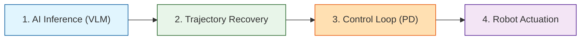
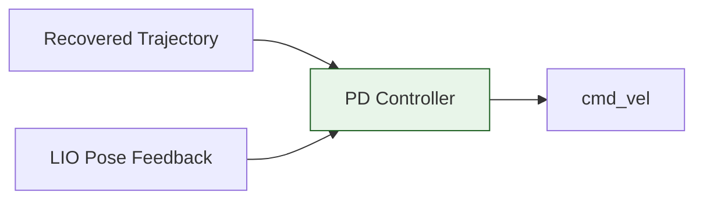
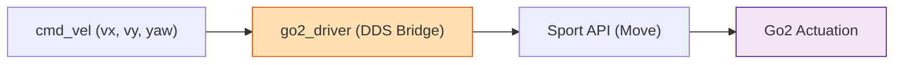
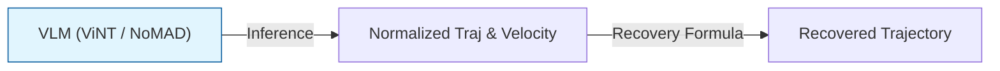

# ❄️ Unitree Go2 Antarctic Navigation Project

본 저장소는 남극 및 극한 지형 환경에서 사족보행 로봇 **Unitree Go2**의 자율주행을 제어하기 위한 ROS 2 Humble/Foxy 기반의 전용 워크스페이스(`go2_ws`)임. 
이 브랜치(`antarctica`)는 불필요한 기존 Nav2 템플릿 파일들을 제거하고, **LIO(라이다), ViNT(모방학습), Go2 SDK(구동)** 핵심 시스템으로만 구성된 클린 샌드박스 환경임.

---

## 📌 1. 전체 프로세스 개요 (Process Overview)

모방 학습(IL) 모델의 경로 추론부터 실물 로봇의 최종 보행 구동까지의 핵심 4단계 흐름도.



---

## 📊 2. 3대 핵심 모듈 정의

| 모듈명 | 분류 / 역할 | 주요 데이터 흐름 | 대상 소스코드 및 패키지 |
| :--- | :--- | :--- | :--- |
| **1) Odometry** | 위치 및 상태 추정 | LiDAR L1 + IMU ➔ 3D Pose | [FAST-LIO](https://github.com/hku-mars/FAST_LIO) (제안) / `go2_driver` |
| **2) Controller** | 경로 추종기 | 궤적 & Pose ➔ `cmd_vel` | [visualnav-transformer](https://github.com/robodhruv/visualnav-transformer) (`pd_controller.py`) |
| **3) Action API** | 로봇 구동 인터페이스 | `cmd_vel` ➔ Sport API | [go2_robot](https://github.com/IntelligentRoboticsLabs/go2_robot) (`go2_driver.cpp`) |

### 상세 정의 및 기술 전략

#### 1. Odometry Module (위치 추정)
*   **VIO (Visual-Inertial)**: 추가 장착된 [Intel RealSense D435i](https://www.intelrealsense.com/depth-camera-d435i/) 카메라 기반 오도메트리.
*   **LIO (LiDAR-Inertial)**: 로봇 내장 4D LiDAR L1 + 내부 IMU 데이터를 통한 오도메트리 계산.
*   **Leg & Internal Odometry**: `lf/sportmodestate` (다리 기구학 상태) ➔ `go2_odom_bridge`를 통해 `/go2_odom` 및 TF 변환 발행.
*   **제안 전략**: 남극 지형 극복을 위해 오도메트리 추정은 **FAST-LIO** 사용 제안.

#### 2. PID Controller (경로 추종기)

*   **ViNT / NoMAD 관련**: 
    *   `visualnav-transformer/deployment/src/pd_controller.py` 내의 비례-미분(PD) 제어 모듈 확인 완료.
    *   입력된 $10 \times 2$ trajectory와 pose 데이터를 가공해 로봇 구동 명령으로 변환하는 조향 제어기로 활용 검토.
*   **기타 제어 방식**: Go2 자체 내장 기능(`TrajectoryFollow`) 또는 ROS 2 Nav2 주행 환경.

#### 3. Unitree Go2 Action Command API (구동 인터페이스)

*   **실제 구동 API**: Unitree SDK2의 Sport API인 **`SportClient.Move(vx, vy, vyaw)`** (물리 모터 제어 및 보행).
*   **연동 오픈소스**: `go2_robot` 드라이버 패키지를 통해 ROS 2 `cmd_vel` 명령을 Sport API로 변환하여 주행 구현.

---

## 🔗 3. 소스코드 레벨 핵심 인터페이스 및 결합점 (Code-Level Bindings)

### 3.1 ViNT 제어 연산 결합점 (visualnav-transformer)
*   **관련 파일**: [pd_controller.py](file:///C:/Users/USER/Desktop/캡스톤/캡2-논문/go2_ws/visualnav-transformer/deployment/src/pd_controller.py)
*   **핵심 코드 라인 및 인터페이스**:
    *   **구독(Subscribe)**: `waypoint_sub = rospy.Subscriber(WAYPOINT_TOPIC, Float32MultiArray, callback_drive)` (Line 81)
        ➔ 모델 추론 패키지(`navigate.py`)가 연산하여 발행하는 로컬 좌표계 궤적 메시지(방향성 포함)를 수신함.
    *   **PD 제어 계산**: `v, w = pd_controller(waypoint.get())` (Line 93)
        ➔ 수신한 로컬 좌표 오차($dx, dy$)를 가공하여 모터 목표 선속도(`v`) 및 각속도(`w`)를 실시간 역산함.
    *   **발행(Publish)**: `vel_out.publish(vel_msg)` (Line 99)
        ➔ 계산된 속도를 하위 ROS 2 `/cmd_vel` 브릿지로 발행함.

### 3.2 Go2 SDK 구동 API 결합점 (go2_ws/src/go2_robot)
*   **관련 파일**: `go2_ws/src/go2_robot/go2_driver/src/go2_driver/go2_driver.cpp`
*   **핵심 코드 라인 및 인터페이스**:
    *   **구독(Subscribe)**: `cmd_vel_sub_`에서 ROS 2 표준 `/cmd_vel` 속도 토픽 구독 및 콜백(`cmd_vel_callback`) 실행.
    *   **명령 파싱**: 수신된 `geometry_msgs::msg::Twist` 메시지에서 X축 선속도(`linear.x`), Y축 선속도(`linear.y`), Z축 각속도(`angular.z`) 값을 각각 파싱함.
    *   **DDS API 전송 (Move)**: 파싱된 값들을 JSON 양식 데이터 파라미터(`x = vx`, `y = vy`, `z = vyaw`)로 직렬화하여 `/api/sport/request` 토픽(API ID: `Move`)으로 Unitree 모션 보드에 발행함.

---

## 📈 4. Trajectory 정규화 및 복원 프로세스 (모방 학습 연동)

모델이 일정한 속도 스케일에 종속되지 않고 순수 **기하학적 궤적 형태(Geometric Path)**를 효과적으로 학습할 수 있도록 속도 성분을 분리하여 정규화함.



### 4.1 학습 단계: 정규화 (Normalization)
로봇이 이동한 실제 물리 궤적에서 속도 스케일을 소거함. ($\Delta t$는 기록 주기로, 5Hz 데이터셋의 경우 $0.2\text{ s}$ 반영)

$$\text{Normalized Trajectory} = \frac{\text{GT Trajectory}}{\Delta t \times v_{GT}}$$

### 4.2 제어 단계: 물리 궤적 복원 (Recovery)
추론 시 모델이 기하학적 궤적(Normalized Trajectory)과 속도 스케일($v_{pred}$)을 예측하면, 제어기에 인가하기 전 실제 물리적 좌표계로 복원함.

$$\text{Recovered Trajectory} = \text{Normalized Trajectory} \times \Delta t \times v_{pred}$$

---

## 📂 5. antarctica 브랜치 디렉토리 구조 (Clean Workspace)

```text
go2_ws/
├── README.md                  <- 본 가이드라인 문서
├── cyclonedds.xml             <- CycloneDDS 네트워크 바인딩 설정 파일
├── visualnav-transformer/     <- ViNT / NoMAD 모델 구현 및 pd_controller.py 코드
└── src/
    ├── HesaiLidar_ROS_2.0/    <- Hesai 라이다 연동 ROS 2 드라이버
    ├── rtabmap_ros/           <- rtabmap SLAM 패키지
    └── go2_robot/             <- Unitree Go2 ROS 2 통신 패키지
        ├── go2_bringup/       <- 실행용 런칭 파일 폴더
        ├── go2_description/   <- 로봇 URDF 및 3D 메시 폴더
        ├── go2_driver/        <- cmd_vel to DDS Sport API 변환 노드 소스코드
        ├── go2_hardware/      <- 하드웨어 인터페이스 정의
        └── go2_interfaces/    <- 사용자 정의 토픽 및 서비스 정의
```
