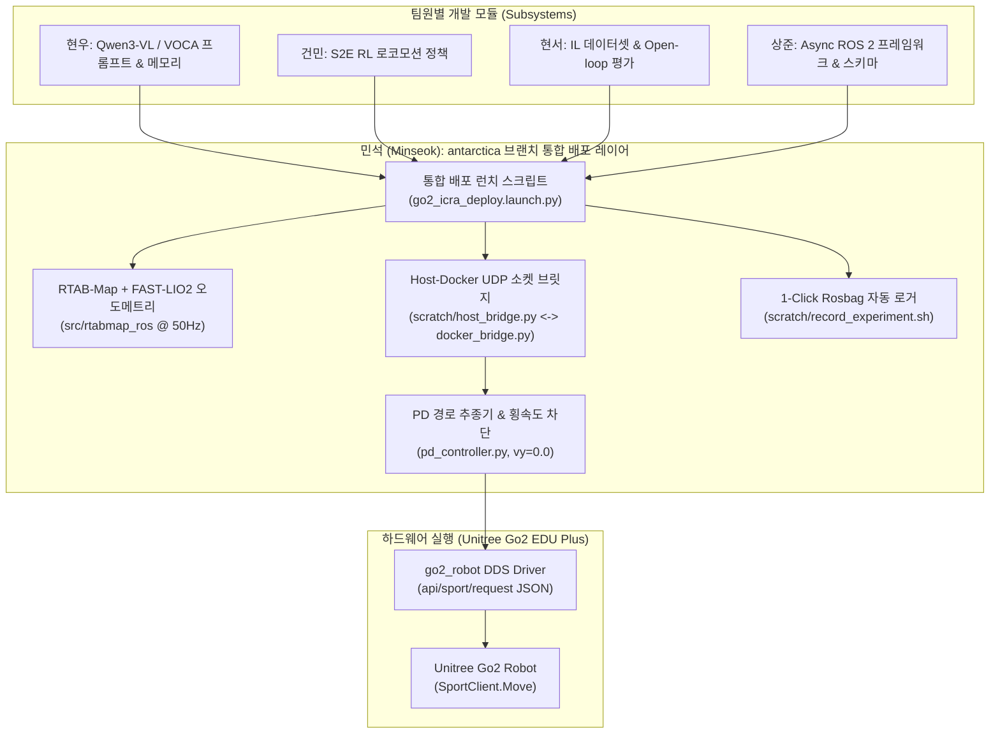

# ❄️ Unitree Go2 Antarctic Navigation Project (antarctica 브랜치)

본 저장소는 남극 및 극한 지형 환경에서 사족보행 로봇 **Unitree Go2 EDU Plus**의 자율주행을 제어하고, **ICRA 2026 자율주행 연구(VOCA + S2E)**를 실물 로봇에 통합 배포하기 위한 ROS 2 전용 워크스페이스(`go2_ws`)임.

---

## 🏗️ 1. antarctica 브랜치 통합 배포 아키텍처 (Deployment Architecture)

본 브랜치는 팀원들(현우, 건민, 현서, 상준)의 서브 시스템 결과물을 하나로 결합하여 **민석 님이 Unitree Go2 실물 로봇 온보드(Jetson Orin NX)에 최종 탑재 및 배포하는 파이프라인**을 포함합니다.



---

## 📌 2. antarctica 브랜치에서 민석 님이 배포할 4대 핵심 과제

1. **통합 배포 런치 스크립트 구현 (`go2_icra_deploy.launch.py`)**
   * 위치: `s2e-vlm-async-framework/src/s2e_vlm_bringup/launch/go2_icra_deploy.launch.py`
   * 역할: VLM 노드, S2E 노드, RTAB-Map 노드, PD Controller 노드를 **원클릭 단일 명령어로 통합 구동**.
2. **RTAB-Map + FAST-LIO2 오도메트리 파이프라인 결합**
   * `FAST-LIO2`의 100Hz `/FAST_LIO2/odom`을 `rtabmap_ros`의 `odom_topic`으로 연결하여 Loop Closure 및 3D 점군 지도 생성.
3. **Jetson Orin NX 하이브리드 소켓 브릿지 구동**
   * 호스트 OS(Foxy)와 도커 컨테이너(Jazzy) 간 1ms 이내 루프백 통신 (`scratch/host_bridge.py` $\leftrightarrow$ `scratch/docker_bridge.py`).
4. **원클릭 Rosbag 데이터 수집 및 ICRA 정량 지표 추출**
   * 주행 테스트 시 `scratch/record_experiment.sh`를 구동하여 성공률(SR %), 충돌 횟수, 주행 시간, SPL 지표 자동 산출.

---

## 🚀 3. 현재 개발 및 연동 진행상황 (Current Progress)

| 개발 모듈 / 태스크 | 상태 | 담당자 | 상세 검증 계획 |
| :--- | :--- | :--- | :--- |
| **RTAB-Map LIO 오도메트리 파싱** | 🟢 **코드 완료 (실물 검증 대기)** | **민석** | `/FAST_LIO2/odom` 수신 및 `/rtabmap/odom` (30~50Hz) 발행 검증 |
| **PD 경로 추종기 & 횡속도 차단** | 🟢 **코드 완료 (실물 검증 대기)** | **민석** | `pd_controller.py` $v_y=0.0$ 차단 및 $K_p, K_d$ Fishtailing 감쇠 튜닝 |
| **Foxy-Jazzy UDP 소켓 브릿지** | 🟢 **코드 완료 (실물 검증 대기)** | **민석** | `scratch/host_bridge.py` $\leftrightarrow$ `docker_bridge.py` 1ms 이내 루프백 통신 |
| **통합 런치 스크립트 작성** | 🟡 **배포 진행 중 (Ready)** | **민석** | `go2_icra_deploy.launch.py` 작성 및 `antarctica` 브랜치 커밋 |
| **1-Click Rosbag 자동 로거** | 🟢 **스크립트 완료** | **민석** | `scratch/record_experiment.sh` 자동 로깅 및 SR %, SPL 산출 스크립트 |

---

## 📋 4. 실하드웨어 젯슨 보드 Quick Run 배포 가이드

복귀 후 젯슨 보드에서 단 3단계 명령어로 실물 로봇을 구동하는 명령어입니다:

### 1단계: 호스트 OS 드라이버 및 오도메트리 가동 (Host Foxy)
```bash
cd ~/go2_ws
colcon build --packages-select go2_robot go2_driver rtabmap_ros && source install/setup.bash
ros2 launch go2_bringup go2.launch.py
```

### 2단계: 도커 컨테이너 및 통합 배포 런치 실행 (Docker Jazzy)
```bash
docker run -it --name go2_jazzy_cpu --net=host -v ~/go2_ws:/workspace/go2_ws arm64v8/ros:jazzy-ros-base bash
# (도커 내부 진입 후)
cd /workspace/go2_ws/s2e-vlm-async-framework && colcon build && source install/setup.bash
ros2 launch s2e_vlm_bringup go2_icra_deploy.launch.py use_mock_hardware:=false
```

### 3단계: 소켓 통신 브릿지 및 1-Click Rosbag 로거 가동
```bash
# 호스트 터미널 1
python3 ~/go2_ws/scratch/host_bridge.py

# 호스트 터미널 2 (실험 기록 시작)
bash ~/go2_ws/scratch/record_experiment.sh
```

---

## 📂 5. antarctica 브랜치 디렉토리 구조 (Clean Workspace)

```text
go2_ws/ (antarctica 브랜치)
├── README.md                  <- [최신화] antarctica 브랜치 전용 통합 배포 가이드 포털
├── cyclonedds.xml             <- CycloneDDS 네트워크 바인딩 설정 파일
├── docs/                      <- 백업 상세 세부 기술 및 마스터 전략 문서 폴더
│   ├── MINSEOK_GO2_EDU_PLUS_ICRA_ALL_IN_ONE_MASTER.md  <- [민석 올인원 단일 마스터 전략서]
│   └── 08_jetson_orin_nx_factcheck_and_architecture_report.md
├── scratch/                   <- 실물 연동 검증용 UDP 소켓/파이썬 백업 드라이버 스크립트 폴더
│   ├── host_bridge.py         <- 호스트 단(Foxy) UDP 통신 송수신 브릿지
│   ├── docker_bridge.py       <- 도커 내부(Jazzy) UDP 통신 송수신 브릿지
│   ├── python_direct_driver.py<- ROS 2 C++ 빌드 에러 시 비상 긴급 구동 드라이버
│   └── record_experiment.sh   <- 1-Click Rosbag 자동 로거 스크립트
├── visualnav-transformer/     <- ViNT / NoMAD 모델 구현 및 pd_controller.py 코드
├── qwen_nav_memory_framework_v3/ <- 상위 VLM 기반 에피소딕 메모리 프레임워크 패키지
├── s2e-vlm-async-framework/   <- ROS 2 비동기 통합 프레임워크 패키지
│   └── src/s2e_vlm_bringup/launch/go2_icra_deploy.launch.py <- [민석 통합 배포 런치]
└── src/
    ├── rtabmap_ros/           <- RTAB-Map + FAST-LIO2 SLAM/오도메트리 패키지 (민석 전담)
    └── go2_robot/             <- Unitree Go2 ROS 2 통신 드라이버 패키지
```
