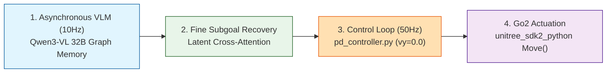
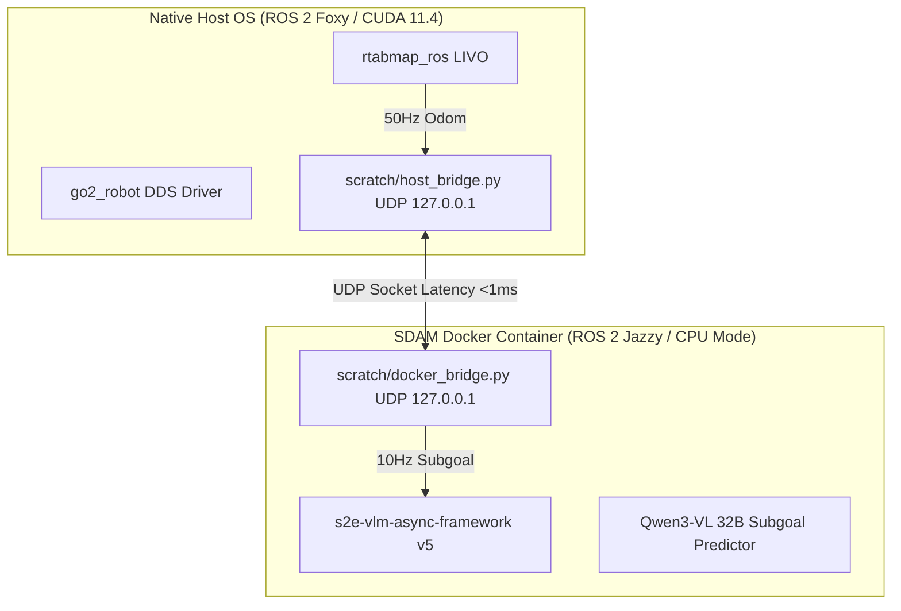

# ❄️ [VL-MAG / ICRA 2026] 시스템 아키텍처 및 코어 파이프라인

> **문서 목적**: VOCA + S2E 기반 **VL-MAG (Vision-Language Memory-Action Graph)** 시스템 전체 프로세스 흐름, 젯슨 온보드 Host OS $\leftrightarrow$ Docker 비동기 파이프라인, RTAB-Map LIVO 센서 연동 및 4족 보행 PD 제어기 결합 구조를 명시함.

---

## 📌 1. 전체 프로세스 개요 (Process Overview)

**VL-MAG** 아키텍처의 저주기 VLM 비동기 수퍼바이저(10Hz)부터 고주파 S2E 4족 보행 제어기(50Hz)까지의 4단계 실행 흐름도.



---

## 📊 2. 3대 핵심 모듈 및 센서 파이프라인 정의

| 모듈명 | 분류 / 역할 | 데이터 흐름 및 주파수 | 소스코드 및 구동 환경 |
| :--- | :--- | :--- | :--- |
| **1) RTAB-Map LIVO** | 내장 센서 오도메트리/SLAM | Front RGB + L2 LiDAR + IMU ➔ 50Hz Pose | `rtabmap_ros` (`go2_rtabmap.launch.py` / Host OS) |
| **2) VL-MAG Supervisor** | VLM 그래프 비주얼 메모리 | Monocular RGB + Goal ➔ Subgoal (10Hz) | `s2e-vlm-async-framework` (`tag v5` / Docker) |
| **3) S2E / PixNav Controller** | 고속 궤적 제어기 | Subgoal ➔ $v_x, \omega_z$ 속도 명령 (50Hz) | `visualnav-transformer` (`pd_controller.py`) |
| **4) Go2 Action API** | 물리 로봇 보행 구동 | ROS 2 `/cmd_vel` ➔ SportClient.Move | `go2_robot` (`unitree_sdk2_python` / Host OS) |

---

## 🔗 3. 소스코드 레벨 핵심 인터페이스 및 결합점 (Code-Level Bindings)

### 3.1 RTAB-Map LIVO 센서 파이프라인 (Host OS / ROS 2 Foxy)
*   **실행 파일**: `src/rtabmap_ros/rtabmap_launch/launch/go2_rtabmap.launch.py`
*   **센서 매핑**:
    *   카메라: `/camera/front/image_raw` (Go2 전면 초광각 RGB)
    *   라이다: `/utlidar/cloud_deskewed` (Unitree L2 4D LiDAR Pointcloud)
    *   IMU: `/utlidar/imu` (Go2 Body IMU)
*   **출력**: `/rtabmap/odom` (50Hz 정밀 3D 오도메트리) 및 2D/3D Occupancy Grid Map

### 3.2 S2E / PixNav 4족 보행 PD 제어기 (Host OS / Python 3)
*   **관련 파일**: `visualnav-transformer/deployment/src/pd_controller.py`
*   **횡속도 차단 및 보행 댐핑**:
    *   Go2 4족 보행 안정성을 위해 횡속도 $v_y = 0.0$ 차단 및 선속도 댐핑 적용:
        ```python
        v_x = clamp(v_x_calc, 0.0, 0.4)  # 직진 선속도 제한 (m/s)
        v_y = 0.0                        # 4족 보행 좌우 흔들림 방지
        w_z = clamp(w_z_calc, -0.6, 0.6) # 회전 각속도 제한 (rad/s)
        ```
*   **DDS 전송**: `unitree_sdk2_python` 브릿지를 통해 `SportClient.Move(v_x, 0.0, w_z)`를 Go2 온보드로 50Hz 인가.

---

## 🏗️ 4. 젯슨 온보드 (Host OS $\leftrightarrow$ Docker) 비동기 소켓 아키텍처

Tegra UMA CUDA Driver ABI 차이로 인한 GPU 충돌을 방지하는 이중 OS 결합 구조:


