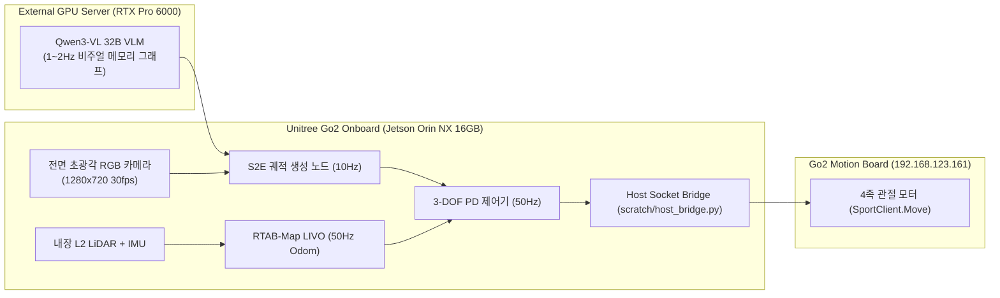

# 🏗️ [01] ESCAPE-Nav 시스템 아키텍처 및 온보드 하드웨어 총괄 가이드

> **문서 소유자**: **민석 (Minseok - Hardware, Sensor & Odometry Lead)**  
> **논문 공식 명칭**: **`ESCAPE-Nav: Experience-Shaped Causally Aligned Perception–Execution for Asynchronous VLM Navigation` (ICRA 2026)**  
> **문서 목적**: Unitree Go2 EDU 사족보행 로봇과 NVIDIA Jetson Orin NX (16GB) 온보드 컴퓨팅 모듈, 원격 GPU 서버(RTX Pro 6000) 간의 **하이브리드 분할 아키텍처 및 센서 제원, 하드웨어 팩트체크 총괄 명세**입니다.

---

## 📌 목차 (Table of Contents)
1. [시스템 분할 아키텍처 (Server / Robot Split)](#1-시스템-분할-아키텍처-server--robot-split)
2. [온보드 센서 제원 및 입력 토픽 규격](#2-온보드-센서-제원-및-입력-토픽-규격)
3. [Jetson Orin NX 16GB 하드웨어 제약 및 메모리 팩트체크](#3-jetson-orin-nx-16gb-하드웨어-제약-및-메모리-팩트체크)
4. [No-SLAM 프레이밍과 RTAB-Map LIVO의 학술적 역할 정의](#4-no-slam-프레이밍과-rtab-map-livo의-학술적-역할-정의)

---

## 🏗️ 1. 시스템 분할 아키텍처 (Server / Robot Split)

* **원격 GPU 서버 (Pro 6000)**: 초대형 VLM(Qwen3-VL 32B) 추론 및 글로벌 비주얼 메모리 서빙.
* **로봇 온보드 (Jetson Orin NX 16GB)**: $50\text{Hz}$ RTAB-Map LIVO 실시간 오도메트리 수신, $10\text{Hz}$ S2E 궤적 생성, $50\text{Hz}$ 3-DOF 홀로노믹 모터 제어.

---

## 📡 2. 온보드 센서 제원 및 입력 토픽 규격

| 센서 명칭 | 물리적 제원 및 특성 | ROS 2 입력 토픽 명 | 발행 주기 |
| :--- | :--- | :--- | :---: |
| **전면 초광각 RGB 카메라** | 1280 $\times$ 720, $120^\circ$ FOV | `/camera/front/image_raw` (`/compressed`) | $30\text{Hz}$ |
| **Unitree L2 4D LiDAR** | $360^\circ \times 96^\circ$ 반구형 커버리지 | `/utlidar/cloud_deskewed` | $15\text{Hz}$ |
| **내장 6-DOF 바디 IMU** | 3축 가속도계 + 3축 자이로스코프 | `/utlidar/imu` | $500\text{Hz}$ |
| **RTAB-Map LIVO 오도메트리** | LiDAR-Visual-Inertial 융합 3D Pose | `/rtabmap/odom` | **$50\text{Hz}$** |

---

## ⚡ 3. Jetson Orin NX 16GB 하드웨어 제약 및 메모리 팩트체크

* **통합 메모리(Unified LPDDR5 16GB) 제약**:
  * 호스트 OS(Ubuntu 20.04 JetPack 5.1.x), DDS 통신, RTAB-Map LIVO 점유 메모리(~2.5GB)를 제외한 실질 가용 메모리는 **~13.5GB**임.
  * 32B VLM 모델(INT4 양자화 시에도 최소 16~18GB 필요)을 젯슨 온보드에 올리면 즉시 OOM 크래시가 발생하므로, **32B 모델은 Pro 6000 서버에서 담당하고 젯슨 온보드는 S2E(10Hz) 및 제어기(50Hz)에 집중**함.

---

## 🛡️ 4. No-SLAM 프레이밍과 RTAB-Map LIVO의 학술적 역할 정의

* **학술적 오해 방지**: 우리 연구(VL-MAG)는 사전 지오메트리 맵 없이 비주얼 메모리 그래프로 달리는 **"No-Prior-Metric-Map"** 항법임.
* **RTAB-Map LIVO의 역할**: 사전 맵으로 길을 찾는 용도가 아니라, **"오프라인 맵핑(이론적 최단거리 $l_i$ 측정용) 및 온라인 50Hz 실측 오도메트리($p_i$ 적분용) 로거"**로 역할을 명확히 분리하여 학술적 정체성을 확립함.
