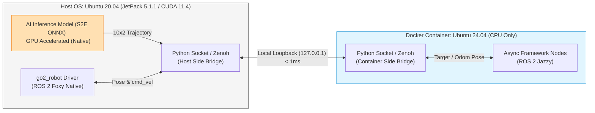

# 🛠️ 젯슨 하이브리드 분리 아키텍처 및 배포 가이드 (Hybrid Split Architecture)

본 문서는 JetPack 5 호스트 환경(Ubuntu 20.04 / CUDA 11.4)과 통합 패키지 요구 환경(Ubuntu 24.04 / ROS 2 Jazzy) 간의 Tegra 드라이버 백포트 에러(Driver/Library Mismatch)를 회피하고 로봇 한 대에서 모든 자율주행 알고리즘을 구동하는 하이브리드 아키텍처 구조도 및 실행 CLI 가이드를 기술함.

---

## 📌 1. 시스템 구조도 (Data Flow Diagram)



### 세부 구동 전략
*   **GPU 트랙 (호스트 네이티브 구동)**: 무거운 AI 모델(ViNT/NoMAD 및 S2E ONNX) 추론 루프는 호스트 OS 단에서 구동하여 호스트에 탑재된 CUDA 11.4 및 TensorRT 8.5.2 드라이버를 직접 호출함.
*   **CPU 트랙 (Jazzy 도커 컨테이너 구동)**: 비동기 프레임워크 및 메모리 그래프 연산(Jazzy)은 도커 안에서 실행함. 도커 런칭 시 `--runtime=nvidia` 옵션을 주지 않는 **순수 CPU 모드**로 기동하여 라이브러리 크래시 가능성을 원천 차단함.
*   **루프백 브릿징 (통신)**: 두 환경 간의 제어 명령(Twist) 및 위치 정보(Pose)는 로컬 루프백(`127.0.0.1`) 네트워크 상에서 **Python Socket Bridge** 또는 **Zenoh Bridge**를 통해 실시간 바이패스함.

---

## 🏃 2. 하이브리드 연동 및 배포 워크플로우 (Integration & Deployment Workflow)

### 1단계: 호스트 OS 준비 (Host Setup - Foxy 네이티브)
1.  **CUDA/TensorRT/JetPack 사양 검증**:
    ```bash
    # 젯팩 버전 확인
    cat /etc/nv_tegra_release
    
    # CUDA 컴파일러 버전 확인 (11.4 확인)
    nvcc --version
    
    # TensorRT 버전 확인 (8.5.2 확인)
    dpkg -l | grep nvinfer
    ```
2.  **GPU 가속 PyTorch/ONNX Runtime 수동 설치**:
    > [!NOTE]
    > **수동 설치가 필요한 기술적 사유 (우회 배포 전략)**
    > *   **공식 PyPI 패키지 부재**: 파이썬 공식 패키지 매니저(`pip`)는 ARM64(`aarch64`) 아키텍처용 CUDA 가속 PyTorch/ONNX 라이브러리를 배포하지 않습니다. 그냥 설치 시 그래픽카드 가속이 비활성화된 CPU 전용으로 깔려 주행 모델 추론 속도가 나오지 않습니다.
    > *   **컴파일 시간 최소화**: 소스코드 컴파일 시 10시간 이상 걸리므로, 엔비디아가 JetPack 5.1.1 사양에 맞춰 사전에 빌드해 배포하는 공식 가속 휠 파일(`.whl`)을 수동 설치하는 것이 정석 우회로입니다.
    ```bash
    # JetPack 5.1.1 전용 PyTorch ARM64 빌드 다운로드 및 설치
    wget https://developer.download.nvidia.com/compute/redist/jp/v511/pytorch/torch-2.0.0+nv23.05-cp38-cp38-linux_aarch64.whl
    pip3 install torch-2.0.0+nv23.05-cp38-cp38-linux_aarch64.whl
    
    # JetPack 5.1.1 (CUDA 11.4) 전용 ONNX Runtime GPU 버전을 수동 설치
    pip3 install onnxruntime-gpu --index-url https://aiinfra.pkgs.visualstudio.com/PublicPackages/_packaging/onnxruntime-cuda-11/pypi/simple/
    ```
3.  **로봇 구동 Foxy 네이티브 드라이버 실행**:
    ```bash
    cd ~/go2_ws
    colcon build --packages-select go2_robot go2_driver
    source install/setup.bash
    
    # 로봇 하드웨어 및 DDS 통신 개통
    ros2 launch go2_bringup go2.launch.py
    ```

### 2단계: 도커 컨테이너 준비 (Docker Setup - Jazzy CPU 전용)
1.  **Jazzy 공식 ARM64 이미지 Pull 및 기동**:
    ```bash
    # 1. ROS 2 Jazzy 공식 ARM64 베이스 이미지 다운로드
    docker pull arm64v8/ros:jazzy-ros-base
    
    # 2. CPU-only 컨테이너 기동 (--net=host로 호스트 DDS 통신망 루프백 공유)
    docker run -it --name go2_jazzy_cpu \
      --net=host \
      -v ~/go2_ws:/workspace/go2_ws \
      arm64v8/ros:jazzy-ros-base bash
    ```
2.  **도커 컨테이너 내부 환경 구축 및 비동기 프레임워크 빌드**:
    ```bash
    # 3. 도커 쉘 진입 후 필요한 패키지 빌더 설치
    apt-get update && apt-get install -y python3-colcon-common-extensions python3-pip
    
    # 4. 비동기 프레임워크 폴더로 이동 후 빌드
    cd /workspace/go2_ws/s2e-vlm-async-framework
    colcon build
    source install/setup.bash
    
    # 5. 유닛 테스트 작동 여부 검증 (23개 테스트 통과 확인)
    python3 -m unittest discover -s src/s2e_vlm_nodes/test -p "test_*.py" -v
    ```

### 3단계: 통신 브릿지 사전 테스트 (Bridge Integration Test)
*   **루프백 네트워크를 통한 데이터 전달 확인**:
    *   **옵션 A (Zenoh Bridge)**:
        양측에 `zenoh-bridge-dds` 빌드 파일을 기동하여 Foxy <-> Jazzy 간 데이터 변환을 활성화함.
        ```bash
        # 호스트 및 컨테이너 내부에서 각각 기동
        ./zenoh-bridge-dds -d 0
        ```
    *   **옵션 B (파이썬 소켓 송수신 스크립트 실행)**:
        양단에서 통신 타입이 없는 바이패스 소켓을 기동함.
        *   호스트 터미널: `python3 ~/go2_ws/scratch/host_bridge.py`
        *   도커 컨테이너 내부: `python3 /workspace/go2_ws/scratch/docker_bridge.py`

### 4단계: 실물 자율주행 제어 루프 검증 (Air & Ground Test)
1.  **공중 동작 검증 (거치대 실행)**:
    *   로봇 다리를 공중에 띄운 뒤, 도커 내에서 실물 제어 주기를 돌려 동작을 스캔함.
        ```bash
        # 도커 컨테이너 내부에서 실제 하드웨어 파라미터를 인가하여 컨트롤러 구동
        ros2 launch s2e_vlm_bringup robot_side.launch.py use_mock_hardware:=false
        ```
2.  **지상 최종 자율주행 (Ground Test)**:
    *   공중 테스트 완료 후 로봇을 평지에 두고 주행을 트리거하여 최종 Closed-loop 주행을 완료함.
