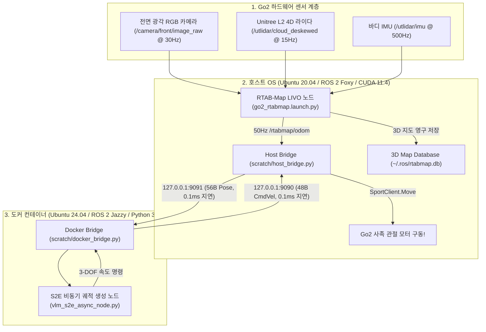

# 🐕 [05] 실물 로봇 RTAB-Map LIVO ↔ 도커 연동 및 실내 실증 주행 마스터 계획서

> **문서 소유자**: **민석 (Minseok - Hardware, Sensor & Deployment Lead)**  
> **논문 공식 명칭**: **`ESCAPE-Nav: Experience-Shaped Causally Aligned Perception–Execution for Asynchronous VLM Navigation` (ICRA 2026)**  
> **테스트 장소**: 한동대학교 연구동 건물 실내 복도 (1~2층)  
> **문서 목적**: 호스트 OS(Ubuntu 20.04 Foxy)에서 구동되는 **RTAB-Map LIVO(50Hz 오도메트리 & 3D 지도 작성)**와 도커 컨테이너(Ubuntu 24.04 Jazzy)의 **S2E 궤적 생성 노드**를 초저지연($0.1\text{ms}$) UDP 소켓 브릿지로 연동하고, **ICRA 2026 Table VIII 5대 시나리오 20회 주행 데이터를 안전하게 수집/검증하기 위한 공식 마스터 계획서**입니다.

---

## 📌 목차 (Table of Contents)
1. [하이브리드 시스템 아키텍처 및 통신 구조](#1-하이브리드-시스템-아키텍처-및-통신-구조)
2. [하드웨어 & 네트워크 사전 점검 체크리스트](#2-하드웨어--네트워크-사전-점검-체크리스트)
3. [현장 4단계 온보드 실행 매뉴얼](#3-현장-4단계-온보드-실행-매뉴얼)
4. [실내 Table VIII 5대 시나리오 주행 규격](#4-실내-table-viii-5대-시나리오-주행-규격)
5. [1-Click Rosbag 자동 로깅 및 지표 산출](#5-1-click-rosbag-자동-로깅-및-지표-산출)

---

## 🏗️ 1. 하이브리드 시스템 아키텍처 및 통신 구조

호스트 OS의 순정 **CUDA 11.4 GPU 가속(RTAB-Map LIVO)**과 도커 컨테이너의 **Python 3.12 AI 프레임워크(S2E / VLM)**가 버전 충돌 없이 완벽히 맞물려 돌아가는 구조입니다:



---

## 🔋 2. 하드웨어 & 네트워크 사전 점검 체크리스트

* [ ] **Go2 배터리 잔량**: $\ge 80\%$ (스마트 배터리 완충 확인)
* [ ] **Jetson Orin NX 부팅**: 12V 통전 및 파란색 LED 점등 확인
* [ ] **SSH 원격 접속 확인**:
  * **NetBird VPN 접속 (권장)**: `ssh unitree@100.96.204.119` (비밀번호: `admin`)
  * **로컬 와이파이 접속 (백업)**: `ssh unitree@192.168.123.99` (비밀번호: `admin`)
* [ ] **센서 렌즈 청결도**: 전면 RGB 카메라 및 L2 LiDAR 렌즈 먼지/지문 제거
* [ ] **안전 비상 정지(E-Stop)**: 유니트리 무선 리모컨을 손에 지참 (비상 시 `L2 + B` 또는 전원 스위치)

---

## 🚀 3. 현장 4단계 온보드 실행 매뉴얼

### [1단계] 호스트 RTAB-Map Foxy 1-Click 설치 & 워크스페이스 빌드
```bash
# 1. 공식 Foxy RTAB-Map 바이너리 설치 (최초 1회만 실행, 1분 소요)
sudo apt update && sudo apt install -y ros-foxy-rtabmap-ros ros-foxy-rtabmap

# 2. 워크스페이스 환경 설정 및 런치 패키지 빌드
cd ~/go2_ws_antarctica
source /opt/ros/foxy/setup.bash
colcon build --symlink-install --packages-select rtabmap_launch
source install/setup.bash
```

### [2단계] 호스트 RTAB-Map LIVO 맵핑 가동 및 50Hz 오도메트리 검증
```bash
# [터미널 1 - 호스트] LIVO 맵핑 노드 실행
ros2 launch rtabmap_launch go2_rtabmap.launch.py

# [터미널 2 - 호스트] 오도메트리 출력 주기 검증 (50Hz 확인)
ros2 topic hz /rtabmap/odom
```

### [3단계] 복도 1바퀴 수동 주행 및 3D 점군 지도 저장
1. 조이스틱 리모컨으로 $0.2 \sim 0.3\text{m/s}$ 속도로 실험할 복도를 1바퀴 천천히 수동 주행합니다.
2. 출발점으로 다시 돌아오면 RTAB-Map이 누적 오차를 0으로 묶는 **루프 클로저(Loop Closure)**를 수행합니다.
3. 터미널 1에서 `Ctrl + C`를 누르면 `~/.ros/rtabmap.db` 파일로 3D 지도가 영구 저장됩니다.

### [4단계] 도커 S2E 자율주행 및 브릿지 폐루프 기동
```bash
# [터미널 1 - 호스트] LIVO 가동 (저장된 맵 기반 로컬라이제이션 또는 실시간 오도메트리)
ros2 launch rtabmap_launch go2_rtabmap.launch.py

# [터미널 2 - 호스트] Host Bridge 가동 (포즈 송신 & 모터 수신)
python3 ~/go2_ws_antarctica/scratch/host_bridge.py

# [터미널 3 - 도커 컨테이너] S2E 정책 가동
docker compose --profile robot_side up -d robot-core
# (또는 컨테이너 접속 후) python3 s2e-vlm-async-framework/src/vlm_s2e_async_node.py
```

---

## 📐 4. 실내 Table VIII 5대 시나리오 주행 규격

```text
========================================================================================
            ICRA 2026 ESCAPE-Nav TABLE VIII REAL-ROBOT CORE SCENARIOS (총 20회 주행)
========================================================================================
 [시나리오 1: Dead-end room (막다른 공간 탈출 - Core)]
 🔵 START ─────── (막다른 복도 끝 진입 ➔ 360도 능동 시야 확장 ➔ 후방 출구 탈출) ───────> 🔴 GOAL

 [시나리오 2: Blocked goal direction (목표 방향 장애물 차단 - Core)]
 🔵 START ─────── (목표 방향 장애물 직면 ➔ 측면 우회로 탐색 및 선회) ───────> 🔴 GOAL

 [시나리오 3: Repeated corridor (반복 구조 복도 회피 - Core)]
 🔵 START ─────── (90도 직각 코너 및 반복 복도 ➔ 방향성 메모리로 실패 에지 재진입 억제) ───────> 🔴 GOAL

 [시나리오 4: Active-view recovery (능동 시야 확장 탐색 - Deployment)]
 🔵 START ─────── (진행 정체 감지 시 능동적 yaw 회전으로 새 브랜치 발견) ───────> 🔴 GOAL

 [시나리오 5: Dynamic obstacle (동적 보행자 실시간 회피 - Deployment)]
 🔵 START ─────── (1.2m/s 보행자 이동 시 실시간 비동기 재계획 및 감속 회피) ───────> 🔴 GOAL
========================================================================================
```

---

## 📊 5. 1-Click Rosbag 자동 로깅 및 지표 산출

주행을 시작할 때 호스트 터미널 4에서 아래 명령어를 실행하여 고속 SSD I/O로 필수 토픽만 Rosbag에 기록합니다:

```bash
# 1-Click Rosbag 자동 녹화
bash ~/go2_ws_antarctica/scratch/record_experiment.sh Dead_end_room Full_ESCAPE_Nav Trial1

# 주행 완료 후 ICRA Table VIII 6대 지표 자동 계산
python3 ~/go2_ws_antarctica/scratch/calculate_icra_metrics.py
```
* **출력 산출물**:
  * `Succ./5` (성공률)
  * `IF/5` (무개입 완주율)
  * `Time (s)` ($T^\dagger$ 정규화 완주 시간)
  * `Duty` (주행 듀티 사이클)
  * `Rec. succ.` (탈출 성공수)
  * `Re-entry` (실패 에지 재진입 횟수)
