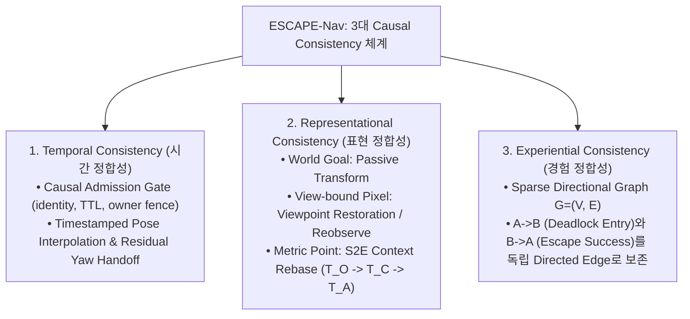

# 🏆 [06] ESCAPE-Nav (ICRA 2026) 정량적 실험 벤치마크 마스터 총괄보고서

> **문서 소유자**: **민석 (Minseok - Hardware, Sensor & Deployment Lead)**  
> **논문 공식 명칭**: **`ESCAPE-Nav: Experience-Shaped Causally Aligned Perception–Execution for Asynchronous VLM Navigation`**  
> **문서 근거**: 최신 13페이지 논문 초안(`ICRA_논문 초안.pdf`) **TABLE VIII (Unitree Go2 Paired Core-Scenario Template)** 전수 반영  
> **문서 목적**: 실물 로봇 Unitree Go2 EDU 온보드 환경에서 수행할 3대 Core 시나리오(Dead-end room, Blocked goal direction, Repeated corridor) 및 2대 추가 배치 시나리오(Active-view recovery, Dynamic obstacle)의 **공식 Table VIII 양식, 평가 지표(Succ./5, IF/5, Time, Duty, Rec. succ., Re-entry) 및 통계 공식 총괄 명세**입니다.

---

## 📌 목차 (Table of Contents)
1. [ESCAPE-Nav 핵심 기여 및 3대 인과 정합성 (Causal Consistency)](#1-escape-nav-핵심-기여-및-3대-인과-정합성-causal-consistency)
2. [공식 TABLE VIII: Unitree Go2 실물 로봇 실증 평가표](#2-공식-table-viii-unitree-go2-실물-로봇-실증-평가표)
3. [Go2 실물 로봇 5대 시나리오 상세 규격](#3-go2-실물-로봇-5대-시나리오-상세-규격)
4. [정량 지표 계산 공식 (Succ./5, IF/5, Time, Duty, DRS, FBR)](#4-정량-지표-계산-공식)

---

## 🎯 1. ESCAPE-Nav 핵심 기여 및 3대 인과 정합성 (Causal Consistency)

ESCAPE-Nav는 비동기 VLM 내비게이션의 3대 난제를 해결하기 위해 설계된 시스템입니다:

---

## 🏆 2. 공식 TABLE VIII: Unitree Go2 실물 로봇 실증 평가표

> **[논문 초안 Table VIII 원문 주석]**  
> *Unitree Go2 paired core-scenario template. 동일 route/start/goal/timeout에서 각 method를 5회 실행한다. Succ.와 IF는 success/intervention-free trial 수, Time은 failure를 timeout으로 집계한 $T^\dagger$, Rec. succ.는 successful/triggered recovery event, Re-entry는 failed-edge 재진입 수다.*

### 📊 TABLE VIII: Unitree Go2 Paired Core-Scenario Benchmark Table

| Scenario (평가 시나리오) | Method (비교 알고리즘) | Succ./5 ↑ (성공 횟수) | IF/5 ↑ (무개입 완주) | Time (s) ↓ (평균 시간 $T^\dagger$) | Duty ↑ (주행 듀티비) | Rec. succ. ↑ (탈출 성공수) | Re-entry ↓ (실패 재진입) |
| :--- | :--- | :---: | :---: | :---: | :---: | :---: | :---: |
| **Dead-end room** *(막다른 공간 탈출)* | Direct-goal *(Baseline)* **Full ESCAPE-Nav *(Ours)*** | `[TBD]` `[TBD]` | `[TBD]` `[TBD]` | `[TBD]` `[TBD]` | `[TBD]` `[TBD]` | `[TBD]` `[TBD]` | `[TBD]` `[TBD]` |
| **Blocked goal direction** *(목표 방향 장애물 차단)* | Direct-goal *(Baseline)* **Full ESCAPE-Nav *(Ours)*** | `[TBD]` `[TBD]` | `[TBD]` `[TBD]` | `[TBD]` `[TBD]` | `[TBD]` `[TBD]` | `[TBD]` `[TBD]` | `[TBD]` `[TBD]` |
| **Repeated corridor** *(반복 구조 복도 회피)* | Direct-goal *(Baseline)* **Full ESCAPE-Nav *(Ours)*** | `[TBD]` `[TBD]` | `[TBD]` `[TBD]` | `[TBD]` `[TBD]` | `[TBD]` `[TBD]` | `[TBD]` `[TBD]` | `[TBD]` `[TBD]` |
| **Active-view recovery** *(능동 시야 확장 탐색)* | **Full ESCAPE-Nav *(Ours)*** | `[TBD]` | `[TBD]` | `[TBD]` | `[TBD]` | `[TBD]` | `[TBD]` |
| **Dynamic obstacle** *(동적 보행자 실시간 회피)* | **Full ESCAPE-Nav *(Ours)*** | `[TBD]` | `[TBD]` | `[TBD]` | `[TBD]` | `[TBD]` | `[TBD]` |

---

## 📐 3. Go2 실물 로봇 5대 시나리오 상세 규격

1. **Dead-end room (3대 Core 시나리오 1)**:
   * 막다른 공간/복도 끝 진입 시 전방 막힘을 감지하고 $360^\circ$ Active Sweep을 통해 후방 $180^\circ$ 출구로 탈출하는 성능 검증.
2. **Blocked goal direction (3대 Core 시나리오 2)**:
   * 목표점 방향이 벽이나 장애물로 직접 막혀 있을 때, Direct-goal처럼 벽에 충돌하지 않고 측면 우회로를 찾아 선회하는 성능 검증.
3. **Repeated corridor (3대 Core 시나리오 3)**:
   * 연구동 내 시각적으로 유사한 90도 직각 코너 및 반복 복도 구조에서 Directional Memory를 이용해 과거 실패 경로 재진입을 억제하는 성능 검증.
4. **Active-view recovery (추가 Deployment 시나리오 1)**:
   * 뷰 확장 스케줄러가 no-progress/stagnation 감지 시 능동적으로 카메라를 회전하여 새 branch를 탐색하는 성능 검증.
5. **Dynamic obstacle (추가 Deployment 시나리오 2)**:
   * $1.2\text{m/s}$ 이동 보행자 통과 시 실시간 비동기 재계획으로 안전 감속 및 우회하는 성능 검증.

---

## 📊 4. 정량 지표 계산 공식

1. **Normalized Completion Time ($T^\dagger$)**:
   $$T_i^\dagger = S_i \min(T_i, T_{\max}) + (1 - S_i) T_{\max}$$
   *(실패나 타임아웃 발생 시 페널티 $T_{\max}$를 부여하여 조기 충돌이 빠른 완주로 왜곡되는 현상 방지)*
2. **Directional Recovery Score (DRS)**:
   $$\text{DRS} = \frac{N_{\text{escaped and resumed}}}{N_{\text{true detected}}}$$
3. **Failed-Branch Re-entry Rate (FBR)**:
   $$\text{FBR} = \frac{N_{\text{failed edge reentry}}}{N_{\text{opportunity}}}$$
