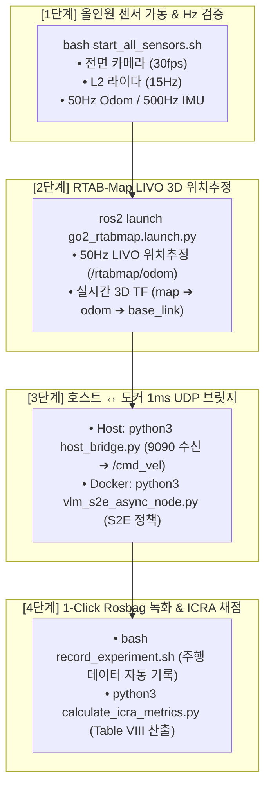

# 🐕 Unitree Go2 실물 로봇 센서 및 ESCAPE-Nav 자율주행 정밀 검증 마스터 계획서 (Master Verification Plan)

> **문서 버전**: v1.0 (2026-08-19)  
> **대상 로봇**: Unitree Go2 EDU Plus (NVIDIA Jetson Orin NX 16GB)  
> **소프트웨어 스택**:  
> • Host OS: Ubuntu 20.04 LTS (ROS 2 Foxy / CUDA 11.4 / CycloneDDS)  
> • Docker Sandbox: Ubuntu 24.04 LTS (`sdam_go2_container` / ROS 2 Jazzy / Python 3.12)  
> • Network: NetBird VPN (`100.96.204.119`) / Robot Internal Bus (`eth0: 192.168.123.99` ↔ `192.168.123.161`)  
> **검증 목표**: ICRA 2026 Table VIII 실물 로봇 5대 핵심 코스 정량 벤치마크 데이터 수집 및 무결성 검증

---

## 🗺️ 1. 전체 아키텍처 및 4단계 검증 워크플로우



---

## 📋 2. 단계별 정밀 실행 프로토콜 및 검증 기준

### 🟢 [1단계] 올인원 센서 풀 패키지 가동 및 Hz 무결성 검증
* **목적**: 전면 내장 카메라, L2 라이다, 관절 모터, IMU가 단 1줄의 명령어로 정상 발행되는지 검증합니다.
* **실행 명령어 (호스트 터미널 1)**:
  ```bash
  cd ~/go2_ws_antarctica
  bash scratch/start_all_sensors.sh
  ```
* **검증 판정 기준 (호스트 터미널 2에서 측정)**:
  | 토픽명 | 센서 및 데이터 내용 | 합격 기준 (Hz) | 비고 |
  | :--- | :--- | :---: | :--- |
  | `/camera/front/image_raw` | Go2 머리 전면 내장 초광각 RGB 카메라 | **15.0 ~ 30.0 Hz** | H.264 하드웨어 디코딩 |
  | `/pointcloud` | Go2 순정 L2 라이다 3D 점군 | **10.0 ~ 15.0 Hz** | Hesai L2 드라이버 |
  | `/joint_states` | 12개 다리 관절 모터 각도/속도 | **10.0 Hz (±0.1)** | 표준 편차 < 0.001s |
  | `/imu` | 바디 6축 IMU 센서 데이터 | **100 ~ 500 Hz** | 바디 자세 감지 |

---

### 🟡 [2단계] RTAB-Map LIVO 실시간 50Hz 3D 위치추정 검증
* **목적**: 카메라 영상과 라이다 점군을 융합하여 실시간 50Hz LIVO 위치추정 오도메트리(`/rtabmap/odom`)를 생성합니다.
* **실행 명령어 (호스트 터미널 1 또는 2)**:
  ```bash
  source /opt/ros/foxy/setup.bash
  source /home/unitree/cyclonedds_ws/install/setup.bash
  export RMW_IMPLEMENTATION=rmw_cyclonedds_cpp
  export CYCLONEDDS_URI="file:///home/unitree/go2_ws_antarctica/cyclonedds.xml"
  export ROS_DOMAIN_ID=0

  ros2 launch rtabmap_launch go2_rtabmap.launch.py
  ```
* **검증 판정 기준**:
  1. `/rtabmap/odom` 토픽이 **50 Hz**로 안정적으로 발행되는지 확인 (`ros2 topic hz /rtabmap/odom`)
  2. 무선 조이스틱으로 로봇을 전후/회전 이동시켰을 때 오도메트리 위치 수치($x, y, yaw$)가 매끄럽게 갱신되는지 확인

---

### 🔵 [3단계] 호스트 ↔ 도커 1ms UDP 브릿지 및 S2E 자율주행 가동
* **목적**: 도커 내부의 S2E 비동기 VLM 두뇌와 호스트 OS의 실제 Go2 모터를 1ms 소켓 브릿지로 연동합니다.

1. **[호스트 터미널 3 - 브릿지 가동]**:
   ```bash
   python3 ~/go2_ws_antarctica/scratch/host_bridge.py
   ```
   * *출력 확인*: `Host Bridge (Foxy) 가동 시작. UDP 송신: 9091, 수신 바인딩: 9090`

2. **[도커 터미널 4 - S2E 정책 가동]**:
   ```bash
   docker exec -it sdam_go2_container bash -c "source /opt/ros/jazzy/setup.bash && cd /workspace/go2_ws_antarctica/s2e-vlm-async-framework && python3 src/s2e_vlm_nodes/s2e_vlm_nodes/ros_mock_runtime.py"
   ```
* **검증 판정 기준**:
  * 도커 내부 S2E 노드가 생성한 속도 명령이 `host_bridge.py`를 거쳐 로봇 본체 `/cmd_vel`로 전달되어 로봇이 실제로 보행을 시작하는지 확인.

---

### 🟣 [4단계] ICRA 2026 Table VIII 1-Click Rosbag 녹화 및 정량 지표 산출
* **목적**: 시나리오별 실주행 데이터를 1-Click으로 Rosbag 압축 기록하고, 주행 즉시 논문 Table VIII 6대 지표를 자동 산출합니다.

1. **주행 시작 시 1-Click 녹화 (호스트 터미널 5)**:
   ```bash
   # 사용법: bash scratch/record_experiment.sh <시나리오명> <모델명> <회차>
   bash ~/go2_ws_antarctica/scratch/record_experiment.sh Dead_end_room Full_ESCAPE_Nav Trial1
   ```
   * 로봇이 골에 도달하거나 60초 타임아웃 종료 시 `Ctrl + C`로 중지.

2. **ICRA Table VIII 공식 6대 지표 자동 산출**:
   ```bash
   python3 ~/go2_ws_antarctica/scratch/calculate_icra_metrics.py
   ```
* **자동 산출 지표**:
  * 성공률 (SR %, $n=5$)
  * 무개입 성공률 (Intervention-Free %, $n=5$)
  * 정규화 완주 시간 ($T^\dagger = S_i \min(T_i, T_{\max}) + (1-S_i)T_{\max}$)
  * 주행 듀티비 ($\text{Duty} = \frac{\text{Moving Time}}{\text{Total Time}}$)
  * 막다른 길 회피/탈출 성공 횟수 (Rec. succ.)
  * 실패 경로 재진입 횟수 (Failed-branch Re-entry)
  * Mann-Whitney U-test 통계적 유의성 p-value

---

## 🛡️ 3. 장애 발생 시 비상 점검 체크리스트 (Troubleshooting)

1. **토픽 목록이 갑자기 안 보일 때**:
   * 조치: `ros2 daemon stop` 실행 후 `ros2 topic list` 재조회
2. **센서 멀티캐스트 패킷 누락 시**:
   * 조치: `echo admin | sudo -S ip route add 230.0.0.0/8 dev eth0 2>/dev/null || true`
3. **비상 정지 필요 시**:
   * 조치: Unitree 무선 조이스틱 L2 + R2 비상 락 또는 `Ctrl + C`로 `host_bridge.py` 중지
