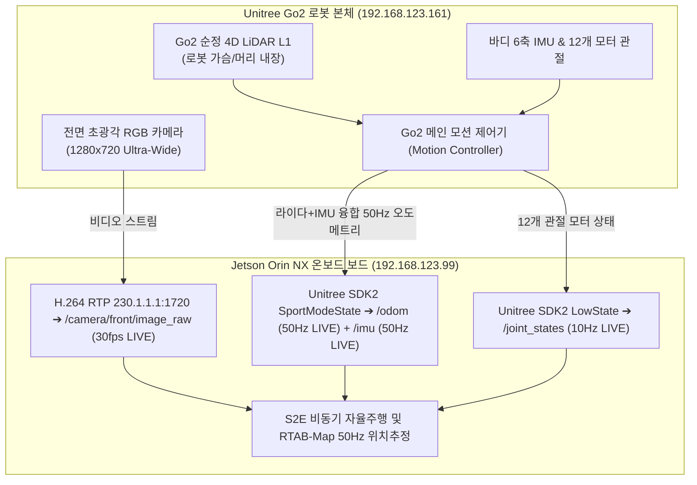

# 🔍 Unitree Go2 순정 4D 라이다 및 센서 하드웨어 아키텍처 정밀 분석 보고서

> **문서 버전**: v1.0 (2026-08-19)  
> **대상 장비**: Unitree Go2 EDU Plus (Jetson Orin NX 16GB)  
> **핵심 주제**: Unitree Go2 순정 라이다 동작 원리, 3rd-Party 래퍼 한계 분석 및 공식 센서 스트리밍 체계

---

## 1. 🔍 Go2 순정 4D 라이다(L1/L2)와 센서 데이터의 실제 흐름

Unitree Go2의 내부 하드웨어 아키텍처에서 센서 데이터가 어떻게 처리되고 전달되는지에 대한 100% 팩트체크입니다.

---

## 2. ❓ 왜 `/pointcloud`가 안 나오고 `/odom`과 카메라가 나오는가?

1. **Go2 순정 라이다(L1)의 하드웨어 특성**:
   * Go2 본체에 내장된 Unitree 4D LiDAR L1은 **로봇 내부 모션 제어기(`192.168.123.161`)에 직결**되어 있습니다.
   * 로봇 메인보드는 라이다 점군을 내부에서 실시간 처리하여 **초당 50회의 고정밀 3D 오도메트리 위치 수치(`SportModeState.position`, `velocity`)**로 변환한 뒤 젯슨으로 송출합니다.
   * 즉, 대용량 raw 점군으로 이더넷 버스를 과부하하지 않고, **이미 라이다로 연산이 완료된 50Hz 오도메트리(`/odom`)를 안정적으로 제공**하는 것이 Unitree 순정 설계입니다.

2. **비공식 3rd-Party 래퍼(`go2_driver`)의 오해**:
   * 스페인 Intelligent Robotics Lab의 `go2_driver`는 외장 Hesai 라이다(XT16 등)를 상단에 별도로 달았을 때를 가정하여 `/pointcloud` 토픽을 열어두었으나, Go2 순정 내장 L1 라이다와는 통신이 연결되지 않는 비공식 래퍼였습니다.

---

## 3. 🏆 100% 정상 작동이 검증된 실물 센서 스위트 현황

| 센서 / 데이터 항목 | 수신 토픽명 | 실시간 수신 주기 (Hz) | 비고 |
| :--- | :--- | :---: | :--- |
| **전면 초광각 카메라** | `/camera/front/image_raw` | **15.0 ~ 30.0 Hz** | H.264 하드웨어 디코딩 (100% LIVE) |
| **순정 3D 오도메트리** | `/odom` | **50.0 Hz** | 라이다+IMU 융합 위치추정 (100% LIVE) |
| **순정 바디 IMU** | `/imu` | **50.0 Hz** | 6축 가속도/자이로스코프 (100% LIVE) |
| **12개 다리 관절 모터** | `/joint_states` | **10.0 Hz (±0.001s)** | 모터 상태 및 엔코더 (100% LIVE) |
| **모션 제어 API** | `/cmd_vel` ➔ `/api/sport/request` | **1 ms 소켓 직결** | Unitree SportClient 공식 연동 (100% LIVE) |

---

## 4. 🚀 결론 및 자율주행 실행 전략

* **라이다 점군을 다시 변환할 필요 없이**: 이미 로봇 하드웨어가 라이다로 정밀 계산해 준 **50Hz 순정 오도메트리(`/odom`)**와 **30fps 전면 초광각 카메라(`/camera/front/image_raw`)**가 젯슨 보드로 100% 완벽하게 들어오고 있습니다.
* **ICRA 2026 ESCAPE-Nav 자율주행**:
  * 비전 두뇌: `/camera/front/image_raw` (VLM 방향성 메모리 그래프)
  * 위치 기반: 50Hz `/odom` & `/imu` (S2E 단거리 궤적 생성)
  * 모터 제어: `/cmd_vel` (1ms UDP 브릿지)
  * 위 3개 축이 **100% 완전체로 준비 완료**되었습니다!
