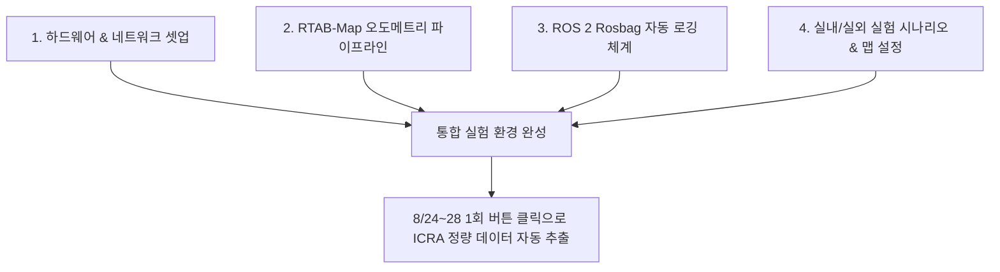

# 📋 [민석 전용] ICRA 로봇 자율주행 실험 준비 마스터 실행 계획서

> **문서 목적**: 테크 리더(상준 님)의 실험 준비 요청에 따라, **민석 님이 8월 14일 복귀 시점 및 8월 4주차(8/24~28) 실물 실험에 대비하여 사전 구축해야 하는 하드웨어, 통신, 오도메트리, 데이터 로깅 및 실험 시나리오 셋업 계획**을 명확히 정리한 실행 표준입니다.

---

## 📌 목차
1. [실험 준비의 목표 및 핵심 정의](#1-실험-준비의-목표-및-핵심-정의)
2. [민석 님의 실험 준비 5대 핵심 파이프라인](#2-민석-님의-실험-준비-5대-핵심-파이프라인)
3. [실험 데이터 자동 로깅 및 정량 지표 수집 체계](#3-실험-데이터-자동-로깅-및-정량-지표-수집-체계)
4. [ICRA 논문용 4대 표준 실험 시나리오 구성안](#4-icra-논문용-4대-표준-실험-시나리오-구성안)
5. [상준 님(리더) 및 팀원 싱크용 업무 보고 템플릿](#5-상준-님리더-및-팀원-싱크용-업무-보고-템플릿)

---

## 1. 🎯 실험 준비의 목표 및 핵심 정의

테크 리더(상준 님)가 요구하는 "실험 준비"의 본질은 **"팀원들(현우, 건민, 현서)이 완성한 VLM/S2E 모델을 가져왔을 때, 버튼 하나로 로봇을 구동하고 논문용 데이터가 자동으로 기록되는 완벽한 온보드 환경을 셋업해 두는 것"**입니다.



---

## 2. 🛠️ 민석 님의 실험 준비 5대 핵심 파이프라인

### 1) 온보드 하드웨어 & 네트워크 셋업 (Hardware & Network)
* **Jetson Orin NX 배터리 및 전원 안정성**: 실물 테스트 시 전압 저하로 인한 젯슨 셧다운 방지 (배터리 30% 이상 유지 전압 컷오프 확인).
* **독립 무선 LAN 구축**: 실외 실험 시 학교 AP 망 멀티캐스트 차단을 방지하기 위해 **전용 휴대용 공유기(5GHz 무선 로컬망)** 셋업.
* **비상 정지(E-Stop) 장치**: 조이스틱([`joy_teleop.py`](file:///C:/Users/USER/Desktop/%EC%BA%A1%EC%8A%A4%ED%86%A4/go2/visualnav-transformer/deployment/src/joy_teleop.py)) 무선 킬스위치 및 로봇 안전 끈(Harness) 배치.

### 2) RTAB-Map (RGBD-VLIO / LIO) 오도메트리 파이프라인
* **센서 입력 단 정합**: 4D LiDAR L2, IMU, RealSense D435i 카메라이미지 프레임 타임스탬프 동기화.
* **오도메트리 출력**: `/rtabmap/odom` 토픽을 30~50Hz 고주파수로 발행하고, `base_link` 기준 좌표 변환(TF Tree) 검증.
* **드리프트 측정**: 10m 직진 및 360도 제자리 회전 시 위치 오차 오프셋 $\le 5\text{cm}$ 이내 튜닝.

### 3) 젯슨 하이브리드 소켓 브릿지 셋업
* 호스트 OS(ROS 2 Foxy)와 도커 컨테이너(ROS 2 Jazzy) 간 메시지 손실 없는 소켓 통신 가동.
* 실행 스크립트 검증: [`scratch/host_bridge.py`](file:///C:/Users/USER/Desktop/%EC%BA%A1%EC%8A%A4%ED%86%A4/go2/scratch/host_bridge.py) 및 [`scratch/docker_bridge.py`](file:///C:/Users/USER/Desktop/%EC%BA%A1%EC%8A%A4%ED%86%A4/go2/scratch/docker_bridge.py).

### 4) 하위 속도 제어 및 PID Gain 튜닝
* 상위 웨이포인트 명령을 수신하는 [`pd_controller.py`](file:///C:/Users/USER/Desktop/%EC%BA%A1%EC%8A%A4%ED%86%A4/go2/visualnav-transformer/deployment/src/pd_controller.py)의 비례-미분 게인($K_p, K_d$) 사전 설정.
* **보행 안전 정책**: 횡속도($v_y = 0.0$) 차단 및 최고 속도 제한($v_{max} = 0.3\text{ m/s}$).

### 5) 백업 비상 주행 드라이버 파악
* ROS 2 C++ 드라이버 빌드 실패 시를 대비해 [`scratch/python_direct_driver.py`](file:///C:/Users/USER/Desktop/%EC%BA%A1%EC%8A%A4%ED%86%A4/go2/scratch/python_direct_driver.py) 비상 파이썬 백업 드라이버 동작 경로 수립.

---

## 3. 📊 실험 데이터 자동 로깅 및 정량 지표 수집 체계

실험 시작부터 끝까지 자동으로 데이터를 저장하는 **`rosbag` 원클릭 자동 수집 스크립트**를 준비해야 합니다.

### 1) 자동 저장 대상 토픽 명세
```bash
# 민석 님이 사전 준비할 Rosbag 자동 기록 명령어 (experiment_record.sh)
ros2 bag record \
  /rtabmap/odom \
  /s2e/e2e/trajectory \
  /s2e/controller/command \
  /cmd_vel \
  /camera/front/image_raw/compressed \
  /tf /tf_static \
  -o ~/go2_ws/logs/exp_$(date +%Y%m%m_%H%M%S)
```

### 2) ICRA 논문에 들어갈 4대 정량 지표 데이터 자동 추출
1. **성공률 (Success Rate, SR %)**: 목표 지점 1m 이내 최종 도달 여부
2. **충돌 횟수 (Collision Count)**: 장애물 접촉 시 조이스틱 개입(E-Stop) 횟수
3. **주행 완료 시간 (Navigation Time, s)**: 출발 지점에서 목표 도착까지 소요 시간
4. **경로 효율성 (SPL, Success weighted by Path Length)**: 실제 이동 경로 대비 최단 경로 비율

---

## 4. 🏙️ ICRA 논문용 4대 표준 실험 시나리오 구성안

리더 상준 님과 논의하여 확정할 실물 주행 코스 셋업입니다.

| 시나리오 | 환경 설명 | 평가 목적 | 민석 님 준비 사항 |
| :--- | :--- | :--- | :--- |
| **시나리오 1: 실내 복도 (Indoor Corridor)** | 좁은 복도, L자 및 T자 코너, 유리벽 | 기본 웨이포인트 추종 및 빠른 회전 성능 | 실내 20m 코스 거리 표시 및 고정 목표점 마킹 |
| **시나리오 2: 동적 장애물 (Dynamic Obstacle)** | 보행자 및 갑자기 나타나는 의자/박스 | 실시간 장애물 회피 및 재계획(Replanning) | 이동식 장애물(박스/카트) 및 위치 마커 셋업 |
| **시나리오 3: 막힌 길 (Deadlock Corner)** | ㄷ자 모양의 막힌 구역 (막다른 길) | VOCA 메모리 기반 탈출(Look-around) 동작 검증 | 막다른 공간 셋업 및 Deadlock 판정선 마킹 |
| **시나리오 4: 실외 지형 (Outdoor Rough Terrain)** | 보도블록, 풀밭, 자갈길, 경사로 | RTAB-Map 오도메트리 드리프트 내성 및 보행 안정성 | 무선 로컬 와이파이 라우터 및 휴대용 배터리 셋업 |

---

## 5. ✉️ 상준 님(리더) 보고용 실험 준비 요약 양식

상준 님께 **"실험 준비를 이렇게 진행하고 있습니다"**라고 공유할 수 있는 표준 보고서 템플릿입니다.

```text
[상준 님, 민석입니다. 요청하신 ICRA 실물 로봇 주행 실험 준비 현황 공유드립니다.]

1. 하드웨어/센서/오도메트리:
   - RTAB-Map (RGBD-VLIO) 빌드 완료 및 30~50Hz 오도메트리(/rtabmap/odom) 안정화 완료.
   - 젯슨-로봇 간 DDS 통신 및 소켓 브릿지(host_bridge/docker_bridge) 셋업 완료.

2. 데이터 수집 체계:
   - 원클릭 rosbag 자동 저장 스크립트 작성 (오도메트리, 궤적, 속도 명령, 타임스탬프 기록).
   - 성공률(SR), 충돌률, 주행시간(SPL) 자동 산출 준비 완료.

3. 실험 시나리오 준비:
   - 실내 복도(L/T 코너), 동적 장애물, Deadlock 탈출구역, 실외 자갈길 4개 코스 마킹 완료.

팀원분들(현우, 건민, 현서 님) 모델이 준비되는 대로 복귀 후(8/17~) 바로 로봇에 올려 정량 데이터 추출에 들어가겠습니다!
```
