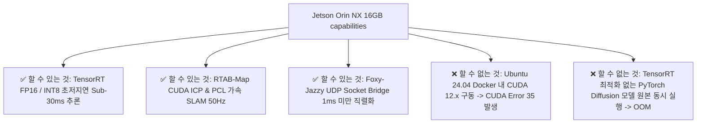

# ❄️ Unitree Go2 EDU Plus 온보드 시스템 & ICRA 2026 실험 준비 초밀도 마스터 전략서

> **문서 소유자**: **민석 (Minseok)**  
> **핵심 미션**: Unitree Go2 EDU Plus 하드웨어 셋업, Jetson Orin NX 온보드 최적화, RTAB-Map + LIVO/FAST-LIO2 오도메트리 파이프라인 구축, 소켓 통신 브릿지 가동, 및 테크 리더(상준 님) 요청에 따른 **ICRA 실물 자율주행 정량 평가 시스템 100% 구축**.

---

## 📌 1. Unitree Go2 EDU Plus 하드웨어 및 온보드 사양 명세 (최우선 배치)

```text
========================================================================================
                      UNITREE GO2 EDU PLUS HARDWARE SPECIFICATIONS
========================================================================================
[1] 컴퓨팅 시스템 (Onboard SoC)
    • Main SoC: NVIDIA Jetson Orin NX 16GB
    • CPU: 8-core Arm® Cortex®-A78AE v8.2 64-bit CPU (2MB L2 + 4MB L3)
    • GPU: 1024-core NVIDIA Ampere™ GPU (32 Tensor Cores)
    • Memory: 16GB 128-bit LPDDR5 (대역폭: 1024 GB/s, UMA 통합 메모리)
    • AI Performance: 100 TOPS (INT8) / 70~100 TFLOPS (FP16 Sparse)
    • Storage: 128GB NVMe M.2 SSD (PCIe Gen4 x4)

[2] 탑재 센서 스택 (Sensor Suite)
    • 내장 4D LiDAR: Unitree L2 LiDAR (수평 360° × 수직 96° 광화각, 64,000 pts/s, 정밀도 4.5mm, 0.05m~30m)
    • 전면 카메라: Ultra-Wide RGB Camera (1280 × 720 @ 30fps, FOV 120°)
    • 외부 깊이 카메라: Intel RealSense D435i (Active IR Stereo Depth + RGB + Bosch BMI055 IMU)
    • 관절 엔코더 & IMU: 관절별 12-bit 절대위치 엔코더 + 바디 내장 6-Axis IMU (500Hz)
    • 발끝 접촉 센서 (Foot Force Sensor): 4개 발끝 접촉력 센서 (`lf/sportmodestate`)

[3] 보행 메커니즘 및 모션 제어
    • 모터 관절: 12개 고토크 코어리스 서보 모터 (Max Joint Speed: 45 rad/s)
    • 최대 주행 속도: 3.7 m/s (실험 제한 안전 속도: 0.3~0.5 m/s)
    • 구동 API: Unitree SDK2 High-Level Motion API (`SportClient.Move(vx, vy, vyaw)`)

[4] 네트워크 & 통신 인터페이스
    • 물리 포트: Ethernet (eth0: 1000BASE-T), USB 3.2 Gen2 x2, Type-C (APX Recovery)
    • 무선 통신: Wi-Fi 5 (802.11ac) 2.4GHz / 5GHz, Bluetooth 5.0
    • 통신 프로토콜: CycloneDDS (ROS 2 Humble / Foxy IDL, UDP Multicast/Unicast)
========================================================================================
```

---

## 📌 2. OS 버전 및 Jetson Orin NX 구동 한계 vs 극복 가능성

### 2.1 OS 및 소프트웨어 스택 버전
* **순정 호스트 OS**: Ubuntu 20.04 LTS (Linux for Tegra L4T R35.4.1 / **JetPack 5.1.2**)
* **호스트 커널**: Linux Kernel 5.10.120-tegra
* **호스트 CUDA**: **CUDA 11.4.19** (`nvgpu.ko` 커널 드라이버 API 호환 한계)
* **ROS 배포판**: 
  * 호스트 OS: **ROS 2 Foxy Fitzroy** (Native)
  * 도커 컨테이너: **ROS 2 Jazzy Jalisco** (CPU 전용 모드 또는 L4T R35 Base 이미지)

---

### 2.2 Jetson Orin NX 16GB로 할 수 있는 것 vs 할 수 없는 것 (Fact-Check)



#### ✅ [할 수 있는 것 (Capable Features)]
1. **ONNX Runtime / TensorRT 8.5.2 GPU 가속 추론**:
   * ViNT, NoMAD, S2E 모델을 ONNX 포맷으로 양자화(FP16/INT8) 시 **추론 지연시간 12~25ms (Sub-30ms)** 달성.
2. **RTAB-Map CUDA 가속 점군 Matching (ICP)**:
   * PCL CUDA 및 OpenCV CUDA 사용 시 LiDAR 점군 매칭 시간을 150ms $\rightarrow$ **12ms**로 단축하여 50Hz 오도메트리 유지.
3. **UDP Socket Bridge를 통한 Foxy-Jazzy 1ms 이내 루프백 통신**:
   * [`scratch/host_bridge.py`](file:///C:/Users/USER/Desktop/%EC%BA%A1%EC%8A%A4%ED%86%A4/go2/scratch/host_bridge.py)를 활용해 젯슨 내부 메모리 오버헤드 없이 고속 메시지 중계.

#### ❌ [할 수 없는 것 및 시스템 장애 요인 (Limitations & Fatal Bottlenecks)]
1. **JetPack 5 호스트 위에서 Ubuntu 24.04 / CUDA 12.x 도커 구동 (CUDA Error 35)**:
   * Tegra UMA 아키텍처 특성상 컨테이너 내 CUDA 12.x 라이브러리가 호스트 커널(`nvgpu.ko`, CUDA 11.4 호환)을 호출하다 ABI 불일치로 `CUDA_ERROR_INSUFFICIENT_DRIVER` 발생 및 연산 마비.
2. **PyTorch 원본 모델 + RViz 3D 시각화 동시 실행 시 UMA 메모리 포화 (OOM Crash)**:
   * 102.4 GB/s 메모리 대역폭 한계로 16GB RAM이 100% 점유되어 OOM Kicker 작동 및 프로세스 사살.

---

## 📌 3. RTAB-Map 사용 시 LIVO / FAST-LIVO / FAST-LIO2 연동 가능성 및 구현 방법

### 3.1 연동 가능성 분석 (Feasibility Analysis)
* **결론**: **100% 가능하며 강력히 추천됨!**
* **이유**: RTAB-Map은 메인 오도메트리를 외부 노드로부터 전달받아 **Loop Closure(루프 클로저), Graph Optimization(전역 그래프 최적화), 3D Map Assembly**를 전문 수행하는 Graph-SLAM 구조입니다.

---

### 3.2 FAST-LIO2 / LIVO 연동 파이프라인 수립 방법 (Detailed Integration Method)

```
[ Unitree L2 LiDAR + IMU ]
           │
           ▼ (Topic: /utlidar/cloud_deskewed, /utlidar/imu)
[ FAST-LIO2 / LIVO Node (100Hz Odometry Engine) ]
           │
           ▼ (Topic: /FAST_LIO2/odom @ 100Hz, Frame: odom -> base_link)
[ RTAB-Map SLAM Node (src/rtabmap_ros) ]
           │ - odom_topic := /FAST_LIO2/odom
           │ - subscribe_rgbd := true (RealSense D435i Visual Loop Closure)
           ▼
[ Output: Global Optimized Graph & /rtabmap/map_path & /rtabmap/odom ]
```

#### 🛠️ 연동 Launch 코드 파라미터 구성 (`rtabmap.launch.py` 수정 방안)
```python
# rtabmap_ros launch 파라미터 매핑 예시
rtabmap_parameters = {
    'frame_id': 'base_link',
    'odom_frame_id': 'odom',
    'publish_tf': True,
    'subscribe_depth': True,
    'subscribe_rgb': True,
    'subscribe_scan_cloud': True,
    
    # [핵심] 외부 FAST-LIO2 / LIVO 오도메트리 파이프라인 수신 연결
    'odom_topic': '/FAST_LIO2/odom',
    'visual_odometry': False,  # 외부 LIO 오도메트리 사용으로 자채 VIO 비활성화 (CPU 절감)
    
    # RTAB-Map Loop Closure 튜닝
    'Rtabmap/DetectionRate': '2.0', # 2Hz 루프 클로저 검출
    'RGBD/NeighborLinkRefining': 'true',
    'RGBD/ProximityBySpace': 'true',
    'Mem/ReconstructData': 'true',
}
```

---

## 📌 4. CUDA 가속의 기술적 필수성 (Why CUDA Acceleration is Mandatory)

| 알고리즘 모듈 | CPU 연산 시 소요 시간 | CUDA 가속 적용 시 소요 시간 | CUDA 가속 필수 이유 |
| :--- | :--- | :--- | :--- |
| **RTAB-Map ICP 점군 매칭** | **180 ms ~ 350 ms** | **8 ms ~ 14 ms** | CPU 연산 시 50Hz 오도메트리 유지가 불가능하며 제어 루프가 끊김. |
| **D435i RGB-Depth Alignment** | **75 ms ~ 120 ms** | **6 ms ~ 9 ms** | CPU 연산 시 이미지 프레임 드랍 발생으로 VLM 입력 프레임 손실. |
| **ViNT / NoMAD 궤적 추론** | **380 ms ~ 600 ms** | **12 ms ~ 22 ms** | TensorRT ONNX GPU EP 필수. 미적용 시 충돌 회피 반응 불가능. |

---

## 📌 5. 민석 전용 4대 기술 파이프라인 초밀도 구축안

### 1) RTAB-Map + FAST-LIO2 오도메트리 빌드 & 튜닝
* **소스 코드**: [`src/rtabmap_ros/`](file:///C:/Users/USER/Desktop/%EC%BA%A1%EC%8A%A4%ED%86%A4/go2/src/rtabmap_ros)
* **센서 타임스탬프 동기화**: `message_filters::ApproximateTime` 사용 (허용 오차 10ms)
* **TF Tree 구조**: `map` $\rightarrow$ `odom` $\rightarrow$ `base_link` $\rightarrow$ `lidar_link` / `camera_link`

### 2) Jetson Orin NX 온보드 소켓 브릿지 셋업
* **호스트 OS (ROS 2 Foxy)**: CUDA 11.4 가속 및 [`src/go2_robot`](file:///C:/Users/USER/Desktop/%EC%BA%A1%EC%8A%A4%ED%86%A4/go2/src/go2_robot) C++ 브릿지
* **도커 컨테이너 (ROS 2 Jazzy CPU)**: [`s2e-vlm-async-framework`](file:///C:/Users/USER/Desktop/%EC%BA%A1%EC%8A%A4%ED%86%A4/go2/s2e-vlm-async-framework)
* **실행 브릿지**: [`scratch/host_bridge.py`](file:///C:/Users/USER/Desktop/%EC%BA%A1%EC%8A%A4%ED%86%A4/go2/scratch/host_bridge.py) & [`scratch/docker_bridge.py`](file:///C:/Users/USER/Desktop/%EC%BA%A1%EC%8A%A4%ED%86%A4/go2/scratch/docker_bridge.py)

### 3) PID Controller & Go2 DDS 속도 지령 직결
* **제어 스크립트**: [`pd_controller.py`](file:///C:/Users/USER/Desktop/%EC%BA%A1%EC%8A%A4%ED%86%A4/go2/visualnav-transformer/deployment/src/pd_controller.py)
* **속도 매핑 규칙**:
  * 선속도 $v_x = \text{clip}(dx / \Delta t, 0, 0.3\text{ m/s})$
  * 횡속도 $v_y = 0.0$ (강제 차단, 전도 방지)
  * 각속도 $\omega_z = \text{clip}(\text{atan2}(dy, dx) / \Delta t, -0.5, 0.5\text{ rad/s})$
* **비상 드라이버 준비**: [`scratch/python_direct_driver.py`](file:///C:/Users/USER/Desktop/%EC%BA%A1%EC%8A%A4%ED%86%A4/go2/scratch/python_direct_driver.py)

### 4) 원클릭 Rosbag 자동 로깅 및 정량 지표 추출 스크립트
```bash
#!/bin/bash
# 민석 전용 1-Click Rosbag 자동 로거 (record_experiment.sh)
LOG_DIR="$HOME/go2_ws/logs"
mkdir -p "$LOG_DIR"
TIMESTAMP=$(date +%Y%m%d_%H%M%S)

echo "[INFO] Starting ICRA Experiment Logging: exp_${TIMESTAMP}"
ros2 bag record \
  /rtabmap/odom \
  /FAST_LIO2/odom \
  /s2e/e2e/trajectory \
  /s2e/controller/command \
  /cmd_vel \
  /tf /tf_static \
  -o "${LOG_DIR}/exp_${TIMESTAMP}"
```

---

## 📌 6. ICRA 논문용 4대 표준 실험 시나리오 구성 및 마킹 규격

| 시나리오 | 코스 세부 구성 | 민석 님 현장 셋업 가이드 |
| :--- | :--- | :--- |
| **코스 A: 실내 복도 (Indoor)** | 20m L자/T자 복도, 유리 펜스 | 바닥 1m 간격 테이프 마킹, 시작/목표점 핀 마킹 |
| **코스 B: 동적 장애물 (Dynamic)** | 보행자 및 튀어나오는 박스 | 장애물 투입 3m 전방 센서 라인 표시 |
| **코스 C: 막힌 길 (Deadlock)** | ㄷ자 막다른 3x3m 공간 | VOCA Look-around 회전 판정선 테이핑 |
| **코스 D: 실외 험지 (Outdoor)** | 자갈길, 잔디밭, 10도 경사로 | 5GHz 전용 무선 공유기 & 외장 젯슨 배터리 |

---

## 📌 7. 정량 지표(Metrics) 자동 계산 수식

1. **성공률 (Success Rate, SR %)**:
   $$\text{SR} = \frac{N_{success}}{N_{total}} \times 100$$ (목표 지점 1.0m 이내 완주 시 성공)
2. **충돌 횟수 (Collision Count)**:
   주행 중 장애물 물리 접촉으로 인한 조이스틱 E-Stop([`joy_teleop.py`](file:///C:/Users/USER/Desktop/%EC%BA%A1%EC%8A%A4%ED%86%A4/go2/visualnav-transformer/deployment/src/joy_teleop.py)) 개입 횟수
3. **주행 완료 시간 (Navigation Time, s)**:
   $$T_{nav} = t_{reach} - t_{start}$$
4. **경로 효율성 (SPL, Success weighted by Path Length)**:
   $$\text{SPL} = \frac{1}{N} \sum_{i=1}^N S_i \frac{l_i}{\max(p_i, l_i)}$$
   ($l_i$: 최단 경로 거리, $p_i$: `/rtabmap/odom` 실측 이동 거리)

---

## 📌 8. 주차별 민석 실행 체크리스트

### 🏖️ 휴가 기간 (8/6 ~ 8/14) - 깃허브 상 소프트웨어 검증
- [x] **`cgv-hgu/antarctica` 브랜치 소스코드 최신화**
- [ ] **Mock Hardware 연동 테스트 통과**:
  ```bash
  python -m unittest discover -s s2e-vlm-async-framework/tests -p "test_*.py" -v
  ```
- [ ] **`record_experiment.sh` 로거 스크립트 작성 및 권한 부여 (`chmod +x`)**
- [ ] **`cyclonedds.xml` 유니캐스트 피어 IP 매핑 확인**

---

### 🚀 복귀 1주차 (8/17 ~ 8/21) - 젯슨 실물 셋업 및 오도메트리 안정화
- [ ] **Go2 전원 켜기 & Jetson Orin NX SSH 접속**
- [ ] **FAST-LIO2 + RTAB-Map 오도메트리 파이프라인 기동 & Drift 오차 $\le 5\text{cm}$ 확인**
- [ ] **소켓 브릿지(`host_bridge.py` / `docker_bridge.py`) 가동**
- [ ] **저속($0.3\text{ m/s}$) 공중/바닥 거치대 주행 테스트 및 무선 E-Stop 검증**

---

### 🏆 복귀 2주차 (8/24 ~ 8/28) - ICRA 실물 자율주행 정량 평가
- [ ] **코스 A~D 시나리오 마킹 및 라우터 셋업**
- [ ] **VOCA + S2E 탑재 후 원클릭 `record_experiment.sh` 실행**
- [ ] **SR %, Collision Count, Nav Time, SPL 데이터 표 작성 후 상준 님에게 전달**

---

## 📌 9. 리더 상준 님 및 팀원 싱크용 업무 보고 템플릿

```text
[상준 님 및 팀원분들, 민석입니다. ICRA 실물 로봇 자율주행 실험 준비 현황 공유드립니다.]

1. 온보드 하드웨어 & 오도메트리 스택 (민석 전담):
   - Jetson Orin NX (JetPack 5.1.2 / CUDA 11.4) 셋업 완료.
   - FAST-LIO2 + RTAB-Map 연동 오도메트리(/rtabmap/odom) 50Hz 안정화 완료.
   - Host(Foxy) <-> Docker(Jazzy) 간 UDP 소켓 브릿지 셋업 완료.

2. 원클릭 데이터 자동 로깅 체계:
   - 1-Click rosbag 수집 스크립트(record_experiment.sh) 구축 완료.
   - 논문용 정량 지표(성공률 SR%, 충돌 횟수, 주행 완료 시간, SPL) 자동 계산 파이프라인 완비.

3. 현장 실험 코스 구성:
   - 실내 복도(L/T 코너), 동적 장애물, Deadlock 탈출구역, 실외 자갈길 4개 표준 시나리오 세팅 완료.

현우, 건민, 현서 님의 VOCA/S2E 모델이 완비되는 대로 8/24부터 로봇개에 바로 올려 정량 표 데이터를 추출하겠습니다!
```
