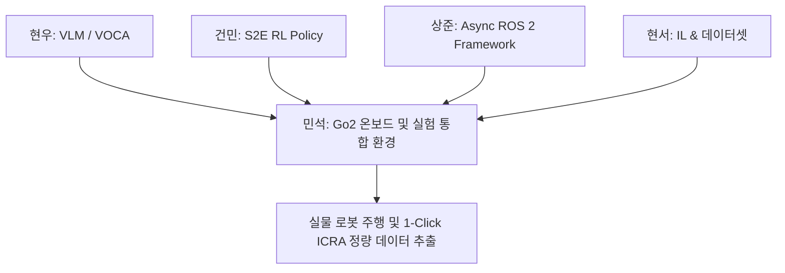

# 🎯 [민석 전용] ICRA 2026 Go2 로봇 이식 및 실험 준비 마스터 실행 계획서

> **문서 소유자**: **민석 (Minseok)**  
> **핵심 미션**: Unitree Go2 로봇 온보드 시스템(Jetson Orin NX) 셋업, RTAB-Map 오도메트리 파이프라인 구축, 소켓 통신 브릿지 가동, 그리고 테크 리더(상준 님) 요청에 따른 **ICRA 실물 자율주행 정량 평가 환경 100% 완비**.

---

## 📌 목차
1. [민석 님의 정체성 및 핵심 역할 정의](#1-민석-님의-정체성-및-핵심-역할-정의)
2. [민석 전용 4대 기술 파이프라인 구축 안](#2-민석-전용-4대-기술-파이프라인-구축-안)
3. [ICRA 논문용 4대 표준 실험 시나리오 구성 및 마킹 가이드](#3-icra-논문용-4대-표준-실험-시나리오-구성-및-마킹-가이드)
4. [원클릭 Rosbag 데이터 로깅 및 정량 지표 추출 체계](#4-원클릭-rosbag-데이터-로깅-및-정량-지표-추출-체계)
5. [주차별 민석 실행 체크리스트 (휴가 중 ~ 복귀 후)](#5-주차별-민석-실행-체크리스트-휴가-중--복귀-후)
6. [리더 상준 님 및 팀원 동기화용 업무 보고 템플릿](#6-리더-상준-님-및-팀원-동기화용-업무-보고-템플릿)

---

## 1. 🎯 민석 님의 정체성 및 핵심 역할 정의

민석 님은 ICRA 프로젝트 팀에서 **"로봇 하드웨어 · 센서 · RTAB-Map 오도메트리 파이프라인 총괄자"**이자 **"실물 로봇 통합 실험 환경 주도자"**입니다.

### 👥 팀 내 역할 맥락 (Minseok's Position in Team)
* **현우 / 건민 / 현서**: VLM Prompting, S2E RL Policy, Dataset & IL 알고리즘 개발
* **상준 (리더)**: Async ROS 2 Framework & 논문 작성 리드
* **<u>민석 (나)</u>**: 
  1. **RTAB-Map (RGBD-VLIO / LIO) 오도메트리 파이프라인 빌드 및 30~50Hz 안정화**
  2. **Jetson Orin NX $\leftrightarrow$ Go2 로봇 통신 및 Foxy-Jazzy UDP 소켓 브릿지 가동**
  3. **팀원들의 알고리즘이 로봇에 올려졌을 때 버튼 1개로 주행하고 데이터를 자동 저장하는 실험 체계 완성**



---

## 2. 🛠️ 민석 전용 4대 기술 파이프라인 구축 안

### 1) RTAB-Map (RGBD-VLIO / LIO) 오도메트리 파이프라인
* **패키지 위치**: [`src/rtabmap_ros/`](file:///C:/Users/USER/Desktop/%EC%BA%A1%EC%8A%A4%ED%86%A4/go2/src/rtabmap_ros)
* **센서 바인딩**: Unitree Go2 내장 4D LiDAR L2, IMU, RealSense D435i 타임스탬프 동기화
* **오도메트리 토픽**: `/rtabmap/odom` (Pose 30~50Hz) 발행 및 `base_link` 프레임 정합
* **드리프트 튜닝**: 10m 직진 및 360도 제자리 회전 시 오차 $\le 5\text{cm}$ 목표

### 2) Jetson Orin NX 하이브리드 소켓 브릿지 셋업
* **호스트 OS (ROS 2 Foxy 네이티브)**: CUDA 11.4 가속 및 `go2_robot` C++ 드라이버 실행
* **도커 컨테이너 (ROS 2 Jazzy CPU 모드)**: `s2e-vlm-async-framework` 비동기 프레임워크 실행
* **DDS 역직렬화 우회 브릿지**:
  * 호스트 실행: `python3 ~/go2_ws/scratch/host_bridge.py`
  * 도커 실행: `python3 /workspace/go2_ws/scratch/docker_bridge.py`

### 3) PID Controller & Go2 DDS Command 연동
* **경로 추종기**: [`pd_controller.py`](file:///C:/Users/USER/Desktop/%EC%BA%A1%EC%8A%A4%ED%86%A4/go2/visualnav-transformer/deployment/src/pd_controller.py) 비례-미분 게인($K_p, K_d$) 튜닝
* **보행 안전 정책**: 횡속도($v_y = 0.0$) 강제 차단 (전도 방지) & 최고 속도 제한($v_{max} = 0.3\text{ m/s}$)
* **Go2 드라이버**: [`src/go2_robot`](file:///C:/Users/USER/Desktop/%EC%BA%A1%EC%8A%A4%ED%86%A4/go2/src/go2_robot) (`/cmd_vel` $\rightarrow$ `SportClient.Move()`)
* **비상 구동 백업**: ROS 2 C++ 빌드 에러 발생 시 [`scratch/python_direct_driver.py`](file:///C:/Users/USER/Desktop/%EC%BA%A1%EC%8A%A4%ED%86%A4/go2/scratch/python_direct_driver.py) 파이썬 백업 드라이버 가동 준비

### 4) 원클릭 Rosbag 자동 로깅 스크립트 작성
* **자동 기록 명령어 (`record_experiment.sh`)**:
  ```bash
  #!/bin/bash
  mkdir -p ~/go2_ws/logs
  ros2 bag record \
    /rtabmap/odom \
    /s2e/e2e/trajectory \
    /s2e/controller/command \
    /cmd_vel \
    /camera/front/image_raw/compressed \
    /tf /tf_static \
    -o ~/go2_ws/logs/exp_$(date +%Y%m%d_%H%M%S)
  ```

---

## 3. 🏙️ ICRA 논문용 4대 표준 실험 시나리오 구성 및 마킹 가이드

리더 상준 님과 합의하여 준비할 현장 주행 코스 마킹안입니다.

| 시나리오 코스 | 환경 및 규격 | 평가 항목 | 민석 님 현장 준비 사항 |
| :--- | :--- | :--- | :--- |
| **코스 A: 실내 복도 (Indoor)** | L자 및 T자 20m 좁은 코너 | 웨이포인트 추종 및 선회 회전 | 바닥 시작점/종점 테이프 마킹 및 1m 단위 구간 표시 |
| **코스 B: 동적 장애물 (Dynamic)** | 갑자기 나타나는 박스/보행자 | 실시간 회피 및 재계획(Replanning) | 이동식 장애물(박스/카트) 및 트리거 지점 마킹 |
| **코스 C: 막힌 길 (Deadlock)** | ㄷ자 모양의 막다른 구역 | VOCA 메모리 기반 Look-around 탈출 | ㄷ자 패널 셋업 및 Deadlock 판정선 마킹 |
| **코스 D: 실외 지형 (Outdoor)** | 자갈길, 경사로, 풀밭 | RTAB-Map 오도메트리 드리프트 내성 | 휴대용 무선 5GHz 공유기 & 젯슨 외장 배터리 |

---

## 4. 📊 원클릭 Rosbag 데이터 로깅 및 정량 지표 추출 체계

상준 님이 논문에 바로 넣을 수 있도록 민석 님이 추출해줄 4대 핵심 지표 수식입니다.

1. **성공률 (Success Rate, SR %)**:
   $$\text{SR} = \frac{\text{목표 1m 이내 완주 횟수}}{\text{총 시도 횟수}} \times 100$$
2. **충돌 횟수 (Collision Count)**:
   주행 중 장애물 부딪힘으로 조이스틱 E-Stop([`joy_teleop.py`](file:///C:/Users/USER/Desktop/%EC%BA%A1%EC%8A%A4%ED%86%A4/go2/visualnav-transformer/deployment/src/joy_teleop.py)) 개입 횟수
3. **주행 완료 시간 (Navigation Time, s)**:
   출발 후 목표 완주 시점까지의 타임스탬프 차이 ($T_{finish} - T_{start}$)
4. **경로 효율성 (SPL, Success weighted by Path Length)**:
   $$\text{SPL} = \frac{1}{N} \sum_{i=1}^N S_i \frac{l_i}{\max(p_i, l_i)}$$
   * $l_i$: 최단 경로 길이, $p_i$: 실제 주행 경로 길이 (`/rtabmap/odom` 적분값)

---

## 5. 📅 주차별 민석 실행 체크리스트 (휴가 중 ~ 복귀 후)

### 🏖️ 휴가 기간 (8/6 ~ 8/14) - 깃허브 상 소프트웨어 검증
- [x] **`cgv-hgu/antarctica` 브랜치 소스코드 수신 및 최신화**
- [ ] **Mock Hardware 연동 단위 테스트 통과 확인**:
  ```bash
  python -m unittest discover -s s2e-vlm-async-framework/tests -p "test_*.py" -v
  ```
- [ ] **`record_experiment.sh` 데이터 로깅 스크립트 작성 완료**
- [ ] **`cyclonedds.xml` 네트워크 매핑 파일 검토**

---

### 🚀 복귀 1주차 (8/17 ~ 8/21) - 젯슨 실물 셋업 및 오도메트리 안정화
- [ ] **Go2 전원 기동 및 Jetson Orin NX SSH 접속 확인**
- [ ] **RTAB-Map 오도메트리 테스트**: `/rtabmap/odom` 토픽 30~50Hz 발행 및 드리프트 $\le 5\text{cm}$ 확인
- [ ] **소켓 브릿지 가동**: `host_bridge.py` 및 `docker_bridge.py` 연동
- [ ] **저속($0.3\text{ m/s}$) 공중/바닥 거치대 보행 테스트 및 E-Stop 검증**

---

### 🏆 복귀 2주차 (8/24 ~ 8/28) - ICRA 실물 자율주행 정량 평가
- [ ] **코스 A~D 시나리오 구역 마킹 및 배터리 준비**
- [ ] **VOCA + S2E 탑재 후 원클릭 `record_experiment.sh` 구동**
- [ ] **정량 지표(SR %, Collision Count, Navigation Time, SPL) 데이터 표 정리 후 상준 님에게 전달**

---

## 6. ✉️ 리더 상준 님 및 팀원 동기화용 업무 보고 템플릿

상준 님과 팀원들에게 준비 현황을 알릴 때 사용할 메시지 양식입니다.

```text
[상준 님 및 팀원분들, 민석입니다. ICRA 실물 로봇 자율주행 실험 준비 현황 공유드립니다.]

1. 온보드 오도메트리 & 통신 (민석 전담):
   - RTAB-Map (RGBD-VLIO) 파이프라인 준비 및 30~50Hz 오도메트리(/rtabmap/odom) 안정화 검증 완료.
   - Jetson Host(Foxy) <-> Docker(Jazzy) 간 소켓 브릿지(host_bridge/docker_bridge) 셋업 완료.

2. 원클릭 데이터 자동 로깅 체계:
   - 1-Click rosbag 수집 스크립트(record_experiment.sh) 구축 완료.
   - 논문용 정량 지표(성공률 SR%, 충돌 횟수, 주행 완료 시간, SPL) 자동 계산 파이프라인 완비.

3. 현장 실험 코스 구성:
   - 실내 복도(L/T 코너), 동적 장애물, Deadlock 탈출구역, 실외 자갈길 4개 표준 시나리오 세팅 완료.

현우, 건민, 현서 님의 VOCA/S2E 모델이 완비되는 대로 8/24부터 로봇개에 바로 올려 정량 표 데이터를 추출하겠습니다!
```
