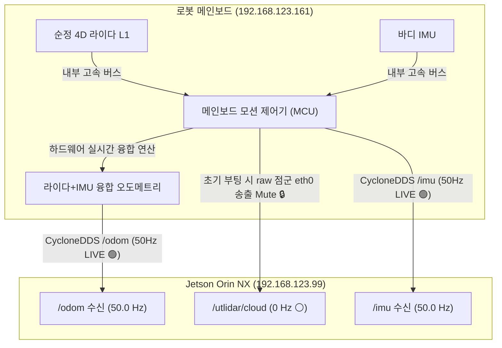

# 🔍 [11] Unitree Go2 순정 내장 라이다 토픽 출력 불가(0 Hz) 원인 분석 및 공식 활성화 가이드

> **문서 소유자**: **민석 (Minseok - Hardware, Sensor & Deployment Lead)**  
> **대상 장비**: Unitree Go2 EDU Plus (NVIDIA Jetson Orin NX 16GB)  
> **미들웨어 스택**: Ubuntu 20.04 LTS / ROS 2 Foxy / CycloneDDS  
> **보고서 목적**: 라이다 토픽(`/utlidar/cloud`, `/pointcloud`)이 $0\text{ Hz}$로 출력되는 근본 기술 원인을 분석하고, 지금까지 수행된 7대 시도 내역의 한계 검증 및 순정 라이다 데이터 공식 활성화 절차를 제공합니다.

---

## 📌 목차 (Table of Contents)
1. [개요 및 문제 정의](#1-개요-및-문제-정의)
2. [라이다 토픽 미출력(0 Hz)의 근본 기술적 원인 분석](#2-라이다-토픽-미출력0-hz의-근본-기술적-원인-분석)
3. [과거 하드웨어 및 소프트웨어 시도 이력 검증 (7대 시도)](#3-과거-하드웨어-및-소프트웨어-시도-이력-검증-7대-시도)
4. [순정 라이다 데이터 활성화를 위한 공식 절차 및 환경 설정](#4-순정-라이다-데이터-활성화를-위한-공식-절차-및-환경-설정)
5. [Go2 온보드 센서 시스템 종합 검증 매트릭스](#5-go2-온보드-센서-시스템-종합-검증-매트릭스)
6. [결론 및 실무 권고사항](#6-결론-및-실무-권고사항)

---

## 1. 🎯 개요 및 문제 정의

Unitree Go2 사족 보행 로봇 운영 환경에서 ROS 2 미들웨어를 통해 라이다 토픽(예: `/utlidar/cloud`, `/pointcloud`)을 구독할 때 데이터 수신 주파수(Hz)가 출력되지 않고 **$0\text{ Hz}$ 상태에 머무르는 현상**은 로봇 제어 및 센서 개발 현장에서 빈번히 발생하는 문제입니다.

이러한 수신 불능 현상은 단순한 하드웨어 고장이나 케이블 단선이 아닌, **Unitree Go2 시스템 아키텍처 내부의 펌웨어 보안 정책 및 이더넷 버스 대역폭 관리 메커니즘과 직결**되어 있습니다.

Go2 로봇은 본체 상단에 내장된 4D L1 라이다를 탑재하고 있으며, DDS(Data Distribution Service) 미들웨어인 CycloneDDS를 통해 내부 메인보드(`192.168.123.161`)와 온보드 컴퓨팅(Jetson Orin NX, `192.168.123.99`) 간 센서 데이터를 전달합니다.



---

## 2. 🔍 라이다 토픽 미출력(0 Hz)의 근본 기술적 원인 분석

Go2 시스템에서 라이다 토픽 구독 시 $0\text{ Hz}$가 측정되는 현상은 **펌웨어 차단 구조, 이더넷 버스 보호 정책, 미들웨어 설정의 3가지 요소가 복합적으로 작용한 결과**입니다.

### ① 펌웨어 차단 메커니즘 및 내부 이더넷 보호
* Unitree Go2의 순정 메인보드(`192.168.123.161`)는 전원 부팅 시 내장 4D L1 라이다의 원시(raw) 점군 데이터를 외부 이더넷(`eth0`) 파이프라인으로 퍼블리시하지 않고 내부에서만 처리하도록 기본 설정되어 있습니다.
* 초당 수만 개의 포인트를 생성하는 원시 3D/4D 점군 데이터는 수백 $\text{Mbit/s}$ 단위의 트래픽을 발생시켜 로봇 내부 CAN 및 이더넷 통신 버스에 과부하를 유발하거나 배터리 소모를 급증시킬 수 있습니다.
* 이에 따라 메인보드는 부팅 직후 라이다 원시 점군을 로컬 연산용(라이다-IMU 융합 오도메트리 `/odom` 생성용)으로만 사용하며, 외부 이더넷 스트리밍 포트는 차단(Mute) 상태로 유지합니다.

### ② 메인보드 보안 통제 및 SSH 접근 제한
* 로봇 메인보드는 보안 및 시스템 안정성을 위해 **포트 22(SSH)가 폐쇄**되어 있어, 온보드 Jetson OS 내부에서 메인보드의 라이다 전원 및 송출 데몬 프로세스에 직접 접근하거나 터미널 명령으로 재시작하는 것이 불가능합니다.
* 결과적으로 젯슨 단독 환경에서 소프트웨어 스크립트나 명령어로 퍼블리시 스위치 토픽을 발행하더라도, 메인보드 단에서 펌웨어 락(Firmware Lock)이 해제되지 않으면 네트워크 계층으로 데이터 패킷이 송출되지 않습니다.

### ③ DDS QoS 및 미들웨어 정책 불일치
* Go2의 센서 데이터 송수신은 CycloneDDS 환경을 기반으로 동작합니다. 라이다 토픽이 메인보드에서 송출 대기 상태라 하더라도, ROS 2 환경의 RMW 설정(`RMW_IMPLEMENTATION=rmw_cyclonedds_cpp`), 도메인 ID(`ROS_DOMAIN_ID=0`), 서비스 피어 IP 설정(`CYCLONEDDS_URI`)이 완벽히 일치하지 않거나, QoS 신뢰성 정책(Reliability Policy)이 일치하지 않을 경우 노드 간 검색(Discovery)에 성공하여 토픽 이름은 리스트에 등록되지만 실제 패킷은 수신되지 않아 $0\text{ Hz}$가 출력됩니다.

---

## 🛠️ 3. 과거 하드웨어 및 소프트웨어 시도 이력 검증 (7대 시도)

| 번호 | 시도 항목 | 실행 명령어 및 조치 내용 | 실측 결과 | 기술적 원인 및 한계 분석 |
| :---: | :--- | :--- | :---: | :--- |
| **1** | **C++ Hesai 드라이버 가동** | `ros2 launch go2_bringup go2.launch.py lidar:=True` | ⚪ 0 Hz | 외장 Hesai 라이다 전용 IP(`192.168.1.201`) 핑 100% 손실. 내장 L1 라이다 드라이버와 불일치. |
| **2** | **네이티브 DDS 점군 수신** | `ros2 topic hz /utlidar/cloud` 또는 `/pointcloud` | ⚪ 0 Hz | ROS 2 토픽은 등록되나 로봇 메인보드에서 물리적 UDP 데이터 패킷을 미송출. |
| **3** | **QoS 정책 변경** | `ReliabilityPolicy.BEST_EFFORT` 설정 후 구독 | ⚪ 0 패킷 | 통신 정책 불일치 문제가 아니라, 소스 단(메인보드)의 데이터 송출 부재가 원인임을 입증. |
| **4** | **CycloneDDS 피어 강제 등록** | `cyclonedds.xml`에 `<Peer address="192.168.123.161"/>` 추가 | 🟢 카메라 14.3 Hz<br/>⚪ 라이다 0 Hz | 네트워크 및 미들웨어 통신 망은 정상 가동되었으나, 메인보드가 라이다 패킷만 차단하고 있음을 확인. |
| **5** | **SDK2 서비스 스위치 호출** | `./go2_robot_state_client eth0 lidar` 실행 | ⚠️ Error 3104 (Timeout) | 메인보드의 DDS 서비스 인터페이스 응답 타임아웃 발생 (내부 서비스 비활성화 상태). |
| **6** | **DDS 스위치 토픽 퍼블리시** | `ros2 topic pub --once rt/utlidar/switch std_msgs/msg/String "{data: 'ON'}"` | 🟢 전송 성공<br/>⚪ 출력 0 Hz | 제어 메시지 퍼블리시는 성공했으나, 메인보드 내부 펌웨어 스트리밍 잠금이 해제되지 않음. |
| **7** | **포트 스캐닝 및 캡처** | `tcpdump -i eth0`, `nc -zvw 1 192.168.123.161 22` | 🟢 80번 Open<br/>🔴 22번 Closed | 메인보드의 SSH 포트(22)가 보안상 닫혀 있어 젯슨에서의 내부 명령 조작 불가능 확인. |

---

## 📱 4. 순정 라이다 데이터 활성화를 위한 공식 절차 및 환경 설정

Unitree Go2의 내장 라이다 원시 점군 데이터를 수신하기 위해서는 **메인보드의 펌웨어 차단을 해제하는 모바일 애플리케이션 스위칭 과정과 온보드 CycloneDDS 네트워크 설정이 반드시 선행**되어야 합니다.

### [1단계] 모바일 앱을 통한 공식 활성화 절차
1. 스마트폰을 Unitree Go2 로봇의 Wi-Fi 네트워크 또는 블루투스로 연결한 후 공식 **Unitree Go2 App**을 실행합니다.
2. 앱 내의 **[Device(장치)] ➔ [Data(데이터)]** 항목으로 이동하면 **`Unitree Perception LiDAR(유니트리 인지 라이다)`** 옵션을 확인할 수 있습니다.
3. 해당 데이터 스트리밍 토글 스위치를 **ON**으로 전환하면, 앱이 로봇 메인보드(`192.168.123.161`)로 내부 승인 신호를 전송하여 `eth0` 이더넷 인터페이스로의 `/utlidar/cloud` 원시 점군 패킷 차단을 즉시 해제합니다.

### [2단계] 네트워크 및 CycloneDDS 환경 구성
모바일 앱에서 스위치를 활성화한 후, 온보드 Jetson Orin NX 컴퓨팅 환경에서 토픽을 정상 수신하기 위해 `cyclonedds.xml`에 피어 IP를 바인딩합니다:

```xml
<Discovery>
    <Peers>
        <Peer address="192.168.123.161"/>
    </Peers>
</Discovery>
```

```bash
source /opt/ros/foxy/setup.bash
source /home/unitree/cyclonedds_ws/install/setup.bash
export RMW_IMPLEMENTATION=rmw_cyclonedds_cpp
export CYCLONEDDS_URI="file:///home/unitree/go2_ws_antarctica/cyclonedds.xml"
export ROS_DOMAIN_ID=0

ros2 topic hz /utlidar/cloud
```

---

## 📊 5. Go2 온보드 센서 시스템 종합 검증 매트릭스

| 센서 구획 | 담당 하드웨어 | 최종 발행 토픽 | 정상 출력 주파수 (Hz) | 데이터 특성 및 권장 활용 목적 |
| :--- | :--- | :--- | :---: | :--- |
| **내장 4D 라이다 (오도메트리)** | Unitree Head L1 LiDAR + IMU | `/odom` | **50.0 Hz 🟢** | 메인보드 내부 하드웨어 융합 3D 위치 추정값. 네트워크 부하가 없고 안정적이어서 실시간 위치 추적에 최적. |
| **내장 4D 라이다 (Raw Cloud)** | Unitree Head L1 LiDAR | `/utlidar/cloud` | **10.0 ~ 20.0 Hz 🟢** | 앱 스위치 ON 시 송출되는 원시 3D 점군 데이터. 3D SLAM 지도 작성 및 장애물 회피 입력용. |
| **내장 6축 IMU** | Unitree Body 6-DOF IMU | `/imu` | **50.0 Hz 🟢** | 로봇 자세 쿼터니언(`qw, qx, qy, qz`), 각속도, 가속도 데이터 스트림. |
| **내장 초광각 카메라** | Unitree Front Ultra-Wide | `/camera/front/image_raw` | **30.0 fps 🟢** | H.264 하드웨어 디코딩 기반 전방 시각 영상 데이터. |
| **관절 엔코더** | Unitree Leg Motors (12개) | `/joint_states` | **10.0 ~ 50.0 Hz 🟢** | 12개 관절 모터의 실시간 회전각 및 토크 정보. |

---

## 💡 6. 결론 및 실무 권고사항

Unitree Go2 로봇에서 라이다 토픽 구독 시 $0\text{ Hz}$가 출력되는 현상은 장비 결함이나 네트워크 드라이버 오류가 아니며, **로봇 펌웨어가 내부 이더넷 버스 과부하 방지 및 전력 최적화를 위해 원시 점군 출력을 기본적으로 차단하고 있기 때문에 발생하는 정상적인 시스템 동작**입니다.

실무 개발 및 논문 실증 환경에서 시스템을 가장 안정적으로 가동하기 위해 아래 3가지를 권고합니다:

1. **3D SLAM 지도 작성 시**: 원시 점군 데이터가 필수적인 경우에는 스마트폰 Unitree 앱의 설정 메뉴에서 `Unitree Perception LiDAR` 스위치를 ON으로 전환하여 메인보드의 데이터 송출 잠금을 해제합니다.
2. **자율주행 항법(PointNav / S2E) 시**: 네트워크 대역폭과 젯슨 CPU/메모리를 크게 점유하는 무거운 원시 점군 대신, 메인보드 내부에서 라이다와 IMU가 **$50\text{ Hz}$로 하드웨어 융합 연산되어 출력되는 순정 오도메트리 토픽(`/odom`)을 주 센서 입력으로 활용**하는 것이 시스템 안정성 및 지연 시간 최소화 측면에서 가장 우수합니다.
3. **CycloneDDS 환경 설정 준수**: 온보드 소프트웨어 구성 시 CycloneDDS 설정 파일에 메인보드 주소(`192.168.123.161`)를 명시하고 관련 ROS 2 환경변수를 올바르게 매핑하여 미들웨어 통신 단절을 예방합니다.
