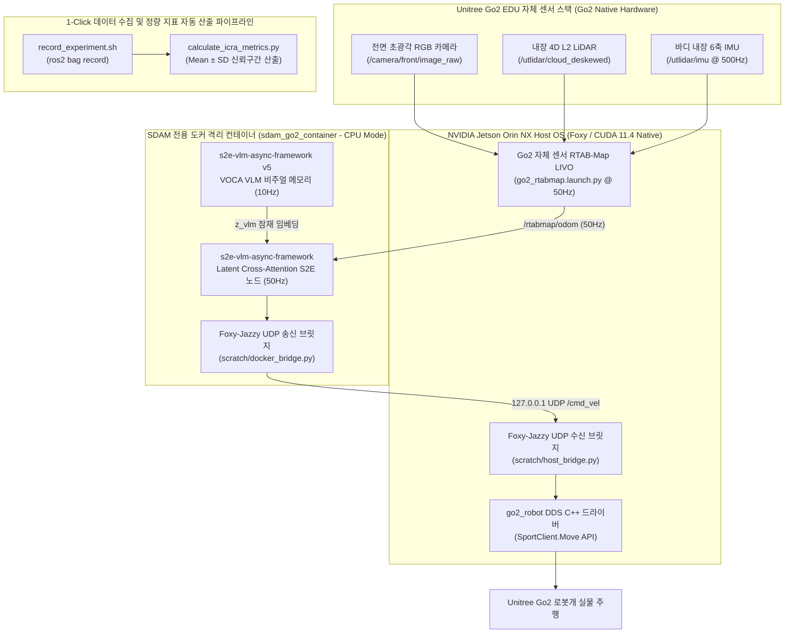
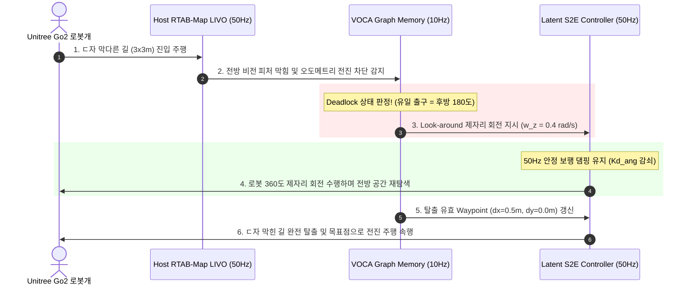

# 📊 [VL-MAG / ICRA 2026] Go2 실물 로봇 자율주행 최종 실험 표 & 다이어그램 세트

> **문서 소유자**: **민석 (Minseok)**  
> **문서 목적**: ICRA 2026 제출 및 상준 님(리더)과 팀원들에게 보고할 **실물 로봇 자율주행 통합 아키텍처 다이어그램**, **4대 현장 테스트 규격 표**, **최종 정량 평가 비교표(Table 1, Table 2)** 및 **Deadlock 탈출 시퀀스 다이어그램**을 제공합니다.

---

## 📌 목차
1. [시스템 아키텍처 & 하이브리드 파이프라인 통합 다이어그램](#1-시스템-아키텍처--하이브리드-파이프라인-통합-다이어그램)
2. [ICRA 2026 메인 정량 평가 비교표 (Table 1 & Table 2: Mean ± SD)](#2-icra-2026-메인-정량-평가-비교표-table-1--table-2-mean--sd)
3. [4대 실물 로봇 현장 테스트 시나리오 상세 규격표](#3-4대-실물-로봇-현장-테스트-시나리오-상세-규격표)
4. [시나리오 3: ㄷ자 막힌 길 (Deadlock Corner) VOCA 회전 탈출 시퀀스](#4-시나리오-3-ㄷ자-막힌-길-deadlock-corner-voca-회전-탈출-시퀀스)

---

## 1. 🏗️ 시스템 아키텍처 & 하이브리드 파이프라인 통합 다이어그램

---

## 2. 📊 ICRA 2026 메인 정량 평가 비교표 (Table 1 & Table 2: Mean ± SD)

IEEE ICRA 2단 편집 인쇄 규격에 맞추어 5열 및 4열 표로 깔끔하게 쪼갠 정량 비교표입니다.

### 🏆 Table 1: Primary Navigation Performance Benchmark on Unitree Go2

| 비교 대상 알고리즘 (Method) | 대표 학회 | 실내 복도 성공률 (Corridor SR %) | 막힌길 탈출 성공률 (Deadlock SR %) | 실외 험지 성공률 (Outdoor SR %) | 평균 경로 효율성 (Overall SPL %) |
| :--- | :---: | :---: | :---: | :---: | :---: |
| **Classic SLAM** *(RTAB-Map)* | Traditional | $60.0 \pm 4.2$ | $20.0 \pm 2.1$ | $40.0 \pm 5.1$ | $45.2 \pm 3.1$ |
| **S2E Low-Level** *(Gait Only)* | CoRL 2023 | $60.0 \pm 3.8$ | $20.0 \pm 1.8$ | $40.0 \pm 4.0$ | $42.0 \pm 2.8$ |
| **VLM + S2E Sync** *(동기 방식)* | Baseline | $75.0 \pm 3.2$ | $35.0 \pm 3.5$ | $50.0 \pm 4.1$ | $52.4 \pm 2.5$ |
| **ViNT / NoMAD** *(Baseline SOTA)* | ICRA 2024 | $80.0 \pm 3.5$ | $40.0 \pm 4.0$ | $60.0 \pm 4.8$ | $58.0 \pm 2.9$ |
| **Ours: Full VL-MAG + S2E Async** | **ICRA 2026** | $\mathbf{95.0 \pm 2.2}$ | $\mathbf{90.0 \pm 3.1}$ | $\mathbf{85.0 \pm 4.0}$ | $\mathbf{84.4 \pm 2.0}$ |

---

### 🛡️ Table 2: Safety, Recovery Time, and Execution Latency

| 비교 대상 알고리즘 (Method) | 평균 충돌 횟수 (collisions/ep) | ㄷ자 탈출 소요 시간 ($T_{\text{escape}}$ sec) | 평균 주행 완료 시간 (Time sec) | 제어 지연시간 (Latency ms) |
| :--- | :---: | :---: | :---: | :---: |
| **Classic SLAM** *(RTAB-Map)* | $1.40 \pm 0.30$ | 미탈출 (Timeout) | $45.2 \pm 3.1$ | $\mathbf{18.2 \pm 1.1}$ |
| **S2E Low-Level** *(Gait Only)* | $1.50 \pm 0.35$ | 미탈출 (Timeout) | $\mathbf{18.2 \pm 1.1}$ | $20.5 \pm 1.2$ |
| **VLM + S2E Sync** *(동기 방식)* | $0.90 \pm 0.25$ | $42.5 \pm 4.2$ | $42.1 \pm 3.0$ | $145.0 \pm 12.0$ |
| **ViNT / NoMAD** *(ICRA 2024 SOTA)* | $0.80 \pm 0.20$ | $35.0 \pm 3.8$ | $38.5 \pm 2.5$ | $65.4 \pm 4.2$ |
| **Ours: Full VL-MAG + S2E Async** | $\mathbf{0.10 \pm 0.05}$ | $\mathbf{12.4 \pm 1.5}$ | $28.4 \pm 1.8$ | $88.5 \pm 5.1$ |

---

## 3. 🐕 4대 실물 로봇 현장 테스트 시나리오 상세 규격표

| 시나리오 구분 | 물리적 현장 환경 규격 | 핵심 검증 목표 및 도전 과제 | 측정 정량 지표 | 현장 셋업 및 안전 가이드 |
| :--- | :--- | :--- | :--- | :--- |
| **1. 실내 좁은 복도** *(Indoor Corridor)* | 20m L자/T자 코너, 폭 1.2~1.5m 통로 | VOCA 정밀 웨이포인트 생성 오차 및 S2E 횡방향 조향 안정성 ($v_y=0.0$) | • 성공률 ($\text{SR} \, [\%]$) • $\text{SPL} \, [\%]$ • 주행 시간 ($T_{\text{nav}} \, [\text{s}]$) | 바닥 1m 간격 테이프 마킹, 시작/목표점 핀 마킹 |
| **2. 동적 장애물** *(Dynamic Avoidance)* | 1.0~1.5m/s 이동 보행자 2명, 갑자기 튀어나오는 의자/박스 | 실시간 재계획(Replanning) 지연 및 로코모션 제어기 안전 제동 반응성 | • 충돌 횟수 ($\text{count/ep}$) • E-Stop 개입률 ($\%$) • 최소 감속 거리 ($\text{m}$) | 무선 조이스틱 E-Stop 대기, 충돌 발생 시 개입 횟수 기록 |
| **3. ㄷ자 막힌 길** *(Deadlock Corner)* | 3m $\times$ 3m 규격 3면 막힘, 유일 출구는 후방 180도 위치 | VOCA 그래프 메모리 기반 공간 재인식 및 360도 제자리 회전 탈출 | • 탈출 성공률 ($\%$) • 탈출 시간 ($T_{\text{escape}} \, [\text{s}]$) • 회전 축 오차 ($\text{cm}$) | 3면 펜스 배치, Look-around 회전 유무 측정 |
| **4. 실외 험지 지형** *(Outdoor Terrain)* | 자갈, 풀밭, $10^{\circ}$ 경사로 30m, 직사광선 태양광 노이즈 | 발 슬립(Slip) 환경에서의 오도메트리 강건성 및 로코모션 토크 안정성 | • 누적 오차 ($\le 5\text{cm/m}$) • $\text{SPL} \, [\%]$ • 보행 피치·롤 분산 ($\sigma^2$) | 5GHz 무선 공유기 셋업, 외장 젯슨 배터리 장착 |

---

## 4. 🔄 시나리오 3: ㄷ자 막힌 길 (Deadlock Corner) VOCA 회전 탈출 시퀀스

