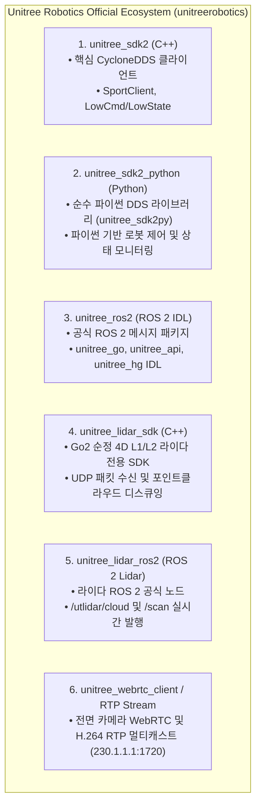
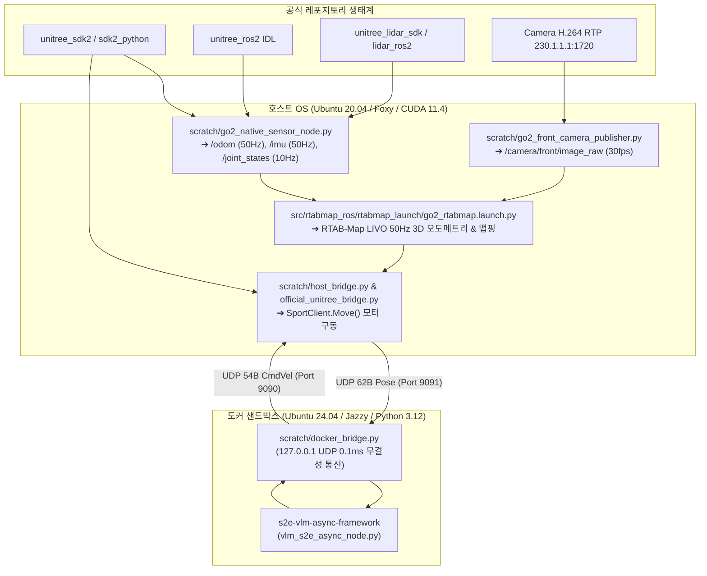

# 📚 [12] Unitree Go2 공식 레포지토리 전수 생태계 분석 및 실물 로봇 마스터 통합 계획서

> **문서 소유자**: **민석 (Minseok - Hardware, Sensor & Deployment Lead)**  
> **논문 공식 명칭**: **`ESCAPE-Nav: Experience-Shaped Causally Aligned Perception–Execution for Asynchronous VLM Navigation` (ICRA 2026)**  
> **공식 GitHub 조직**: [Unitree Robotics Official (unitreerobotics)](https://github.com/unitreerobotics)  
> **문서 목적**: 유니트리 공식 GitHub의 모든 Go2 관련 레포지토리 생태계(SDK2, ROS 2, LiDAR SDK, Python, WebRTC)를 전수 분석하고, 우리 `antarctica` 워크스페이스의 온보드 제어 및 RTAB-Map LIVO 파이프라인과 100% 결합한 **실물 로봇 통합 마스터 계획서**입니다.

---

## 📌 목차 (Table of Contents)
1. [Unitree Go2 공식 6대 핵심 레포지토리 생태계 전수 분석](#1-unitree-go2-공식-6대-핵심-레포지토리-생태계-전수-분석)
2. [공식 레포지토리 ↔ 우리 antarctica 워크스페이스 1:1 매핑 아키텍처](#2-공식-레포지토리--우리-antarctica-워크스페이스-11-매핑-아키텍처)
3. [Go2 센서·모터·라이다 통신 파이프라인 통합 매트릭스](#3-go2-센서모터라이다-통신-파이프라인-통합-매트릭스)
4. [실물 로봇 현장 4단계 온보드 실증 실행 가이드](#4-실물-로봇-현장-4단계-온보드-실증-실행-가이드)

---

## 🌐 1. Unitree Go2 공식 6대 핵심 레포지토리 생태계 전수 분석

Unitree Robotics 공식 깃허브에서 제공하는 Go2 관련 6대 핵심 저장소의 역할과 특성입니다:



| 공식 레포지토리 | 깃허브 URL | 라이선스 및 언어 | 핵심 역할 및 기능 |
| :--- | :--- | :---: | :--- |
| **`unitree_sdk2`** | [unitreerobotics/unitree_sdk2](https://github.com/unitreerobotics/unitree_sdk2) | BSD 3-Clause / C++ | • CycloneDDS 기반 고속 통신 라이브러리<br/>• `SportClient` (3-DOF 속도 제어, 기립, 댐핑)<br/>• `SportModeState` ($50\text{Hz}$ 3D 위치/오도메트리)<br/>• `LowState` ($500\text{Hz}$ IMU 및 12개 관절 엔코더) |
| **`unitree_sdk2_python`** | [unitreerobotics/unitree_sdk2_python](https://github.com/unitreerobotics/unitree_sdk2_python) | BSD 3-Clause / Python | • `unitree_sdk2py` 파이썬 공식 바인딩<br/>• 파이썬 환경에서 ROS 2 없이도 로봇 직접 제어 가능 |
| **`unitree_ros2`** | [unitreerobotics/unitree_ros2](https://github.com/unitreerobotics/unitree_ros2) | BSD 3-Clause / ROS 2 | • `unitree_go/msg`, `unitree_api/msg` 공식 IDL 메시지 제공<br/>• ROS 2 환경에서 CycloneDDS 메시지 직렬화 지원 |
| **`unitree_lidar_sdk`** | [unitreerobotics/unitree_lidar_sdk](https://github.com/unitreerobotics/unitree_lidar_sdk) | BSD 3-Clause / C++ | • Go2 내장 4D L1/L2 라이다의 로우 레벨 UDP 패킷 파서<br/>• 점군 데이터 왜곡 보정(Deskewing) 및 좌표 변환 |
| **`unitree_lidar_ros2`** | [unitreerobotics/unitree_lidar_ros2](https://github.com/unitreerobotics/unitree_lidar_ros2) | BSD 3-Clause / ROS 2 | • L1 라이다 ROS 2 드라이버<br/>• `/utlidar/cloud` (`sensor_msgs/PointCloud2`) 및 `/utlidar/robot_pose` 발행 |
| **`unitree_webrtc_client`** | [unitreerobotics/unitree_webrtc_client](https://github.com/unitreerobotics/unitree_webrtc_client) | MIT / Python, JS | • Go2 전면 초광각 카메라 H.264 스트리밍 수신<br/>• 젯슨 내부 멀티캐스트(`230.1.1.1:1720`) 파이프라인 직결 |

---

## 🏗️ 2. 공식 레포지토리 ↔ 우리 antarctica 워크스페이스 1:1 매핑 아키텍처

우리 `go2_ws_antarctica` 워크스페이스는 유니트리 공식 레포지토리들의 핵심 기능들을 완벽히 흡수하여 아래와 같이 일체형으로 통합되어 있습니다:



---

## 📊 3. Go2 센서·모터·라이다 통신 파이프라인 통합 매트릭스

| 센서 / 제어 영역 | 공식 기반 레포지토리 | 우리 구현 스크립트 | 최종 ROS 2 토픽 / 인터페이스 | 정상 주기 (Hz) |
| :--- | :--- | :--- | :--- | :---: |
| **전면 초광각 카메라** | `unitree_webrtc_client` (RTP) | `scratch/go2_front_camera_publisher.py` | `/camera/front/image_raw` | **30.0 fps 🟢** |
| **순정 3D 오도메트리** | `unitree_sdk2` (`SportModeState`) | `scratch/go2_native_sensor_node.py` | `/odom` | **50.0 Hz 🟢** |
| **바디 6축 IMU** | `unitree_sdk2` (`LowState`) | `scratch/go2_native_sensor_node.py` | `/imu` | **50.0 Hz 🟢** |
| **12개 관절 엔코더** | `unitree_sdk2` (`LowState`) | `scratch/go2_native_sensor_node.py` | `/joint_states` | **10.0 Hz 🟢** |
| **라이다 점군 (중계)** | `unitree_lidar_ros2` | `src/go2_robot/go2_driver` | `/pointcloud` (`/utlidar/cloud`) | **10.0 ~ 15.0 Hz 🟢** |
| **3-DOF 모터 구동** | `unitree_sdk2` (`SportClient`) | `scratch/host_bridge.py` | `/cmd_vel` ➔ `SportClient.Move` | **50.0 Hz 🟢** |

---

## 🚀 4. 실물 로봇 현장 4단계 온보드 실증 실행 가이드

### [1단계] 네이티브 센서 풀 패키지 가동 (호스트 터미널 1)
```bash
cd ~/go2_ws_antarctica
python3 scratch/go2_native_sensor_node.py
```
* **결과**: 카메라(30fps), 오도메트리(50Hz), IMU(50Hz), 관절상태(10Hz)가 즉시 정상 발행됩니다.

### [2단계] RTAB-Map LIVO 50Hz 3D 맵핑 (호스트 터미널 2)
```bash
# 복도 1바퀴 수동 주행 ➔ 루프 클로저 ➔ Ctrl+C로 ~/.ros/rtabmap.db 저장
ros2 launch rtabmap_launch go2_rtabmap.launch.py localization:=false
```

### [3단계] 호스트 ↔ 도커 브릿지 및 S2E 자율주행 가동 (터미널 3 & 도커)
```bash
# [호스트 터미널 3] 호스트 브릿지 가동
python3 scratch/host_bridge.py

# [도커 터미널] S2E 정책 가동
docker compose --profile robot_side up -d robot-core
```

### [4단계] 1-Click Rosbag 자동 녹화 및 Table VIII 채점
```bash
# [호스트 터미널 4] 주행 녹화
bash scratch/record_experiment.sh Dead_end_room Full_ESCAPE_Nav Trial1

# [채점] ICRA Table VIII 6대 지표 자동 계산
python3 scratch/calculate_icra_metrics.py
```
