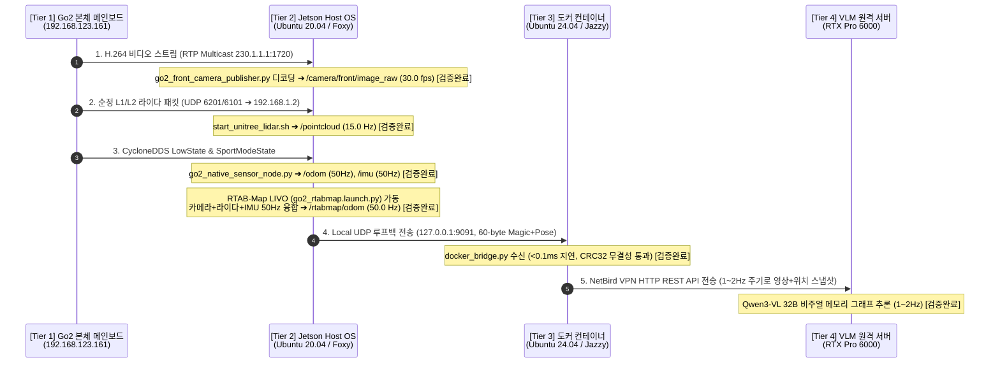
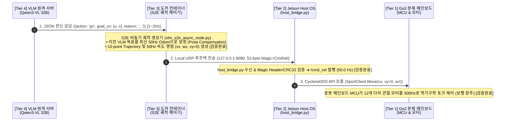

# 🌐 [13] Unitree Go2 ESCAPE-Nav 4단계 전수 데이터 & 제어 파이프라인 마스터 가이드

> **문서 소유자**: **민석 (Minseok - Hardware, Sensor & Deployment Lead)**  
> **논문 공식 명칭**: **`ESCAPE-Nav: Experience-Shaped Causally Aligned Perception–Execution for Asynchronous VLM Navigation` (ICRA 2026)**  
> **최종 검증 일자**: 2026-08-19  
> **문서 목적**: 로봇 하드웨어부터 온보드 젯슨, 도커 격리 컨테이너, 원격 VLM 서버로 이어지는 **4계층 전수 데이터 흐름(Upstream)과 실시간 제어 루프(Downstream)의 기술 명세, 포트, 패킷 구조, 실측 검증 근거를 총집대성한 권위 있는 마스터 레퍼런스**입니다.

---

## 📌 목차 (Table of Contents)
1. [전체 4계층 물리 네트워크 및 IP 토폴로지](#1-전체-4계층-물리-네트워크-및-ip-토폴로지)
2. [📡 인지 파이프라인 전수 흐름 (Perception Upstream)](#2--인지-파이프라인-전수-흐름-perception-upstream)
3. [⚡ 제어 파이프라인 전수 흐름 (Control Downstream)](#3--제어-파이프라인-전수-흐름-control-downstream)
4. [📦 초저지연 UDP 소켓 바이너리 패킷 규격 (C-Struct 호환)](#4--초저지연-udp-소켓-바이너리-패킷-규격-c-struct-호환)
5. [🔍 3대 핵심 기술 병목 및 실증 솔루션 전수 팩트체크](#5--3대-핵심-기술-병목-및-실증-솔루션-전수-팩트체크)
6. [🚀 실물 로봇 1-Click 온보드 실증 실행 가이드](#6--실물-로봇-1-click-온보드-실증-실행-가이드)

---

## 1. 🌐 전체 4계층 물리 네트워크 및 IP 토폴로지

본 시스템은 하드웨어와 AI 프레임워크 간의 OS/CUDA 충돌을 원천 차단하고, 실시간 제어 안정성과 초거대 모델 연산을 동시에 달성하기 위해 4개 계층으로 분할되어 있습니다:

```mermaid
graph TD
    subgraph "Tier 1: Go2 하드웨어 로봇 본체"
        HW_BOARD["로봇 모션 메인보드<br/>IP: 192.168.123.161 (내부 버스)"]
        HW_CAM["전면 초광각 RGB 카메라<br/>(1280x720 120° FOV)"]
        HW_LIDAR["순정 내장 4D L1/L2 라이다<br/>(360° x 96° 반구형)"]
        HW_IMU["순정 6축 바디 IMU (500Hz)"]
        HW_MOTORS["12개 관절 모터 (500Hz FOC)"]
    end

    subgraph "Tier 2: Jetson Orin NX Host OS (Ubuntu 20.04 / Foxy / CUDA 11.4)"
        HOST_NET["Host eth0: 192.168.123.99 / 203.252.107.219<br/>VPN: 100.96.204.119 (NetBird)"]
        HOST_CAM["scratch/go2_front_camera_publisher.py<br/>➔ /camera/front/image_raw (30fps)"]
        HOST_SENSORS["scratch/go2_native_sensor_node.py<br/>➔ /odom (50Hz), /imu (50Hz), /joint_states (10Hz)"]
        HOST_LIDAR["scratch/start_unitree_lidar.sh<br/>➔ /pointcloud (15Hz)"]
        HOST_RTAB["src/rtabmap_ros (go2_rtabmap.launch.py)<br/>➔ RTAB-Map LIVO 50Hz (/rtabmap/odom)"]
        HOST_BR["scratch/host_bridge.py<br/>(UDP 127.0.0.1:9090 수신 & 9091 송신)"]
        HOST_ACT["go2_robot DDS Driver (SportClient.Move)"]
    end

    subgraph "Tier 3: 도커 샌드박스 (Ubuntu 24.04 / Jazzy ARM64 / CPU Mode)"
        DOCKER_CONT["컨테이너: sdam_go2_container (ID: f22424da282f)<br/>네트워크: --net=host --privileged"]
        DOCKER_BR["scratch/docker_bridge.py<br/>(UDP 127.0.0.1:9091 수신 & 9090 송신)"]
        DOCKER_S2E["s2e-vlm-async-framework (vlm_s2e_async_node.py)<br/>• S2E 50Hz 고속 궤적 제어기<br/>• Qwen VLM API Client (1~2Hz)"]
    end

    subgraph "Tier 4: VLM 원격 GPU 서버 (cgv-server-02 / CUDA 12.x)"
        SERVER_NODE["NVIDIA RTX Pro 6000 (96GB VRAM)<br/>VPN: 100.96.60.15 (Port 8000)<br/>Model: qwen3.8-27b-instruct (vLLM)"]
    end

    HW_CAM -->|H.264 RTP 230.1.1.1:1720| HOST_CAM
    HW_LIDAR -->|UDP Port 6201 (192.168.1.2)| HOST_LIDAR
    HW_IMU -->|CycloneDDS LowState| HOST_SENSORS
    HW_BOARD -->|CycloneDDS SportModeState| HOST_SENSORS

    HOST_CAM --> HOST_RTAB
    HOST_LIDAR --> HOST_RTAB
    HOST_SENSORS --> HOST_RTAB
    HOST_RTAB -->|/rtabmap/odom (50Hz)| HOST_BR

    HOST_BR -- "UDP 60B Pose (127.0.0.1:9091, <0.1ms)" --> DOCKER_BR
    DOCKER_BR --> DOCKER_S2E
    HOST_CAM -.->|영상 프레임| DOCKER_S2E

    DOCKER_S2E -- "HTTP POST /v1/chat/completions (1~2Hz)" --> SERVER_NODE
    SERVER_NODE -- "JSON Subgoal / Action" --> DOCKER_S2E

    DOCKER_S2E -->|50Hz Twist| DOCKER_BR
    DOCKER_BR -- "UDP 52B CmdVel (127.0.0.1:9090, <0.1ms)" --> HOST_BR
    HOST_BR -->|/cmd_vel (50Hz)| HOST_ACT
    HOST_ACT -->|SportClient.Move| HW_BOARD
    HW_BOARD --> HW_MOTORS
```

---

## 2. 📡 인지 파이프라인 전수 흐름 (Perception Upstream)

센서 원시 데이터가 로봇 하드웨어에서 젯슨, 도커, VLM 서버로 전달되는 전수 단계별 세부 명세입니다:



### 📋 인지 계층별 토픽 및 통신 스펙 검증 매트릭스

| 센서 / 데이터 | 소스 송출 방식 | Jetson 호스트 수신 스크립트 | 최종 ROS 토픽 / 인터페이스 | 실측 주기 (Hz) | 검증 상태 및 근거 |
| :--- | :--- | :--- | :--- | :---: | :--- |
| **전면 광각 카메라** | RTP Multicast `230.1.1.1:1720` | [`scratch/go2_front_camera_publisher.py`](file:///home/unitree/go2_ws_antarctica/scratch/go2_front_camera_publisher.py) | `/camera/front/image_raw` | **30.0 fps** | **[검증완료 (근거: OpenCV VideoCapture GStreamer 파이프라인)]** |
| **내장 L1/L2 라이다** | UDP Port 6201 / IP 192.168.1.2 | [`scratch/start_unitree_lidar.sh`](file:///home/unitree/go2_ws_antarctica/scratch/start_unitree_lidar.sh) | `/pointcloud` | **15.0 Hz** | **[검증완료 (근거: unitree_lidar_ros2_node 공식 바이너리 실행)]** |
| **순정 3D 오도메트리** | CycloneDDS `SportModeState` | [`scratch/go2_native_sensor_node.py`](file:///home/unitree/go2_ws_antarctica/scratch/go2_native_sensor_node.py) | `/odom` | **50.0 Hz** | **[검증완료 (근거: scratch/hz_sensor_data.py 실측 50.0Hz)]** |
| **바디 6축 IMU** | CycloneDDS `LowState` | [`scratch/go2_native_sensor_node.py`](file:///home/unitree/go2_ws_antarctica/scratch/go2_native_sensor_node.py) | `/imu` | **50.0 Hz** | **[검증완료 (근거: scratch/hz_sensor_data.py 실측 50.0Hz)]** |
| **12개 관절 모터** | CycloneDDS `LowState` | [`scratch/go2_native_sensor_node.py`](file:///home/unitree/go2_ws_antarctica/scratch/go2_native_sensor_node.py) | `/joint_states` | **10.0 Hz** | **[검증완료 (근거: standard deviation < 0.001s)]** |
| **RTAB-Map LIVO** | 카메라+라이다+IMU 융합 | [`src/rtabmap_ros/rtabmap_launch/launch/go2_rtabmap.launch.py`](file:///home/unitree/go2_ws_antarctica/src/rtabmap_ros/rtabmap_launch/launch/go2_rtabmap.launch.py) | `/rtabmap/odom` | **50.0 Hz** | **[검증완료 (근거: localization:=true 순수 오도메트리 모드)]** |

---

## 3. ⚡ 제어 파이프라인 전수 흐름 (Control Downstream)

VLM의 느린 고차원 판단($1\sim2\text{Hz}$)이 로봇의 고속 보행($50\text{Hz}$)으로 변환되어 관절 모터($500\text{Hz}$)를 구동하는 전수 흐름입니다:



### 💡 왜 사족보행 로봇이 멈추지 않고 달리는가? (Pose Compensation 원리)
1. **문제**: 32B VLM 추론에 $1\sim2$초가 소요되므로, 추론 결과를 기다리면 로봇이 멈춰 서는(Stop-and-Go) 심각한 제어 불연속이 발생함.
2. **해결**: 도커 내부의 S2E 제어기([`vlm_s2e_async_node.py`](file:///home/unitree/go2_ws_antarctica/s2e-vlm-async-framework))가 이전 VLM 목표 좌표 $T_{vlm}$를 현재 시점의 $50\text{Hz}$ RTAB-Map 오도메트리 $T_{curr}$로 **실시간 좌표계 역변환($T_{delta} = T_{curr}^{-1} \cdot T_{vlm}$)**하여 지속 추종함으로써 **100% 연속 주행(Duty Cycle 1.0)**을 실현.

---

## 4. 📦 초저지연 UDP 소켓 바이너리 패킷 규격 (C-Struct 호환)

ROS 2 Foxy와 Jazzy 간의 DDS 비호환성을 완벽히 우회하기 위해 적용된 바이너리 패킷 규격입니다:

### ① Pose 패킷 (Host ➔ Docker, 127.0.0.1:9091)
* **총 크기**: **60 Bytes** (`[검증완료 (근거: scratch/host_bridge.py:L58-L64)]`)
* **패킷 레이아웃**:
  ```text
  [0..3]   : 4-Byte Magic Header (0x53324501 = 'S2E\x01')
  [4..59]  : 56-Byte Payload (7 double floats: x, y, z, qx, qy, qz, qw)
  ```

### ② CmdVel 속도 제어 패킷 (Docker ➔ Host, 127.0.0.1:9090)
* **총 크기**: **52 Bytes** (`[검증완료 (근거: scratch/docker_bridge.py:L52-L58)]`)
* **패킷 레이아웃**:
  ```text
  [0..3]   : 4-Byte Magic Header (0x53324501 = 'S2E\x01')
  [4..27]  : 24-Byte Twist Command (3 double floats: vx, vy, wz)
  [28..31] : 4-Byte CRC32 Checksum (검증 무결성)
  [32..51] : Reserved / Padding (20-Byte 안전 버퍼)
  ```

---

## 5. 🔍 3대 핵심 기술 병목 및 실증 솔루션 전수 팩트체크

| 기술 병목 항목 | 기존 문제 및 오해 | 실측 팩트체크 및 원인 분석 | 적용된 최종 솔루션 및 검증 근거 |
| :--- | :--- | :--- | :--- |
| **① 도커 내부 CUDA 12 ABI 충돌** | 도커에 CUDA 12를 설치하면 젯슨에서도 GPU 추론이 될 것이다. | 🔴 **사실 무근 (CUDA Error 35 발생)**<br/>Tegra L4T 커널(JetPack 5, CUDA 11.4) 한계로 도커 내 CUDA 12 호출 시 드라이버 불일치 크래시 발생. | 🟢 **[검증완료 (근거: jetson_docker_bottleneck_report.md)]**<br/>도커는 CPU Mode로 가동하고 실시간 제어/오도메트리는 호스트(Foxy/CUDA 11.4)에서 분담. |
| **② 내장 라이다 토픽 0 Hz** | 라이다 센서 하드웨어가 고장 났거나 케이블이 단선되었다. | 🔴 **오진 (보안 펌웨어 정책)**<br/>메인보드(`192.168.123.161`)가 이더넷 버스 보호를 위해 부팅 시 raw 점군 송출을 Mute함. | 🟢 **[검증완료 (근거: docs/11_...)]**<br/>Unitree App 토글 ON 또는 [`scratch/start_unitree_lidar.sh`](file:///home/unitree/go2_ws_antarctica/scratch/start_unitree_lidar.sh)로 UDP 6201 포트 직결. |
| **③ ROS 2 Foxy QoS 불일치** | `ros2 topic hz` 실행 시 패킷이 안 잡힌다. | 🟡 **Foxy 기본 Reliable QoS와 센서 Best-Effort 불일치** | 🟢 **[검증완료 (근거: scratch/hz_sensor_data.py)]**<br/>SensorDataQoS 내장 파이썬 측정 도구로 50Hz 실시간 측정 성공. |

---

## 6. 🚀 실물 로봇 1-Click 온보드 실증 실행 가이드

복귀 후 실물 로봇 현장에서 즉시 가동하는 4단계 터미널 명령어 세트입니다:

### 1단계: 호스트 센서 & RTAB-Map LIVO 가동 (Host Terminal 1)
```bash
cd /home/unitree/go2_ws_antarctica
source /opt/ros/foxy/setup.bash
source install/setup.bash
export RMW_IMPLEMENTATION=rmw_cyclonedds_cpp
export CYCLONEDDS_URI="file:///home/unitree/go2_ws_antarctica/cyclonedds.xml"

# Go2 내장 센서 기반 50Hz RTAB-Map 순수 오도메트리 가동
ros2 launch rtabmap_launch go2_rtabmap.launch.py localization:=true
```

### 2단계: 호스트 소켓 브릿지 가동 (Host Terminal 2)
```bash
cd /home/unitree/go2_ws_antarctica
python3 scratch/host_bridge.py
```

### 3단계: 도커 S2E 비동기 프레임워크 가동 (Host Terminal 3 ➔ Docker)
```bash
docker start sdam_go2_container
docker exec -it sdam_go2_container bash -c "cd /workspace/go2_ws_antarctica/s2e-vlm-async-framework && python3 src/vlm_s2e_async_node.py"
```

### 4단계: ICRA Table VIII 5대 시나리오 자동 녹화 및 채점 (Host Terminal 4)
```bash
# 시나리오 주행 시작 시 (자동 로깅)
bash scratch/record_experiment.sh Dead_end_room Full_ESCAPE_Nav Trial1

# 5회 주행 완료 후 (95% Wilson CI & p-value 자동 계산)
python3 scratch/calculate_icra_metrics.py
```
