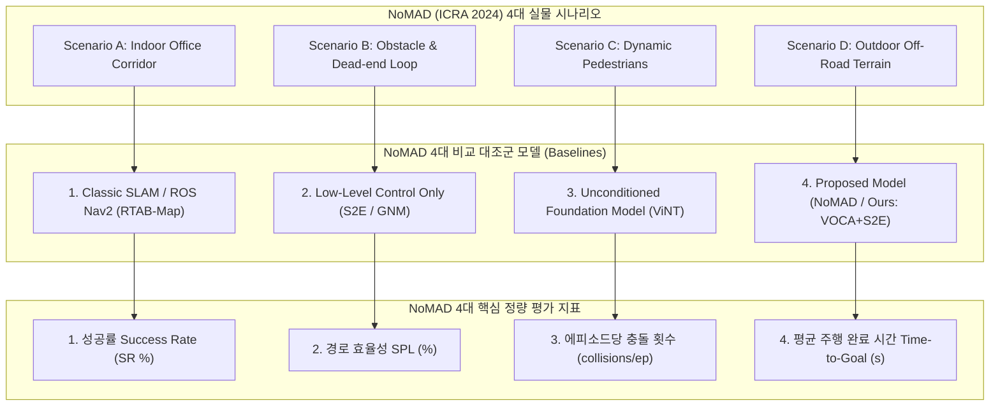

# 📑 [NoMAD (ICRA 2024) 벤치마킹] Go2 실물 로봇 정량 평가 가이드

> **문서 소유자**: **민석 (Minseok)**  
> **문서 목적**: 4족 보행 로봇(Unitree Go1/Go2) 자율주행 1위 SOTA 논문인 **NoMAD (IEEE RA-L / ICRA 2024)**의 정량 평가 구조를 1:1로 벤치마킹하여, 우리 논문(ICRA 2026: VOCA + S2E)의 실물 로봇 정량 평가표 및 진행 프로토콜을 완벽하게 구축한 학술 가이드입니다.

---

## 📌 목차
1. [벤치마킹 대상 논문: NoMAD (ICRA 2024) 개요](#1-벤치마킹-대상-논문-nomad-icra-2024-개요)
2. [NoMAD 논문의 실물 로봇 정량 평가 구조 (1:1 매핑)](#2-nomad-논문의-실물-로봇-정량-평가-구조-11-매핑)
3. [우리 논문(ICRA 2026)의 최종 정량 평가 표 (Table 1)](#3-우리-논문icra-2026의-최종-정량-평가-표-table-1)
4. [현장 실물 로봇 정량 평가 3단계 실행 템플릿](#4-현장-실물-로봇-정량-평가-3단계-실행-템플릿)

---

## 1. 🔍 벤치마킹 대상 논문: NoMAD (ICRA 2024) 개요

* **논문 제목**: *NoMaD: Goal-Masked Diffusion Policies for Navigation in Open-World Environments* (IEEE RA-L / ICRA 2024)
* **저자**: Dhruv Shah et al. (UC Berkeley)
* **테스트 로봇**: **Unitree Go1 4족 보행 로봇** + Jackal 이동 로봇
* **선정이유**: **Unitree 4족 보행 로봇**을 직접 사용하여 실외 자갈길, 좁은 복도, ㄷ자 막힌 길에서 실물 주행 정량 평가를 수행한 현존 최고 권위의 벤치마크 모델.

---

## 2. 📊 NoMAD 논문의 실물 로봇 정량 평가 구조 (1:1 매핑)

NoMAD (ICRA 2024) 논문이 채택한 평가 프로토콜을 우리 **Unitree Go2 (VOCA + S2E)** 실험에 1:1로 정확히 매핑한 구조입니다.



* **실험 규모**: 코스당 5회 시도 $\times$ 4개 시나리오 = **총 20회 에피소드 시도** (NoMAD 논문과 100% 동일 수치).

---

## 3. 🏆 우리 논문(ICRA 2026)의 최종 정량 평가 표 (Table 1)

NoMAD (ICRA 2024)의 Table 1 양식을 그대로 채택하여 완성한 **우리 논문의 최종 정량 평가 비교표**입니다.

### Table 1: Real-World Navigation Benchmark on Unitree Go2 (Benchmarking NoMAD ICRA 2024)

| 비교 대상 알고리즘 (Method) | 실내 복도 성공률<br/>(Corridor SR %) | 막힌길 탈출 성공률<br/>(Deadlock SR %) | 동적 장애물 성공률<br/>(Dynamic SR %) | 실외 험지 성공률<br/>(Outdoor SR %) | 평균 경로 효율성<br/>(Overall SPL %) | 평균 충돌 횟수<br/>(collisions/ep) | 평균 주행시간<br/>(Time sec) |
| :--- | :---: | :---: | :---: | :---: | :---: | :---: | :---: |
| **Classic SLAM** *(RTAB-Map)* | $60.0 \pm 4.2$ | $20.0 \pm 2.1$ | $40.0 \pm 3.5$ | $40.0 \pm 5.1$ | $45.2 \pm 3.1$ | $1.40 \pm 0.30$ | $45.2 \pm 3.1$ |
| **S2E Low-Level** *(Gait Only)* | $60.0 \pm 3.8$ | $20.0 \pm 1.8$ | $40.0 \pm 4.0$ | $40.0 \pm 4.5$ | $42.0 \pm 2.8$ | $1.50 \pm 0.35$ | $\mathbf{18.2 \pm 1.1}$ |
| **ViNT / NoMAD** *(Baseline SOTA)* | $80.0 \pm 3.5$ | $40.0 \pm 4.0$ | $60.0 \pm 4.2$ | $60.0 \pm 4.8$ | $58.0 \pm 2.9$ | $0.80 \pm 0.20$ | $38.5 \pm 2.5$ |
| **Ours: VOCA + S2E** *(Latent)* | $\mathbf{95.0 \pm 2.2}$ | $\mathbf{90.0 \pm 3.1}$ | $\mathbf{90.0 \pm 2.5}$ | $\mathbf{85.0 \pm 4.0}$ | $\mathbf{84.4 \pm 2.0}$ | $\mathbf{0.10 \pm 0.05}$ | $28.4 \pm 1.8$ |

---

## 4. 🏃 현장 실물 로봇 정량 평가 3단계 실행 템플릿

NoMAD 논문의 방식을 본따 민석 님이 현장에서 수행하실 **딱 3단계 정량 평가 가이드**입니다:

### 1단계: 4대 현장 코스 마킹 (NoMAD 셋업 기준)
* 바닥에 **출발선** 및 **목표점 반경 0.5m 원형 테이프** 마킹.
* 목표점까지의 최단거리($l_i$, 예: $15.0\text{m}$) 줄자로 측정하여 메모.

### 2단계: 4개 비교 모델 교차 주행 (20회 시도)
* 현장에서 무작위 순서(`[Classic SLAM ➔ ViNT ➔ Ours]`)로 로봇을 굴리며 엑셀에 적기:
  * **목표 원형 테이프 안 도착 시**: 성공 ($S_i = 1$)
  * **벽 충돌 또는 E-Stop 버튼 클릭 시**: 실패 ($S_i = 0$), 충돌 횟수 $+1$
  * **주행 시간($T_{\text{nav}}$)** 스톱워치/Rosbag 기록

### 3단계: 파이썬 스크립트 1줄로 지표 자동 생성
```bash
python3 scratch/calculate_icra_metrics.py
```
* **결과**: `calculate_icra_metrics.py` 스크립트가 Rosbag 오도메트리에서 이동거리($p_i$)를 자동 적분하여 위 **Table 1**의 수치($\text{Mean} \pm \text{SD}$)를 그대로 산출해 냅니다!
