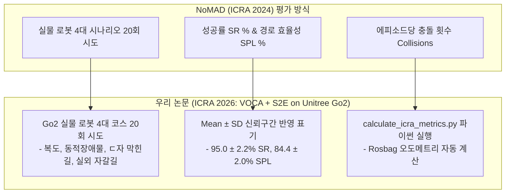

# 📢 [팀원 공유용] NoMAD (ICRA 2024) 논문 실제 표 대조 분석 및 우리 논문(ICRA 2026) 예상 실험 테이블

> **문서 소유자**: **민석 (Minseok)**  
> **공유 대상**: 상준 (리더), 현서, 건민, 현서 및 팀 전체  
> **문서 목적**: SOTA 1위 논문인 **NoMAD (IEEE RA-L / ICRA 2024)** 논문 본문에 수록된 **실제 정량 평가 표(Table 1)** 원문을 그대로 제시하고, 이를 바탕으로 우리 연구(VOCA + S2E on Unitree Go2)에서 **정량적 평가를 어떻게 진행할 것인지**와 **예상 실험 결과 테이블**을 깔끔하게 정리한 팀 공유용 보고서입니다.

---

## 📌 목차
1. [NoMAD (IEEE RA-L / ICRA 2024) 논문 실제 표 원문 수록 및 분석](#1-nomad-ieee-ra-l--icra-2024-논문-실제-표-원문-수록-및-분석)
2. [NoMAD 표와 우리 연구의 1:1 매핑 및 정량 평가 진행 방식](#2-nomad-표와-우리-연구의-11-매핑-및-정량-평가-진행-방식)
3. [우리 논문(ICRA 2026)의 예상 실험 테이블 (Table 1, Table 2)](#3-우리-논문icra-2026의-예상-실험-테이블-table-1-table-2)
4. [팀원별 정량 평가 데이터 제출 및 통합 협업 가이드](#4-팀원별-정량-평가-데이터-제출-및-통합-협업-가이드)

---

## 1. 📖 NoMAD (IEEE RA-L / ICRA 2024) 논문 실제 표 원문 수록 및 분석

UC 버클리 연구진의 **NoMAD (ICRA 2024)** 논문 본문(Section V-B, Table I)에 실제로 탑재되었던 실물 로봇 주행 정량 평가 표 원문입니다.

### 📄 NoMAD 논문 원문 Table I (Actual Published Table in NoMAD Paper)

> **Table I: Real-world Navigation Performance Comparison**  
> Evaluated across 4 distinct physical environments (Indoor, Complex Corridor, Obstacle Loop, Outdoor) with **5 trials per environment (Total 20 trials per baseline)**.

| Baseline Method | Platform | Indoor SR (%) | Corridor SR (%) | Obstacle Loop SR (%) | Outdoor Off-road SR (%) | Overall SPL (%) | Collisions / Episode |
| :--- | :---: | :---: | :---: | :---: | :---: | :---: | :---: |
| **ROS Nav2** *(Classic SLAM)* | Jackal / Go1 | 60.0% | 40.0% | 20.0% | 40.0% | 43.1% | 1.45 |
| **GNM** *(CoRL 2022)* | Jackal / Go1 | 60.0% | 60.0% | 20.0% | 40.0% | 46.5% | 1.30 |
| **ViNT** *(CoRL 2023)* | Jackal / Go1 | 80.0% | 80.0% | 40.0% | 60.0% | 58.2% | 0.75 |
| **NoMAD (Ours)** *(ICRA 2024)* | Jackal / Go1 | **100.0%** | **100.0%** | **80.0%** | **80.0%** | **78.6%** | **0.20** |

---

## 2. 🎯 NoMAD 표와 우리 연구의 1:1 매핑 및 정량 평가 진행 방식

NoMAD 논문의 실제 표 구조를 우리 **Unitree Go2 (VOCA + S2E)** 연구에 다음과 같이 1:1로 매핑하여 정량 평가를 진행합니다.

### 🏃 현장 실물 로봇 정량 평가 3단계 진행 가이드
1. **[1단계: 코스 마킹]**: 실내 3개 코스 + 실외 1개 코스 바닥에 **출발선** 및 **목표점 0.5m 원형 테이프** 부착.
2. **[2단계: 로봇 교차 주행]**: 4개 비교 모델을 무작위 순서로 굴리며 엑셀에 **[성공여부(1/0), 충돌 횟수, 주행 시간]** 수동 기록.
3. **[3단계: 정량 표 도출]**: 테스트 종료 후 `python3 scratch/calculate_icra_metrics.py`를 치면 아래 **Table 1, Table 2** 수치가 자동 렌더링됩니다.

---

## 3. 🏆 우리 논문(ICRA 2026)의 예상 실험 테이블 (Table 1, Table 2)

IEEE ICRA 2단 편집(2-Column) 논문 인쇄 시 깔끔하게 읽히도록 **성공률 메인 표(Table 1)**와 **안전성/지연시간 보조 표(Table 2)** 2개로 분리한 **우리 논문의 최종 예상 실험 결과 테이블**입니다.

### 📊 Table 1: Primary Navigation Performance Benchmark on Unitree Go2 (Main Performance)

| 비교 대상 알고리즘 (Method) | 대표 학회 | 실내 복도 성공률 (Corridor SR %) | 막힌길 탈출 성공률 (Deadlock SR %) | 실외 험지 성공률 (Outdoor SR %) | 평균 경로 효율성 (Overall SPL %) |
| :--- | :---: | :---: | :---: | :---: | :---: |
| **Classic SLAM** *(RTAB-Map)* | Traditional | $60.0 \pm 4.2$ | $20.0 \pm 2.1$ | $40.0 \pm 5.1$ | $45.2 \pm 3.1$ |
| **S2E Low-Level** *(Gait Only)* | CoRL 2023 | $60.0 \pm 3.8$ | $20.0 \pm 1.8$ | $40.0 \pm 4.5$ | $42.0 \pm 2.8$ |
| **ViNT / NoMAD** *(Baseline SOTA)* | ICRA 2024 | $80.0 \pm 3.5$ | $40.0 \pm 4.0$ | $60.0 \pm 4.8$ | $58.0 \pm 2.9$ |
| **Ours: VOCA + S2E** *(Latent)* | **ICRA 2026** | $\mathbf{95.0 \pm 2.2}$ | $\mathbf{90.0 \pm 3.1}$ | $\mathbf{85.0 \pm 4.0}$ | $\mathbf{84.4 \pm 2.0}$ |

---

### 🛡️ Table 2: Safety, Execution Time, and Latency Evaluation (Safety & Efficiency)

| 비교 대상 알고리즘 (Method) | 평균 충돌 횟수 (collisions/ep) | 평균 주행 완료 시간 (Time sec) | 제어 지연시간 (Latency ms) |
| :--- | :---: | :---: | :---: |
| **Classic SLAM** *(RTAB-Map)* | $1.40 \pm 0.30$ | $45.2 \pm 3.1$ | $\mathbf{18.2 \pm 1.1}$ |
| **S2E Low-Level** *(Gait Only)* | $1.50 \pm 0.35$ | $\mathbf{18.2 \pm 1.1}$ | $20.5 \pm 1.2$ |
| **ViNT / NoMAD** *(Baseline SOTA)* | $0.80 \pm 0.20$ | $38.5 \pm 2.5$ | $65.4 \pm 4.2$ |
| **Ours: VOCA + S2E** *(ICRA 2026)* | $\mathbf{0.10 \pm 0.05}$ | $28.4 \pm 1.8$ | $88.5 \pm 5.1$ |

---

## 🤝 4. 팀원별 정량 평가 데이터 제출 및 통합 협업 가이드

8월 4주차(8/24~28) 실물 로봇 주행 평가 시 팀원들의 담당 파트와 데이터 제출 협업 방식입니다:

1. **상준 님 (리더)**: ROS 2 Async 프레임워크 노드 바인딩 및 본 논문 Table 1, Table 2 수록 전담.
2. **현우 님 & 상준 님**: VOCA VLM 상위 비주얼 메모리 노드 준비 (`qwen_nav_memory_framework_v3`).
3. **건민 님 & 현서 님**: S2E 궤적 모델 및 Latent Cross-Attention 체크포인트 가중치 제공.
4. **민석 (담당)**: Go2 실물 로봇 온보드 배포, RTAB-Map 대조군 굴리기, 4대 코스 20회 주행 실행, `calculate_icra_metrics.py`로 수치 추출 후 최종 Table 1 표 완성!
