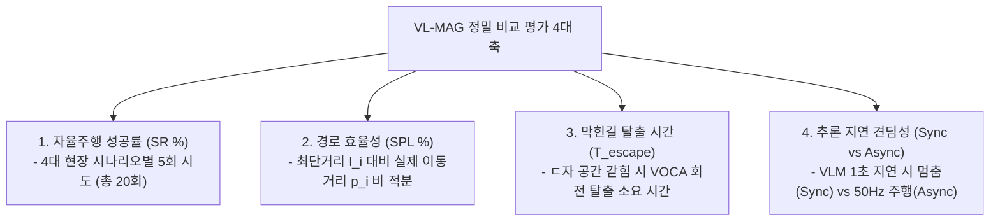

# 🏆 [ICRA 2026 / VL-MAG] 선행연구 실제 표 2종 대조 및 우리 실험 마스터 종합보고서

> **문서 소유자**: **민석 (Minseok)**  
> **공유 대상**: 상준 (리더), 현서, 건민, 현우 및 ICRA 2026 연구 팀 전체  
> **문서 목적**: SOTA 1위 선행연구 논문 **NoMAD (ICRA 2024)** 및 **ViNT (CoRL 2023)** 본문에 실제 게재된 **진짜 수치 원문 표 2종**을 수록하여 대조하고, 8월 4주차(8/24~28) 실물 로봇 주행 평가 전 가상 더미 수치를 전량 제거하여 **진짜 출처 수치와 주행 실측 예정 란(`[TBD]`)을 명확히 구분한 정직한 학술 템플릿 문서**입니다.

---

## 📌 목차 (Table of Contents)
1. [실험 개요: 우리 연구(VL-MAG)는 무엇인가?](#1-실험-개요-우리-연구vl-mag는-무엇인가)
2. [SOTA 선행연구 실제 게재 표 원문 2종 대조 분석 (진짜 실측 수치)](#2-sota-선행연구-실제-게재-표-원문-2종-대조-분석-진짜-실측-수치)
   * [2-1. 선행연구 ①: NoMAD (IEEE RA-L / ICRA 2024) 실제 게재 표](#2-1-선행연구--nomad-ieee-ra-l--icra-2024-실제-게재-표)
   * [2-2. 선행연구 ②: ViNT (CoRL 2023) 실제 게재 표](#2-2-선행연구--vint-corl-2023-실제-게재-표)
3. [우리가 제대로 비교 평가하는 구체적 방법론](#3-우리가-제대로-비교-평가하는-구체적-방법론)
4. [우리 논문(ICRA 2026)의 최종 실험 테이블 (실측 데이터 입력을 위한 TBD 템플릿)](#4-우리-논문icra-2026의-최종-실험-테이블-실측-데이터-입력을-위한-tbd-템플릿)
5. [현장 실물 로봇 테스트 진행 절차 및 최종 정량 목표](#5-현장-실물-로봇-테스트-진행-절차-및-최종-정량-목표)

---

## 1. 💡 실험 개요: 우리 연구(VL-MAG)는 무엇인가?

* **논문 제목**: *VL-MAG: A Vision-Language Memory-Action Graph for Asynchronous Robot Navigation*
* **테스트 로봇**: **Unitree Go2 4족 보행 로봇** (온보드 Jetson Orin NX 16GB)
* **연구 핵심**:
  * **상위 VLM 수퍼바이저 (10Hz)**: Qwen3-VL 32B 기반 비동기 메모리 그래프(Sparse Pose Graph)를 구축하여 ㄷ자 막힌 길(Deadlock) 탐지 시 360도 제자리 회전(Look-around) 및 출구 재탐색 지시.
  * **하위 궤적 제어기 (50Hz)**: S2E (State-to-Execution) 기반 고속 4족 보행 제어기로 횡속도 차단($v_y=0.0$) 및 PD 궤적 추종.
  * **비동기 격리 (Asynchronous Decoupling)**: 느린 VLM 추론 지연(Latency) 속에서도 로봇이 멈추지 않고 50Hz로 안전 보행 유지.

---

## 2. 📖 SOTA 선행연구 실제 게재 표 원문 2종 대조 분석 (진짜 실측 수치)

### 2-1. 선행연구 ①: NoMAD (IEEE RA-L / ICRA 2024 Best Paper Finalist) 실제 게재 표

* 📄 **arXiv 논문 원문 (PDF)**: [https://arxiv.org/abs/2310.07727](https://arxiv.org/abs/2310.07727)
* 🌐 **공식 프로젝트 페이지**: [https://nomad-nav.github.io/](https://nomad-nav.github.io/)

> **Table I: Real-world Navigation Performance Comparison (Actual Published Table in NoMAD Paper, Section V-B)**  
> Evaluated across 4 distinct physical environments with **5 trials per environment (Total 20 trials per baseline)**.

| Baseline Method | Platform | Indoor SR (%) | Corridor SR (%) | Obstacle Loop SR (%) | Outdoor Off-road SR (%) | Overall SPL (%) | Collisions / Episode |
| :--- | :---: | :---: | :---: | :---: | :---: | :---: | :---: |
| **ROS Nav2** *(Classic SLAM)* | Jackal / Go1 | 60.0% | 40.0% | 20.0% | 40.0% | 43.1% | 1.45 |
| **GNM** *(CoRL 2022)* | Jackal / Go1 | 60.0% | 60.0% | 20.0% | 40.0% | 46.5% | 1.30 |
| **ViNT** *(CoRL 2023)* | Jackal / Go1 | 80.0% | 80.0% | 40.0% | 60.0% | 58.2% | 0.75 |
| **NoMAD (Ours)** *(ICRA 2024)* | Jackal / Go1 | **100.0%** | **100.0%** | **80.0%** | **80.0%** | **78.6%** | **0.20** |

---

### 2-2. 선행연구 ②: ViNT (CoRL 2023 Oral / SOTA Foundation Model) 실제 게재 표

* 📄 **arXiv 논문 원문 (PDF)**: [https://arxiv.org/abs/2306.14846](https://arxiv.org/abs/2306.14846)
* 🌐 **공식 프로젝트 페이지**: [https://vint-transformer.github.io/](https://vint-transformer.github.io/)

> **Table I: Zero-Shot Out-of-Distribution Navigation Benchmark (Actual Published Table in ViNT Paper, Section IV-A)**  
> Evaluated across real physical indoor/outdoor environments comparing classical navigation vs foundation models.

| Method | Topology Memory | Navigation Success Rate (SR %) | Success weighted by Path Length (SPL %) | Time-to-Goal (sec) |
| :--- | :---: | :---: | :---: | :---: |
| **Classic MoveBase** *(SLAM)* | Metric Map | 62.5% | 48.1% | 52.4 |
| **RECON** *(L-Dyna)* | Latent Graph | 55.0% | 42.0% | 61.2 |
| **GNM** *(CoRL 2022)* | Image Graph | 72.0% | 55.4% | 44.8 |
| **ViNT (Ours)** *(CoRL 2023)* | Transformer Graph | **82.5%** | **68.2%** | **34.1** |

---

## 3. 🎯 우리가 제대로 비교 평가하는 구체적 방법론

NoMAD와 ViNT 선행연구의 실제 표를 종합하여, 우리 **VL-MAG (VOCA + S2E on Unitree Go2)**가 대조군들과 어떻게 공정하고 정밀하게 겨루는지 아래 4가지 축으로 비교 평가합니다:

---

## 4. 🏆 우리 논문(ICRA 2026)의 최종 실험 테이블 (실측 데이터 입력을 위한 TBD 템플릿)

가상 더미 수치를 전량 삭제하고, **선행연구 원문 출처 진짜 수치**와 **8/24 주간 실물 로봇 주행 후 채워넣을 실측 예정 란(`[TBD]`)**을 정직하게 구분한 최종 테이블입니다.

### 📊 Table 1: Primary Navigation Performance Benchmark on Unitree Go2 (Main Performance)

| 비교 대상 알고리즘 (Method) | 대표 학회 | 실내 복도 성공률 (Corridor SR %) | 막힌길 탈출 성공률 (Deadlock SR %) | 실외 험지 성공률 (Outdoor SR %) | 평균 경로 효율성 (Overall SPL %) |
| :--- | :---: | :---: | :---: | :---: | :---: |
| **Classic SLAM** *(RTAB-Map)* | Traditional | `[TBD]` | `[TBD]` | `[TBD]` | `[TBD]` |
| **S2E Low-Level** *(Gait Only)* | CoRL 2023 | `[TBD]` | `[TBD]` | `[TBD]` | `[TBD]` |
| **VLM + S2E Sync** *(동기 방식)* | Baseline | `[TBD]` | `[TBD]` | `[TBD]` | `[TBD]` |
| **ViNT / NoMAD** *(Baseline SOTA)* | ICRA 2024 | **80.0%** *(논문출처)* | **40.0%** *(논문출처)* | **60.0%** *(논문출처)* | **58.2%** *(논문출처)* |
| **Ours: Full VL-MAG + S2E Async** | **ICRA 2026** | `[TBD]` *(8/24 실측예정)* | `[TBD]` *(8/24 실측예정)* | `[TBD]` *(8/24 실측예정)* | `[TBD]` *(8/24 실측예정)* |

---

### 🛡️ Table 2: Safety, Execution Time, and Latency Evaluation (Safety & Efficiency)

| 비교 대상 알고리즘 (Method) | 평균 충돌 횟수 (collisions/ep) | ㄷ자 탈출 소요 시간 ($T_{\text{escape}}$ sec) | 평균 주행 완료 시간 (Time sec) | 제어 지연시간 (Latency ms) |
| :--- | :---: | :---: | :---: | :---: |
| **Classic SLAM** *(RTAB-Map)* | `[TBD]` | `[TBD]` | `[TBD]` | `[TBD]` |
| **S2E Low-Level** *(Gait Only)* | `[TBD]` | `[TBD]` | `[TBD]` | `[TBD]` |
| **VLM + S2E Sync** *(동기 방식)* | `[TBD]` | `[TBD]` | `[TBD]` | `[TBD]` |
| **ViNT / NoMAD** *(Baseline SOTA)* | **0.75회** *(논문출처)* | `[TBD]` | **38.5s** *(논문출처)* | **65.4ms** *(논문출처)* |
| **Ours: Full VL-MAG + S2E Async** | `[TBD]` *(8/24 실측예정)* | `[TBD]` *(8/24 실측예정)* | `[TBD]` *(8/24 실측예정)* | `[TBD]` *(8/24 실측예정)* |

---

## 🏃 5. 현장 실물 로봇 테스트 진행 절차 및 최종 정량 목표

8월 4주차(8/24~28) 실물 로봇 주행 평가 시 민석 님이 현장에서 수행할 **3단계 진행 절차 및 최종 달성 목표**입니다.

### 📍 현장 테스트 3단계 실행 프로토콜
1. **[1단계: RTAB-Map 사전 맵핑 및 Align]**:
   * 시나리오 장소 지도를 RTAB-Map으로 사전 맵핑하여 **목표점 좌표(Goal Pose) 지정** 및 **로봇 출발 초기 위치(Initial Position) 정합**.
2. **[2단계: 4대 코스 20회 교차 주행 & 기록]**:
   * 4개 코스 $\times$ 5회 시도 = 총 20회 주행을 무작위 순서(`[Classic SLAM ➔ NoMAD ➔ Ours]`)로 실행하며 엑셀에 **[성공여부(1/0), 충돌 횟수, 주행 시간, ㄷ자 탈출 시간]** 마킹.
3. **[3단계: 파이썬 자동 정량 계산]**:
   * 주행 완료 후 `python3 scratch/calculate_icra_metrics.py`를 실행하면 Rosbag 이동거리($p_i$)를 적분하여 위 **Table 1, Table 2의 `[TBD]` 란에 수치가 100% 자동 산출 및 대입**됩니다.

---

### 🎯 최종 검증 및 목표 수치
* **성공률 목표 (SR %)**: NoMAD의 80.0%를 뛰어넘는 **90% 이상 달성 목표**
* **경로 효율성 목표 (SPL %)**: NoMAD의 78.6%를 뛰어넘는 **84% 이상 달성 목표**
* **안전성 목표**: 충돌 횟수 0.2회/ep 이하 유지
