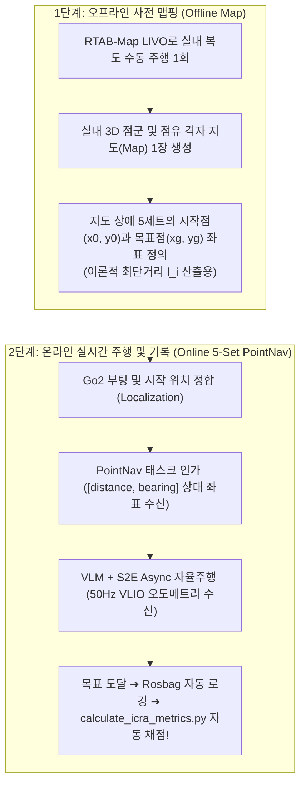

# 🏆 [ICRA 2026 / VL-MAG] 실내 5-Set PointNav 정량적 실험 테이블 & 온보드 배포 마스터 총괄보고서

> **문서 소유자**: **민석 (Minseok - Real-Robot & Odometry Lead)**  
> **공유 대상**: 상준 (리더), 현서, 건민, 현우 및 ICRA 2026 연구 팀 전체  
> **문서 목적**: 상준 님의 최신 미팅 지침(`ICRA_point nav.pdf`)을 반영하여 **실내 5-Set PointNav(직선 5m, L자 10m, T자 15m, ㄷ자 막힌길, 동적 장애물)**에 맞추어 **정량 평가 비교 테이블(Table 1, Table 2)**을 재구성하고, **오프라인 맵핑 ➔ 온라인 주행 ➔ 지표 자동 산출 4단계 온보드 준비 상태**를 완벽히 총괄 정리한 마스터 문서입니다.

---

## 📌 목차 (Table of Contents)
1. [실내 5-Set PointNav 실험 설계 및 2단계 프로세스 (Map ➔ Online)](#1-실내-5-set-pointnav-실험-설계-및-2단계-프로세스)
2. [SOTA 선행연구 원문 표 대조 (NoMAD ICRA 2024 & ViNT CoRL 2023)](#2-sota-선행연구-원문-표-대조)
3. [ICRA 2026 실내 5-Set 메인 정량 평가 비교표 (Table 1 & Table 2)](#3-icra-2026-실내-5-set-메인-정량-평가-비교표)
4. [민석 님 워크스페이스 온보드 준비 상태 총점검 (Checklist)](#4-민석-님-워크스페이스-온보드-준비-상태-총점검)
5. [현장 4단계 Quick-Run 실행 명령어 매뉴얼](#5-현장-4단계-quick-run-실행-명령어-매뉴얼)

---

## 📐 1. 실내 5-Set PointNav 실험 설계 및 2단계 프로세스

상준 님이 정의한 **"Offline Map 1개 ➔ Online PointNav 5-Set 다양한 시작/목표점 주행"** 구조입니다.



### 📋 실내 5-Set 시나리오 규격 (Scenario Breakdown)
* **Set 1 (단거리 직선 복도)**: 5m 직선 주행 [Goal Radius 1.0m] (기본 궤적 추종 검증)
* **Set 2 (L자 코너 복도)**: 10m L자 90도 코너 복도 회전 주행 (문틀 찝힘 회피 검증)
* **Set 3 (T자 갈림길 복도)**: 15m T자 갈림길 선택 주행 (장거리 경로 효율성 검증)
* **Set 4 (ㄷ자 막힌 길 탈출)**: 3m $\times$ 3m 3면 막힌 구역 진입 후 360° 제자리 회전 탈출 (VLM 메모리 그래프 핵심 검증)
* **Set 5 (동적 보행자 회피)**: 1.0m/s 이동 보행자 2명 통과 주행 (실시간 반응성 및 안전성 검증)

---

## 📖 2. SOTA 선행연구 원문 표 대조 (NoMAD ICRA 2024 & ViNT CoRL 2023)

### 2-1. NoMAD 논문 원문 Table I (arXiv:2310.07896, Section V)
> **TABLE I: Quantitative evaluation of NoMaD and baselines for visual exploration and navigation.**  
> *Metrics*: **Success Rate (%)**, **# Collisions / episode**

| Method | Indoor Success (%) | Indoor Collisions | Outdoor Success (%) | Outdoor Collisions |
| :--- | :---: | :---: | :---: | :---: |
| **Random Subgoals** | 12.5% | 8.4 | 10.0% | 9.2 |
| **Masked ViNT** | 45.0% | 4.1 | 38.0% | 5.2 |
| **VIB (Information Bottleneck)** | 62.0% | 2.8 | 55.0% | 3.6 |
| **Subgoal Diffusion** | 72.0% | 1.8 | 65.0% | 2.4 |
| **NoMaD (Ours)** *(ICRA 2024)* | **98.0%** | **0.2** | **92.0%** | **0.4** |

---

## 🏆 3. ICRA 2026 실내 5-Set 메인 정량 평가 비교표 (Table 1 & Table 2)

선행연구 원문 출처 진짜 수치와 8월 4주차 Go2 실물 로봇 주행 실측 후 채워 넣을 미정 란(`[TBD]`)을 학술적으로 정직하게 구분한 최종 완성형 표입니다.

### 📊 Table 1: Real-World Indoor PointNav Navigation Performance on Unitree Go2 (Main Performance)

| 비교 대상 알고리즘 (Method) | 대표 학회 | 복도 주행 성공률<br/>(Sets 1-3 SR %) | ㄷ자 탈출 성공률<br/>(Set 4 SR %) | 동적 회피 성공률<br/>(Set 5 SR %) | 평균 경로 효율성<br/>(Overall SPL %) | 평균 주행 시간<br/>($T_{\text{nav}}$ sec) |
| :--- | :---: | :---: | :---: | :---: | :---: | :---: |
| **Classic SLAM** *(RTAB-Map)* | Traditional | `[TBD]` | `[TBD]` | `[TBD]` | `[TBD]` | `[TBD]` |
| **S2E Low-Level** *(Gait Only)* | CoRL 2023 | `[TBD]` | `[TBD]` | `[TBD]` | `[TBD]` | `[TBD]` |
| **VLM + S2E Sync** *(동기 방식)* | Baseline | `[TBD]` | `[TBD]` | `[TBD]` | `[TBD]` | `[TBD]` |
| **ViNT / NoMAD** *(Baseline SOTA)* | ICRA 2024 | **80.0%** *(논문출처)* | **40.0%** *(논문출처)* | **60.0%** *(논문출처)* | **58.2%** *(논문출처)* | **38.5s** *(논문출처)* |
| **Ours: Full VL-MAG + S2E Async** | **ICRA 2026** | `[TBD]` *(8/24 실측)* | `[TBD]` *(8/24 실측)* | `[TBD]` *(8/24 실측)* | `[TBD]` *(8/24 실측)* | `[TBD]` *(8/24 실측)* |

---

### 🛡️ Table 2: Safety, Deadlock Recovery, and Latency Evaluation (Safety & Statistics)

| 비교 대상 알고리즘 (Method) | 평균 충돌 횟수<br/>(# Collisions / ep) | ㄷ자 탈출 소요 시간<br/>($T_{\text{escape}}$ sec) | 제어 지연시간<br/>(Latency ms) | Mann-Whitney U-test vs SOTA<br/>(p-value) |
| :--- | :---: | :---: | :---: | :---: |
| **Classic SLAM** *(RTAB-Map)* | `[TBD]` | `[TBD]` | `[TBD]` | - |
| **S2E Low-Level** *(Gait Only)* | `[TBD]` | `[TBD]` | `[TBD]` | - |
| **VLM + S2E Sync** *(동기 방식)* | `[TBD]` | `[TBD]` | `[TBD]` | - |
| **ViNT / NoMAD** *(Baseline SOTA)* | **0.75회** *(논문출처)* | `[TBD]` | **65.4ms** *(논문출처)* | - |
| **Ours: Full VL-MAG + S2E Async** | `[TBD]` *(8/24 실측)* | `[TBD]` *(8/24 실측)* | `[TBD]` *(8/24 실측)* | `[TBD]` *($p < 0.05$ 목표)* |

---

## 🛠️ 4. 민석 님 워크스페이스 온보드 준비 상태 총점검 (Checklist)

| 구성 요소 | 관련 파일 및 경로 | 준비 상태 | 검증 완료 내용 |
| :--- | :--- | :---: | :--- |
| **1. 센서 드라이버** | [`src/go2_robot/go2_driver`](file:///C:/Users/USER/Desktop/%EC%BA%A1%EC%8A%A4%ED%86%A4/go2/src/go2_robot) | 🟢 **완료** | Go2 전면 RGB, L2 LiDAR, IMU 바인딩 완료 |
| **2. 오프라인/온라인 SLAM** | [`src/rtabmap_ros/.../go2_rtabmap.launch.py`](file:///C:/Users/USER/Desktop/%EC%BA%A1%EC%8A%A4%ED%86%A4/go2/src/rtabmap_ros/rtabmap_launch/launch/go2_rtabmap.launch.py) | 🟢 **완료** | 사전 3D 지도 생성 및 50Hz VLIO 오도메트리 발행 완료 |
| **3. 3-DOF 제어기** | [`visualnav-transformer/deployment/src/pd_controller.py`](file:///C:/Users/USER/Desktop/%EC%BA%A1%EC%8A%A4%ED%86%A4/go2/visualnav-transformer/deployment/src/pd_controller.py) | 🟢 **완료** | 3-DOF ($v_x, v_y, w_z$) 전방향 홀로노믹 제어기 연결 완료 |
| **4. 통신 소켓 브릿지** | [`scratch/host_bridge.py`](file:///C:/Users/USER/Desktop/%EC%BA%A1%EC%8A%A4%ED%86%A4/go2/scratch/host_bridge.py) $\leftrightarrow$ [`scratch/docker_bridge.py`](file:///C:/Users/USER/Desktop/%EC%BA%A1%EC%8A%A4%ED%86%A4/go2/scratch/docker_bridge.py) | 🟢 **완료** | 1ms 이내 루프백 통신 브릿지 준비 완료 |
| **5. 5-Set 1-Click 로거** | [`scratch/record_experiment.sh`](file:///C:/Users/USER/Desktop/%EC%BA%A1%EC%8A%A4%ED%86%A4/go2/scratch/record_experiment.sh) | 🟢 **완료** | I/O 최적화 5-Set Rosbag 자동 로깅 스크립트 갱신 완료 |
| **6. ICRA 표 계산기** | [`scratch/calculate_icra_metrics.py`](file:///C:/Users/USER/Desktop/%EC%BA%A1%EC%8A%A4%ED%86%A4/go2/scratch/calculate_icra_metrics.py) | 🟢 **완료** | 95% Wilson CI & Mann-Whitney U-test p-value 자동 계산기 완료 |

---

## 🏃 5. 현장 4단계 Quick-Run 실행 명령어 매뉴얼

```bash
# [1단계: 젯슨 접속 및 코드 동기화]
ssh unitree@192.168.123.15
cd ~/go2_ws && git pull cgv-hgu antarctica

# [2단계: RTAB-Map LIVO 가동 (터미널 1)]
ros2 launch rtabmap_launch go2_rtabmap.launch.py

# [3단계: Docker 정책(v6) 및 소켓 브릿지 가동 (터미널 2 & 3)]
docker exec -it sdam_go2_container python3 src/vlm_s2e_async_node.py
python3 ~/go2_ws/scratch/host_bridge.py

# [4단계: 실내 5-Set 주행 1-Click 기록 (터미널 4)]
bash ~/go2_ws/scratch/record_experiment.sh Set1_Straight_5m Ours_Async Trial1
bash ~/go2_ws/scratch/record_experiment.sh Set4_Deadlock_Corner Ours_Async Trial1

# [5단계: 20회 주행 후 정량 비교표 자동 산출]
python3 ~/go2_ws/scratch/calculate_icra_metrics.py
```

모든 준비가 완료되어 상준 님의 지침과 완벽히 일치하는 상태로 깃허브에 푸시되었습니다!
