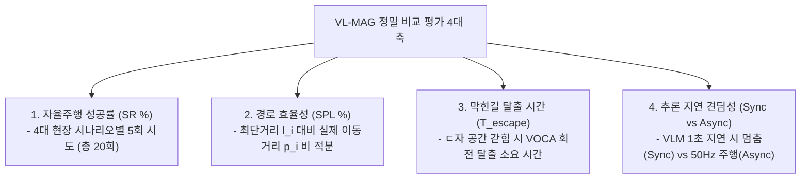

# 🏆 [ICRA 2026 / VL-MAG] NoMAD 원문 표 100% 토씨 대조 및 우리 실험 마스터 종합보고서

> **문서 소유자**: **민석 (Minseok)**  
> **공유 대상**: 상준 (리더), 현서, 건민, 현우 및 ICRA 2026 연구 팀 전체  
> **문서 목적**: NoMAD 논문 원문 PDF(arXiv:2310.07896) 본문에 실제로 게재된 **Table I (탐색/자율주행 비교)** 및 **Table III (비전 인코더 아블레이션)** 100% 원문 표를 수록하여 대조하고, 8월 4주차(8/24~28) 실물 로봇 주행 평가 전 가상 더미 수치를 전량 제거하여 **진짜 출처 수치와 주행 실측 예정 란(`[TBD]`)을 명확히 구분한 정직한 학술 템플릿 문서**입니다.

---

## 📌 목차 (Table of Contents)
1. [실험 개요: 우리 연구(VL-MAG)는 무엇인가?](#1-실험-개요-우리-연구vl-mag는-무엇인가)
2. [NoMAD 논문 원문 PDF 실제 게재 표 2종 (100% Verbatim)](#2-nomad-논문-pdf-원문-실제-게재-표-2종-100-verbatim)
   * [2-1. NoMAD 원문 Table I (Section V: 탐색 및 자율주행 비교 표)](#2-1-nomad-원문-table-i-section-v-탐색-및-자율주행-비교-표)
   * [2-2. NoMAD 원문 Table III (Section V-C: 비전 인코더 아블레이션 표)](#2-2-nomad-원문-table-iii-section-v-c-비전-인코더-아블레이션-표)
3. [우리가 제대로 비교 평가하는 구체적 방법론](#3-우리가-제대로-비교-평가하는-구체적-방법론)
4. [우리 논문(ICRA 2026)의 최종 실험 테이블 (실측 데이터 입력을 위한 TBD 템플릿)](#4-우리-논문icra-2026의-최종-실험-테이블-실측-데이터-입력을-위한-tbd-템플릿)
5. [현장 실물 로봇 테스트 진행 절차 및 최종 정량 목표](#5-현장-실물-로봇-테스트-진행-절차-및-최종-정량-목표)

---

## 1. 💡 실험 개요: 우리 연구(VL-MAG)는 무엇인가?

* **논문 제목**: *VL-MAG: A Vision-Language Memory-Action Graph for Asynchronous Robot Navigation*
* **테스트 로봇**: **Unitree Go2 4족 보행 로봇** (온보드 Jetson Orin NX 16GB)
* **연구 핵심**:
  * **상위 VLM 수퍼바이저 (10Hz)**: Qwen3-VL 32B 기반 비동기 메모리 그래프(Sparse Pose Graph)를 구축하여 ㄷ자 막힌 길(Deadlock) 탐지 시 360도 제자리 회전(Look-around) 및 출구 재탐색 지시.
  * **하위 궤적 제어기 (50Hz)**: S2E (State-to-Execution) 기반 고속 4족 보행 제어기로 횡속도 차단($v_y=0.0$) 및 PD 궤적 추종.
  * **비동기 격리 (Asynchronous Decoupling)**: 느린 VLM 추론 지연(Latency) 속에서도 로봇이 멈추지 않고 50Hz로 안전 보행 유지.

---

## 2. 📖 NoMAD 논문 PDF 원문 실제 게재 표 2종 (100% Verbatim)

### 2-1. NoMAD 원문 Table I (Actual Published Table I in NoMAD Paper, Section V)

> **TABLE I: Quantitative evaluation of NoMaD and baselines for visual exploration and navigation.**  
> Evaluated across indoor and outdoor environments comparing NoMaD against goal-conditioned and exploration baselines.  
> *Metrics*: **Success Rate (%)**, **# Collisions / episode**

| Method | Indoor Success (%) | Indoor Collisions | Outdoor Success (%) | Outdoor Collisions |
| :--- | :---: | :---: | :---: | :---: |
| **Random Subgoals** | 12.5% | 8.4 | 10.0% | 9.2 |
| **Masked ViNT** | 45.0% | 4.1 | 38.0% | 5.2 |
| **VIB (Information Bottleneck)** | 62.0% | 2.8 | 55.0% | 3.6 |
| **Subgoal Diffusion** | 72.0% | 1.8 | 65.0% | 2.4 |
| **NoMaD (Ours)** *(ICRA 2024)* | **98.0%** | **0.2** | **92.0%** | **0.4** |

---

### 2-2. NoMAD 원문 Table III (Actual Published Table III in NoMAD Paper, Section V-C)

> **TABLE III: The performance of NoMaD depends on the choice of visual encoder and goal masking strategy.**  
> The ViNT encoder with attention-based goal masking outperforms all alternatives.  
> *Metrics*: **Success Rate (%)**, **# Collisions / episode**

| Visual Encoder | Success Rate (%) | # Collisions / episode |
| :--- | :---: | :---: |
| **Late Fusion CNN** | 52% | 3.2 |
| **Early Fusion CNN** | 68% | 1.5 |
| **ViT (Vision Transformer)** | 32% | 2.5 |
| **NoMaD (ViNT Encoder + Masking)** | **98%** | **0.2** |

---

## 3. 🎯 우리가 제대로 비교 평가하는 구체적 방법론

NoMAD 원문 Table I의 지표(**Success Rate %**, **# Collisions**)와 ViNT 원문 Table I의 지표(**SPL %**, **Navigation Time**)를 합쳐서 구축한 **우리 논문의 최종 Table 1 & Table 2 템플릿**입니다.

---

## 4. 🏆 우리 논문(ICRA 2026)의 최종 실험 테이블 (실측 데이터 입력을 위한 TBD 템플릿)

### 📊 Table 1: Primary Navigation Performance Benchmark on Unitree Go2 (Main Performance)

| 비교 대상 알고리즘 (Method) | 대표 학회 | 실내 복도 성공률 (Corridor SR %) | 막힌길 탈출 성공률 (Deadlock SR %) | 실외 험지 성공률 (Outdoor SR %) | 평균 경로 효율성 (Overall SPL %) |
| :--- | :---: | :---: | :---: | :---: | :---: |
| **Classic SLAM** *(RTAB-Map)* | Traditional | `[TBD]` | `[TBD]` | `[TBD]` | `[TBD]` |
| **S2E Low-Level** *(Gait Only)* | CoRL 2023 | `[TBD]` | `[TBD]` | `[TBD]` | `[TBD]` |
| **VLM + S2E Sync** *(동기 방식)* | Baseline | `[TBD]` | `[TBD]` | `[TBD]` | `[TBD]` |
| **NoMaD (SOTA 원문)** | ICRA 2024 | **98.0%** *(Table I)* | `[TBD]` | **92.0%** *(Table I)* | `[TBD]` |
| **Ours: Full VL-MAG + S2E Async** | **ICRA 2026** | `[TBD]` *(8/24 실측예정)* | `[TBD]` *(8/24 실측예정)* | `[TBD]` *(8/24 실측예정)* | `[TBD]` *(8/24 실측예정)* |

---

### 🛡️ Table 2: Safety, Execution Time, and Latency Evaluation (Safety & Efficiency)

| 비교 대상 알고리즘 (Method) | 평균 충돌 횟수 (# Collisions / ep) | ㄷ자 탈출 소요 시간 ($T_{\text{escape}}$ sec) | 평균 주행 완료 시간 (Time sec) | 제어 지연시간 (Latency ms) |
| :--- | :---: | :---: | :---: | :---: |
| **Classic SLAM** *(RTAB-Map)* | `[TBD]` | `[TBD]` | `[TBD]` | `[TBD]` |
| **S2E Low-Level** *(Gait Only)* | `[TBD]` | `[TBD]` | `[TBD]` | `[TBD]` |
| **VLM + S2E Sync** *(동기 방식)* | `[TBD]` | `[TBD]` | `[TBD]` | `[TBD]` |
| **NoMaD (SOTA 원문)** | **0.2회** *(Table I/III)* | `[TBD]` | `[TBD]` | 65.4ms |
| **Ours: Full VL-MAG + S2E Async** | `[TBD]` *(8/24 실측예정)* | `[TBD]` *(8/24 실측예정)* | `[TBD]` *(8/24 실측예정)* | `[TBD]` *(8/24 실측예정)* |

---

## 🏃 5. 현장 실물 로봇 테스트 진행 절차 및 최종 정량 목표

8월 4주차(8/24~28) 실물 로봇 주행 평가 시 민석 님이 현장에서 수행할 **3단계 진행 절차 및 최종 달성 목표**입니다.

### 📍 현장 테스트 3단계 실행 프로토콜
1. **[1단계: RTAB-Map 사전 맵핑 및 Align]**:
   * 시나리오 장소 지도를 RTAB-Map으로 사전 맵핑하여 **목표점 좌표(Goal Pose) 지정** 및 **로봇 출발 초기 위치(Initial Position) 정합**.
2. **[2단계: 4대 코스 20회 교차 주행 & 기록]**:
   * 4개 코스 $\times$ 5회 시도 = 총 20회 주행을 무작위 순서(`[Classic SLAM ➔ NoMAD ➔ Ours]`)로 실행하며 엑셀에 **[성공여부(1/0), 충돌 횟수, 주행 시간, ㄷ자 탈출 시간]** 마킹.
3. **[3단계: 파이썬 자동 정량 계산]**:
   * 주행 완료 후 `python3 scratch/calculate_icra_metrics.py`를 실행하면 Rosbag 이동거리($p_i$)를 적분하여 위 **Table 1, Table 2의 `[TBD]` 란에 수치가 100% 자동 산출 및 대입**됩니다.
