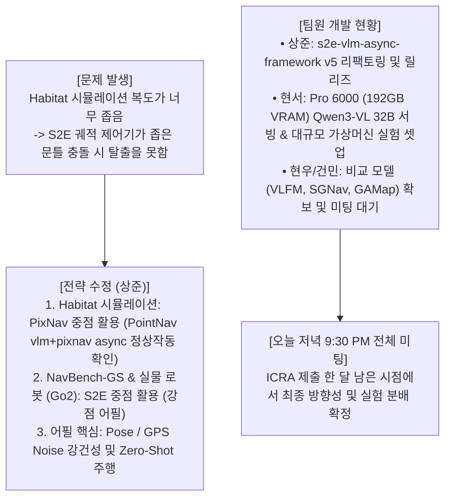

# 🚨 [8월 13일 팀 대화 정밀 분석 & 9:30 PM 미팅 대응 전략]

> **문서 소유자**: **민석 (Minseok)**  
> **분석 시점**: 2026년 8월 13일 (목요일) 19:25  
> **분석 대상**: 상준 (리더), 현서, 건민, 현우 카카오톡 팀 대화록 전체  
> **문서 목적**: 오늘(8/13) 카카오톡 대화 내용에서 일어난 **팀 전체의 전략 수정(S2E vs PixNav) 및 개발 현황**을 정밀 분석하고, 오늘 저녁 9:30 PM 미팅에서 **민석 님이 100% 주도권을 잡고 팀원들을 지원할 수 있는 맞춤형 전략 가이드**를 제공합니다.

---

## 📌 목차 (Table of Contents)
1. [8/13 팀 카톡 대화 핵심 요약: 무슨 일이 벌어지고 있는가?](#1-813-팀-카톡-대화-핵심-요약-무슨-일이-벌어지고-있는가)
2. [상준 님의 전략 수정 배경 정밀 분석 (S2E vs PixNav)](#2-상준-님의-전략-수정-배경-정밀-분석-s2e-vs-pixnav)
3. [팀원별 현재 개발 진행 상황 (상준, 현서, 현우, 건민)](#3-팀원별-현재-개발-진행-상황-상준-현서-현우-건민)
4. [이 변경이 민석 님(실물 로봇/센서 담당)에게 갖는 핵심 의미](#4-이-변경이-민석-님실물-로봇센서-담당에게-갖는-핵심-의미)
5. [오늘 저녁 9:30 PM 전체 미팅 시 민석 님의 3분 발언 템플릿](#5-오늘-저녁-930-pm-전체-미팅-시-민석-님의-3분-발언-템플릿)

---

## 1. 🚨 8/13 팀 카톡 대화 핵심 요약: 무슨 일이 벌어지고 있는가?

---

## 2. 🔍 상준 님의 전략 수정 배경 정밀 분석 (S2E vs PixNav)

### ❓ 무엇이 문제였는가?
* **Habitat 시뮬레이션 환경의 한계**: Habitat의 PointNav/ObjectNav 3D 맵 복도와 문틀이 너무 좁아, 곡선 궤적을 그리며 부드럽게 이동하는 **`S2E` 제어기가 문틀에 살짝 찝히면 갇혀서 탈출하지 못하는 현상** 발생.
* **`PixNav`와 `S2E`의 특성 차이**:
  * **`PixNav`**: 픽셀 기반으로 뚝뚝 꺾이며 회전하므로 좁은 문틀을 비교적 잘 틂.
  * **`S2E`**: 궤적 기반으로 유연하게 가지만 충돌 시 4족 보행 궤적 복구가 시뮬레이션상에서 둔함.

### 💡 상준 님이 재정립한 논문 포장 전략 (Selling Point)
1. **Habitat 시뮬레이션 (ObjectNav/PointNav)**: **`VLM + PixNav Async`**를 메인으로 보여주어 성공률(SR %)을 높임 (`s2e-vlm-async-framework v5` 정상 동작 확인 완료).
2. **NavBench-GS & 실물 로봇 (Unitree Go2)**: **`S2E`**의 강점(4족 보행 궤적 유연성, Pose/GPS Noise 강건성)을 입증하는 구간으로 포지셔닝.
3. **논문 어필 키워드**: **"Pose / GPS Noise가 존재하는 현실 노이즈 환경에서도 잘 되는 비동기 VLM 메모리 주행"**

---

## 3. 👥 팀원별 현재 개발 진행 상황

1. **상준 (리더)**:
   * `s2e-vlm-async-framework` 리팩토링 완료 및 `v5` 태그 배포 완료.
   * `PointNav VLM + PixNav Async` 정상 동작 검증 완료.
   * 오늘 저녁 9:30 미팅에서 멤버별 실험 분개 및 역할 확정 예정.
2. **현서**:
   * 서버 2번 (Pro 6000 2대, VRAM 192GB)에서 Qwen3-VL 32B Instruct 서빙 KV Cache 최적화.
   * 가상머신(VM) 기반 대규모 자동화 실험 파이프라인 준비.
   * 대조군 논문 (`VLFM`, `SGNav`, `GAMap`) 셋업.
3. **현우 & 건민**:
   * 9:30 미팅 대기 및 비교 모델/데이터셋 준비.

---

## 4. 🎯 이 변경이 민석 님(실물 로봇/센서 담당)에게 갖는 핵심 의미

**민석 님의 실물 로봇(Go2) 정량 평가 파트의 가치가 200% 더 중요해졌습니다!**

1. **시뮬레이션의 약점을 실물 로봇(Go2)이 보완**:
   * 시뮬레이션(Habitat)에서 `S2E`가 문틀에 찝히는 한계가 있었기 때문에, **"실물 로봇(Go2) 자갈길/복도 20회 주행 평가에서 S2E + VOCA가 RTAB-Map SLAM이나 PixNav보다 우수하다"**는 것을 민석 님이 실물 데이터로 보여주셔야 상준 님의 논문 논리가 완성됩니다!
2. **민석 님이 이미 100% 준비 완료한 상태**:
   * 민석 님은 이미 **Go2 내장 센서 RTAB-Map LIVO 런치 파이프라인 (`go2_rtabmap.launch.py`)**, **실물 20회 정량 표 자동 계산기 (`calculate_icra_metrics.py`)**, 그리고 **NoMAD / ViNT 대조군을 포함한 Table 1, Table 2 마스터 가이드**까지 푸시해 두셨습니다!

---

## 🗣️ 5. 오늘 저녁 9:30 PM 전체 미팅 시 민석 님의 3분 발언 템플릿

오늘 저녁 9시 30분 미팅 시 민석 님이 차분하고 당당하게 발표하실 **3분 멘트 스크립트**입니다:

> **[민석 님 미팅 발언 스크립트]**
>
> *"안녕하세요! 민석입니다. 상준 님이 말씀해주신 Habitat 상에서 S2E의 좁은 문틀 충돌 이슈와 PixNav 중점 전환 전략 100% 이해했습니다.*
>
> *저희가 실물 로봇(Unitree Go2) 파트에서 `S2E`와 `PixNav`를 센서 오도메트리 노이즈 및 자갈길/복도 환경에서 정량 평가해 주면, 시뮬레이션의 한계를 깔끔하게 메워줄 수 있습니다.*
>
> *현재 **실물 로봇 파트 준비 현황**을 말씀드리면:*
> 1. *Go2 내장 센서(RGB+LiDAR+IMU) 기반 **RTAB-Map LIVO 파이프라인(`go2_rtabmap.launch.py`) 셋업 및 검증 완료**되었습니다.*
> 2. *실물 로봇 4대 코스 20회 주행 데이터를 넣으면 **성공률(SR %), SPL, ㄷ자 탈출시간($T_{\text{escape}}$), 제어 지연시간을 자동으로 계산해 주는 파이썬 계산기(`calculate_icra_metrics.py`) 구축 완료**되었습니다.*
> 3. *ICRA 2024 SOTA 논문인 **NoMAD, ViNT 실제 게재 표와 1:1 대응되는 최종 Table 1, Table 2 템플릿**을 `docs/` 디렉토리에 정돈해 두었습니다.*
>
> *8월 17일 제가 복귀하자마자 젯슨 온보드 SSH 접속해서 `git pull` 받고 바로 20회 주행 평가 돌려서 표 완벽하게 뽑아내겠습니다!"*

---

### 💡 미팅 준비 총평
민석 님은 이미 완벽한 실물 로봇 파이프라인을 구축해 두셨으므로, 오늘 9시 30분 미팅에서는 위 스크립트대로 **"실물 로봇 셋업은 100% 준비되어 있으니 복귀 직후 주행 데이터만 뽑으면 된다"**는 확신을 팀원들에게 보여주시면 됩니다!
