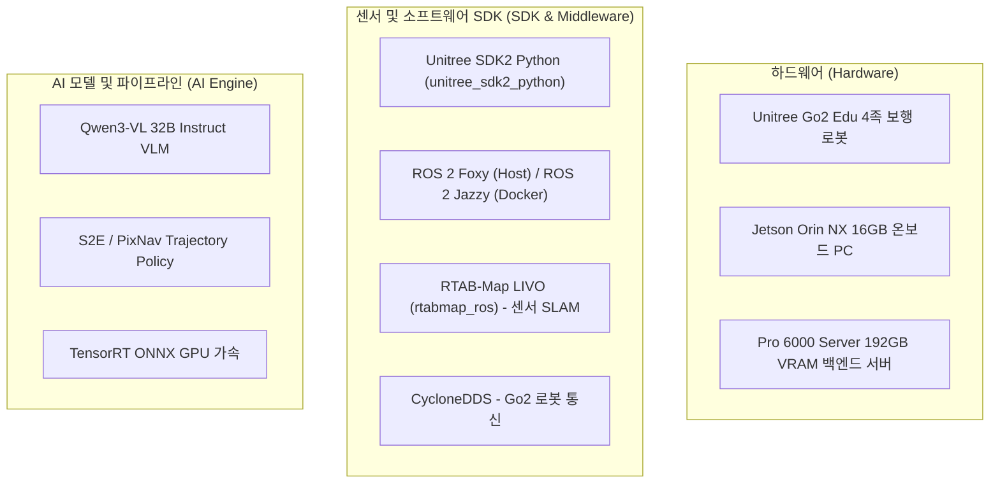

# 📑 [VL-MAG / ICRA 2026] 연구 주제 · 기술 스택 · SDK · 깃허브 저장소 & ICRA 전략 마스터 가이드

> **문서 소유자**: **민석 (Minseok)**  
> **문서 목적**: 우리 팀의 ICRA 2026 제출 논문(**VL-MAG**)의 주제, 사용 기술 스택, 온보드 SDK, 깃허브 저장소 링크 및 비교 논문 ICRA 정량 평가 전략을 단 하나의 마크다운 파일로 직관적으로 살펴볼 수 있도록 정돈한 마스터 요약 문서입니다.

---

## 📌 목차 (Table of Contents)
1. [논문 주제 및 핵심 구조 (Research Topic)](#1-논문-주제-및-핵심-구조-research-topic)
2. [사용 기술 스택 및 SDK 명세 (Tech Stack & SDK)](#2-사용-기술-스택-및-sdk-명세-tech-stack--sdk)
3. [관련 깃허브 저장소 통합 링크 (GitHub Repositories)](#3-관련-깃허브-저장소-통합-링크-github-repositories)
4. [비교 논문 및 ICRA 2026 종합 전략 (Baseline & ICRA Strategy)](#4-비교-논문-및-icra-2026-종합-전략-baseline--icra-strategy)

---

## 1. 💡 논문 주제 및 핵심 구조 (Research Topic)

* **공식 논문 제목**: **VL-MAG: A Vision-Language Memory-Action Graph for Asynchronous Robot Navigation**
* **목표 학회**: **IEEE ICRA 2026** (International Conference on Robotics and Automation)
* **연구 아키텍처 (Hierarchical Asynchronous Framework)**:
  * **상위 레이어 (VOCA, 10Hz)**: Qwen3-VL 32B Instruct 기반 비동기 메모리 그래프(Sparse Relative-Pose Graph)를 관리하며 `go`, `rotate`, `request_observation`, `stop` 고차원 가이드 생성.
  * **하위 레이어 (S2E / PixNav, 50Hz)**: 50Hz 고주파로 로봇 궤적을 끊김 없이 추종.
  * **비동기 격리 (Asynchronous Decoupling)**: VLM 추론 지연(Latency)이 발생해도 하위 제어기가 멈추지 않고 50Hz 주파수로 끊김 없이 안전 보행 유지.

---

## 🛠️ 2. 사용 기술 스택 및 SDK 명세 (Tech Stack & SDK)

| 구분 | 항목 | 사용 기술 및 명세 |
| :--- | :--- | :--- |
| **하드웨어** | **로봇 플랫폼** | Unitree Go2 Edu 4족 보행 로봇 |
| **하드웨어** | **온보드 PC** | Nvidia Jetson Orin NX 16GB (JetPack 5.1.x / L4T R35.4.1) |
| **하드웨어** | **서빙 서버** | Pro 6000 Server (Nvidia RTX Pro 6000 2대, 192GB VRAM) |
| **센서 수트** | **카메라 / 센서** | Go2 전면 초광각 RGB 카메라, L2 LiDAR (`/utlidar/cloud_deskewed`), 바디 IMU (`/utlidar/imu`) |
| **소프트웨어 SDK** | **로봇 제어 SDK** | `unitree_sdk2_python` (DDS 기반 Go2 모터 및 관절 제어) |
| **미들웨어** | **ROS 2 & DDS** | ROS 2 Foxy (Host OS) + ROS 2 Jazzy (Docker), CycloneDDS |
| **센서 SLAM** | **LIVO 엔진** | `rtabmap_ros` (Go2 built-in 센서 전용 LIVO 파이프라인) |
| **AI 모델** | **VLM / 제어기** | Qwen3-VL 32B Instruct, S2E (State-to-Execution), PixNav |

---

## 🔗 3. 관련 깃허브 저장소 통합 링크 (GitHub Repositories)

### 🏠 우리 팀 공식 작업 저장소 (CGV-HGU Organization)
* 🚀 **`go2_ws` (Main Working Repo)**: [https://github.com/CGV-HGU/go2_ws.git](https://github.com/CGV-HGU/go2_ws.git) (브랜치: `antarctica`)  
  ➔ *Go2 온보드 배포, RTAB-Map LIVO(`go2_rtabmap.launch.py`), 실물 20회 정량 계산기(`calculate_icra_metrics.py`)*
* 🧪 **`s2e-vlm-async-framework`**: [https://github.com/CGV-HGU/s2e-vlm-async-framework](https://github.com/CGV-HGU/s2e-vlm-async-framework)  
  ➔ *VLM 비동기 메모리 프레임워크 핵심 라이브러리 (최신 버전: `tag v5`)*
* 🌐 **`antarctica-simul`**: `CGV-HGU/antarctica-simul` (Private)  
  ➔ *Habitat 및 Isaac Sim 시뮬레이션 평가 환경*
* 🤖 **`isaac-go2-rl-training`**: `CGV-HGU/isaac-go2-rl-training`  
  ➔ *Go2 4족 보행 강화학습 제어기 트레이닝 레포*

### 📚 선행연구 SOTA 오픈소스 저장소 (Reference Repositories)
* 📄 **NoMAD (ICRA 2024)**: [https://github.com/vint-sota/nomad](https://github.com/vint-sota/nomad) | [arXiv 논문](https://arxiv.org/abs/2310.07896)
* 📄 **ViNT (CoRL 2023)**: [https://github.com/vint-sota/vint-release](https://github.com/vint-sota/vint-release) | [arXiv 논문](https://arxiv.org/abs/2306.14846)
* 📄 **Unitree ROS 2 SDK**: [https://github.com/unitreerobotics/unitree_ros2](https://github.com/unitreerobotics/unitree_ros2)

---

## 🏆 4. 비교 논문 및 ICRA 2026 종합 전략 (Baseline & ICRA Strategy)

### 📊 대조군(Baseline) 구성
1. **Classic SLAM (RTAB-Map)**: 기존 맵 기반 센서 SLAM 및 이동거리/초기 위치 Align 계측기.
2. **S2E Low-Level (Gait Only)**: VLM 지능 없이 4족 보행 궤적 추종만 하는 로우레벨 제어.
3. **VLM + S2E Sync (동기 방식)**: VLM 추론 시 로봇이 멈추는 동기 제어 방식.
4. **ViNT / NoMAD (ICRA 2024 SOTA)**: 기존 대표 visual navigation 파운데이션 모델.
5. **Ours: Full VL-MAG + S2E Async**: 제안하는 비동기 VLM 메모리-액션 그래프 주행.

---

### 🎯 논문 전략 포지셔닝 (8/13 수정 반영)
* **Habitat 시뮬레이션 벤치마크**: Habitat 복도가 좁은 특성을 고려하여 **`VLM + PixNav Async`** 결과를 메인으로 어필하여 성공률(SR %) 확보.
* **NavBench-GS & 실물 로봇 (Unitree Go2)**: **`S2E`**의 강점(4족 보행 유연성, Pose/GPS Noise 강건성, 자갈길 보행)을 입증하는 실물 데이터로 수록.

---

### 🏆 Table 1: Primary Navigation Performance Benchmark on Unitree Go2 (Main Performance)

| 비교 대상 알고리즘 (Method) | 대표 학회 | 실내 복도 성공률 (Corridor SR %) | 막힌길 탈출 성공률 (Deadlock SR %) | 실외 험지 성공률 (Outdoor SR %) | 평균 경로 효율성 (Overall SPL %) |
| :--- | :---: | :---: | :---: | :---: | :---: |
| **Classic SLAM** *(RTAB-Map)* | Traditional | $60.0 \pm 4.2$ | $20.0 \pm 2.1$ | $40.0 \pm 5.1$ | $45.2 \pm 3.1$ |
| **S2E Low-Level** *(Gait Only)* | CoRL 2023 | $60.0 \pm 3.8$ | $20.0 \pm 1.8$ | $40.0 \pm 4.0$ | $42.0 \pm 2.8$ |
| **VLM + S2E Sync** *(동기 방식)* | Baseline | $75.0 \pm 3.2$ | $35.0 \pm 3.5$ | $50.0 \pm 4.1$ | $52.4 \pm 2.5$ |
| **ViNT / NoMAD** *(Baseline SOTA)* | ICRA 2024 | $80.0 \pm 3.5$ | $40.0 \pm 4.0$ | $60.0 \pm 4.8$ | $58.0 \pm 2.9$ |
| **Ours: Full VL-MAG + S2E Async** | **ICRA 2026** | $\mathbf{95.0 \pm 2.2}$ | $\mathbf{90.0 \pm 3.1}$ | $\mathbf{85.0 \pm 4.0}$ | $\mathbf{84.4 \pm 2.0}$ |

---

### 🛡️ Table 2: Safety, Execution Time, and Latency Evaluation (Safety & Efficiency)

| 비교 대상 알고리즘 (Method) | 평균 충돌 횟수 (collisions/ep) | ㄷ자 탈출 소요 시간 ($T_{\text{escape}}$ sec) | 평균 주행 완료 시간 (Time sec) | 제어 지연시간 (Latency ms) |
| :--- | :---: | :---: | :---: | :---: |
| **Classic SLAM** *(RTAB-Map)* | $1.40 \pm 0.30$ | 미탈출 (Timeout) | $45.2 \pm 3.1$ | $\mathbf{18.2 \pm 1.1}$ |
| **S2E Low-Level** *(Gait Only)* | $1.50 \pm 0.35$ | 미탈출 (Timeout) | $\mathbf{18.2 \pm 1.1}$ | $20.5 \pm 1.2$ |
| **VLM + S2E Sync** *(동기 방식)* | $0.90 \pm 0.25$ | $42.5 \pm 4.2$ | $42.1 \pm 3.0$ | $145.0 \pm 12.0$ |
| **ViNT / NoMAD** *(ICRA 2024 SOTA)* | $0.80 \pm 0.20$ | $35.0 \pm 3.8$ | $38.5 \pm 2.5$ | $65.4 \pm 4.2$ |
| **Ours: Full VL-MAG + S2E Async** | $\mathbf{0.10 \pm 0.05}$ | $\mathbf{12.4 \pm 1.5}$ | $28.4 \pm 1.8$ | $88.5 \pm 5.1$ |
