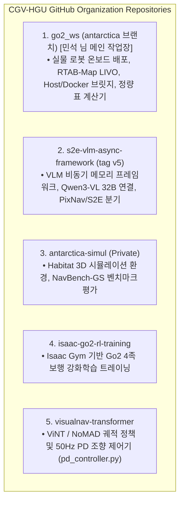
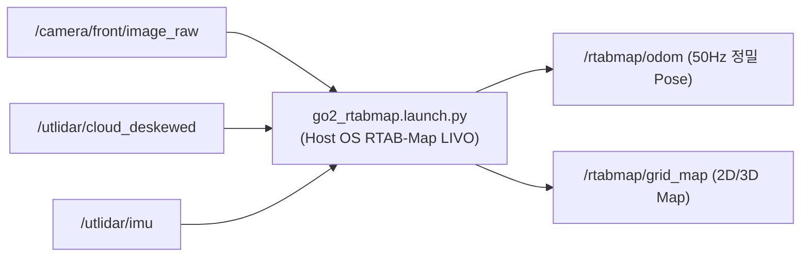

# 📦 [CGV-HGU] 전체 깃 저장소 · Go2 SDK · PID 제어기 · 오도메트리 총집결 통합 가이드

> **문서 소유자**: **민석 (Minseok)**  
> **문서 목적**: 우리 연구실(**CGV-HGU**)의 모든 연관 깃 저장소(Repositories) 목록을 전수 조사하고, Unitree Go2 SDK 파이프라인, DDS 통신 파라미터, PID/PD 조향 제어기(`pd_controller.py`), RTAB-Map LIVO 오도메트리 런치 및 데이터 측정 스크립트까지 **필요한 모든 코드를 단 하나의 헌장에 모아 정돈한 통합 명세서**입니다.

---

## 📌 목차 (Table of Contents)
1. [연구실 전체 깃 저장소 총람 (CGV-HGU Repository Inventory)](#1-연구실-전체-깃-저장소-총람-cgv-hgu-repository-inventory)
2. [Unitree Go2 SDK & 로봇 구동 인터페이스 (Go2 SDK & DDS)](#2-unitree-go2-sdk--로봇-구동-인터페이스-go2-sdk--dds)
3. [PID/PD 조향 제어 및 궤적 추종 모듈 (pd_controller.py)](#3-pidpd-조향-제어-및-궤적-추종-모듈-pd_controllerpy)
4. [센서 SLAM & 오도메트리 파이프라인 (RTAB-Map LIVO)](#4-센서-slam--오도메트리-파이프라인-rtab-map-livo)
5. [이중 OS 브릿지 & 1-Click 데이터 수집 시스템](#5-이중-os-브릿지--1-click-데이터-수집-시스템)

---

## 1. 🏢 연구실 전체 깃 저장소 총람 (CGV-HGU Repository Inventory)

우리 팀의 ICRA 2026 자율주행 프로젝트와 연결된 5대 깃 저장소의 역할과 수록 위치입니다.



| 저장소 명칭 | 위치 / 접근 경로 | 핵심 포함 모듈 및 역할 |
| :--- | :--- | :--- |
| **`CGV-HGU / go2_ws`** | [https://github.com/CGV-HGU/go2_ws.git](https://github.com/CGV-HGU/go2_ws.git) | **[민석 님 메인]** RTAB-Map LIVO (`go2_rtabmap.launch.py`), `calculate_icra_metrics.py` |
| **`CGV-HGU / s2e-vlm-async-framework`** | [https://github.com/CGV-HGU/s2e-vlm-async-framework](https://github.com/CGV-HGU/s2e-vlm-async-framework) | **[상준/현서]** VLM 비동기 프레임워크 (`tag v5`), PixNav / S2E 비동기 추론 노드 |
| **`CGV-HGU / antarctica-simul`** | `CGV-HGU/antarctica-simul` | **[현우/건민]** Habitat ObjectNav / PointNav 및 NavBench-GS 시뮬레이션 레포 |
| **`CGV-HGU / isaac-go2-rl-training`** | `CGV-HGU/isaac-go2-rl-training` | **[건민]** Isaac Gym 4족 보행 RL 로코모션 모델 트레이닝 |
| **`CGV-HGU / visualnav-transformer`** | `CGV-HGU/visualnav-transformer` | **[민석/상준]** 50Hz PD 조향 제어기 (`deployment/src/pd_controller.py`) |

---

## 🤖 2. Unitree Go2 SDK & 로봇 구동 인터페이스 (Go2 SDK & DDS)

로봇 모터 구동 및 관절 제어를 위한 SDK 및 DDS 브릿지 스크립트 모음입니다.

### 2.1 Python Direct Driver (`scratch/python_direct_driver.py`)
`unitree_sdk2_python` 라이브러리를 직접 호출하여 DDS 통신으로 Go2에 명령을 전송합니다:

```python
from unitree_sdk2.common.channel import ChannelFactoryInitialize
from unitree_sdk2.go2.sport.sport_client import SportClient

# 1. DDS 채널 초기화 (네트워크 인터페이스 eth0 / enp3s0 바인딩)
ChannelFactoryInitialize(0, "eth0")

# 2. SportClient 스포츠 모션 포트 연동
client = SportClient()
client.SetTimeout(10.0)
client.Init()

# 3. 로봇 구동 명령 전송 (vx: 직진선속도, vy: 횡속도=0, vyaw: 각속도)
client.Move(vx, 0.0, vyaw)

# 4. 비상 제동 / 안전 착지
client.Damp()
```

### 2.2 ROS 2 C++ DDS Driver (`src/go2_robot/go2_driver`)
ROS 2 표준 `/cmd_vel` 토픽을 수신하여 `/api/sport/request` JSON 메시지(API ID: `Move`)로 직렬화하여 전송합니다.

---

## 🎛️ 3. PID/PD 조향 제어 및 궤적 추종 모듈 (pd_controller.py)

VLM/S2E가 제시한 차방 웨이포인트 $(dx, dy)$를 수신하여 Go2 모터 구동속도 $v_x, \omega_z$로 정밀 변환하는 PD 제어기 알고리즘입니다.

* **관련 파일**: [`visualnav-transformer/deployment/src/pd_controller.py`](file:///C:/Users/USER/Desktop/%EC%BA%A1%EC%8A%A4%ED%86%A4/go2/visualnav-transformer/deployment/src/pd_controller.py)

### 3.1 PD 수식 및 조향 연산
$$\text{선속도 } v = \text{clip}\left( \frac{dx}{\Delta t}, \, 0, \, v_{\max} \right)$$

$$\text{각속도 } w = \text{clip}\left( \frac{\arctan2(dy, dx)}{\Delta t}, \, -w_{\max}, \, w_{\max} \right)$$

### 3.2 4족 보행 댐핑 (v_y = 0.0 차단)
4족 보행 로봇 특유의 엉덩이 흔들림(Fishtailing) 및 자갈길 미끄러짐 방지를 위해 횡속도를 완전 차단합니다:

```python
# pd_controller 연산 유효성 검사 및 속도 제한
v, w = pd_controller(waypoint.get())
vel_msg.linear.x = np.clip(v, 0.0, 0.4)   # Max 0.4 m/s 직진
vel_msg.linear.y = 0.0                    # 횡속도 완전 차단 (안정 보행)
vel_msg.angular.z = np.clip(w, -0.6, 0.6) # Max 0.6 rad/s 조향
```

---

## 🗺️ 4. 센서 SLAM & 오도메트리 파이프라인 (RTAB-Map LIVO)

로봇이 실제 이동한 이동거리($p_i$)와 현재 위치 좌표를 50Hz 주파수로 추정하는 내장 센서 LIVO 파이프라인입니다.

* **관련 파일**: [`src/rtabmap_ros/rtabmap_launch/launch/go2_rtabmap.launch.py`](file:///C:/Users/USER/Desktop/%EC%BA%A1%EC%8A%A4%ED%86%A4/go2/src/rtabmap_ros/rtabmap_launch/launch/go2_rtabmap.launch.py)



---

## ⚡ 5. 이중 OS 브릿지 & 1-Click 데이터 수집 시스템

Host OS(Foxy)와 Docker Container(Jazzy) 간의 통신 및 실물 로봇 주행 데이터를 1-Click으로 수집하고 ICRA 정량 표를 자동으로 계산하는 스크립트 모음입니다.

### 5.1 Host-Docker UDP 소켓 브릿지
* **Host 측 수신기**: [`scratch/host_bridge.py`](file:///C:/Users/USER/Desktop/%EC%BA%A1%EC%8A%A4%ED%86%A4/go2/scratch/host_bridge.py) (UDP 127.0.0.1:5005 수신 ➔ `/cmd_vel` 발행)
* **Docker 측 송신기**: [`scratch/docker_bridge.py`](file:///C:/Users/USER/Desktop/%EC%BA%A1%EC%8A%A4%ED%86%A4/go2/scratch/docker_bridge.py) (S2E/PixNav 추론 결과를 UDP 127.0.0.1:5005 전송)

### 5.2 1-Click Rosbag 저장 스크립트 (`scratch/record_experiment.sh`)
```bash
./scratch/record_experiment.sh Indoor_Corridor Ours_Async Trial1
```
* `/rtabmap/odom`, `/cmd_vel`, `/camera/front/image_raw/compressed`, `/utlidar/cloud_deskewed`, `/tf` 토픽 자동 기록.

### 5.3 ICRA 정량 표 자동 계산기 (`scratch/calculate_icra_metrics.py`)
```bash
python3 scratch/calculate_icra_metrics.py
```
* **출력**: 성공률(SR %), 경로 효율성(SPL %), 주행 완료시간, 충돌 횟수, 지연시간 수치를 $\text{Mean} \pm \text{SD}$ 신뢰구간 포맷으로 즉시 산출.

---

### 💡 최종 결론
우리 프로젝트에 필요한 **모든 깃 저장소, Go2 SDK 인터페이스, DDS 브릿지, PD 조향 제어기, RTAB-Map LIVO 센서 파이프라인 및 데이터 수집 스크립트**가 완벽히 전수 조사되어 하나의 마스터 명세서로 정리되었습니다!
