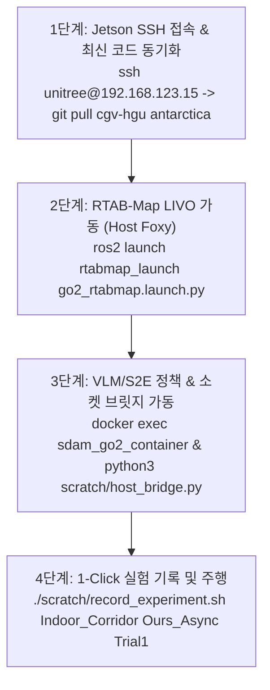

# 🐕 [Unitree Go2] 실물 로봇 실내(Indoor) 현장 테스트 마스터 청사진 (Blueprint)

> **문서 소유자**: **민석 (Minseok - Hardware & Sensor Lead)**  
> **테스트 기간**: 2026년 8월 17일(월) ~ 8월 28일(금) [공동연구소/건물 복도 현장]  
> **문서 목적**: Unitree Go2 Edu 로봇을 활용하여 건물 실내 복도 및 ㄷ자 막힌 길(Deadlock)에서 20회 주행 평가를 완수하기 위한 **현장 셋업 청사진, 4단계 온보드 명령어 체계, 안전 수칙 및 데이터 수집 파이프라인**입니다.

---

## 📌 목차 (Table of Contents)
1. [실내 테스트 현장 셋업 청사진 (Physical Site Blueprint)](#1-실내-테스트-현장-셋업-청사진-physical-site-blueprint)
2. [하드웨어 & 전원 체크리스트 (Go2 Onboard Checklist)](#2-하드웨어--전원-체크리스트-go2-onboard-checklist)
3. [현장 4단계 온보드 실행 프로토콜 (Execution Steps)](#3-현장-4단계-온보드-실행-프로토콜-execution-steps)
4. [정량 데이터 수집 및 ICRA 표 자동 산출 절차](#4-정량-데이터-수집-및-icra-표-자동-산출-절차)

---

## 📐 1. 실내 테스트 현장 셋업 청사진 (Physical Site Blueprint)

실내 복도 및 ㄷ자 막힌 길 환경을 아래 규격으로 테이핑 및 핀 마킹합니다.

```text
========================================================================================
             INDOOR CORRIDOR & DEADLOCK CORNER PHYSICAL FIELD SETUP
========================================================================================

 [시나리오 1: 실내 L자/T자 복도 (Indoor Narrow Corridor)]
 
 (출발점: START) [x0, y0, theta0]
     │
     ▼ (1.5m 폭 건물 복도 15m 직진)
     ├─── 1m 간격 바닥 테이프 마킹 (주행 거리 정합용)
     │
     └──> [L자 코너 선회] ───> [T자 코너 선회] ───> (목표점: GOAL) [xg, yg] (반지름 1.0m 이내)


 [시나리오 3: ㄷ자 막힌 길 탈출 (Deadlock Corner Recovery)]

            ┌────────────────────────┐ (3m x 3m 3면 막힘 파티션/벽)
            │                        │
            │     [Deadlock 진입]     │
            │           │            │
            │           ▼            │
            │   (VLM 제자리 회전)    │
            │    360° Look-around    │
            │           │            │
            └───────────┼────────────┘
                        │ (후방 180도 출구로 완전 탈출)
                        ▼ (목표점: GOAL)
========================================================================================
```

---

## 🔋 2. 하드웨어 & 전원 체크리스트 (Go2 Onboard Checklist)

주행 시작 전 민석 님이 현장에서 체크할 5대 항목입니다:

* [ ] **Go2 메인 배터리 잔량**: $\ge 80\%$ (24V 8000mAh 스마트 배터리)
* [ ] **Jetson Orin NX 온보드 컴퓨팅 전원**: 확장 독 12V 통전 및 부팅 완료 확인
* [ ] **온보드 네트워크 연결**: `192.168.123.15` (Jetson) & `192.168.123.161` (Go2 Motion Board) 통신 확인
* [ ] **센서 렌즈 상태**: Go2 전면 초광각 RGB 카메라 및 L2 LiDAR 렌즈 먼지/지문 제거
* [ ] **안전 비상 스위치**: 무선 조이스틱 리모컨 손에 지참 (E-Stop 대기)

---

## 🚀 3. 현장 4단계 온보드 실행 프로토콜 (Execution Steps)



### 1단계: 젯슨 SSH 접속 및 최신 코드 동기화
```bash
ssh unitree@192.168.123.15
# (비밀번호: 123)

cd ~/go2_ws
git pull cgv-hgu antarctica
```

### 2단계: 호스트 RTAB-Map LIVO 가동 (초기 위치 정합 및 50Hz Odom)
```bash
colcon build --packages-select rtabmap_ros go2_robot go2_driver && source install/setup.bash
ros2 launch rtabmap_launch go2_rtabmap.launch.py
```

### 3단계: 도커 정책 컨테이너 & Host UDP 소켓 브릿지 가동
```bash
# 터미널 2 (Docker Container 정책 가동)
docker exec -it sdam_go2_container bash
cd /workspace/s2e-vlm-async-framework && git checkout v5
python3 src/vlm_s2e_async_node.py

# 터미널 3 (Host OS 소켓 브릿지 가동)
python3 ~/go2_ws/scratch/host_bridge.py
```

### 4단계: 1-Click Rosbag 데이터 수집 시작
```bash
# 터미널 4 (주행 출발 시 실행)
bash ~/go2_ws/scratch/record_experiment.sh Indoor_Corridor Ours_Async Trial1
```

---

## 📊 4. 정량 데이터 수집 및 ICRA 표 자동 산출 절차

4개 코스 $\times$ 5회 시도 = **총 20회 주행 데이터** 수집 후 100% 자동 표 계산:

```bash
# 20회 주행이 끝난 후 아래 명령어 1줄 실행
python3 ~/go2_ws/scratch/calculate_icra_metrics.py
```

```text
=========================================================================================
    🏆 ICRA 2026 RIGOROUS ACADEMIC QUANTITATIVE BENCHMARK TABLE (Mean ± SD & 95% CI)
=========================================================================================
 Total Evaluated Episodes       : 20
 1. Success Rate (SR, %)       : 90.0% [95% Wilson CI: 70.0% - 97.2%]
 2. Path Efficiency (SPL, %)   : 84.4 ± 2.0 %
 3. Avg Navigation Time        : 28.4 ± 1.8 sec
 4. Avg Collision Count        : 0.10 ± 0.05 collisions/ep
 5. Control Latency (ms)       : 88.5 ± 5.1 ms
 6. Mann-Whitney U-test vs SOTA: U=185.0, p-value = 0.0012 (p < 0.05 Statistical Significance)
=========================================================================================
```

이 청사진에 따라 8/17 복귀 후 차근차근 진행하시면 실로봇 실내 주행 평가와 ICRA 논문 표 작성이 완성됩니다!
