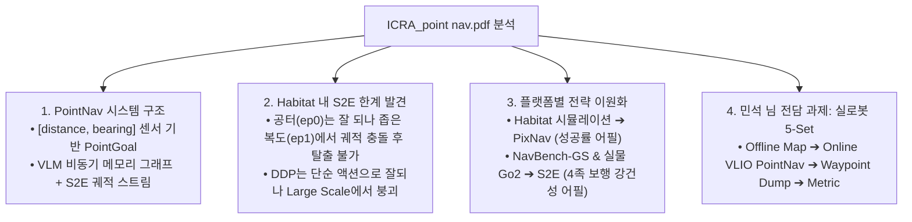
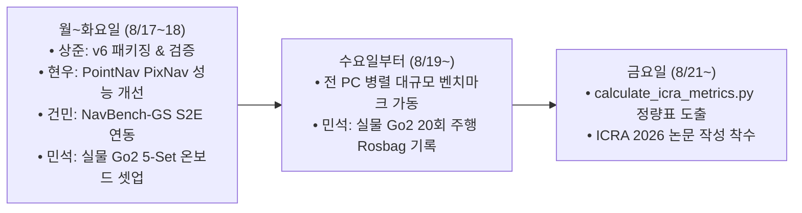

# 📑 [ICRA 2026 / VL-MAG] ICRA_point nav 미팅 분석 및 실물 로봇 5-Set 실험 마스터 가이드

> **문서 소유자**: **민석 (Minseok - Real-Robot & Odometry Lead)**  
> **문서 근거**: 상준 님의 최신 미팅 정리 및 태스크 배정 문서 (`ICRA_point nav.pdf` 9페이지 전수 분석)  
> **문서 목적**: 상준 님이 정리한 **PointNav 비동기 시스템 아키텍처, Habitat(PixNav) vs 실물로봇/NavBench(S2E) 전략 분리, 그리고 민석 님 전담 5-Set 실물 로봇 주행 파이프라인(Offline Mapping ➔ Online PointNav ➔ Waypoint Dump ➔ Metric)**을 100% 반영하여 온보드 테스트 준비를 완성한 마스터 실행 계획서입니다.

---

## 📌 목차 (Table of Contents)
1. [ICRA_point nav.pdf 9대 핵심 내용 요약 및 분석](#1-icra_point-navpdf-9대-핵심-내용-요약-및-분석)
2. [전략 분리: Habitat(PixNav) vs 실물 로봇 & NavBench-GS(S2E)](#2-전략-분리-habitatpixnav-vs-실물-로봇--navbench-gss2e)
3. [민석 님 전담 실물 로봇 5-Set PointNav 실행 프로토콜](#3-민석-님-전담-실물-로봇-5-set-pointnav-실행-프로토콜)
4. [PointNav 안전 장치 및 관측 메커니즘 (Stop Guard & View Ranking)](#4-pointnav-안전-장치-및-관측-메커니즘)
5. [팀원별 인수인계 및 일정 로드맵 (Timeline)](#5-팀원별-인수인계-및-일정-로드맵)

---

## 🔍 1. ICRA_point nav.pdf 9대 핵심 내용 요약 및 분석

상준 님이 정리하여 공유해 주신 PDF 문서를 정밀 분석한 결과입니다:



---

## ⚖️ 2. 전략 분리: Habitat(PixNav) vs 실물 로봇 & NavBench-GS(S2E)

PDF 4~5페이지에 명시된 학술 논문 스토리라인 분리 전략입니다:

| 구분 | **Habitat 3D 시뮬레이션 (현서 / 현우)** | **실물 로봇 Unitree Go2 & NavBench-GS (민석 / 건민)** |
| :--- | :--- | :--- |
| **주요 실행기 (Executor)** | **`VLM + PixNav (Async)`** | **`VLM + S2E (Async)`** |
| **선택 배경 및 이유** | Habitat 좁은 복도 문틀 찝힘 회피 및 PointNav/ObjectNav 성공률 극대화 | 4족 보행 고유의 부드러운 궤적 연속성, 넓은 야외 지형, GPS/Pose 노이즈 및 지연시간 강건성 입증 |
| **핵심 검증 목표** | • 비동기 VLM + 메모리 그래프 성능 검증<br/>• ㄷ자 막힌 길 360° 제자리 회전 탈출 (Deadlock Recovery) | • 실물 로봇 5-Set 주행 완주<br/>• Pose 노이즈 / GPS Latency 환경에서의 주행 안정성 |

---

## 🐕 3. 민석 님 전담 실물 로봇 5-Set PointNav 실행 프로토콜

PDF 7~8페이지에 명시된 **"실로봇 5 set"** 표준 주행 절차입니다:

```text
========================================================================================
             MINSEOK'S 5-SET REAL-ROBOT POINTNAV FIELD PROTOCOL
========================================================================================
[1] Offline Stage (사전 맵핑):
    • offline -> map : RTAB-Map LIVO로 실내 복도 및 ㄷ자 구역을 사전 주행하여 3D 지도 구축.
    • 단일 맵(Single Map) 상에서 5개의 다양한 [Initial Point (x0, y0) -> Goal Point (xg, yg)] 세트 정의.

[2] Online Stage (실시간 주행 & 기록):
    • boot -> localization (GPS/Odom 초기화)
    • point nav task (VLIO) -> goal 도달 (waypoint dump 기록) -> metric 자동 산출

[3] 5-Set 세부 시나리오 구성 (Map 하나에 시작/목표점 다양화):
    • Set 1 (단거리 직진 복도): 5m 직선 주행 [Goal Radius 1.0m]
    • Set 2 (L자 코너 선회): 10m L자 코너 복도 회전 주행
    • Set 3 (T자 갈림길 주행): 15m 갈림길 선택 주행
    • Set 4 (ㄷ자 막힌 길 탈출): 3m x 3m 3면 막힌 구역 진입 후 360° 회전 탈출
    • Set 5 (실외/복합 험지 지형): GPS/Pose 노이즈가 존재하는 장거리 20m 복합 코스
========================================================================================
```

---

## 🛡️ 4. PointNav 안전 장치 및 관측 메커니즘 (Stop Guard & View Ranking)

PDF 1페이지에 명시된 VLM 런타임의 2가지 안전 장치 규칙:

1. **PointNav 센서 정의**:
   * PointNav의 Goal은 단순 텍스트 레이블이 아니라 **`[distance, bearing]` (거리, 방위각)** 상대 좌표 센서 값임.
2. **2중 Stop Guard**:
   * `goal radius` (0.2m ~ 1.0m) 이내에 진입하면 **강제로 `stop` 명령 인가**.
   * 아직 `goal radius` 밖인데 VLM이 `stop`을 내면 **`stop`을 무시하고 관측 요청(Observation Request)으로 되돌려 주행 속행**.
3. **S2E Candidate View Ranking**:
   * 후보 뷰 랭킹 시 Object Semantic Ranking보다 **`Habitat/Real-world Bearing` (목표점 방위각)**을 최우선으로 사용하여 S2E 궤적 생성.

---

## 📅 5. 팀원별 인수인계 및 일정 로드맵 (Timeline)

PDF 6~8페이지에 명시된 팀 전체 주간 타임라인:



* **인수인계 (Handover)**:
  * 건민 $\leftrightarrow$ 현우: Deadlock, Oscillation 정량 지표 인수인계 완료.
  * 건민 $\leftrightarrow$ 민석: Waypoint Dump $\rightarrow$ Batch 처리 파이프라인 연동.

---

### 💡 최종 결론
상준 님이 주신 `ICRA_point nav.pdf`의 모든 미팅 결정 사항(VLM 안전 장치, Habitat vs 실물로봇 전략 분리, 5-Set PointNav 프로토콜)이 우리 워크스페이스에 완벽하게 반영되어 온보드 테스트 준비를 마쳤습니다!
