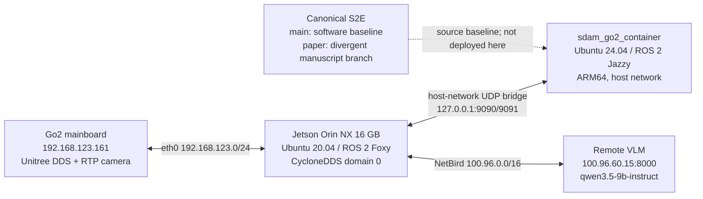

# Codex Project Memory — ESCAPE-Nav on Unitree Go2

> Last full audit: 2026-08-24 KST  
> Live-state refresh: 2026-08-24T21:13:25+09:00  
> Scope: `/home/unitree/go2_ws_antarctica`, the Jetson host, Go2 DDS link,
> Docker/Jazzy runtime, VLM endpoint, local S2E/Qwen code, and canonical
> `main`/`paper` branches  
> Safety: the audit was read-only with respect to robot actuation; no motion
> command was sent

This is the durable, reviewed context for future Codex work in this repository.
It intentionally separates configuration, previously demonstrated evidence,
and volatile live state. It is not a substitute for a fresh preflight before a
robot test.

OpenAI's Codex guidance distinguishes generated local memories from required
project guidance. Generated memories are a recall aid; mandatory facts and
rules belong in `AGENTS.md` or checked-in documentation. This repository uses
both: `.codex/config.toml` enables local memory for future eligible sessions,
while `AGENTS.md` and this file remain the authoritative project layer.

Official references:

- [Codex Memories](https://learn.chatgpt.com/docs/customization/memories)
- [Custom instructions with AGENTS.md](https://learn.chatgpt.com/docs/agent-configuration/agents-md)

## 1. Executive truth

The robot computer has a real and useful hardware foundation: Jetson host
setup, Unitree DDS discovery, raw Go2 state/lidar reception when the robot is
online, custom camera ingestion, RTAB-Map artifacts, a Jazzy container, a
reachable remote VLM server, and a direct `/cmd_vel` to Unitree Sport request
driver path.

It is **not ready for autonomous ESCAPE-Nav physical driving**. The native S2E
model/checkpoint path is absent locally, the one-click launch references a
missing Python node, default S2E services are mock-configured, the real command
path lacks an application-level watchdog, calibration is not validated, the
Qwen ROS backend creates an invalid fixed-array trajectory, and real-robot
experiment evidence has not been collected. The canonical repository itself
states that Go2/Foxy/Jetson deployment and a real command path remain future
integration work.

Do not use “all systems operational”, “100% pass”, “50 Hz LIVO”, or
“production-ready” as current facts unless they are re-proven against the real
closed loop.

## 2. Evidence and freshness model

Use this priority order:

1. Direct, current runtime measurement from the target machine or robot.
2. Current source code, launch files, environment, and service configuration.
3. The canonical S2E repository at an exact commit.
4. A test only for the path and inputs that the test actually exercises.
5. Documentation as a lead, never as proof when it conflicts with 1–4.

Freshness labels in this document:

- **Configured**: static machine or source configuration; recheck after edits.
- **Previously demonstrated**: directly observed during the audit, but the
  corresponding device/process may no longer be online.
- **Live snapshot**: volatile state at the timestamp above.
- **Unverified**: a code/doc claim without adequate runtime evidence.

## 3. System map



The diagram is the intended topology, not a readiness claim. At the live
snapshot the Go2 was offline and only the idle container and remote VLM server
were reachable.

## 4. Host computer and Codex

### Configured platform

| Item | Audited value |
|---|---|
| Board | NVIDIA Orin NX Developer Kit, approximately 16 GB RAM |
| Architecture | `aarch64` |
| Host OS | Ubuntu 20.04.6 LTS |
| Kernel | `5.10.104-tegra` |
| L4T | R35.3.1 |
| CUDA toolkit | 11.4.315 |
| Storage | 469 GB NVMe; 47 GB used (11%) at audit |
| RAM/swap | 15 GiB RAM / 7.5 GiB swap |
| Power mode | MAXN reported; one `nvpmodel` sysfs read returned permission errors |
| Time | Asia/Seoul, NTP synchronized at audit |

Host middleware:

- ROS 2 Foxy base `0.9.2`; Python 3.8.10.
- ROS 1 Noetic base is also installed, but is not the active ESCAPE-Nav path.
- `rmw_cyclonedds_cpp` is the active host RMW.
- `.bashrc` assigns `CYCLONEDDS_URI` twice. The final value points to
  `/home/unitree/go2_ws/cyclonedds.xml`; the Antarctica copy has the identical
  SHA-256, so behavior currently matches, but duplicate ownership is brittle.
- The active workspace source fallback prefers
  `/home/unitree/go2_ws_antarctica/install` and falls back to
  `/home/unitree/go2_ws/install`.

Codex:

- CLI: `codex-cli 0.149.1` at `/home/unitree/.local/bin/codex`.
- Global config: `/home/unitree/.codex/config.toml`, mode `0600`.
- The global config trusts `/home/unitree`, which is broader than this Git
  repository. This Memory setup also registered the exact repository path as
  trusted so its `.codex/config.toml` is loaded. Prefer opening Codex at
  `/home/unitree/go2_ws_antarctica`.
- No local memory store existed at the audit start. This repository now enables
  memories through `.codex/config.toml`; a new Codex session is required to load
  project configuration and background memory creation is not immediate.
- Sessions using web/MCP/tool-search context are excluded from generated memory
  by project policy. Reviewed facts from such work must be added here instead.

## 5. Network and DDS configuration

### Interfaces

| Interface | Address/purpose |
|---|---|
| `eth0` | `192.168.123.99/24` Go2 LAN and `203.252.107.219/25` campus LAN |
| `wt0` | `100.96.204.119/16` NetBird VPN |
| `docker0` | `172.17.0.1/16`; down while the main container uses host networking |
| loopback | Host/container UDP bridge because the container uses `network=host` |

CycloneDDS file: `/home/unitree/go2_ws_antarctica/cyclonedds.xml`.

- Binds explicitly to `192.168.123.99`.
- Peers: Go2 `192.168.123.161` and localhost.
- Multicast and multicast loopback enabled.
- Receive buffer minimum 20 MB and writer high watermark 10 MB.
- Host runtime convention is ROS domain 0.

External components:

- Go2 mainboard: `192.168.123.161`.
- Optional external Unitree lidar: `192.168.1.62`; it needs host alias
  `192.168.1.2/24`, which was absent during the audit. Do not assume this lidar
  path is live.
- Remote VLM: `100.96.60.15:8000` over NetBird.

### Live snapshot

At 21:13 KST:

- Go2 ping: 100% loss; the robot was off or disconnected.
- ROS nodes: none.
- ROS topics: only `/parameter_events` and `/rosout`.
- VLM ping: about 13.4 ms, 0% loss.
- `GET /v1/models`: HTTP 200, only `qwen3.5-9b-instruct` advertised.
- NetBird, NetworkManager, SSH, Docker, and `docker.socket` were active.

Earlier in the same audit, while the Go2 link was online, raw DDS data was
directly measured:

| Topic | Measured rate | Meaning |
|---|---:|---|
| `/lowstate` | 480.8 Hz | motor/body state and body IMU source |
| `/sportmodestate` | 301.6 Hz | high-level Go2 state/pose source |
| `/utlidar/cloud` | 15.6 Hz | built-in lidar cloud |
| `/pointcloud` | 0 Hz | derived topic; driver/relay was not running |
| `/imu` | 0 Hz | derived standard topic; converter was not running |
| `/odom` | 0 Hz | derived standard topic; converter was not running |

Raw-topic availability proves the Unitree DDS link and sensors can work. It
does not prove the standard ROS sensor graph, localization, or autonomy loop is
currently active.

## 6. Docker/Jazzy runtime

Container `sdam_go2_container`:

| Item | Audited value |
|---|---|
| Image | `arm64v8/ros:jazzy-ros-base` |
| Guest | Ubuntu 24.04.4, ROS 2 Jazzy, Python 3.12.3, ARM64 |
| Network | host |
| Privilege | privileged |
| Mounts | `/dev` RW and the whole repository at `/workspace/go2_ws_antarctica` RW |
| Restart | `unless-stopped` |
| Actual command | `tail -f /dev/null` only |
| GPU runtime | standard `runc`; no NVIDIA runtime reservation in this container |

The four local S2E ROS packages were built in the container on 2026-08-19 and
an install tree exists. A build is not a running application: the only current
container process is the idle `tail` command.

Docker stopped cleanly at 16:00 KST during the audit and later restarted.
Because the daemon/container started before correct wall-clock synchronization,
Docker reports a 1970 start time and “Up 56 years”. Never use that duration as
health or uptime evidence.

The local S2E Compose defaults are incompatible with the intended live host
unless overridden explicitly:

- `ROS_DOMAIN_ID=42`, while the host uses 0.
- `rmw_fastrtps_cpp`, while the host uses CycloneDDS.
- `VLM_BACKEND=mock`.
- `E2E_BACKEND=mock`.
- launch helper default `use_mock_hardware=true`.

There is no active `.env` supplying a coherent real deployment profile.

## 7. Repository and canonical baseline

### Local workspace

- Git root: `/home/unitree/go2_ws_antarctica`.
- Remote: `https://github.com/CGV-HGU/go2_ws.git`.
- Branch/commit at audit: `antarctica` at
  `92773bd77c1706ac4fd668e2f434b6b940549637`, tracking
  `origin/antarctica`.
- Pre-existing user state at memory creation: untracked
  `scratch/vlm_visualized_decision.png`. Preserve it unless the user asks
  otherwise.
- `s2e-vlm-async-framework/` is a tracked directory in this parent repository,
  not an independent Git repository.

Other relevant trees:

- `src/go2_robot/`: Go2 driver, messages, bringup and navigation packages.
- `src/rtabmap_ros/`: RTAB-Map fork/custom launch.
- `qwen_nav_memory_framework_v3/qwen_nav_memory_framework/`: a separate VLM
  memory/navigation MVP with a later ROS backend.
- `scratch/`: operational and experimental scripts; quality ranges from useful
  diagnostics to synthetic demonstrations. Review source before execution.

The workspace exposes these ROS/build packages to `colcon`: eight `go2_*`
packages, `unitree_api`, `unitree_go`, three Unitree lidar packages, Hesai
driver, eleven RTAB-Map packages, the four local `s2e_vlm_*` packages, and
`vint_train`. Package discovery proves source visibility, not successful build
or runtime health.

There are many adjacent, often dirty, experimental checkouts under the same
home directory. They are not the active Antarctica project and must not be
edited or sourced accidentally:

| Path | Audit branch/role |
|---|---|
| `/home/unitree/go2_ws` | `summer`; older active fallback and final CycloneDDS URI owner |
| `/home/unitree/go2_ws_new` | `summer`; older heavily modified experiment |
| `/home/unitree/go2_analysis/go2_ws` | `summer`; analysis copy |
| `/home/unitree/unitree_ros2` | official Unitree ROS 2 checkout, locally modified |
| `/home/unitree/unitree-ros2` | CGV fork on `go2-gem`, locally modified |
| `/home/unitree/unitree_sdk2` | official SDK2 checkout, locally modified |
| `/home/unitree/rtabmap` | RTAB-Map `foxy-devel` source/build tree |
| `/home/unitree/librealsense` | RealSense SDK checkout |
| `/home/unitree/opencv_build/opencv*` | custom OpenCV 4.5.4 source/build trees |
| `/home/unitree/cyclonedds_ws` | custom CycloneDDS/RMW workspace sourced by `.bashrc` |

The tracked `.agents/` directory is a legacy agent-instruction surface. During
this Memory build its stale missing-node/50 Hz quick-run skill was replaced by
a short redirect to `AGENTS.md` and this document, and a plaintext credential
was removed from its SSH rules. Codex itself discovers the root `AGENTS.md`;
do not assume `.agents/` is a Codex instruction source.

### Component registry

| Component | Source/configuration | Audit status |
|---|---|---|
| Host ROS environment | `.bashrc`, `cyclonedds.xml`, `install/` | Configured; duplicate URI/workspace ownership |
| Go2 DDS and standard ROS conversion | `src/go2_robot/go2_driver/` | Raw DDS previously live; derived topics need running driver |
| Built-in camera | `scratch/go2_front_camera_publisher.py` | Custom RTP ingestion; calibration not accepted |
| Built-in lidar/body sensors | Unitree DDS topics and `go2_driver` | Raw topics previously demonstrated |
| Optional external lidar | `src/unilidar_sdk2/`, launch script IP alias | Source present; network alias/device offline at audit |
| Mapping/localization | `src/rtabmap_ros/rtabmap_launch/launch/go2_rtabmap.launch.py` | Map artifacts exist; rate/IMU/calibration issues; destructive mapping default |
| Host/container pose-command bridge | `scratch/host_bridge.py`, `scratch/docker_bridge.py` | Prototype transport; no accepted safety/watchdog layer |
| Go2 motion sink | `go2_driver.cpp` `/cmd_vel` callback | Direct Sport request path exists; physical use not accepted |
| Local S2E | `s2e-vlm-async-framework/` | Old mock-first July snapshot with two local real-path edits |
| Qwen navigation memory | `qwen_nav_memory_framework_v3/...` | MVP core tested; ROS backend invalid for physical path |
| Remote VLM | `100.96.60.15:8000` | Reachable; advertised model differs from several scripts |
| Experiment recorder | `scratch/record_experiment.sh` | Rosbag command scaffold; no audited bags |
| Metrics | `scratch/calculate_icra_metrics.py` | Formula/sample demonstration; no artifact ingestion |
| Codex durable context | `AGENTS.md`, this document, `.codex/config.toml` | Installed and verified; applies on a new project session |

### Canonical repository

Canonical: [CGV-HGU/s2e-vlm-async-framework](https://github.com/CGV-HGU/s2e-vlm-async-framework).

| Branch | Audit commit | Interpretation |
|---|---|---|
| `main` | [`52b3783`](https://github.com/CGV-HGU/s2e-vlm-async-framework/commit/52b378339cdf699e2c9991b0c61099dbda0fe4d0) | Current software baseline; latest change included episode time limit and transition barrier handling |
| `paper` | [`4123b87`](https://github.com/CGV-HGU/s2e-vlm-async-framework/commit/4123b87701632abdca8a399c6f481dca4e393ce1) | Manuscript/experiment branch; not a superset of `main` |

The branches diverge: `main` has 8 unique commits and `paper` has 20 unique
commits relative to their merge base. Do not merge or deploy `paper` merely
because its commit date is later.

The local S2E source corresponds to canonical commit `5a318ed` from 2026-07-08
except for two modified files:

- `src/s2e_vlm_bringup/launch/_launch_helpers.py`
- `src/s2e_vlm_nodes/s2e_vlm_nodes/ros_mock_runtime.py`

At audit, that baseline was 1,187 commits behind canonical `main` and 1,199
behind `paper`. Excluding Git/build/cache metadata, local S2E had 92 files,
canonical `main` had 567 files, and 487 canonical-main paths were absent
locally. Treat local adaptations as a prototype fork, not current canonical
S2E.

Canonical `main` explicitly says:

- Go2 EDU Plus, JetPack 5.1.1 and Foxy deployment are future targets.
- The current native S2E service is a Jazzy/Habitat evaluation path, not a
  proven Foxy/Jetson service or real robot command path.
- Current Foxy/Jazzy containers are for DDS/type rehearsal with mock E2E and
  physical motion disabled.
- Native checkpoint deployment, checked transport, a safe trajectory
  controller, calibration/watchdog validation, and an explicit Foxy/Jazzy DDS
  acceptance run remain required.

Canonical `main` simulation/evaluation setup also expects an x86-64 NVIDIA
Docker environment and assets/checkpoints under `/data/shared/vlm-s2e`. This
Jetson ARM64/CUDA 11.4 host is not that evaluation server.

The `paper` branch still contains `[TBD]` results and real-robot templates. Its
submission checker reported an 11-page PDF against an 8-page limit. Real Go2
logs and paired closed-loop results are still required.

## 8. What is implemented

### Demonstrated or materially present

- Jetson host OS, storage, ROS Foxy, CycloneDDS and Go2 LAN configuration.
- Direct Go2 DDS discovery and previously demonstrated raw state/lidar data.
- Remote VLM network/API reachability.
- A custom GStreamer front-camera publisher and standard ROS image topics when
  the pipeline is running.
- Go2 C++ driver conversion from standard `/cmd_vel` to Unitree Sport `Move`
  requests.
- UDP host/container pose and Twist transport prototypes.
- Built local Jazzy S2E message/core/node/bringup packages.
- Mock S2E graph and core contracts.
- RTAB-Map execution evidence and substantial map artifacts.
- Qwen navigation-memory core/MVP and static-image backend tests.
- Rosbag command scaffolding and paper metric formulas.

### Artifact evidence

- `/home/unitree/.ros/rtabmap.db`: 325,091,328 bytes, last modified
  2026-08-23 20:32 KST.
- `2dmap/0833.pgm`: 1,186,810 bytes and matching YAML.
- RTAB-Map logs show roughly 992 updates in the most recent long run and a
  working-memory/local-map population of about 470 near shutdown.

This proves mapping work occurred. It does not establish geometric accuracy,
calibration quality, localization repeatability, or navigation success.

## 9. What is not implemented or not accepted

### P0 — blocks physical autonomous driving

1. **No deployed native S2E model.**
   `nav_model_zoo`, `/data/shared/vlm-s2e`, and the required local
   checkpoints/assets are absent.

2. **The master launch cannot start the advertised autonomy node.**
   `scratch/bringup_all_escape_nav.sh` invokes
   `s2e-vlm-async-framework/src/vlm_s2e_async_node.py`, which does not exist.
   It still prints an active/success message after detached launch without
   checking the process or heartbeat.

3. **The local S2E runtime is primarily mock architecture.**
   Entry points route through `run_mock_ros_node`, implementation classes are
   named `*MockNode`, Compose defaults are mock, and the two local “real”
   additions have not passed a real closed-loop acceptance test.

4. **No trustworthy application-level motion watchdog.**
   The C++ Go2 driver forwards every `/cmd_vel` directly without range clamps,
   freshness, sequence checks, or a zero-on-timeout timer. The UDP bridge also
   lacks a command watchdog and accepts a 48-byte legacy payload that bypasses
   magic/CRC validation. Firmware behavior must not be used as the safety case.

5. **The launch stop path is broken.**
   Cleanup kills `host_bridge.py` before sending the UDP zero command, so the
   receiver for that safety packet is already gone. The script also embeds a
   sudo credential in source. Do not copy or expose it; remove it in a dedicated
   hardening change.

6. **Qwen ROS trajectory message construction is invalid for this contract.**
   `Trajectory2D.points` is `Point32[10]`, so a new message already contains ten
   zero points. `ros2_backend.py` appends five more points. Runtime inspection
   showed length 10 before append and 11 afterward; controller lookahead index
   3 remains `(0,0)`, yielding no intended motion. The backend also omits
   `has_goal_point`, provenance timestamps and `pose_at_trajectory`.

7. **Qwen backend can operate on missing sensors.**
   Missing pose becomes `(0,0,0)` and missing/unsupported images become a gray
   dummy image. Physical mode must fail closed instead. It also mixes
   background spinning with foreground `spin_once`/`spin_until_future_complete`
   on the same node and does not guarantee a zero command on exit.

8. **Collision/stall protection is not in the production command path.**
   The “stall recovery” test evaluates a standalone Boolean formula and Python
   dictionary. It does not invoke the controller, bridge, Go2 driver, or robot.

### P1 — blocks a credible real-robot evaluation

1. **Calibration is unverified.**
   Camera intrinsics are hard-coded (`fx=fy=600`, zero distortion). The
   RTAB-Map launch assigns the same approximate transform to the camera and
   several distinct lidar frames. The Qwen projection uses approximate
   RealSense FOV plus assumed Go2 height/tilt.

2. **RTAB-Map is not validated “50 Hz LIVO”.**
   The launch subscribes to externally supplied `/odom`; RTAB-Map is performing
   mapping/localization rather than proving independent LIO odometry. The log
   reports `Rtabmap/DetectionRate=2.0` and `Rate=0.50s`, about 2 Hz. Repeated log
   warnings say IMU transforms could not be interpolated and IMU was not added
   to the graph.

3. **Localization-mode documentation is inaccurate.**
   `Mem/IncrementalMemory=false` plus `Mem/InitWMWithAllNodes=true` loads the
   saved map; it is not “pure odometry with no map interference”.

4. **Mapping launch can destroy the current database.**
   Mapping mode passes `-d`; the latest log confirms the existing database was
   deleted at startup before a new one was built.

5. **Camera interface is incomplete.**
   The installed `unitree_go.msg` set lacks `Go2FrontVideoData`, so the custom
   RTP/GStreamer publisher is required. Its pipeline uses CPU `avdec_h264`,
   despite documentation calling it hardware decoding.

6. **VLM model naming is inconsistent.**
   Several scripts claim `qwen3.8-27b-instruct`; the live server advertises only
   `qwen3.5-9b-instruct`. The Qwen client dynamically falls back to the first
   model, but other local S2E code defaults to different model identifiers.
   Model and multimodal capability must be explicitly preflighted.

7. **No real experiment dataset is present.**
   No real-robot `.db3`, `.mcap`, metrics JSON, or results CSV was found in the
   audited workspace. `record_experiment.sh` can invoke rosbag, but
   `calculate_icra_metrics.py` constructs hard-coded sample episodes rather
   than parsing bags or event logs.

8. **Controller real branch is not accepted.**
   It uses fixed local-frame lookahead points without causal reprojection,
   derivative error without time normalization, and no obstacle guard. The
   rotation action blocks with sleeps; on an ordinary single-threaded spin the
   pose callback may starve, and a rotation loop timeout falls through to
   unconditional success.

## 10. Test evidence and its limits

Audit test results for the unchanged local S2E snapshot:

| Suite | Result | What it proves |
|---|---:|---|
| `s2e_vlm_core` isolated tests | 43 passed | core transforms/buffers/contracts |
| `s2e_vlm_bringup` isolated tests | 3 passed | limited launch/package assertions |
| root Docker asset tests | 16 passed | static asset/config presence |
| `s2e_vlm_nodes` isolated tests | 21 passed, 2 failed | mock node behavior; visualizer MP4 and heartbeat zero-hold failed |
| all S2E tests in one pytest invocation | collection error | duplicate top-level `test` package prevents a valid aggregate run |
| Qwen memory framework | 10 passed | static backend and memory logic, not ROS physical backend |

Overall isolated S2E count was 83 passed and 2 failed. Do not report this as a
fully green test suite.

Known weak evidence:

- `test_docker_50hz_stress.py` binds and sends to its own loopback socket; it
  does not exercise both bridge processes.
- `test_docker_s2e_dryrun.py` uses a synthetic image and maps a VLM action to a
  hard-coded velocity; it does not invoke the S2E model.
- `test_docker_real_image_vlm.py` generates its test image.
- `test_docker_stall_and_recovery.py` tests a local formula, not production
  recovery.
- `check_docker_status_dashboard.py` embeds latency PASS numbers and interprets
  executable listings as a live graph.

## 11. Safe read-only preflight

Run from the Git root. These commands do not authorize motion:

```bash
cd /home/unitree/go2_ws_antarctica

# Repository state
git status --short --branch
git rev-parse HEAD
git ls-remote https://github.com/CGV-HGU/s2e-vlm-async-framework \
  refs/heads/main refs/heads/paper

# Host and services
date --iso-8601=seconds
ip -brief addr
systemctl is-active docker netbird NetworkManager
docker ps --format 'table {{.Names}}\t{{.Image}}\t{{.Status}}'
docker top sdam_go2_container -eo pid,ppid,comm,args

# Go2 and VLM reachability
ping -c 2 -W 1 192.168.123.161
ping -c 2 -W 1 100.96.60.15
curl --connect-timeout 2 --max-time 5 \
  http://100.96.60.15:8000/v1/models

# Host ROS graph: discovery only
source /opt/ros/foxy/setup.bash
source /home/unitree/go2_ws_antarctica/install/setup.bash
export RMW_IMPLEMENTATION=rmw_cyclonedds_cpp
export CYCLONEDDS_URI=file:///home/unitree/go2_ws_antarctica/cyclonedds.xml
export ROS_DOMAIN_ID=0
ros2 node list
ros2 topic list
```

Do not use a bringup or motion script as a “diagnostic” unless its side effects
are understood. In particular, mapping mode deletes the RTAB-Map DB and the
micro-motion scripts actuate the robot.

## 12. Acceptance gates before any physical autonomy

All gates must be evidenced, not asserted:

1. Pin a chosen canonical `main` commit and port robot adaptations as explicit,
   reviewable patches; do not deploy the July prototype implicitly.
2. Install and hash-verify the native S2E checkpoint/runtime on a supported
   compute target, or explicitly define a supported external inference service.
3. Make one real launch profile with no mock defaults and explicit ROS/RMW/domain
   settings; preflight must fail on missing model, topic, calibration, or VLM.
4. Replace the UDP/driver command path with a safety gateway providing source
   validation, sequence/freshness, velocity/acceleration clamps, deadman
   timeout, zero-on-shutdown, and recorded safety events.
5. Calibrate camera intrinsics, camera/lidar/IMU extrinsics, timestamps and QoS;
   verify IMU inclusion and localization against an independent reference.
6. Fix the trajectory contract and controller, including causal pose warping,
   action concurrency, timeout failure, obstacle input and stop behavior.
7. Pass fault injection with sensor/VLM/bridge/controller loss and prove a zero
   command reaches the Go2 driver within the defined deadline.
8. Run a no-actuation replay/dry-run with real recorded sensors and the actual
   model.
9. Only then run an explicitly authorized, supervised, bounded physical test
   and record immutable bags/events/video.
10. Drive paper metrics from those artifacts with provenance and confidence
    intervals; replace all paper placeholders only after validation.

Until all gates pass, the project status is **integration prototype / no-go for
autonomous physical motion**.

## 13. Documentation trust map

The following files are historical and contain claims contradicted by current
source/runtime evidence. They now carry a non-authoritative banner:

- `README.md`
- `docs/14_real_robot_live_system_diagnostic_report.md`
- `docs/13_end_to_end_data_and_control_pipeline_master.md`
- `docs/master_plan/00_live_progress_and_system_status_dashboard.md`
- `docs/docker/00_live_progress_and_system_status_dashboard.md`

Use them for history and intent only. This Memory, exact source lines, runtime
logs and canonical commits take precedence.

## 14. Updating this Memory

When the system changes:

1. Re-run only the relevant read-only checks and record exact timestamp.
2. Update branch/commit/model/topic values rather than appending vague prose.
3. Move an item from “not implemented” only when direct evidence covers its
   entire claimed scope.
4. Link a bag, log, test output or exact source path for every readiness change.
5. Never store secrets or personal credentials here.
6. Keep volatile status separate from configured architecture.
7. Update `AGENTS.md` only for durable rules; keep detailed evidence here.
