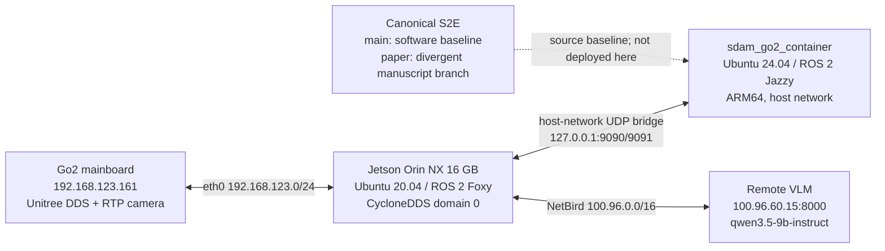

# Codex Project Memory — ESCAPE-Nav on Unitree Go2

> Last full audit: 2026-08-24 KST  
> Live-state refresh: 2026-08-24T21:13:25+09:00  
> Scope: `/home/unitree/go2_ws_antarctica`, the Jetson host, Go2 DDS link,
> Docker/Jazzy runtime, VLM endpoint, local S2E/Qwen code, and canonical
> `main`/`paper` branches  
> Safety: the audit was read-only with respect to robot actuation; no motion
> command was sent

This is the durable, reviewed context for future Codex work in this repository.
It intentionally separates configuration, previously demonstrated evidence,
and volatile live state. It is not a substitute for a fresh preflight before a
robot test.

OpenAI's Codex guidance distinguishes generated local memories from required
project guidance. Generated memories are a recall aid; mandatory facts and
rules belong in `AGENTS.md` or checked-in documentation. This repository uses
both: `.codex/config.toml` enables local memory for future eligible sessions,
while `AGENTS.md` and this file remain the authoritative project layer.

Official references:

- [Codex Memories](https://learn.chatgpt.com/docs/customization/memories)
- [Custom instructions with AGENTS.md](https://learn.chatgpt.com/docs/agent-configuration/agents-md)

## 1. Executive truth

The robot computer has a real and useful hardware foundation: Jetson host
setup, Unitree DDS discovery, raw Go2 state/lidar reception when the robot is
online, custom camera ingestion, RTAB-Map artifacts, a Jazzy container, a
reachable remote VLM server, and a direct `/cmd_vel` to Unitree Sport request
driver path.

It is **not ready for autonomous ESCAPE-Nav physical driving**. The native S2E
model/checkpoint path is absent locally, the one-click launch references a
missing Python node, default S2E services are mock-configured, the real command
path lacks an application-level watchdog, calibration is not validated, the
Qwen ROS backend creates an invalid fixed-array trajectory, and real-robot
experiment evidence has not been collected. The canonical repository itself
states that Go2/Foxy/Jetson deployment and a real command path remain future
integration work.

Do not use “all systems operational”, “100% pass”, “50 Hz LIVO”, or
“production-ready” as current facts unless they are re-proven against the real
closed loop.

## 2. Evidence and freshness model

Use this priority order:

1. Direct, current runtime measurement from the target machine or robot.
2. Current source code, launch files, environment, and service configuration.
3. The canonical S2E repository at an exact commit.
4. A test only for the path and inputs that the test actually exercises.
5. Documentation as a lead, never as proof when it conflicts with 1–4.

Freshness labels in this document:

- **Configured**: static machine or source configuration; recheck after edits.
- **Previously demonstrated**: directly observed during the audit, but the
  corresponding device/process may no longer be online.
- **Live snapshot**: volatile state at the timestamp above.
- **Unverified**: a code/doc claim without adequate runtime evidence.

## 3. System map



The diagram is the intended topology, not a readiness claim. At the live
snapshot the Go2 was offline and only the idle container and remote VLM server
were reachable.

## 4. Host computer and Codex

### Configured platform

| Item | Audited value |
|---|---|
| Board | NVIDIA Orin NX Developer Kit, approximately 16 GB RAM |
| Architecture | `aarch64` |
| Host OS | Ubuntu 20.04.6 LTS |
| Kernel | `5.10.104-tegra` |
| L4T | R35.3.1 |
| CUDA toolkit | 11.4.315 |
| Storage | 469 GB NVMe; 47 GB used (11%) at audit |
| RAM/swap | 15 GiB RAM / 7.5 GiB swap |
| Power mode | MAXN reported; one `nvpmodel` sysfs read returned permission errors |
| Time | Asia/Seoul, NTP synchronized at audit |

Host middleware:

- ROS 2 Foxy base `0.9.2`; Python 3.8.10.
- ROS 1 Noetic base is also installed, but is not the active ESCAPE-Nav path.
- `rmw_cyclonedds_cpp` is the active host RMW.
- `.bashrc` assigns `CYCLONEDDS_URI` twice. The final value points to
  `/home/unitree/go2_ws/cyclonedds.xml`; the Antarctica copy has the identical
  SHA-256, so behavior currently matches, but duplicate ownership is brittle.
- The active workspace source fallback prefers
  `/home/unitree/go2_ws_antarctica/install` and falls back to
  `/home/unitree/go2_ws/install`.

Codex:

- CLI: `codex-cli 0.149.1` at `/home/unitree/.local/bin/codex`.
- Global config: `/home/unitree/.codex/config.toml`, mode `0600`.
- The global config trusts `/home/unitree`, which is broader than this Git
  repository. This Memory setup also registered the exact repository path as
  trusted so its `.codex/config.toml` is loaded. Prefer opening Codex at
  `/home/unitree/go2_ws_antarctica`.
- No local memory store existed at the audit start. This repository now enables
  memories through `.codex/config.toml`; a new Codex session is required to load
  project configuration and background memory creation is not immediate.
- Sessions using web/MCP/tool-search context are excluded from generated memory
  by project policy. Reviewed facts from such work must be added here instead.

## 5. Network and DDS configuration

### Interfaces

| Interface | Address/purpose |
|---|---|
| `eth0` | `192.168.123.99/24` Go2 LAN and `203.252.107.219/25` campus LAN |
| `wt0` | `100.96.204.119/16` NetBird VPN |
| `docker0` | `172.17.0.1/16`; down while the main container uses host networking |
| loopback | Host/container UDP bridge because the container uses `network=host` |

CycloneDDS file: `/home/unitree/go2_ws_antarctica/cyclonedds.xml`.

- Binds explicitly to `192.168.123.99`.
- Peers: Go2 `192.168.123.161` and localhost.
- Multicast and multicast loopback enabled.
- Receive buffer minimum 20 MB and writer high watermark 10 MB.
- Host runtime convention is ROS domain 0.

External components:

- Go2 mainboard: `192.168.123.161`.
- Optional external Unitree lidar: `192.168.1.62`; it needs host alias
  `192.168.1.2/24`, which was absent during the audit. Do not assume this lidar
  path is live.
- Remote VLM: `100.96.60.15:8000` over NetBird.

### Live snapshot

At 21:13 KST:

- Go2 ping: 100% loss; the robot was off or disconnected.
- ROS nodes: none.
- ROS topics: only `/parameter_events` and `/rosout`.
- VLM ping: about 13.4 ms, 0% loss.
- `GET /v1/models`: HTTP 200, only `qwen3.5-9b-instruct` advertised.
- NetBird, NetworkManager, SSH, Docker, and `docker.socket` were active.

Earlier in the same audit, while the Go2 link was online, raw DDS data was
directly measured:

| Topic | Measured rate | Meaning |
|---|---:|---|
| `/lowstate` | 480.8 Hz | motor/body state and body IMU source |
| `/sportmodestate` | 301.6 Hz | high-level Go2 state/pose source |
| `/utlidar/cloud` | 15.6 Hz | built-in lidar cloud |
| `/pointcloud` | 0 Hz | derived topic; driver/relay was not running |
| `/imu` | 0 Hz | derived standard topic; converter was not running |
| `/odom` | 0 Hz | derived standard topic; converter was not running |

Raw-topic availability proves the Unitree DDS link and sensors can work. It
does not prove the standard ROS sensor graph, localization, or autonomy loop is
currently active.

## 6. Docker/Jazzy runtime

Container `sdam_go2_container`:

| Item | Audited value |
|---|---|
| Image | `arm64v8/ros:jazzy-ros-base` |
| Guest | Ubuntu 24.04.4, ROS 2 Jazzy, Python 3.12.3, ARM64 |
| Network | host |
| Privilege | privileged |
| Mounts | `/dev` RW and the whole repository at `/workspace/go2_ws_antarctica` RW |
| Restart | `unless-stopped` |
| Actual command | `tail -f /dev/null` only |
| GPU runtime | standard `runc`; no NVIDIA runtime reservation in this container |

The four local S2E ROS packages were built in the container on 2026-08-19 and
an install tree exists. A build is not a running application: the only current
container process is the idle `tail` command.

Docker stopped cleanly at 16:00 KST during the audit and later restarted.
Because the daemon/container started before correct wall-clock synchronization,
Docker reports a 1970 start time and “Up 56 years”. Never use that duration as
health or uptime evidence.

The local S2E Compose defaults are incompatible with the intended live host
unless overridden explicitly:

- `ROS_DOMAIN_ID=42`, while the host uses 0.
- `rmw_fastrtps_cpp`, while the host uses CycloneDDS.
- `VLM_BACKEND=mock`.
- `E2E_BACKEND=mock`.
- launch helper default `use_mock_hardware=true`.

There is no active `.env` supplying a coherent real deployment profile.

## 7. Repository and canonical baseline

### Local workspace

- Git root: `/home/unitree/go2_ws_antarctica`.
- Remote: `https://github.com/CGV-HGU/go2_ws.git`.
- Branch/commit at audit: `antarctica` at
  `92773bd77c1706ac4fd668e2f434b6b940549637`, tracking
  `origin/antarctica`.
- Pre-existing user state at memory creation: untracked
  `scratch/vlm_visualized_decision.png`. Preserve it unless the user asks
  otherwise.
- `s2e-vlm-async-framework/` is a tracked directory in this parent repository,
  not an independent Git repository.

Other relevant trees:

- `src/go2_robot/`: Go2 driver, messages, bringup and navigation packages.
- `src/rtabmap_ros/`: RTAB-Map fork/custom launch.
- `qwen_nav_memory_framework_v3/qwen_nav_memory_framework/`: a separate VLM
  memory/navigation MVP with a later ROS backend.
- `scratch/`: operational and experimental scripts; quality ranges from useful
  diagnostics to synthetic demonstrations. Review source before execution.

The workspace exposes these ROS/build packages to `colcon`: eight `go2_*`
packages, `unitree_api`, `unitree_go`, three Unitree lidar packages, Hesai
driver, eleven RTAB-Map packages, the four local `s2e_vlm_*` packages, and
`vint_train`. Package discovery proves source visibility, not successful build
or runtime health.

There are many adjacent, often dirty, experimental checkouts under the same
home directory. They are not the active Antarctica project and must not be
edited or sourced accidentally:

| Path | Audit branch/role |
|---|---|
| `/home/unitree/go2_ws` | `summer`; older active fallback and final CycloneDDS URI owner |
| `/home/unitree/go2_ws_new` | `summer`; older heavily modified experiment |
| `/home/unitree/go2_analysis/go2_ws` | `summer`; analysis copy |
| `/home/unitree/unitree_ros2` | official Unitree ROS 2 checkout, locally modified |
| `/home/unitree/unitree-ros2` | CGV fork on `go2-gem`, locally modified |
| `/home/unitree/unitree_sdk2` | official SDK2 checkout, locally modified |
| `/home/unitree/rtabmap` | RTAB-Map `foxy-devel` source/build tree |
| `/home/unitree/librealsense` | RealSense SDK checkout |
| `/home/unitree/opencv_build/opencv*` | custom OpenCV 4.5.4 source/build trees |
| `/home/unitree/cyclonedds_ws` | custom CycloneDDS/RMW workspace sourced by `.bashrc` |

The tracked `.agents/` directory is a legacy agent-instruction surface. During
this Memory build its stale missing-node/50 Hz quick-run skill was replaced by
a short redirect to `AGENTS.md` and this document, and a plaintext credential
was removed from its SSH rules. Codex itself discovers the root `AGENTS.md`;
do not assume `.agents/` is a Codex instruction source.

### Component registry

| Component | Source/configuration | Audit status |
|---|---|---|
| Host ROS environment | `.bashrc`, `cyclonedds.xml`, `install/` | Configured; duplicate URI/workspace ownership |
| Go2 DDS and standard ROS conversion | `src/go2_robot/go2_driver/` | Raw DDS previously live; derived topics need running driver |
| Built-in camera | `scratch/go2_front_camera_publisher.py` | Custom RTP ingestion; calibration not accepted |
| Built-in lidar/body sensors | Unitree DDS topics and `go2_driver` | Raw topics previously demonstrated |
| Optional external lidar | `src/unilidar_sdk2/`, launch script IP alias | Source present; network alias/device offline at audit |
| Mapping/localization | `src/rtabmap_ros/rtabmap_launch/launch/go2_rtabmap.launch.py` | Map artifacts exist; rate/IMU/calibration issues; destructive mapping default |
| Host/container pose-command bridge | `scratch/host_bridge.py`, `scratch/docker_bridge.py` | Prototype transport; no accepted safety/watchdog layer |
| Go2 motion sink | `go2_driver.cpp` `/cmd_vel` callback | Direct Sport request path exists; physical use not accepted |
| Local S2E | `s2e-vlm-async-framework/` | Old mock-first July snapshot with two local real-path edits |
| Qwen navigation memory | `qwen_nav_memory_framework_v3/...` | MVP core tested; ROS backend invalid for physical path |
| Remote VLM | `100.96.60.15:8000` | Reachable; advertised model differs from several scripts |
| Experiment recorder | `scratch/record_experiment.sh` | Rosbag command scaffold; no audited bags |
| Metrics | `scratch/calculate_icra_metrics.py` | Formula/sample demonstration; no artifact ingestion |
| Codex durable context | `AGENTS.md`, this document, `.codex/config.toml` | Installed and verified; applies on a new project session |

### Canonical repository

Canonical: [CGV-HGU/s2e-vlm-async-framework](https://github.com/CGV-HGU/s2e-vlm-async-framework).

| Branch | Audit commit | Interpretation |
|---|---|---|
| `main` | [`52b3783`](https://github.com/CGV-HGU/s2e-vlm-async-framework/commit/52b378339cdf699e2c9991b0c61099dbda0fe4d0) | Current software baseline; latest change included episode time limit and transition barrier handling |
| `paper` | [`4123b87`](https://github.com/CGV-HGU/s2e-vlm-async-framework/commit/4123b87701632abdca8a399c6f481dca4e393ce1) | Manuscript/experiment branch; not a superset of `main` |

The branches diverge: `main` has 8 unique commits and `paper` has 20 unique
commits relative to their merge base. Do not merge or deploy `paper` merely
because its commit date is later.

The local S2E source corresponds to canonical commit `5a318ed` from 2026-07-08
except for two modified files:

- `src/s2e_vlm_bringup/launch/_launch_helpers.py`
- `src/s2e_vlm_nodes/s2e_vlm_nodes/ros_mock_runtime.py`

At audit, that baseline was 1,187 commits behind canonical `main` and 1,199
behind `paper`. Excluding Git/build/cache metadata, local S2E had 92 files,
canonical `main` had 567 files, and 487 canonical-main paths were absent
locally. Treat local adaptations as a prototype fork, not current canonical
S2E.

Canonical `main` explicitly says:

- Go2 EDU Plus, JetPack 5.1.1 and Foxy deployment are future targets.
- The current native S2E service is a Jazzy/Habitat evaluation path, not a
  proven Foxy/Jetson service or real robot command path.
- Current Foxy/Jazzy containers are for DDS/type rehearsal with mock E2E and
  physical motion disabled.
- Native checkpoint deployment, checked transport, a safe trajectory
  controller, calibration/watchdog validation, and an explicit Foxy/Jazzy DDS
  acceptance run remain required.

Canonical `main` simulation/evaluation setup also expects an x86-64 NVIDIA
Docker environment and assets/checkpoints under `/data/shared/vlm-s2e`. This
Jetson ARM64/CUDA 11.4 host is not that evaluation server.

The `paper` branch still contains `[TBD]` results and real-robot templates. Its
submission checker reported an 11-page PDF against an 8-page limit. Real Go2
logs and paired closed-loop results are still required.

## 8. What is implemented

### Demonstrated or materially present

- Jetson host OS, storage, ROS Foxy, CycloneDDS and Go2 LAN configuration.
- Direct Go2 DDS discovery and previously demonstrated raw state/lidar data.
- Remote VLM network/API reachability.
- A custom GStreamer front-camera publisher and standard ROS image topics when
  the pipeline is running.
- Go2 C++ driver conversion from standard `/cmd_vel` to Unitree Sport `Move`
  requests.
- UDP host/container pose and Twist transport prototypes.
- Built local Jazzy S2E message/core/node/bringup packages.
- Mock S2E graph and core contracts.
- RTAB-Map execution evidence and substantial map artifacts.
- Qwen navigation-memory core/MVP and static-image backend tests.
- Rosbag command scaffolding and paper metric formulas.

### Artifact evidence

- `/home/unitree/.ros/rtabmap.db`: 325,091,328 bytes, last modified
  2026-08-23 20:32 KST.
- `2dmap/0833.pgm`: 1,186,810 bytes and matching YAML.
- RTAB-Map logs show roughly 992 updates in the most recent long run and a
  working-memory/local-map population of about 470 near shutdown.

This proves mapping work occurred. It does not establish geometric accuracy,
calibration quality, localization repeatability, or navigation success.

## 9. What is not implemented or not accepted

### P0 — blocks physical autonomous driving

1. **No deployed native S2E model.**
   `nav_model_zoo`, `/data/shared/vlm-s2e`, and the required local
   checkpoints/assets are absent.

2. **The master launch cannot start the advertised autonomy node.**
   `scratch/bringup_all_escape_nav.sh` invokes
   `s2e-vlm-async-framework/src/vlm_s2e_async_node.py`, which does not exist.
   It still prints an active/success message after detached launch without
   checking the process or heartbeat.

3. **The local S2E runtime is primarily mock architecture.**
   Entry points route through `run_mock_ros_node`, implementation classes are
   named `*MockNode`, Compose defaults are mock, and the two local “real”
   additions have not passed a real closed-loop acceptance test.

4. **No trustworthy application-level motion watchdog.**
   The C++ Go2 driver forwards every `/cmd_vel` directly without range clamps,
   freshness, sequence checks, or a zero-on-timeout timer. The UDP bridge also
   lacks a command watchdog and accepts a 48-byte legacy payload that bypasses
   magic/CRC validation. Firmware behavior must not be used as the safety case.

5. **The launch stop path is broken.**
   Cleanup kills `host_bridge.py` before sending the UDP zero command, so the
   receiver for that safety packet is already gone. The script also embeds a
   sudo credential in source. Do not copy or expose it; remove it in a dedicated
   hardening change.

6. **Qwen ROS trajectory message construction is invalid for this contract.**
   `Trajectory2D.points` is `Point32[10]`, so a new message already contains ten
   zero points. `ros2_backend.py` appends five more points. Runtime inspection
   showed length 10 before append and 11 afterward; controller lookahead index
   3 remains `(0,0)`, yielding no intended motion. The backend also omits
   `has_goal_point`, provenance timestamps and `pose_at_trajectory`.

7. **Qwen backend can operate on missing sensors.**
   Missing pose becomes `(0,0,0)` and missing/unsupported images become a gray
   dummy image. Physical mode must fail closed instead. It also mixes
   background spinning with foreground `spin_once`/`spin_until_future_complete`
   on the same node and does not guarantee a zero command on exit.

8. **Collision/stall protection is not in the production command path.**
   The “stall recovery” test evaluates a standalone Boolean formula and Python
   dictionary. It does not invoke the controller, bridge, Go2 driver, or robot.

### P1 — blocks a credible real-robot evaluation

1. **Calibration is unverified.**
   Camera intrinsics are hard-coded (`fx=fy=600`, zero distortion). The
   RTAB-Map launch assigns the same approximate transform to the camera and
   several distinct lidar frames. The Qwen projection uses approximate
   RealSense FOV plus assumed Go2 height/tilt.

2. **RTAB-Map is not validated “50 Hz LIVO”.**
   The launch subscribes to externally supplied `/odom`; RTAB-Map is performing
   mapping/localization rather than proving independent LIO odometry. The log
   reports `Rtabmap/DetectionRate=2.0` and `Rate=0.50s`, about 2 Hz. Repeated log
   warnings say IMU transforms could not be interpolated and IMU was not added
   to the graph.

3. **Localization-mode documentation is inaccurate.**
   `Mem/IncrementalMemory=false` plus `Mem/InitWMWithAllNodes=true` loads the
   saved map; it is not “pure odometry with no map interference”.

4. **Mapping launch can destroy the current database.**
   Mapping mode passes `-d`; the latest log confirms the existing database was
   deleted at startup before a new one was built.

5. **Camera interface is incomplete.**
   The installed `unitree_go.msg` set lacks `Go2FrontVideoData`, so the custom
   RTP/GStreamer publisher is required. Its pipeline uses CPU `avdec_h264`,
   despite documentation calling it hardware decoding.

6. **VLM model naming is inconsistent.**
   Several scripts claim `qwen3.8-27b-instruct`; the live server advertises only
   `qwen3.5-9b-instruct`. The Qwen client dynamically falls back to the first
   model, but other local S2E code defaults to different model identifiers.
   Model and multimodal capability must be explicitly preflighted.

7. **No real experiment dataset is present.**
   No real-robot `.db3`, `.mcap`, metrics JSON, or results CSV was found in the
   audited workspace. `record_experiment.sh` can invoke rosbag, but
   `calculate_icra_metrics.py` constructs hard-coded sample episodes rather
   than parsing bags or event logs.

8. **Controller real branch is not accepted.**
   It uses fixed local-frame lookahead points without causal reprojection,
   derivative error without time normalization, and no obstacle guard. The
   rotation action blocks with sleeps; on an ordinary single-threaded spin the
   pose callback may starve, and a rotation loop timeout falls through to
   unconditional success.

## 10. Test evidence and its limits

Audit test results for the unchanged local S2E snapshot:

| Suite | Result | What it proves |
|---|---:|---|
| `s2e_vlm_core` isolated tests | 43 passed | core transforms/buffers/contracts |
| `s2e_vlm_bringup` isolated tests | 3 passed | limited launch/package assertions |
| root Docker asset tests | 16 passed | static asset/config presence |
| `s2e_vlm_nodes` isolated tests | 21 passed, 2 failed | mock node behavior; visualizer MP4 and heartbeat zero-hold failed |
| all S2E tests in one pytest invocation | collection error | duplicate top-level `test` package prevents a valid aggregate run |
| Qwen memory framework | 10 passed | static backend and memory logic, not ROS physical backend |

Overall isolated S2E count was 83 passed and 2 failed. Do not report this as a
fully green test suite.

Known weak evidence:

- `test_docker_50hz_stress.py` binds and sends to its own loopback socket; it
  does not exercise both bridge processes.
- `test_docker_s2e_dryrun.py` uses a synthetic image and maps a VLM action to a
  hard-coded velocity; it does not invoke the S2E model.
- `test_docker_real_image_vlm.py` generates its test image.
- `test_docker_stall_and_recovery.py` tests a local formula, not production
  recovery.
- `check_docker_status_dashboard.py` embeds latency PASS numbers and interprets
  executable listings as a live graph.

## 10.1 Go2 RTAB-Map LIO mapping correction (2026-08-27 KST)

The configured mapping path is now explicitly:

```text
/utlidar/robot_odom + /utlidar/imu + /utlidar/cloud_deskewed
                    -> scratch/go2_livo_sensor_bridge.py
                    -> /livo/odom + /livo/imu + /livo/cloud(base_link)
                    -> RTAB-Map 3D ICP mapping
/camera/front/*     -> RTAB-Map RGB place recognition / loop candidates
```

This is Unitree LiDAR+IMU odometry (LIO) plus RGB place recognition. It is not
metric RTAB-Map visual odometry: the built-in front stream is monocular and no
calibrated depth/stereo input is available. `Reg/Strategy=1` therefore uses 3D
ICP for registration while RGB remains subscribed for appearance retrieval.

The retired bridge had relabeled `/utlidar/cloud_deskewed` from `odom` to
`radar` without transforming XYZ. The replacement applies one common
LiDAR-to-host clock offset, uses time-matched `/utlidar/robot_odom` to transform
deskewed points back to `base_link`, removes the 10,000 zero-padding records,
and contains no actuation publisher/subscriber. A stationary live sensor check
on 2026-08-27 measured approximately 148 Hz odom, 218 Hz IMU and 15 Hz cloud;
the output frame was `base_link`, zero points were absent, and the transformed
cloud min/max/centroid matched the simultaneous `/utlidar/cloud_base` values.
The built-in `/utlidar/imu` ROS fields currently contain a `w,x,y,z` source
array, unlike the external SDK's documented `x,y,z,w` order. The bridge compares
both interpretations against measured gravity once at startup and selected
`wxyz`; the corrected orientation/gravity residual was 0.48 degrees while the
unreordered quaternion was physically inconsistent. The built-in IMU's measured
acceleration is z-up, so no external-L2 mount rotation is applied to this topic.

RTAB-Map configuration changes are in
`src/rtabmap_ros/rtabmap_launch/launch/go2_rtabmap.launch.py`: unsupported 0.21.1
keys were removed, `Grid/NormalK` and `GridGlobal/FootprintRadius` are used,
`Icp/Force4DoF=true` and `Optimizer/GravitySigma=0.3` preserve a 3D trajectory
while constraining gravity, and `Mem/UseOdomGravity=false` selects the IMU.
All 38 RTAB-Map core keys in the launch file were found in the installed 0.21.1
parameter list. `unitree_lidar_ros2` and `rtabmap_launch` built successfully.

The two Unitree source references are `unitreerobotics/unitree_ros2` for Go2
built-in DDS topics and `unitreerobotics/unilidar_sdk2` for an independently
connected L2. The main mapping path uses only built-in DDS topics. The external
SDK launcher publishes `/external_l2/*` so it cannot collide with `/utlidar/*`;
its UDP defaults are LiDAR `192.168.1.62`, host `192.168.1.2`, ports 6101/6201.
The local aarch64 static library SHA-256 matched official SDK v2.0.10:
`4e334b67c1a92152c89363d8014a6e361d7bf590e58484d7d6ddc8541389de28`.

Mapping mode now skips Docker/command bridges and backs up
`/home/unitree/.ros/rtabmap.db` before the launch file invokes `-d`. Recorder
startup remains opt-in only through `--record`; it is not part of mapping mode.
The image/CameraInfo frame now uses ROS optical-axis convention, but camera
intrinsics (`fx=fy=600`, zero distortion) and camera/IMU extrinsic positions
are still estimates, not calibration evidence. The physical-autonomy no-go and
acceptance gate 5 therefore remain unchanged.

## 10.2 `rtabmap0827` loop-closure and graph-distortion diagnosis (2026-08-27 KST)

The 232.38-second `/home/unitree/.ros/rtabmap.db` run contained 402 sensor
nodes, 402 RGB images, 402 scans and 350,459 ORB features. RGB appearance
retrieval was active, but the graph had only 219 neighbor links and 395 gravity
links: global and local-space loop-closure links were both zero. Thirteen
visual hypotheses were rejected and no hypothesis was accepted. This run is
therefore not evidence that loop closure improved or degraded the map; no loop
closure was applied.

Raw Unitree LIO had a 0.772 m start/end gap and a 0.226 m z range. RTAB-Map's
optimized keyframes had a 2.289 m gap and a 1.434 m z range, with corrections
up to 2.097 m in XY and 16.23 degrees in yaw. The primary suspect is
`RGBD/NeighborLinkRefining=true`, which re-estimated every built-in Unitree LIO
neighbor link supplied as external odometry using sparse L2 point-to-plane ICP. The next controlled run
should change only that parameter to `false`. It is now `false` in the source
and rebuilt launch package. It was subsequently verified in the physical
`rtabmap0827_2` run summarized in section 10.3. Seven IMU interpolation warnings correspond
exactly to the seven nodes without gravity links and should be addressed
separately by delaying cloud publication until a covering IMU sample exists.

The complete evidence, hashes, issue table and staged loop test are in
`docs/troubleshooting/06_rtabmap_livo_2026-08-27_runtime_diagnosis_and_loop_closure_log.md`.
Headless mapping now starts `scratch/rtabmap_loop_logger.py` before RTAB-Map and
persists accepted global/proximity closures, rejected hypotheses, heartbeats
and the shutdown summary under `/home/unitree/.ros/rtabmap_loop_logs/`. The
logger subscribes only to `/info` and has no ROS publisher or actuation path.

## 10.3 `rtabmap0827_2` measured result (2026-08-27 KST)

The first run with `RGBD/NeighborLinkRefining=false` produced 563 nodes over
308.44 seconds and `/home/unitree/.ros/rtabmap0827_2.pgm`. The SQLite database
passed its integrity check. The graph had 414 neighbor links, five type-2
local-space proximity closures, 557 gravity links and no type-1 global visual
closure. RGB retrieval was active on 479 nodes and reached a maximum hypothesis
score of 0.844551, but 83 visual hypotheses were rejected by the LiDAR ICP
registration. The five accepted links were recent-node closures (287->276,
291->276, 292->275, 297->270 and 303->265), not a full-lap visual closure.

The new 2D projection is visually more continuous and contains 3,262 occupied
cells versus 2,296 in `rtabmap0827`; the run also had about 40 percent more
nodes, so this alone is not an accuracy proof. A critical remaining issue is
vertical graph deformation: raw Unitree LIO z varied only 0.0212 m, while
RTAB-Map's `MapToBase_z` statistics spanned 6.452 m and ended near -6.068 m.
This deformation began before the five proximity closures. For a flat,
single-floor navigation map, a controlled 3DoF graph run is the next candidate;
that configuration has not yet been applied.

The first dedicated text log under-counted rejected hypotheses because RTAB-Map
0.21.1 appended `/` to statistics keys. The JSONL retained the raw statistics,
so the result was recoverable. `scratch/rtabmap_loop_logger.py` now accepts both
key forms, distinguishes GUI/headless run labels and writes `SUMMARY` on
SIGINT/SIGTERM; the fixes passed synthetic event tests but need confirmation in
the next physical mapping run.

On 2026-08-28, with no explicit `230.0.0.0/8` route installed, current live
checks received `/utlidar/robot_odom`, `/utlidar/cloud_deskewed` and 1280x720
front-camera frames. CycloneDDS already pins `192.168.123.99/eth0` and the
GStreamer camera source now pins `multicast-iface=eth0`. Mapping bringup no
longer mutates kernel routes or requests sudo; it only verifies that the Go2
unicast path uses eth0 with source `192.168.123.99`.

## 10.4 Four-tier and ICRA 2027 evidence audit (2026-08-27 KST)

The current evidence-first entry points are:

- `docs/master_plan/[2026-08-27]_Robot_Jetson_Docker_Server_4Tier_실측감사_및_ICRA2027_실로봇_실험프로토콜.md`
  for the robot -> Jetson -> Docker -> server architecture, deployment gaps,
  safety gates and ICRA experiment protocol.
- `docs/master_plan/[2026-08-27]_RTAB-Map_LIVO_문제_원인_해결_및_재검증_총정리.md`
  for the RTAB-Map/LIO issue -> cause -> fix -> verification ledger.
- `2dmap/2026-08-27/MANIFEST.md` for the two maps, loop logs, hashes and the
  limits of the conclusions that can be drawn from them.

At audit time the local workspace commit was
`c977dee555ad396aab1483eecccd6631737abe8c`; the live remote `main` and `paper`
heads were respectively `fc336569a9a521ecd395925f41014bbcc9265c26` and
`f301e860fe70755036c39a0e58506100b3dd4be8`. These identifiers are provenance,
not an instruction to reset, merge or push the dirty workspace.

The four physical tiers are reachable, but the application chain is not an
autonomous navigation system yet. The Go2 exposes live L2 deskewed cloud, IMU
and LIO odometry over built-in DDS. The Jetson has adequate observed memory and
storage headroom. The Docker container is alive with host networking but its
PID 1 is only an idle keep-alive, its compose defaults select mock VLM/E2E
backends, and the expected S2E source node and ONNX checkpoint are absent. The
remote server advertises `qwen3.5-9b-instruct`. A 2026-08-27 16:46 KST
charging-window refresh verified host and container `GET /v1/models`, a
Docker-originated text `action=stop` JSON response, and one archived real Go2
RGB image request that identified an office chair while preserving `stop`.
This proves static image-payload acceptance, not live-camera navigation, the
full VL-MAG contract, S2E execution or safe actuation. The latest `paper`
branch describes the Go2/Foxy/Jetson path as a future integration target and
keeps physical actuation disabled.

For the paper's paired real-robot comparison, choosing five fixed start-goal
pairs gives `5 pairs x 2 methods x 5 repetitions = 50` main runs. Full-only
active-view and dynamic-obstacle demonstrations are kept separate so that they
do not contaminate the paired Direct-goal versus Full comparison. Every reported
metric must be reconstructed from immutable sensor, decision, command, safety
and independent-ground-truth artifacts; the existing sample metric script is
not sufficient evidence.

The 2026-08-27 map result supports one configuration improvement but not a 3D
accuracy claim: disabling neighbor-link refinement yielded a more continuous
2D projection and five accepted local-space proximity links, while no global
visual loop closure was accepted and the optimized graph still developed a
6.452 m vertical range. The next mapping experiment should therefore be a
single-variable planar-graph A/B run while retaining 3D LiDAR observations.
The default launch remains the 4DoF baseline. A dedicated
`map_headless.sh` now selects the three planar arguments and stores
the database, console, loop events, configuration snapshots and hashes under a
single run ID. It has passed static/build validation but has no physical result
yet.

Two attempted `run_map.sh` starts on 2026-08-28 produced zero `/info`
frames because the rtabmap child aborted with exit code -6 before mapping. The
new graph launch substitutions had been YAML-coerced into ROS booleans while
RTAB-Map declares these core parameters as strings. All three overrides now use
`ParameterValue(..., value_type=str)`, and static evaluation confirmed string
types for both 4DoF and planar profiles. The actual crash core ended in
`rclcpp::Node::declare_parameter<std::string>`; a corrected Foxy/CycloneDDS
probe with an isolated `/tmp` database reached SLAM/callback/subscription setup
and survived until its 12-second timeout. Bringup now also requires the actual
`/rtabmap` node to survive initialization before printing its LIVE banner. No
physical planar result has been collected after this correction yet.

The first planar wrapper attempt on 2026-08-28 (`20260828_113015_planar3dof_headless`)
also produced no physical result. Startup cleanup used broad
`pkill -9 -f rtabmap`, which matched the wrapper's `tee` because its evidence
path contained `~/.ros/rtabmap_runs`; the pipeline then exited with SIGPIPE
status 141 before any sensor or RTAB-Map node started. Cleanup now targets the
exact `rtabmap`/`rtabmap_viz` process names and the specific ROS launch command.
The wrapper archives a DB only after an `RTABMAP_STARTED` sentinel is written
by the verified `/rtabmap` startup gate, preventing an old DB from being
mislabelled as output from a failed run.

The physical-autonomy status remains **NO-GO** until the acceptance gates in
section 12 and the experiment-plan safety gates are satisfied.

## 11. Safe read-only preflight

Run from the Git root. These commands do not authorize motion:

```bash
cd /home/unitree/go2_ws_antarctica

# Repository state
git status --short --branch
git rev-parse HEAD
git ls-remote https://github.com/CGV-HGU/s2e-vlm-async-framework \
  refs/heads/main refs/heads/paper

# Host and services
date --iso-8601=seconds
ip -brief addr
systemctl is-active docker netbird NetworkManager
docker ps --format 'table {{.Names}}\t{{.Image}}\t{{.Status}}'
docker top sdam_go2_container -eo pid,ppid,comm,args

# Go2 and VLM reachability
ping -c 2 -W 1 192.168.123.161
ping -c 2 -W 1 100.96.60.15
curl --connect-timeout 2 --max-time 5 \
  http://100.96.60.15:8000/v1/models

# Host ROS graph: discovery only
source /opt/ros/foxy/setup.bash
source /home/unitree/go2_ws_antarctica/install/setup.bash
export RMW_IMPLEMENTATION=rmw_cyclonedds_cpp
export CYCLONEDDS_URI=file:///home/unitree/go2_ws_antarctica/cyclonedds.xml
export ROS_DOMAIN_ID=0
ros2 node list
ros2 topic list
```

Do not use a bringup or motion script as a “diagnostic” unless its side effects
are understood. In particular, mapping mode deletes the RTAB-Map DB and the
micro-motion scripts actuate the robot.

## 12. Acceptance gates before any physical autonomy

All gates must be evidenced, not asserted:

1. Pin a chosen canonical `main` commit and port robot adaptations as explicit,
   reviewable patches; do not deploy the July prototype implicitly.
2. Install and hash-verify the paper-selected frozen PixNav Checkpoint_A/runtime
   on a supported compute target. Treat S2E as a separate NavBench-GS auxiliary
   experiment, not the current real-robot backend.
3. Make one real launch profile with no mock defaults and explicit ROS/RMW/domain
   settings; preflight must fail on missing model, topic, calibration, or VLM.
4. Replace the UDP/driver command path with a safety gateway providing source
   validation, sequence/freshness, velocity/acceleration clamps, deadman
   timeout, zero-on-shutdown, and recorded safety events.
5. Calibrate camera intrinsics, camera/lidar/IMU extrinsics, timestamps and QoS;
   verify IMU inclusion and localization against an independent reference.
6. Fix the trajectory contract and controller, including causal pose warping,
   action concurrency, timeout failure, obstacle input and stop behavior.
7. Pass fault injection with sensor/VLM/bridge/controller loss and prove a zero
   command reaches the Go2 driver within the defined deadline.
8. Run a no-actuation replay/dry-run with real recorded sensors and the actual
   model.
9. Only then run an explicitly authorized, supervised, bounded physical test
   and record immutable bags/events/video.
10. Drive paper metrics from those artifacts with provenance and confidence
    intervals; replace all paper placeholders only after validation.

Until all gates pass, the project status is **integration prototype / no-go for
autonomous physical motion**.

## 13. Documentation trust map

The following files are historical and contain claims contradicted by current
source/runtime evidence. They now carry a non-authoritative banner:

- `README.md`
- `docs/14_real_robot_live_system_diagnostic_report.md`
- `docs/13_end_to_end_data_and_control_pipeline_master.md`
- `docs/master_plan/00_live_progress_and_system_status_dashboard.md`
- `docs/docker/00_live_progress_and_system_status_dashboard.md`

Use them for history and intent only. This Memory, exact source lines, runtime
logs and canonical commits take precedence.

## 14. Updating this Memory

When the system changes:

1. Re-run only the relevant read-only checks and record exact timestamp.
2. Update branch/commit/model/topic values rather than appending vague prose.
3. Move an item from “not implemented” only when direct evidence covers its
   entire claimed scope.
4. Link a bag, log, test output or exact source path for every readiness change.
5. Never store secrets or personal credentials here.
6. Keep volatile status separate from configured architecture.
7. Update `AGENTS.md` only for durable rules; keep detailed evidence here.

## 15. Canonical mapping entry points (2026-08-28)

User-facing RTAB-Map mapping entry points are now exactly:

- `./run_map.sh`: Jetson desktop GUI mapping; `--view [DB]` opens a saved DB.
- `./map_headless.sh`: SSH/tmux headless mapping with per-run evidence.

The redundant top-level/scratch mapping, GUI, screen-recording, viewer and
compatibility wrappers were removed. They remain recoverable from Git history.
Both canonical entries use the same flat-floor profile:

```text
Reg/Force3DoF=true
Icp/Force4DoF=false
RGBD/LoopClosureIdentityGuess=true
RGBD/NeighborLinkRefining=false
```

The 4D L2 3D cloud, Unitree LIO/IMU and RGB place retrieval remain enabled.
Mapping keeps recorder, Docker/VLM, the command bridge and motor output off.
Shutdown now gives RTAB-Map up to 15 seconds to close the DB before fallback
process cleanup.

RTAB-Map localization is a pose/map service, not a navigation controller.
The main Direct-goal PixNav versus Full ESCAPE-PixNav campaign uses the same
frozen PixNav backend and does not require Nav2. Nav2 is optional for a separately validated
classic baseline or waypoint demo; it must not be added to only one main method.

## 16. Planar global-loop qualification result (2026-08-28 12:46 KST)

Physical headless run `20260828_124601_planar3dof_headless` used the canonical
planar profile with `RGBD/LoopClosureIdentityGuess=true`. It recorded 249
nodes in a 73,879,552-byte DB. A read-only Python sqlite3 integrity check
returned `ok`; `rtabmap-export --scan --poses` re-optimized and exported 164
poses and 83,083 assembled scan points.

The run accepted two Type-1 global visual closures, `174→61` (score 0.1255)
and `211→1` (score 0.8717), plus eight proximity events in the logger. The DB
contains nine unique Type-2 links and two unique Type-1 links (each stored in
both directions). Six other visual hypotheses were rejected before graph
insertion by `RGBD/OptimizeMaxError`; this is correct protection, not six
accepted false loops. The two accepted Type-1 transforms had translation
norms 0.1885 m and 0.0300 m. The optimized trajectory was 41.039 m long,
spanned 13.796 m × 8.653 m in XY and 0.0235 m in Z, and ended 0.0335 m from
its start. A top-down assembled-cloud/trajectory inspection showed no graph
fold or discontinuous pose jump. Runtime counts for odometry loss, optimizer
failure and NaN were all zero. There were 118 `negative hessian index (-1)`
covariance warnings without an optimizer failure.

This is direct evidence that the built-in RGB place retrieval → identity
initial guess → 3D L2 ICP verification → planar graph optimization path can
produce a correct global closure. It is one qualification run, not the golden
map: perform two more independent short-loop runs and require correct Type-1
closure in at least two of the three total runs before the full-area map.

The archived manifest reports wrapper status 141 although the DB is valid.
Operator Ctrl+C interrupted both sides of the foreground output pipeline;
`tee` closed first and the inner cleanup then received SIGPIPE. The mapping
wrapper now uses `tee --ignore-interrupts`, normalizes an established
operator-stop status 130 to wrapper status 0, and falls back to Python's
standard sqlite3 module to write `database_integrity.txt` when the sqlite3 CLI
is absent. Confirm those three shutdown artifacts on the next short run.

RTAB-Map CLI utilities such as `rtabmap-export` may update SQLite bookkeeping
even when used for analysis. Never run them directly on a run artifact or a
frozen golden DB: copy the DB to a fresh `/tmp` path first. During this audit a
CLI analysis changed the archived DB hash; the archive was immediately restored
from `/home/unitree/.ros/rtabmap.db`, whose SHA-256 exactly matched the original
manifest value `29354bf3d8ff1f10e7098f8005efcda8c51e5287e22b255ef34d1604c6926ed9`.
The complete run `SHA256SUMS` check passed after restoration.

## 17. PixNav paper/runtime correction and fast-map diagnosis (2026-08-28)

The latest canonical `paper` branch commit inspected on 2026-08-28 is
`126f2f024c3cbbaa091734d0557e9d6f554adbde` (`updated paper`). Its real-robot
primary comparison uses the same frozen Pixel-Navigator backend for Direct-goal
and Full ESCAPE. S2E is a separate NavBench-GS auxiliary experiment and must not
be reported as the current Go2 policy backend. The paper pins
`reference/vlm-s2e-integration` at
`6341a5d33903131ddfce74498c04e1c0ae04ec61`.

Official Pixel-Navigator `Checkpoint_A` was downloaded to the ignored local-data
path `.local-data/vlm-s2e/checkpoints/pixelnav_A.ckpt`. Direct measurement:

```text
size=217967433 bytes
sha256=0b1faff7631962351bbbfe8cb115a3a03069f33fab499865f887ffbb5a3cabe3
```

The size and hash match the lab repository's `LOCAL_DATA.md`. The Jetson host
Python 3.8.10 has no `torch` or `torchvision`, so checkpoint inference is
currently `BLOCKED_RUNTIME`, not PASS. `pixnav_check.py` is the canonical
file-only qualification tool; it contains no ROS, socket, SDK or actuator
publisher. A PASS from it proves only checkpoint/runtime and recorded-RGB input
contract, not Go2 navigation.

The full-area run `20260828_133817_planar3dof_headless` is not a golden map.
It covered a 395.883 m raw path in 568.435 s (about 0.697 m/s), ended 10.961 m
from its raw start, accepted 32 unique proximity links but no global visual
link, and rejected 19 global candidates. Start-node candidates were retrieved
but failed the 0.15 ICP correspondence or 3.0 graph-error gates. Do not loosen
those gates to force a closure. Re-map the golden DB at an initial 0.2–0.3 m/s,
then qualify localization speed separately at increasing tiers.

An accepted RTAB-Map global or proximity closure adds a graph constraint and
re-optimizes the pose graph, distributing accumulated pose error and realigning
the attached 2D/3D observations. A retrieved or rejected candidate does not
perform that correction.

## 18. Full-map geometry failure and proximity-loop root cause (2026-08-28)

The physical environment for run `20260828_141247_planar3dof_headless` has two
90-degree corners. The exported all-loop trajectory instead folded and crossed,
so the previous golden-candidate conclusion is withdrawn. Database integrity
and low optimized constraint residuals proved only internal consistency, not
physical correctness.

On untouched-hash-preserving `/tmp` copies, removing Type-1 global links did
not remove the fold. Removing only Type-2 spatial proximity links restored a
raw-LIO-like orthogonal trajectory and the two physical corners. End gaps were
1.077 m with all loops, 1.240 m without Type-1, 0.986 m without Type-2, and
1.949 m without either Type-1/Type-2. This isolates the aggressive Type-2
configuration (`Angle=180`, unlimited graph depth, ten path neighbors) as the
main distortion source.

The canonical flat-floor profile now keeps RGB Type-1 retrieval and 3D L2 ICP
verification, but sets `RGBD/ProximityBySpace=false`. Its dormant proximity
values are restored to the installed RTAB-Map 0.21.1 defaults: angle 45,
maximum graph depth 50 and path max neighbors 0. Loop threshold, ICP ratio and
optimization error gate are deliberately unchanged for a one-variable causal
fix. The failed full DB remains analysis evidence and must not be used for
localization. Next run is a 1–2 minute, two-corner Type-2-OFF qualification;
only a pass authorizes one full remap.

## 19. PixNav v2 input correction and Jetson file-only adapter (2026-08-28 16:30 KST)

Section 17's `BLOCKED_RUNTIME` statement is superseded. A JetPack 5.1.1
isolated runtime now exists at `.local-data/pixnav_runtime/site-packages` with
NVIDIA PyTorch `2.0.0+nv23.05`; the official Checkpoint_A performed a real
CUDA forward on recorded Go2 RGB.

An input-contract error was discovered after the first three runs. The VLM
selected pixel `(640,600)` on `frame_10`, but the original tool used
`frame_00` as the goal image and frames 0–10 as history. Runs `152009`,
`152047`, and `152410` therefore prove checkpoint forward execution and
determinism only; they are withdrawn from capture-view acceptance. The fixed
`pixnav_check.py` schema v2 records `goal_frame`, `source_frames`, and
history-only `frames`, and rejects observations that predate goal capture.

Corrected evidence is:

```text
PixNav CUDA v2:
  ~/.ros/pixnav_runs/20260828_162002_pixnav_file_only/report.json
  goal=frame_10, history=[frame_10], latency=2.889 s, action=look_down
Macro audit:
  ~/.ros/pixnav_macro_runs/20260828_162023_pixnav_macro_file_only/
Offline VLM→PixNav→macro chain:
  ~/.ros/pixnav_chain_runs/20260828_162122_pixnav_offline_chain/
Pure/file-copy fault injection:
  ~/.ros/pixnav_fault_runs/20260828_163454_pixnav_fault_injection/ (22/22)
Jetson qualification manifest:
  ~/.ros/pixnav_qualification_runs/20260828_163514_pixnav_qualification/
```

The new pure-Python ament package `src/escape_nav_pixnav` implements:

- the pinned 6-way action contract;
- bounded file-only proposals (0.25 m forward and ±30 degree turns, with
  speed, acceleration, probability, age and timeout limits);
- fixed-camera `look_up/look_down` as reobserve plus zero hold;
- a mode-0600 hash-chained JSONL audit sink;
- offline causal artifact validation;
- an ordered live-event contract
  `frame_captured→vlm_submitted→vlm_completed→pixnav_completed→macro_audited`;
- stale, duplicate, out-of-order, disconnected and actuation-enabled rejection;
- a qualification manifest with source/config/checkpoint/evidence hashes.

All proposals and events keep `actuation_permitted=false`. The runtime modules
directly import no ROS, socket, Unitree SDK, geometry/navigation message or ROS
launch package. `colcon test` passed 56 tests with zero failures. This is not a
controller, live camera/history, localization, obstacle safety, E-stop, actual
watchdog stop-latency or robot-motion proof. Existing data has no frames after
`frame_10`, so multi-step PixNav history still requires newly recorded clips.
