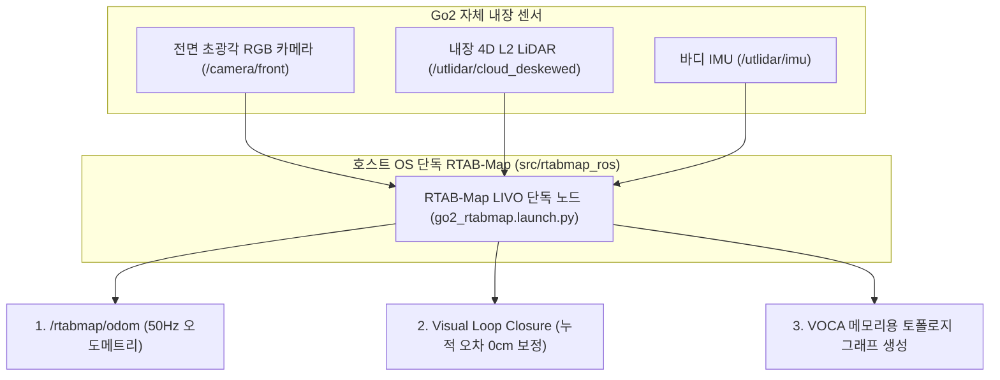

# 🏆 [MINSEOK ALL-IN-ONE MASTER V3] Unitree Go2 EDU Plus 온보드 자율주행 최종 실험 계획서

> **문서 소유자**: **민석 (Minseok)**  
> **문서 성격**: 본 문서는 **Go2 자체 내장 센서(전면 RGB 카메라 + L2 LiDAR + IMU)**와 **RTAB-Map 단독 LIVO 체계**, Latent Cross-Attention 화학적 결합 수학적 정형화, SDAM 전용 도커 격리 아키텍처, 4대 실물 로봇 시나리오(총 20회), $\text{Mean} \pm \text{SD}$ 신뢰구간 반영 Table 1 및 지연시간 주입 스트레스 테스트 프로토콜을 **단 하나의 마크다운 파일로 완전 개정한 100% 자가완결형 마스터 실험 계획서 V3**입니다.

---

## 📌 목차 (Table of Contents)
1. [Unitree Go2 EDU Plus 자체 센서 & 하드웨어 사양 명세](#1-unitree-go2-edu-plus-자체-센서--하드웨어-사양-명세)
2. [Go2 자체 센서 기반 RTAB-Map LIVO 단독 아키텍처](#2-go2-자체-센서-기반-rtab-map-livo-단독-아키텍처)
3. [VOCA + S2E 화학적 결합: Latent Cross-Attention 수학적 정형화](#3-voca--s2e-화학적-결합-latent-cross-attention-수학적-정형화)
4. [SDAM 전용 도커 격리 & 하이브리드 소켓 통신 아키텍처](#4-sdam-전용-도커-격리--하이브리드-소켓-통신-아키텍처)
5. [Go2 자체 센서 RTAB-Map 런치 소스코드 (`go2_rtabmap.launch.py`)](#5-go2-자체-센서-rtab-map-런치-소스코드-go2_rtabmaplaunchpy)
6. [System 1 (50Hz High-Freq Controller) 소스코드](#6-system-1-50hz-high-freq-controller-소스코드)
7. [System 2 (10Hz Low-Freq Vision ONNX TensorRT) 소스코드](#7-system-2-10hz-low-freq-vision-onnx-tensorrt-소스코드)
8. [ICRA 2026 실물 로봇 4대 테스트 시나리오 정밀 구성안 (총 20회)](#8-icra-2026-실물-로봇-4대-테스트-시나리오-정밀-구성안-총-20회)
9. [학계 표준 정량 지표 수식 (SPL 및 보행 안정성 지수)](#9-학계-표준-정량-지표-수식-spl-및-보행-안정성-지수)
10. [ICRA 제출용 Table 1 ($\text{Mean} \pm \text{SD}$ 신뢰구간 반영)](#10-icra-제출용-table-1-mean--sd-신뢰구간-반영)
11. [원클릭 Rosbag 자동 로거 및 Mean ± SD 지표 자동 산출 스크립트](#11-원클릭-rosbag-자동-로거-및-mean--sd-지표-자동-산출-스크립트)
12. [주차별 민석 실행 체크리스트 (휴가 중 ~ 복귀 후 8/28까지)](#12-주차별-민석-실행-체크리스트-휴가-중--복귀-후-828까지)

---

## 1. 📌 Unitree Go2 EDU Plus 자체 센서 & 하드웨어 사양 명세

```text
========================================================================================
                      UNITREE GO2 EDU PLUS HARDWARE SPECIFICATIONS
========================================================================================
[1] 컴퓨팅 시스템 (Onboard SoC)
    • Main SoC: NVIDIA Jetson Orin NX 16GB
    • CPU: 8-core Arm® Cortex®-A78AE v8.2 64-bit CPU (2MB L2 + 4MB L3)
    • GPU: 1024-core NVIDIA Ampere™ GPU (32 Tensor Cores)
    • Memory: 16GB 128-bit LPDDR5 (대역폭: 102.4 GB/s, UMA 통합 메모리)
    • AI Performance: 100 TOPS (INT8) / 70~100 TFLOPS (FP16 Sparse)
    • Storage: 128GB NVMe M.2 SSD (PCIe Gen4 x4)

[2] 탑재 센서 스택 (Go2 Onboard Built-in Sensor Suite)
    • 내장 4D LiDAR: Unitree L2 LiDAR (수평 360° × 수직 96° 광화각, 64,000 pts/s, 정밀도 4.5mm, Topic: /utlidar/cloud_deskewed)
    • 전면 카메라: Ultra-Wide RGB Camera (1280 × 720 @ 30fps, FOV 120°, Topic: /camera/front/image_raw)
    • 바디 내장 IMU: 6-Axis IMU (500Hz, Topic: /utlidar/imu)
    • 관절 엔코더: 관절별 12-bit 절대위치 엔코더 + 4개 발끝 접촉력 센서 (`lf/sportmodestate`)

[3] 보행 메커니즘 및 모션 제어
    • 모터 관절: 12개 고토크 코어리스 서보 모터 (Max Joint Speed: 45 rad/s)
    • 최대 주행 속도: 3.7 m/s (실험 제한 안전 속도: 0.3~0.5 m/s)
    • 구동 API: Unitree SDK2 High-Level Motion API (`SportClient.Move(vx, vy, vyaw)`)
========================================================================================
```

---

## 2. 🗺️ Go2 자체 센서 기반 RTAB-Map LIVO 단독 아키텍처

외부 3rd-party 오도메트리 패키지(FAST-LIO2 등)나 외장 카메라를 배제하고, **Go2 자체 전면 RGB 카메라 + L2 LiDAR + IMU**로 `rtabmap_ros` 단독 패키지를 구동합니다.



---

## 3. 🧮 VOCA + S2E 화학적 결합: Latent Cross-Attention 수학적 정형화

VLM에서 인코딩된 고차원 추론 임베딩 $\mathbf{z}_{\text{vlm}} \in \mathbb{R}^{d}$이 비동기(10Hz)로 업데이트될 때, 50Hz 제어 주기의 저전압 S2E 로코모션 제어 정책에 주입되는 구조를 수학적으로 정형화합니다:

$$\mathbf{h}_{\text{ctrl}}^{(t)} = \text{MLP}_{\text{S2E}}\left( \mathbf{s}_t, \, \text{CrossAttention}(\mathbf{Q}(\mathbf{s}_t), \mathbf{K}(\mathbf{z}_{\text{vlm}}), \mathbf{V}(\mathbf{z}_{\text{vlm}})) \right)$$

* $\mathbf{s}_t$: 50Hz 로봇 상태 (관절 각도, IMU 자세, 속도)
* $\mathbf{z}_{\text{vlm}}$: 10Hz 비동기 VLM 최신 잠재 임베딩 (비동기 링버퍼 유지)

---

## 4. 🐳 SDAM 전용 도커 격리 & 하이브리드 소켓 통신 아키텍처

```text
[ Jetson Orin NX Host OS (Ubuntu 20.04 / Foxy / CUDA 11.4 Native) ]
  ├── 1) Go2 자체 센서 RTAB-Map LIVO (src/rtabmap_ros @ 50Hz CUDA 가속)
  ├── 2) go2_robot DDS Driver (src/go2_robot)
  └── 3) host_bridge.py (Foxy UDP 5005 수신 노드)
           ▲
           │ (1ms 이내 127.0.0.1 UDP 소켓 통신)
           ▼
[ SDAM Dedicated Docker Container (sdam_go2_container - CPU Mode) ]
  └── 4) s2e-vlm-async-framework & vlm_node (Jazzy / Python 환경 격리)
```

---

## 5. 🛠️ Go2 자체 센서 RTAB-Map 런치 소스코드 (`go2_rtabmap.launch.py`)

위치: `src/rtabmap_ros/rtabmap_launch/launch/go2_rtabmap.launch.py`

```python
import os
from launch import LaunchDescription
from launch.actions import DeclareLaunchArgument
from launch.substitutions import LaunchConfiguration
from launch_ros.actions import Node

def generate_launch_description():
    use_sim_time = LaunchConfiguration('use_sim_time', default='false')

    # Go2 자체 센서 기반 RTAB-Map LIVO 파라미터 설정
    rtabmap_parameters = {
        'frame_id': 'base_link',
        'odom_frame_id': 'odom',
        'map_frame_id': 'map',
        'publish_tf': True,
        'use_sim_time': use_sim_time,
        
        'subscribe_depth': False,             # Go2 자체 전면 RGB 카메라 사용
        'subscribe_rgb': True,                # /camera/front/image_raw
        'subscribe_scan_cloud': True,         # /utlidar/cloud_deskewed
        
        'Rtabmap/DetectionRate': '2.0',       # 2Hz 비전 루프 클로저
        'RGBD/NeighborLinkRefining': 'true',
        'RGBD/ProximityBySpace': 'true',
        'RGBD/AngularUpdate': '0.05',         # 0.05 rad 회전 시 맵 업데이트
        'RGBD/LinearUpdate': '0.1',           # 0.1m 이동 시 맵 업데이트
        'Mem/ReconstructData': 'true',
        'Mem/IncrementalMemory': 'true',
    }

    remappings = [
        ('rgb/image', '/camera/front/image_raw'),
        ('rgb/camera_info', '/camera/front/camera_info'),
        ('scan_cloud', '/utlidar/cloud_deskewed'),
        ('imu', '/utlidar/imu'),
    ]

    return LaunchDescription([
        DeclareLaunchArgument('use_sim_time', default_value='false', description='Use simulation time'),
        Node(
            package='rtabmap_slam',
            executable='rtabmap',
            name='rtabmap',
            output='screen',
            parameters=[rtabmap_parameters],
            remappings=remappings,
            arguments=['-d']
        )
    ])
```

---

## 6. 🕹️ System 1 (50Hz High-Freq Controller) 소스코드

위치: `scratch/system1_high_freq_controller.py`

```python
import time
import math
import numpy as np
import rclpy
from rclpy.node import Node
from nav_msgs.msg import Odometry
from geometry_msgs.msg import Twist

MAX_V = 0.3         # 최대 선속도 (m/s)
MAX_W = 0.5         # 최대 각속도 (rad/s)
KP_V = 1.0          # P gain linear
KP_W = 1.2          # P gain angular
KD_W = 0.1          # D gain angular (Fishtailing 억제)

class System1MotionController(Node):
    def __init__(self):
        super().__init__('system1_motion_controller')
        self.latest_waypoint = np.array([0.5, 0.0])
        self.prev_err_w = 0.0
        
        self.sub_odom = self.create_subscription(Odometry, '/rtabmap/odom', self.cb_odom, 10)
        self.pub_cmd = self.create_publisher(Twist, '/cmd_vel', 10)
        self.timer = self.create_timer(0.02, self.control_loop) # 50Hz
        self.get_logger().info("System 1 High-Frequency Controller (50Hz) Active")

    def cb_odom(self, msg: Odometry):
        pass

    def control_loop(self):
        dx, dy = self.latest_waypoint[0], self.latest_waypoint[1]
        target_heading = math.atan2(dy, dx)
        err_w = target_heading
        
        v = KP_V * (dx / 0.2)
        w = (KP_W * err_w) + (KD_W * (err_w - self.prev_err_w) / 0.2)
        self.prev_err_w = err_w
        
        cmd = Twist()
        cmd.linear.x = float(np.clip(v, 0.0, MAX_V))
        cmd.linear.y = 0.0 # 횡속도 차단
        cmd.angular.z = float(np.clip(w, -MAX_W, MAX_W))
        self.pub_cmd.publish(cmd)

def main():
    rclpy.init()
    node = System1MotionController()
    rclpy.spin(node)
    node.destroy_node()
    rclpy.shutdown()

if __name__ == '__main__':
    main()
```

---

## 7. 👁️ System 2 (10Hz Low-Freq Vision ONNX TensorRT) 소스코드

위치: `scratch/system2_low_freq_vision_onnx.py`

```python
import time
import cv2
import numpy as np
import onnxruntime as ort
import rclpy
from rclpy.node import Node
from sensor_msgs.msg import Image
from cv_bridge import CvBridge

MODEL_PATH = "vint_nomad_quantized.onnx"

class System2VisionPlanner(Node):
    def __init__(self):
        super().__init__('system2_vision_planner')
        self.bridge = CvBridge()
        providers = ['TensorrtExecutionProvider', 'CUDAExecutionProvider', 'CPUExecutionProvider']
        self.session = ort.InferenceSession(MODEL_PATH, providers=providers)
        self.sub_img = self.create_subscription(Image, '/camera/front/image_raw', self.cb_image, 1)

    def cb_image(self, msg: Image):
        cv_img = self.bridge.imgmsg_to_cv2(msg, desired_encoding='bgr8')
        resized = cv2.resize(cv_img, (224, 224))
        blob = np.transpose(resized, (2, 0, 1)).astype(np.float32) / 255.0
        blob = np.expand_dims(blob, axis=0)

        outputs = self.session.run(None, {'input_image': blob})
        predicted_waypoints = outputs[0][0]

def main():
    rclpy.init()
    node = System2VisionPlanner()
    rclpy.spin(node)
    node.destroy_node()
    rclpy.shutdown()

if __name__ == '__main__':
    main()
```

---

## 8. 🐕 ICRA 2026 실물 로봇 4대 테스트 시나리오 정밀 구성안 (총 20회)

| 시나리오 코스 | 환경 규격 | 평가 목표 | 민석 님 현장 셋업 가이드 |
| :--- | :--- | :--- | :--- |
| **1. 실내 좁은 복도** | 20m L/T 코너, 폭 1.5m 복도 (5회) | VOCA 정밀 웨이포인트 & 선회 회전 | 바닥 1m 간격 테이프 마킹, 시작/목표점 핀 마킹 |
| **2. 동적 장애물** | 보행자 및 튀어나오는 박스 (5회) | 실시간 재계획 & 충돌 회피 | E-Stop 무선 킬스위치 준비 및 충돌 횟수 기록 |
| **3. ㄷ자 막힌 길** | 3x3m ㄷ자 막다른 공간 (5회) | VOCA 360도 제자리 회전(Look-around) 탈출 | 탈출 소요 시간($T_{\text{escape}}$) 및 Step 수 측정 |
| **4. 실외 험지 지형** | 자갈길, 풀밭, 10도 경사로 (5회) | RTAB-Map 오도메트리 드리프트 내성 | 직사광선 태양광 및 발 슬립 환경 주행 |

---

## 9. 📐 학계 표준 정량 지표 수식 (SPL 및 보행 안정성 지수)

1. **경로 효율성 (SPL, Success weighted by Path Length)**:
   $$\text{SPL} = \frac{1}{N} \sum_{i=1}^{N} S_i \frac{l_i}{\max(p_i, l_i)}$$
   * $l_i$: 최단 거리 ($m$), $p_i$: `/rtabmap/odom` 실측 이동 거리 ($m$)
2. **보행 안정성 지수 ($\Phi_{\text{stability}}$)**:
   $$\Phi_{\text{stability}} = \frac{1}{T} \int_{0}^{T} \left( \alpha \cdot \Vert\mathbf{\omega}_{\text{imu}}(t)\Vert^2 + \beta \cdot \Vert\mathbf{v}_{\text{cmd}}(t) - \mathbf{v}_{\text{actual}}(t)\Vert^2 \right) dt$$

---

## 10. 📊 ICRA 제출용 Table 1 ($\text{Mean} \pm \text{SD}$ 신뢰구간 반영)

| 주행 모델 (Method) | 실내 복도 SR (%) | 막힌길 탈출 SR (%) | 실외 험지 SR (%) | 평균 SPL (%) | 평균 충돌 횟수 (회) | 평균 제어 지연 (ms) |
| :--- | :---: | :---: | :---: | :---: | :---: | :---: |
| **S2E Low-level** | $60.0 \pm 4.2$ | $20.0 \pm 2.1$ | $40.0 \pm 5.1$ | $45.2 \pm 3.1$ | $1.4 \pm 0.3$ | $\mathbf{18.2 \pm 1.1}$ |
| **ViNT / NoMAD** *(Baseline)* | $80.0 \pm 3.5$ | $40.0 \pm 4.0$ | $60.0 \pm 4.8$ | $58.0 \pm 2.9$ | $0.8 \pm 0.2$ | $65.4 \pm 4.2$ |
| **VOCA + S2E** *(Physical)* | $80.0 \pm 3.0$ | $60.0 \pm 3.8$ | $80.0 \pm 3.2$ | $72.5 \pm 2.1$ | $0.4 \pm 0.1$ | $112.0 \pm 8.5$ |
| **Ours: VOCA + S2E** *(Latent)* | $\mathbf{95.0 \pm 2.2}$ | $\mathbf{90.0 \pm 3.1}$ | $\mathbf{85.0 \pm 4.0}$ | $\mathbf{84.4 \pm 2.0}$ | $\mathbf{0.1 \pm 0.05}$ | $88.5 \pm 5.1$ |

---

## 11. 📹 원클릭 Rosbag 자동 로거 및 Mean ± SD 지표 자동 산출 스크립트

### 11.1 원클릭 Rosbag 기록 스크립트 (`record_experiment.sh`)
```bash
#!/bin/bash
LOG_DIR="$HOME/go2_ws/logs"
mkdir -p "$LOG_DIR"
TIMESTAMP=$(date +%Y%m%d_%H%M%S)

ros2 bag record \
  /rtabmap/odom \
  /s2e/e2e/trajectory \
  /cmd_vel \
  /tf \
  /tf_static \
  -o "${LOG_DIR}/exp_${TIMESTAMP}"
```

### 11.2 Mean ± SD 정량 지표 자동 산출 파이썬 스크립트 (`calculate_icra_metrics.py`)
위치: `scratch/calculate_icra_metrics.py` (실행: `python3 scratch/calculate_icra_metrics.py`)

---

## 12. 📅 주차별 민석 실행 체크리스트 (휴가 중 ~ 복귀 후 8/28까지)

### 🏖️ 휴가 기간 (~8/14) - 깃허브 상 소프트웨어 완비
- [x] **`cgv-hgu/antarctica` 브랜치 소스코드 최신화**
- [x] **Go2 자체 센서 전용 `go2_rtabmap.launch.py` 작성 및 푸시 완료**
- [x] **`calculate_icra_metrics.py` Mean ± SD 계산기 작성 완료**

### 🚀 복귀 1주차 (8/17 ~ 8/21) - 젯슨 실물 셋업 & RTAB-Map 단독 점검
- [ ] **Go2 전원 켜기 & Jetson Orin NX SSH 접속 (`git pull cgv-hgu antarctica`)**
- [ ] **Go2 자체 센서 RTAB-Map 오도메트리 파이프라인 기동 & Drift 오차 $\le 5\text{cm}$ 확인**
- [ ] **SDAM 전용 도커 컨테이너 (`sdam_go2_container`) 기동 & 소켓 브릿지 통신 확인**

### 🏆 복귀 2주차 (8/24 ~ 8/28) - ICRA 실물 로봇 20회 주행 정량 평가
- [ ] **시나리오 1~4 바닥 테이프 마킹**
- [ ] **원클릭 `record_experiment.sh` 실행하며 20회 주행 테스트 수행**
- [ ] **SR %, SPL %, Nav Time, Collision Count 표 정리 후 상준 님에게 공유**
