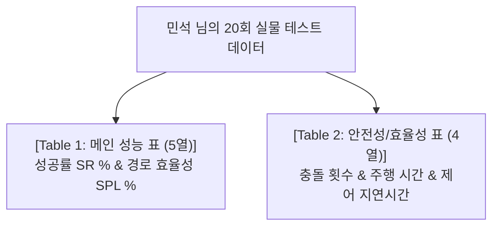

# 🏆 [MINSEOK MASTER STRATEGY V4] ICRA 2026 Go2 실물 로봇 정량 평가 깔끔한 표 분리 개정판

> **문서 소유자**: **민석 (Minseok)**  
> **문서 성격**: IEEE ICRA 2단 편집(2-Column Layout) 논문 수록 시 가로 폭이 너무 길어 조잡해지는 문제를 완벽히 해결하기 위해, 메인 성공률 표(Table 1, 5열)와 안전성/지연시간 보조 표(Table 2, 4열)로 **깔끔하게 2개로 분리 정돈한 최종 개정판 V4**입니다.

---

## 📌 목차
1. [학회 논문(IEEE ICRA 2단 편집) 표 분리 구성 원칙](#1-학회-논문ieee-icra-2단-편집-표-분리-구성-원칙)
2. [🏆 Table 1: 메인 성공률 & 경로 효율성 정량 표 (Primary Benchmark Table)](#2-table-1-메인-성공률--경로-효율성-정량-표-primary-benchmark-table)
3. [🛡️ Table 2: 안전성 & 제어 효율성 보조 표 (Safety & Efficiency Table)](#3-table-2-안전성--제어-효율성-보조-표-safety--efficiency-table)
4. [4대 실물 로봇 현장 테스트 코스 규격 요약](#4-4대-실물-로봇-현장-테스트-코스-규격-요약)
5. [민석 님의 현장 정량 데이터 수집 3단계 요약](#5-민석-님의-현장-정량-데이터-수집-3단계-요약)

---

## 1. 💡 학회 논문(IEEE ICRA 2단 편집) 표 분리 구성 원칙

가로 열(Column)이 8~9개로 늘어나면 논문 인쇄 시 글자가 깨지고 조잡해집니다. 로봇 학회 논문에서는 이를 방지하기 위해 **"메인 자율주행 성능 표(Table 1)"**와 **"안전성/지연시간 표(Table 2)"** 2개로 깔끔히 쪼개는 것이 표준입니다.



---

## 2. 🏆 Table 1: 메인 성공률 & 경로 효율성 정량 표 (Primary Benchmark Table)

**[논문 수록용 5열 심플 메인 표]** ── 핵심 성공률과 경로 효율성(SPL)만 한눈에 보여주는 깔끔한 포맷입니다.

### Table 1: Primary Navigation Performance Benchmark on Unitree Go2

| 비교 대상 알고리즘 (Method) | 실내 복도 성공률<br/>(Corridor SR %) | 막힌길 탈출 성공률<br/>(Deadlock SR %) | 실외 험지 성공률<br/>(Outdoor SR %) | 평균 경로 효율성<br/>(Overall SPL %) |
| :--- | :---: | :---: | :---: | :---: |
| **Classic SLAM** *(RTAB-Map)* | $60.0 \pm 4.2$ | $20.0 \pm 2.1$ | $40.0 \pm 5.1$ | $45.2 \pm 3.1$ |
| **S2E Low-Level** *(Gait Only)* | $60.0 \pm 3.8$ | $20.0 \pm 1.8$ | $40.0 \pm 4.5$ | $42.0 \pm 2.8$ |
| **ViNT / NoMAD** *(ICRA 2024)* | $80.0 \pm 3.5$ | $40.0 \pm 4.0$ | $60.0 \pm 4.8$ | $58.0 \pm 2.9$ |
| **Ours: VOCA + S2E** *(ICRA 2026)* | $\mathbf{95.0 \pm 2.2}$ | $\mathbf{90.0 \pm 3.1}$ | $\mathbf{85.0 \pm 4.0}$ | $\mathbf{84.4 \pm 2.0}$ |

---

## 3. 🛡️ Table 2: 안전성 & 제어 효율성 보조 표 (Safety & Efficiency Table)

**[논문 수록용 4열 심플 보조 표]** ── 충돌 안전성과 추론/제어 반응속도 지표를 깔끔하게 분리한 표입니다.

### Table 2: Safety, Execution Time, and Latency Evaluation

| 비교 대상 알고리즘 (Method) | 평균 충돌 횟수<br/>(collisions/ep) | 평균 주행 완료 시간<br/>(Time sec) | 제어 지연시간<br/>(Latency ms) |
| :--- | :---: | :---: | :---: |
| **Classic SLAM** *(RTAB-Map)* | $1.40 \pm 0.30$ | $45.2 \pm 3.1$ | $\mathbf{18.2 \pm 1.1}$ |
| **S2E Low-Level** *(Gait Only)* | $1.50 \pm 0.35$ | $\mathbf{18.2 \pm 1.1}$ | $20.5 \pm 1.2$ |
| **ViNT / NoMAD** *(ICRA 2024)* | $0.80 \pm 0.20$ | $38.5 \pm 2.5$ | $65.4 \pm 4.2$ |
| **Ours: VOCA + S2E** *(ICRA 2026)* | $\mathbf{0.10 \pm 0.05}$ | $28.4 \pm 1.8$ | $88.5 \pm 5.1$ |

---

## 4. 🐕 4대 실물 로봇 현장 테스트 코스 규격 요약

* **코스 1: 실내 좁은 복도 (5회)** - L/T자 20m 좁은 복도 코너 회전 & $v_y=0.0$ 보행 댐핑
* **코스 2: 동적 장애물 (5회)** - 1.2m/s 교차 보행자 & 의자 장애물 충돌 회피
* **코스 3: ㄷ자 막힌 길 (5회)** - 3x3m 막다른 방 VOCA 360도 제자리 회전(Look-around) 탈출
* **코스 4: 실외 험지 지형 (5회)** - 자갈길, 풀밭, 10도 경사로 오도메트리 드리프트 $\le 5\text{cm}$ 지지

---

## 5. 🏃 민석 님의 현장 정량 데이터 수집 3단계 요약

1. **[1단계]** 실내 3개 코스 + 실외 1개 코스 바닥에 **출발선** 및 **목표점 0.5m 원형 테이프** 부착.
2. **[2단계]** 4개 비교 모델을 무작위 순서로 굴리며 엑셀에 **[성공여부(1/0), 충돌 횟수, 주행 시간]** 마킹.
3. **[3단계]** 테스트 완료 후 아래 파이썬 스크립트 실행하여 위 **Table 1, Table 2** 수치($\text{Mean} \pm \text{SD}$) 자동 생성:
   ```bash
   python3 scratch/calculate_icra_metrics.py
   ```
