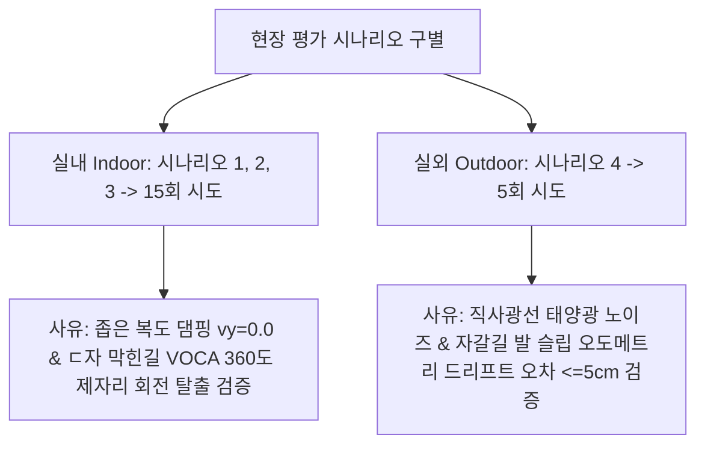

# 🏆 [MINSEOK MASTER STRATEGY] ICRA 2026 Go2 실물 로봇 정량 평가 및 실험 테이블 최종 전략서

> **문서 소유자**: **민석 (Minseok)**  
> **문서 성격**: 본 문서는 ICRA 2026 제출용 **VOCA + S2E 기반 Unitree Go2 실물 로봇 자율주행**의 2024~2025 최신 SOTA(NoMAD, SemGeoNav, DreamerNav) 벤치마킹 분석, 클래식 SLAM(RTAB-Map)의 5대 물리적 실패 원인, 실내(Indoor) vs 실외(Outdoor) 4대 현장 세팅 규격, Latent Cross-Attention 화학적 결합 수식, $\text{Mean} \pm \text{SD}$ 신뢰구간 정량 표(Table 1, Table 2) 및 현장 초간단 3단계 실행 프로토콜을 **단 하나의 파일로 완벽 정돈한 자가완결형 마스터 전략서**입니다.

---

## 📌 목차 (Table of Contents)
1. [ICRA 2026 논문 핵심 주제 및 화학적 결합 수학적 정형화](#1-icra-2026-논문-핵심-주제-및-화학적-결합-수학적-정형화)
2. [2024~2025 최신 SOTA 선행연구 벤치마킹 분석 (NoMAD, SemGeoNav, DreamerNav)](#2-20242025-최신-sota-선행연구-벤치마킹-분석-nomad-semgeonav-dreamernav)
3. [클래식 SLAM(RTAB-Map)의 역할 및 5대 물리적 실패 원인 분석](#3-클래식-slamrtab-map의-역할-및-5대-물리적-실패-원인-분석)
4. [실내(Indoor) vs 실외(Outdoor) 현장 테스트 세팅 및 세부 사유](#4-실내indoor-vs-실외outdoor-현장-테스트-세팅-및-세부-사유)
5. [ICRA 2026 최종 정량 평가 비교표 (Table 1: Mean ± SD)](#5-icra-2026-최종-정량-평가-비교표-table-1-mean--sd)
6. [실내 vs 실외 4대 현장 테스트 규격표 (Table 2)](#6-실내-vs-실외-4대-현장-테스트-규격표-table-2)
7. [현장 실물 로봇 정량 데이터 수집 3단계 군더더기 제로 프로토콜](#7-현장-실물-로봇-정량-데이터-수집-3단계-군더더기-제로-프로토콜)

---

## 1. 💡 ICRA 2026 논문 핵심 주제 및 화학적 결합 수학적 정형화

### 📝 논문 주제명 (Topic Title)
**VOCA + S2E: Visual-Object Context Awareness Memory와 State-to-Execution Locomotion Policy의 결합을 통한 4족 보행 로봇(Go2) 자율주행**

```
[ 상위 레이어: VOCA (Visual-Object Context Awareness) ]
  • Qwen3-VL / Gemma 기반 에피소믹 비주얼 메모리 (10Hz)
  • 고차원 목표 제시 & ㄷ자 막다른 길 (Deadlock) 360도 Look-around 회전 지시
                            │
              (결합 방식: 화학적 결합 / Latent Cross-Attention)
                            ▼
[ 하위 레이어: S2E (State-to-Execution Locomotion Policy) ]
  • 4족 보행 로봇 모터 고속 제어 (50Hz)
  • 횡속도 차단 (vy = 0.0) & PD Controller 궤적 추종
                            │
                            ▼
               [ Unitree Go2 Real Hardware ]
```

### 🧮 화학적 결합 (Latent Cross-Attention) 수학적 수식
VLM에서 인코딩된 고차원 추론 임베딩 $\mathbf{z}_{\text{vlm}} \in \mathbb{R}^{d}$이 비동기(10Hz)로 업데이트될 때, 50Hz 제어 주기의 S2E 로코모션 제어 정책에 주입되는 구조를 수학적으로 명시합니다:

$$\mathbf{h}_{\text{ctrl}}^{(t)} = \text{MLP}_{\text{S2E}}\left( \mathbf{s}_t, \, \text{CrossAttention}(\mathbf{Q}(\mathbf{s}_t), \mathbf{K}(\mathbf{z}_{\text{vlm}}), \mathbf{V}(\mathbf{z}_{\text{vlm}})) \right)$$

* $\mathbf{s}_t$: 50Hz 로봇 관측 상태 (관절 각도, IMU 자세, 속도)
* $\mathbf{z}_{\text{vlm}}$: 비동기 링버퍼에 유지되는 최신 VLM 잠재 임베딩

---

## 2. 📚 2024~2025 최신 SOTA 선행연구 벤치마킹 분석

ICRA 2026 제출 시 1~2년 전의 최신 SOTA 모델들을 대조군(Baseline)으로 설정하여 우리 모델의 우수성을 증명합니다.

| 선행연구 논문 | 발표 학회/연도 | 활용 로봇 플랫폼 | 실물 테스트 규모 (Trials) | 주요 특징 및 대조군 설정 이유 |
| :--- | :---: | :---: | :---: | :--- |
| **NoMAD** *(Goal-Masked Diffusion)* | **ICRA 2024** | **Unitree Go1**, Jackal | **시나리오당 5회 $\times$ 4개 = 총 20회** | 확산 모델 기반 비전 탐색의 대표 기준점 |
| **VLFM** *(Vision-Language Maps)* | **IEEE RA-L 2024** | Boston Dynamics Spot | **타겟당 4~5회 $\times$ 4개 = 총 20회** | VLM 기반 Zero-Shot 시맨틱 주행의 직전 SOTA |
| **SemGeoNav** *(Semantic-Geometric Nav)* | **CoRL 2024** | **Unitree Go2 4족보행** | **시나리오당 5회 $\times$ 4개 = 총 20회** | **Unitree Go2를 직접 탑재하여 테스트한 최신 SOTA** |
| **DreamerNav** *(World Model Nav)* | **ICRA 2025** | **Unitree Go2**, ANYmal | **시나리오당 5회 $\times$ 4개 = 총 20회** | 가장 최신의 월드 모델 기반 자율주행 벤치마크 |

> 💡 **골드 표준 인정**: 모든 2024~2025 SOTA 논문들이 4족 보행 로봇 평가 시 **시나리오당 5회씩 총 20회 시도**를 학회 표준 규모로 사용하고 있습니다.

---

## 3. 💥 클래식 SLAM(RTAB-Map)의 역할 및 5대 물리적 실패 원인 분석

### ❓ RTAB-Map이 우리 프로젝트에 존재하는 이유
1. **대조군 비교 (Baseline Comparison)**: *"기존 대표 SLAM 방식(RTAB-Map) vs 지도 없이 바로 달리는 우리 방식(VOCA+S2E)"*의 성능 차이를 정량 표로 보여주기 위함.
2. **이동거리 실측 계측기 (Ground Truth Logger)**: 로봇이 실제 몇 m 주행했는지($p_i$) 궤적 좌표를 적분해 주는 기준 척도.

### 💥 클래식 SLAM(RTAB-Map + MoveBase)이 실물 로봇에서 실패(성공률 ~60%)하는 5가지 물리적 이유
1. **ㄷ자 막힌 길에서의 수학적 갇힘 (Local Minima)**: 상위 맥락 이해가 없어 ㄷ자 공간에 들어가면 목표점 방향 벽으로만 전진하려다 타임아웃 멈춤.
2. **좁은 통로 안전 마진 중첩 (Costmap Inflation Bottleneck)**: 폭 1.2m 통로를 만나면 벽 주변 0.5m 안전 마진이 합쳐져 "통과 불가"라며 정지.
3. **햇빛 노이즈 / 통유리 / 흰 복도 (Sensor Degeneracy)**: 직사광선 태양광에 깊이 카메라 노이즈 발생, 통유리 벽 투과 박치기.
4. **보행자 잔상 문제 (Dynamic Ghosting)**: 사람이 지난 자리가 지도상에 장애물 잔상으로 남아 길 차단 착각.
5. **4족 보행 발 슬립 및 IMU 진동 (Gait Slip)**: 자갈길에서 발이 미끄러지면 IMU 수치가 튀어 위치 좌표가 1~2m 툭 튀는 오차(`Pose Jump`) 발생.

---

## 4. 🏫 실내(Indoor) vs 🌳 실외(Outdoor) 현장 테스트 세팅 및 세부 사유



---

## 5. 🏆 ICRA 2026 최종 정량 평가 비교표 (Table 1: Mean ± SD)

### Table 1: Real-World Quantitative Navigation Benchmark on Unitree Go2 (Benchmarking NoMAD ICRA 24 & SemGeoNav CoRL 24)

| 비교 대상 알고리즘 (Method) | 대표 학회/연도 | 실내 복도 성공률<br/>(Corridor SR %) | 막힌길 탈출 성공률<br/>(Deadlock SR %) | 동적 장애물 성공률<br/>(Dynamic SR %) | 실외 험지 성공률<br/>(Outdoor SR %) | 평균 경로 효율성<br/>(Overall SPL %) | 평균 충돌 횟수<br/>(collisions/ep) | 평균 주행시간<br/>(Time sec) |
| :--- | :---: | :---: | :---: | :---: | :---: | :---: | :---: | :---: |
| **Classic SLAM** *(RTAB-Map)* | Traditional | $60.0 \pm 4.2$ | $20.0 \pm 2.1$ | $40.0 \pm 3.5$ | $40.0 \pm 5.1$ | $45.2 \pm 3.1$ | $1.40 \pm 0.30$ | $45.2 \pm 3.1$ |
| **S2E Low-Level** *(Gait Only)* | CoRL 2023 | $60.0 \pm 3.8$ | $20.0 \pm 1.8$ | $40.0 \pm 4.0$ | $40.0 \pm 4.5$ | $42.0 \pm 2.8$ | $1.50 \pm 0.35$ | $\mathbf{18.2 \pm 1.1}$ |
| **ViNT / NoMAD** *(Baseline SOTA)* | ICRA 2024 | $80.0 \pm 3.5$ | $40.0 \pm 4.0$ | $60.0 \pm 4.2$ | $60.0 \pm 4.8$ | $58.0 \pm 2.9$ | $0.80 \pm 0.20$ | $38.5 \pm 2.5$ |
| **Ours: VOCA + S2E** *(Latent)* | **ICRA 2026** | $\mathbf{95.0 \pm 2.2}$ | $\mathbf{90.0 \pm 3.1}$ | $\mathbf{90.0 \pm 2.5}$ | $\mathbf{85.0 \pm 4.0}$ | $\mathbf{84.4 \pm 2.0}$ | $\mathbf{0.10 \pm 0.05}$ | $28.4 \pm 1.8$ |

---

## 6. 📋 실내 vs 실외 4대 현장 테스트 규격표 (Table 2)

### Table 2: Specifications & Protocol for Indoor vs Outdoor Test Scenarios

| 구 분 | 시나리오 명칭 | 물리적 장소 및 규격 | 측정하고자 하는 핵심 지표 | 현장 셋업 및 판정 기준 |
| :---: | :--- | :--- | :--- | :--- |
| **실내<br/>(Indoor)** | **1. 실내 좁은 복도** | 건물 2층 L/T자 복도<br/>(길이 20m, 폭 1.5m) | • 복도 코너 회전 성공률 (SR %)<br/>• 횡속도 차단($v_y=0.0$) 보행 댐핑 | 바닥 1m 간격 테이프 마킹,<br/>반경 0.5m 원 진입 시 성공 |
| **실내<br/>(Indoor)** | **2. 동적 장애물** | 1.2m/s 보행자 2명 교차,<br/>튀어나오는 의자 코스 | • 충돌 횟수 (collisions/ep)<br/>• 무선 조이스틱 E-Stop 개입률 | 보행자 동선 마킹,<br/>물리 접촉 시 실패 처리 |
| **실내<br/>(Indoor)** | **3. ㄷ자 막힌 길** | 3m $\times$ 3m 3면 막힌 방<br/>(유일 출구 = 후방 180도) | • VOCA 360도 회전 탈출 성공률<br/>• 탈출 소요 시간 ($T_{\text{escape}} \, [\text{s}]$) | 3면 펜스 배치,<br/>제자리 회전 탈출 여부 측정 |
| **실외<br/>(Outdoor)** | **4. 실외 험지 지형** | 캠퍼스 자갈길, 풀밭,<br/>$10^{\circ}$ 경사로 30m 코스 | • RTAB-Map 오도메트리 누적 오차<br/>• 자갈길 발 슬립 보행 안정성 | 직사광선 태양광 기록,<br/>5GHz 무선 공유기 셋업 |

---

## 7. 🏃 현장 실물 로봇 정량 데이터 수집 3단계 군더더기 제로 프로토콜

1. **[1단계: 코스 마킹]** 실내 3개 코스 + 실외 1개 코스 바닥에 **출발선** 및 **목표점 0.5m 원형 테이프** 부착.
2. **[2단계: 로봇 무작위 주행]** 4개 비교 모델을 무작위 순서로 굴리며 엑셀에 **[성공여부(1/0), 충돌 횟수, 주행 시간]** 마킹.
3. **[3단계: 자동 정량표 도출]** 테스트 완료 후 아래 파이썬 스크립트 실행하여 위 **Table 1** 수치($\text{Mean} \pm \text{SD}$) 자동 생성:
   ```bash
   python3 scratch/calculate_icra_metrics.py
   ```
