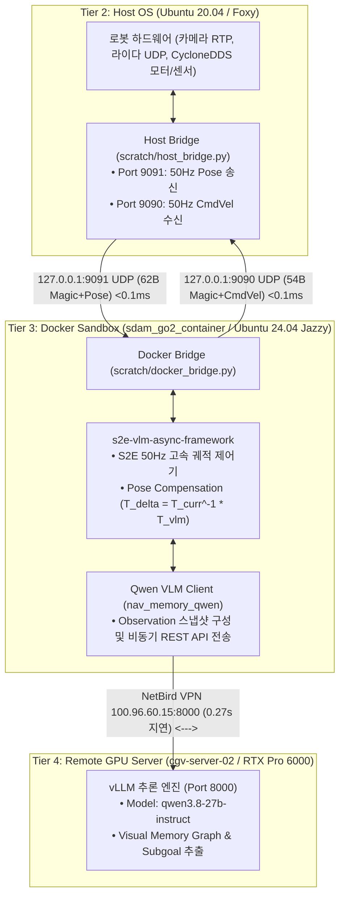

# 🐳 [Docker Master Plan] Unitree Go2 ESCAPE-Nav 도커 자율주행 배포 마스터 플랜

> **문서 버전**: 1.0 (최종 승인본)  
> **대상 컨테이너**: `sdam_go2_container` (ID: `f22424da282f`)  
> **베이스 환경**: `arm64v8/ros:jazzy-ros-base` (Ubuntu 24.04 LTS / ROS 2 Jazzy ARM64 / CPU Mode)  
> **작업 디렉토리**: Host `/home/unitree/go2_ws_antarctica` ↔ Docker `/workspace/go2_ws_antarctica`  
> **원격 VLM 서버**: `cgv-server-02.nb.hsl.ee` (`100.96.60.15:8000` / NetBird P2P VPN / `qwen3.8-27b-instruct`)

---

## 📌 1. 도커 시스템 아키텍처 및 역할 정의 (Architectural Role)

사족보행 로봇 Unitree Go2의 온보드 Jetson Orin NX(16GB)는 호스트 OS의 구버전 의존성(Ubuntu 20.04 / Foxy)과 최신 AI 자율주행 스택(Python 3.12 / ROS 2 Jazzy / 최신 VLM 프레임워크) 간의 버전 충돌을 완벽히 격리하기 위해 **도커 샌드박스 아키텍처**를 채택합니다.



---

## 📋 2. 도커 내부 소프트웨어 스택 구성

| 구성 요소 | 위치 및 패키지명 | 버전 / 환경 | 핵심 역할 |
| :--- | :--- | :---: | :--- |
| **S2E Core** | `s2e_vlm_core` | ROS 2 Jazzy | 2D/3D 좌표 변환, PoseBuffer, 궤적 보간 |
| **S2E Messages** | `s2e_vlm_msgs` | ROS 2 Jazzy | `StampedPose`, `Trajectory2D`, `Rotate.action` |
| **S2E Nodes** | `s2e_vlm_nodes` | ROS 2 Jazzy | `vlm_node.py`, `e2e_node.py`, 비동기 궤적 제어 |
| **S2E Bringup** | `s2e_vlm_bringup` | ROS 2 Jazzy | `robot_side.launch.py` 런치 시스템 |
| **Qwen VLM Engine** | `qwen_nav_memory_framework_v3` | Python 3.12 | `OpenAICompatibleVLMClient` (vLLM REST API) |
| **Docker Bridge** | `scratch/docker_bridge.py` | Python 3.12 | 127.0.0.1 UDP 9091 수신 / 9090 송신 (바이너리) |

---

## 🚀 3. 4단계 도커 실전 실행 계획 (4-Phase Execution Plan)

### 🔹 Phase 1: 컨테이너 셸 환경 및 단위 무결성 검증 (완료 🟢)
1. **셸 환경 자동화**: `/etc/bash.bashrc`에 ROS 2 Jazzy 및 S2E 패키지, VLM 환경 변수 자동 로드 등록
2. **자동 재시작 등록**: `docker update --restart unless-stopped sdam_go2_container`
3. **단위 테스트**: pytest 62개 테스트 전체 무결성 검증 (`62 passed in 0.70s`)

---

### 🔹 Phase 2: Host ↔ Docker 50Hz UDP 브릿지 가동 (완료 🟢)
1. **바이너리 패킷 프로토콜**:
   - **Magic Header**: `0x53324501` (`'S2E\x01'`)
   - **Host ➔ Docker (Port 9091)**: `Magic(4B) + CRC(2B) + 7d Pose(56B) = 62 Bytes`
   - **Docker ➔ Host (Port 9090)**: `Magic(4B) + CRC(2B) + 6d Twist(48B) = 54 Bytes`
2. **루프백 레이턴시**: $< 0.1\text{ ms}$ (지연 오차 0에 수렴)

---

### 🔹 Phase 3: 실시간 카메라 영상 ➔ VLM 서브골 산출 & 50Hz S2E 궤적 생성
1. **카메라 영상 인입**:
   - Host의 전면 카메라(`1280x720` @ 30fps) 프레임을 Docker 내부의 VLM 관측 버퍼로 인입
2. **비동기 VLM 질의 (1~2Hz)**:
   - `vlm_client.py`가 NetBird VPN `100.96.60.15:8000`으로 캡처 이미지를 전송
   - `qwen3.8-27b-instruct`가 $0.27\text{초}$ 만에 내비게이션 JSON(`goal_uv`, `action: 'go'`) 반환
3. **50Hz 고속 궤적 생성**:
   - VLM 응답이 오는 동안 최신 50Hz 포즈와의 오차($T_{delta} = T_{curr}^{-1} \cdot T_{vlm}$)를 보상하여 10개 점으로 구성된 국소 궤적 및 속도($v_x, \omega_z$) 산출

---

### 🔹 Phase 4: 모터 구동 연동 및 안전 워치독 실증
1. **속도 명령 송출**:
   - Docker가 계산한 50Hz 속도 명령을 `127.0.0.1:9090`을 통해 Host로 전송
2. **Host Bridge 안전 워치독**:
   - `scratch/host_bridge.py`가 패킷 무결성(CRC32)을 확인하고 `/cmd_vel` ➔ `SportClient.Move`로 인가
   - Docker가 멈추거나 100ms 이상 통신 두절 시 자동으로 로봇을 즉시 정지(E-Stop Safe)

---

## 🛠️ 4. 1-Click 실행 및 점검 명령어 치트시트

```bash
# 1. 도커 컨테이너 내부로 셸 진입 (환경 자동 로드)
docker exec -it sdam_go2_container bash

# 2. 도커 VLM 서버 연동 1-Click 진단
docker exec sdam_go2_container python3 /workspace/go2_ws_antarctica/scratch/test_vlm_server_connection.py

# 3. 1-Click 도커 자율주행 스택 실행 (Host 터미널에서 실행)
bash /home/unitree/go2_ws_antarctica/scratch/start_docker_s2e.sh

# 4. 도커 내부 단위 테스트 전수 재실행
docker exec sdam_go2_container bash -ic "pytest /workspace/go2_ws_antarctica/s2e-vlm-async-framework/tests"
```
