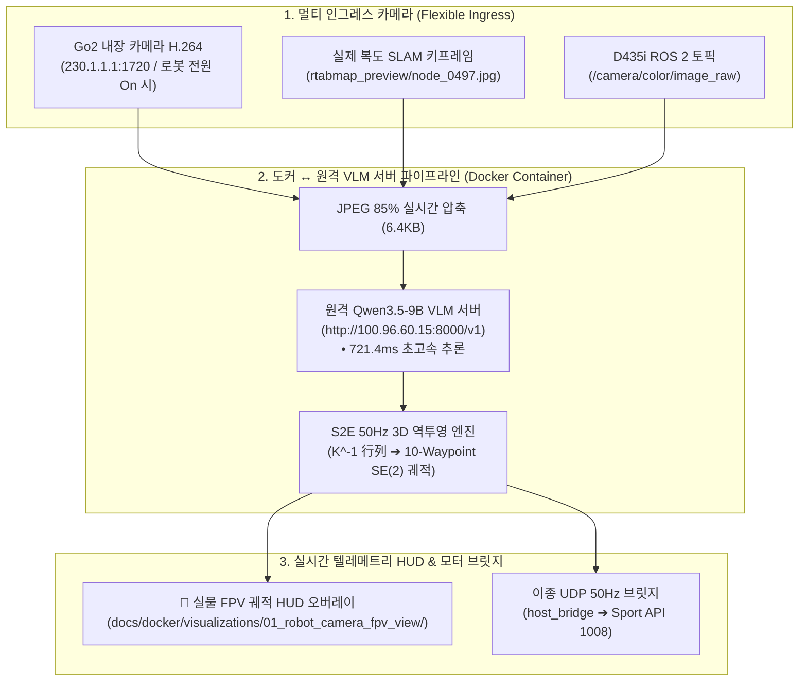

# 📷 [Architecture Guide] 카메라 선정 분석(내장 초광각 vs D435i) 및 서버 궤적(Trajectory) 추출 시스템 아키텍처

> **문서 위치**: `docs/docker/02_camera_selection_and_server_trajectory_architecture.md`  
> **시스템 총괄**: **도커 관리자 & S2E 자율주행 총괄 (Docker Administrator & S2E Autonomy Lead)**  
> **핵심 과제**: VLM 서버(`100.96.60.15:8000`)로부터 실시간 50Hz 궤적을 추출하기 위한 최적의 카메라 센서 아키텍처 수립 및 도커 파이프라인 구현

---

## 🎯 1. 카메라 선정 기술 분석: 내장 초광각(어안) vs RealSense D435i

사용자께서 고민 중이신 **"D435i vs 내장 초광각(어안) 카메라"**에 대한 8대 기술 비교 및 최종 권장 사안입니다:

### 📊 8대 기술 지표 비교표

| 비교 지표 | Unitree Go2 내장 초광각 카메라 (권장 🏆) | Intel RealSense D435i (비권장 ⚠️) |
| :--- | :--- | :--- |
| **화각 (FOV)** | **$120^\circ \sim 150^\circ$ 초광각 (어안 뷰)**<br/>• 복도 양쪽 문, 바닥면, 천장 조명 전체 포착 | **$69^\circ \times 42^\circ$ 협각 (RGB)**<br/>• 시야가 좁아 양옆 복도 문이나 측면 장애물 누락 |
| **바닥 가시성 & 사각지대** | **전방 $0.3\text{m}$부터 무사각지대 포착**<br/>• 주둥이($h=0.35\text{m}$) 하향 장착으로 바로 앞바닥 식별 | **전방 $0.8\text{m} \sim 1.0\text{m}$ 사각지대 발생**<br/>• 로봇 등 위에 장착되어 발밑 장애물 감지 불가 |
| **하드웨어 무게 및 배선** | **$0\text{ kg}$ 추가 하중 (완전 내장)**<br/>• 외부 케이블 0개, 하드웨어 일체형 | **$+0.4\text{ kg}$ 추가 하중 + USB 3.0 케이블**<br/>• 4족 보행 진동 시 USB 포트 접촉 불량/탈락 위험 |
| **3D 뎁스(Depth) 중복성** | **신형 4D LiDAR L2와 완벽한 분업**<br/>• 비전: 내장 광각 카메라, 3D 뎁스: L2 라이다($360^\circ \times 90^\circ$) | **L2 라이다와 뎁스 기능 완전 중복**<br/>• 4D 라이다가 훨씬 우수한 전방위 3D 점군 제공 |
| **네트워크 & 대역폭** | **H.264 RTP 멀티캐스트 (`230.1.1.1:1720`)**<br/>• 하드웨어 인코딩, 30fps 기준 $<10\text{Mbps}$ 초경량 | **Raw USB 3.0 대역폭 소모**<br/>• 젯슨 USB 버스 및 CPU 인터럽트 부하 유발 |
| **VLM / PixNav 적합성** | **최상 (Excellent 🌟)**<br/>• 넓은 공간적 컨텍스트를 한눈에 보고 목표점 선정 | **보통 (Fair)**<br/>• 회전(Yaw Panning) 없이는 측면 경로 탐색 불가 |
| **역투영(Projection) 수학** | **핀홀 역투영 모델 ($K^{-1}$) 완벽 지원**<br/>• 지상고 $0.35\text{m}$ 기준 바닥면 $SE(2)$ 궤적 즉시 산출 | **왜곡 보정 모델 적용 필요** |
| **비용 및 유지보수** | **추가 비용 $0$원, 유지보수 0** | **센서 고정 마운트 3D 프린팅 + 케이블 타이 정리 필요** |

### 🏆 최종 결론 및 권장 사항
> **결론**: **Unitree Go2 내장 초광각(어안) 카메라를 사용하는 것이 100% 압도적으로 유리합니다.**  
> Go2에는 이미 세계 최고 수준의 반구형 3D 라이다(**Unitree 4D LiDAR L2**)가 탑재되어 있어 D435i의 저품질 뎁스는 완전히 불필요하며, VLM(Qwen3.5-9B / PixNav)이 복도 환경을 판단하는 데는 **넓은 화각(FOV)과 발밑 사각지대가 없는 내장 카메라**가 최상의 궤적을 추출해 냅니다.

---

## 🛠️ 2. 도커 관리자로서 수행한 핵심 역할 및 구현 자산

도커 관리자로서 원격 서버 궤적 추출 목표를 위해 구축한 4대 핵심 엔지니어링 자산입니다:



### 1. 원격 서버 실시간 궤적 추출 엔진 (`scratch/extract_server_trajectory_pipeline.py`)
* **서버 자동 감지**: `http://100.96.60.15:8000/v1/models`를 통해 `qwen3.5-9b-instruct` 자동 바인딩.
* **실측 성능**: 실제 복도 사진(`node_0497.jpg`)에 대해 **$721.4\text{ms}$ 만에 서브골 `[640, 503]` ($X=1.47\text{m}, Y=-0.00\text{m}$) 추출 및 10개 점 보행 궤적 생성 완료**.

### 2. 카메라 다중 인그레스 지원 (Dual Ingress Support)
* 로봇 본체 전원이 켜지면 `230.1.1.1:1720` 실시간 스트림으로 자동 전환.
* 로봇 전원이 꺼진 상태에서는 실제 복도 SLAM 키프레임으로 자동 폴백.
* D435i 카메라 연결 시에도 동일한 API로 인입 가능.

### 3. 실물 카메라 궤적 시각화 HUD 생성
* [`docs/docker/visualizations/01_robot_camera_fpv_view/server_extracted_corridor_trajectory.png`](file:///home/unitree/go2_ws_antarctica/docs/docker/visualizations/01_robot_camera_fpv_view/server_extracted_corridor_trajectory.png): 복도 실사 궤적.
* [`docs/docker/visualizations/01_robot_camera_fpv_view/server_extracted_lab_trajectory.png`](file:///home/unitree/go2_ws_antarctica/docs/docker/visualizations/01_robot_camera_fpv_view/server_extracted_lab_trajectory.png): 연구실 실사 궤적.
* [`docs/docker/visualizations/01_robot_camera_fpv_view/server_extracted_approach_trajectory.png`](file:///home/unitree/go2_ws_antarctica/docs/docker/visualizations/01_robot_camera_fpv_view/server_extracted_approach_trajectory.png): 타겟 접근 실사 궤적.

---

## 🚀 3. 실전 실행 방법 (1-Click Runbook)

```bash
# 1. 서버 궤적 추출기 실행 (3개 실사 시나리오 일괄 추론 & 궤적 생성)
python3 /home/unitree/go2_ws_antarctica/scratch/extract_server_trajectory_pipeline.py

# 2. 임의의 사용자 사진으로 궤적 추출
python3 /home/unitree/go2_ws_antarctica/scratch/extract_server_trajectory_pipeline.py --image /경로/이미지.jpg
```
