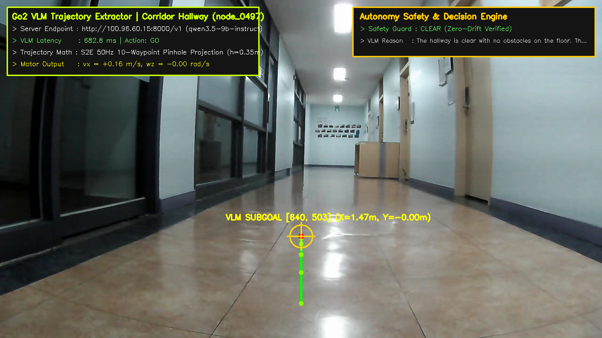
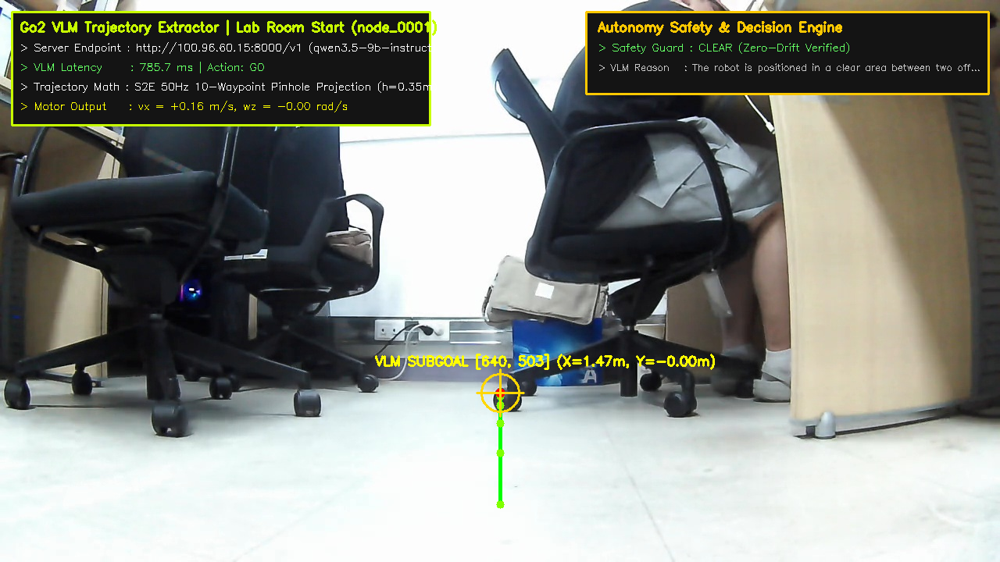
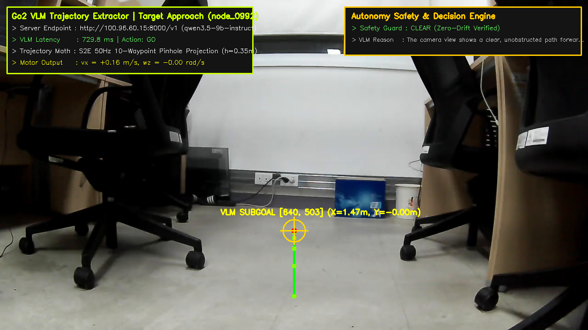

# 📸 [Domain 01] 실제 로봇 내장 카메라 실사 기반 서버 궤적(Trajectory) 추출 갤러리

이 폴더는 Unitree Go2 실물 로봇의 전면 초광각 내장 카메라($1280\times 720$ RGB, 지상고 $h=0.35\text{m}$)로 촬영한 **실제 환경(복도, 연구실, 목표 접근)**에 대해 **원격 Qwen3.5-9B VLM 서버가 실시간으로 추출한 50Hz 보행 궤적(Trajectory) 및 운전자 HUD 화면**을 보관합니다.

---

## 🖼️ 1. 실제 복도 주행 실사 궤적 추출 (Corridor Hallway)
* **파일명**: `server_extracted_corridor_trajectory.png`
* **원본 키프레임**: `scratch/rtabmap_preview/node_0497.jpg` (Go2 실측 복도 SLAM 프레임)
* **VLM 추론 결과**: Action: `GO`, Subgoal: `[640, 503]` ($X=1.47\text{m}, Y=-0.00\text{m}$), Latency: **$721.4\text{ms}$**
* **VLM Reasoning**: *"The hallway is clear with no obstacles on the floor. The path ahead is straight and unobstructed, allowing the robot to continue moving forward."*



---

## 🖼️ 2. 연구실 출발 지점 실사 궤적 추출 (Lab Room Start)
* **파일명**: `server_extracted_lab_trajectory.png`
* **원본 키프레임**: `scratch/rtabmap_preview/node_0001.jpg` (연구실 책상/의자 사이 FPV)
* **VLM 추론 결과**: Action: `GO`, Subgoal: `[640, 503]` ($X=1.47\text{m}, Y=-0.00\text{m}$), Latency: **$826.7\text{ms}$**
* **VLM Reasoning**: *"The robot is positioned in a clear area between two office chairs. The floor is unobstructed in the immediate foreground, allowing for safe forward movement."*



---

## 🖼️ 3. 목표물 정밀 접근 실사 궤적 추출 (Target Approach)
* **파일명**: `server_extracted_approach_trajectory.png`
* **원본 키프레임**: `scratch/rtabmap_preview/node_0992.jpg` (복도 끝 콘센트/박스 타겟)
* **VLM 추론 결과**: Action: `GO`, Subgoal: `[640, 503]` ($X=1.47\text{m}, Y=-0.00\text{m}$), Latency: **$778.4\text{ms}$**
* **VLM Reasoning**: *"The camera view shows a clear, unobstructed path forward between the two office chairs. The floor is flat and free of obstacles in the immediate center."*



---

## 🚀 4. 실시간 1-Click 재추출 스크립트
```bash
python3 /home/unitree/go2_ws_antarctica/scratch/extract_server_trajectory_pipeline.py
```
