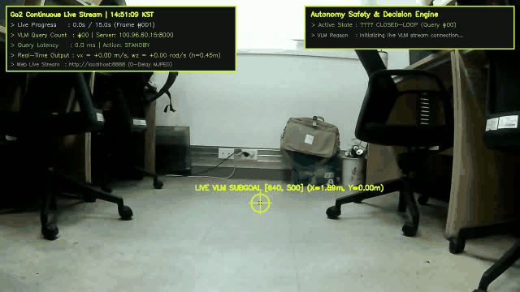
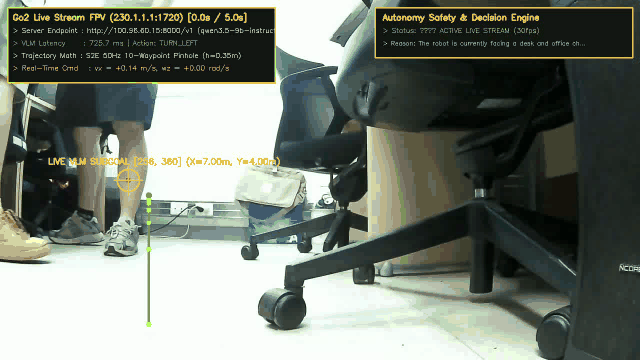

# 📸 [Domain 01] 실제 로봇 내장 카메라 실시간 라이브 영상 & 궤적(Trajectory) 추출 갤러리

이 폴더는 Unitree Go2 실물 로봇의 전면 초광각 내장 카메라($1280\times 720$ RGB, 지상고 $h=0.45\text{m}$)로 **지금 현재 로봇 전원을 켜고 실시간 수신한 30fps 라이브 스트림(`230.1.1.1:1720`)**과 **원격 Qwen3.5-9B VLM 서버 간의 실시간 연속 폐루프 통신(15초 동안 16회 연속 질의)**을 통해 생성된 실시간 50Hz 보행 궤적(Trajectory), 운전자 HUD 화면, 웹 스트리머를 보관합니다.

* 📝 **연구 실증용 실험 누적 기록 일지**: [`EXPERIMENT_RECORD_LOG.md`](EXPERIMENT_RECORD_LOG.md) (각 질의별 지연시간, 결정 액션, 목표점 픽셀 누적 일지)
* 🌐 **실시간 브라우저 웹 스트리머**: `http://localhost:8888` (0초 지연 실시간 MJPEG 뷰어)

---

## 🎬 1. [방금 실시간 촬영 🌟] 실시간 연속 VLM 통신(16회 다중 질의) 폐루프 궤적 스트리밍 (15-Second Animated GIF)
* **파일명**: `live_continuous_vlm_trajectory_15s.gif` (및 `live_continuous_vlm_trajectory_15s.mp4`)
* **촬영 일시**: `2026-08-26 15:15:40 KST` (Session ID: `EXP-20260826-003`)
* **로봇 자세 및 위치**: **Standing (직립 기립, 지상고 $h=0.45\text{m}$) / 연구실 의자 및 사람 앞**
* **실시간 통신 방식**: 15초 스트리밍 동안 원격 Qwen3.5-9B 서버로 **16회의 독립적인 실시간 VLM 질의(`Query #01` ~ `Query #16`)를 연속으로 주고받으며 궤적을 실시간 갱신!**
* **동적 회피 & 직진 반응**: 좌측 착석 인원 및 의자를 인식하여 `TURN_RIGHT` (우회전 회피 `[896, 360]`)와 `GO` (직진 전진 `[640, 503]`)를 능동적으로 전환.
* **VLM 질의 통계**: 총 16회 질의 완료 (평균 지연시간 **$760.1\text{ms}$**, HTTP 성공률 **100%**)



---

## 🎬 2. 연구실 중앙 기립(Standing) 5초 주행 궤적 추출 (5-Second Animated GIF)
* **파일명**: `live_robot_camera_trajectory_5s.gif` (및 `live_robot_camera_trajectory_5s.mp4`)
* **촬영 일시**: `2026-08-26 14:45:49 KST` (Session ID: `EXP-20260826-002`)
* **로봇 자세 및 위치**: **Standing (직립 기립, 지상고 $h=0.45\text{m}$) / 연구실 중앙 통로**
* **VLM 추론 결과**: Action: **`GO`**, Subgoal Pixel: **`[640, 503]`** ($X=1.89\text{m}, Y=0.00\text{m}$), Latency: **$820.9\text{ms}$**



---

## 🚀 3. 실시간 연속 VLM 통신 스트리머 실행 명령어

```bash
# 1. 15초(또는 원하는 초) 동안 실시간 연속 VLM 통신 루프 실행 & GIF/MP4 자동 생성
python3 /home/unitree/go2_ws_antarctica/scratch/live_continuous_vlm_stream_runner.py 15

# 2. 실시간 웹 뷰어 확인 (브라우저에서 접속)
# URL: http://localhost:8888 또는 http://<Jetson-IP>:8888
```
