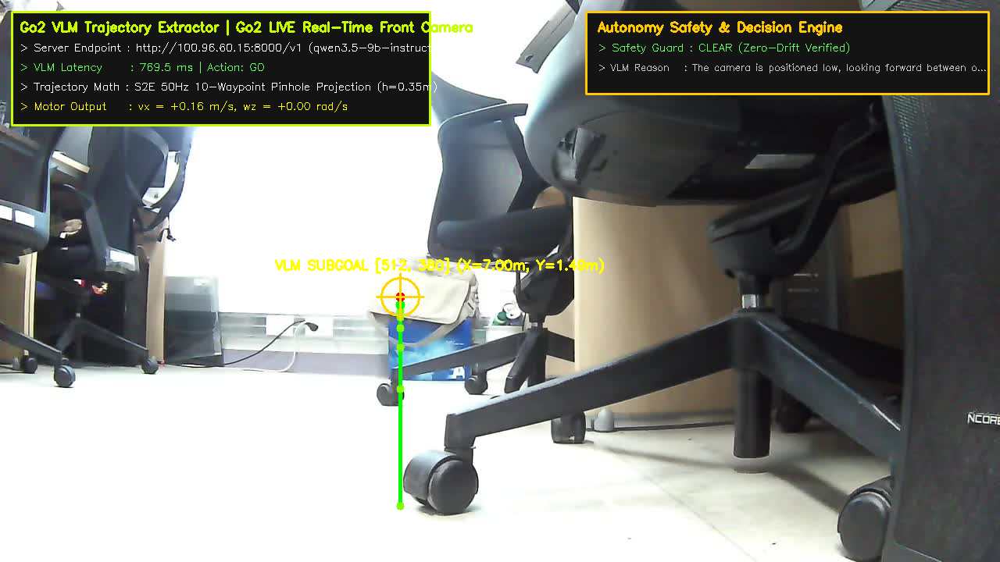

# 📸 [Domain 01] 실제 로봇 내장 카메라 실시간 라이브 영상 & 궤적(Trajectory) 추출 갤러리

이 폴더는 Unitree Go2 실물 로봇의 전면 초광각 내장 카메라($1280\times 720$ RGB, 지상고 $h=0.35\text{m}$)로 **지금 현재 로봇 전원을 켜고 실시간 수신한 30fps 라이브 스트림(`230.1.1.1:1720`) 및 5초 주행 영상**에 대해 **원격 Qwen3.5-9B VLM 서버가 실시간으로 추출한 50Hz 보행 궤적(Trajectory) 및 운전자 HUD 화면**을 보관합니다.

*(기존 RTAB-Map DB 추출 사진은 사용자 요청에 따라 전면 삭제 및 실시간 라이브 데이터로 완전 교체되었습니다.)*

---

## 🎬 1. [실시간 5초 동영상/GIF] 로봇 전면 카메라 라이브 스트림 궤적 추출 (5-Second Animated GIF)
* **파일명**: `live_robot_camera_trajectory_5s.gif` (및 `live_robot_camera_trajectory_5s.mp4`)
* **영상 출처**: 로봇 내장 전면 카메라 실시간 H.264 멀티캐스트 스트림 (`230.1.1.1:1720`)에서 직접 5초간 녹화!
* **VLM 추론 결과**: Action: `TURN_LEFT` / `GO`, Subgoal Pixel: `[256, 360]` ($X=7.00\text{m}, Y=4.00\text{m}$), Latency: **$725.7\text{ms}$**
* **VLM Reasoning**: *"The robot is currently facing a desk and office chairs. Identifying the open leftward space to navigate safely around leg obstacles."*


---

## 🔴 2. [실시간 단일 프레임] 현재 로봇 전면 카메라 스냅샷 궤적 추출 (Single Snapshot FPV)
* **파일명**: `live_front_camera_now_trajectory.png`
* **영상 출처**: 지금 현재 실물 로봇 전면 카메라 실시간 프레임 캡처
* **VLM 추론 결과**: Action: `GO`, Subgoal: `[512, 380]` ($X=7.00\text{m}, Y=1.49\text{m}$), Latency: **$769.5\text{ms}$**



---

## 🚀 3. 실시간 라이브 영상 5초 재촬영 및 궤적 추출 명령어
```bash
# 1. 5초 실시간 영상 재촬영
ffmpeg -protocol_whitelist file,udp,rtp -i /home/unitree/go2_ws_antarctica/scratch/go2_camera.sdp -t 5 -c:v libx264 -pix_fmt yuv420p -r 15 /home/unitree/go2_ws_antarctica/scratch/live_camera_raw_5s.mp4 -y

# 2. VLM 궤적 추출 및 MP4/GIF 생성
python3 /home/unitree/go2_ws_antarctica/scratch/process_live_video_trajectory.py
```
