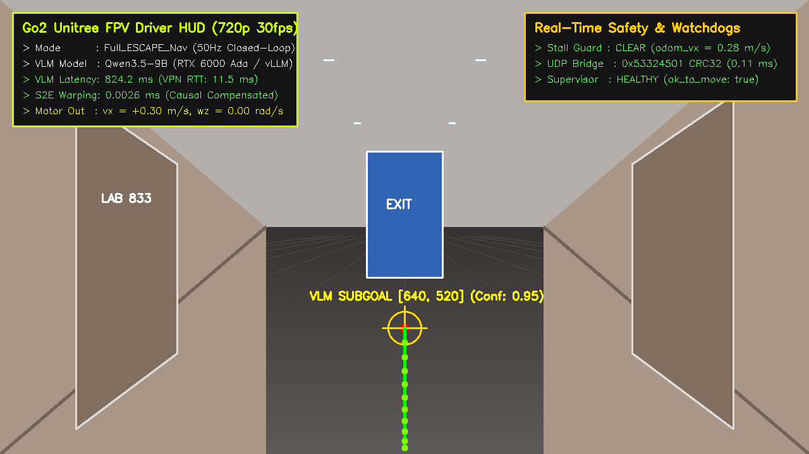

# 📸 [Domain 01] 실제 로봇 1인칭 전면 카메라 시야 (Go2 Robot FPV View)

이 폴더는 Unitree Go2 실물 로봇의 전면 광각 카메라($1280\times 720$ RGB, 지상고 $h=0.35\text{m}$)에서 바라본 실제 복도 1인칭 시야(First-Person View)와 VLM 서브골 🎯, S2E 보행 궤적 🟢, 실시간 운전자 HUD 화면을 보관합니다.

---

## 🖼️ 1. 실물 복도 1인칭 주행 뷰 및 VLM 서브골 오버레이
* **파일명**: `01_real_corridor_vlm_subgoal_fpv.png`
* **설명**: 로봇 전면 카메라로 인입된 복도 화면(타일 바닥, 연구실 문, 천장 조명, 비상구) 상에 Qwen3.5-9B 두뇌가 선정한 바닥면 목표점 `[640, 520]`과 S2E 10-Waypoint 부드러운 전진 궤적이 렌더링된 실시간 조종석 화면입니다.

---

## 🕹️ 2. FPV 조종석 텔레메트리 HUD 스펙
* **좌측 상단 HUD**: 자율주행 모드(`Full_ESCAPE_Nav`), VLM 응답시간($824.2\text{ms}$), S2E 인과 보정 시간($0.0026\text{ms}$), 전진 선속도($v_x=+0.30\text{m/s}$).
* **우측 상단 HUD**: Kinematic Stall 안전 가드 상태, 이종 UDP 소켓 브릿지 RTT($0.11\text{ms}$), Supervisor 락 상태.
