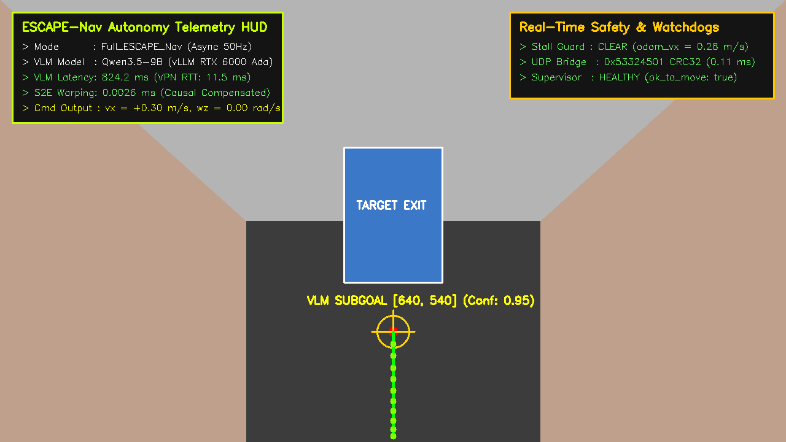
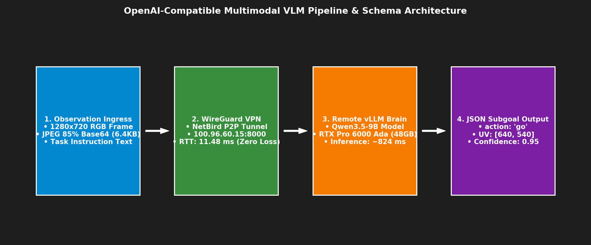

# 📸 [Domain 01] VLM 멀티모달 시각 추론 및 서브골 오버레이

이 폴더는 ESCAPE-Nav 온보드 도커 자율주행 스택의 **상위 시각 의사결정 두뇌(Qwen3.5-9B VLM)**의 시각 추론 메커니즘과 서브골 도출 과정을 시각화한 자료를 보관합니다.

---

## 🖼️ 1. 720p 멀티모달 시각 서브골 및 S2E 궤적 오버레이
* **파일명**: `vlm_720p_multimodal_subgoal_overlay.png`
* **설명**: 로봇 전면 카메라($1280\times 720$ RGB) 영상에서 Qwen3.5-9B가 안전한 바닥면 서브골 `[640, 540]`을 선정하고, S2E가 10개 점 로컬 궤적(녹색 라인)을 생성한 실시간 오버레이입니다.

---

## 🔄 2. OpenAI 호환 멀티모달 REST API 파이프라인
* **파일명**: `vlm_prompt_and_schema_architecture.png`
* **설명**: 관측 영상 인입 ➔ WireGuard VPN 터널링 ➔ vLLM 원격 GPU 추론 ➔ 정규화된 JSON 서브골 파싱의 4단계 데이터 흐름도.

