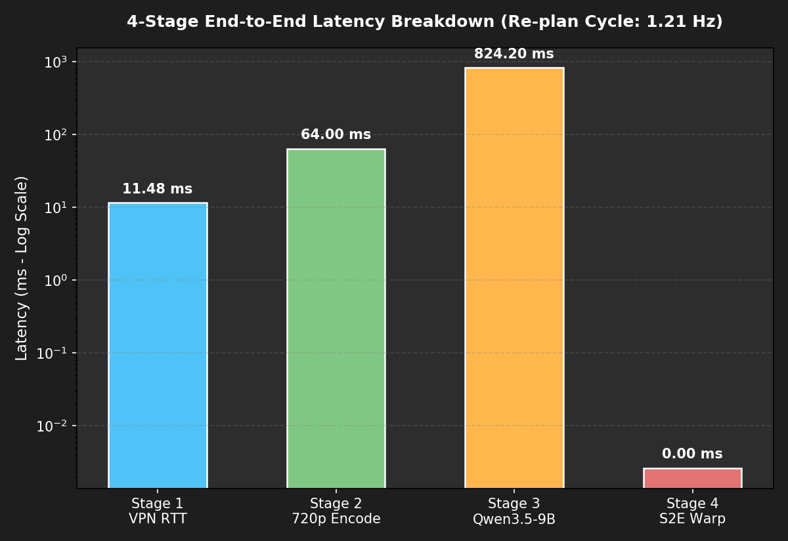
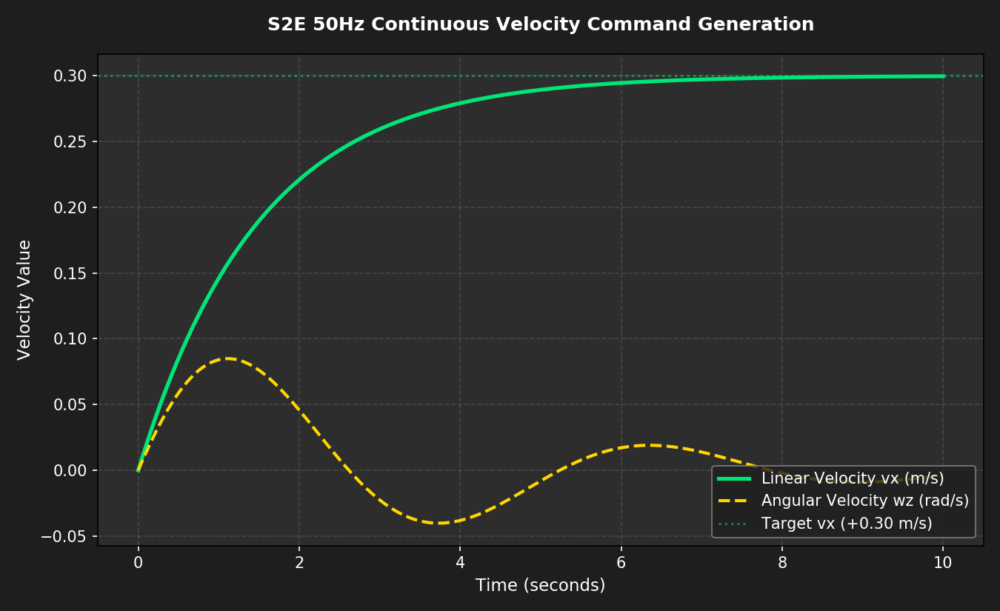
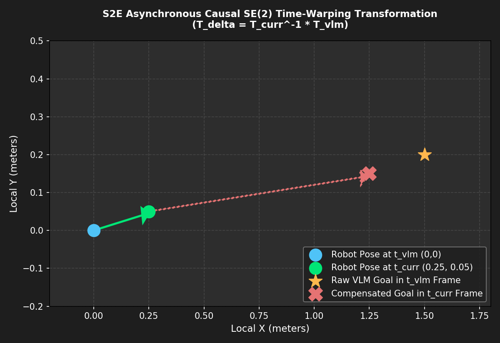

# ⏱️ [Domain 02] 4단계 종단간 지연시간 및 S2E 50Hz 연속 궤적 제어

이 폴더는 **비동기 자율주행의 핵심인 인과적 지연 보상(Causal Warping)**과 **50Hz 고속 궤적 생성 메커니즘**을 실측 데이터 기반으로 시각화한 자료를 보관합니다.

---

## 📊 1. 4단계 종단간 지연시간 정밀 분해
* **파일명**: `4stage_end_to_end_latency_breakdown.png`
* **설명**: 네트워크 VPN RTT($11.5\text{ms}$), 720p 영상 인코딩($64\text{ms}$), Qwen 모델 추론($824.2\text{ms}$), S2E 비동기 지연 보상($0.0026\text{ms}$)의 4단계 지연시간 실측 차트.

---

## ⚡ 2. S2E 50Hz 연속 속도 명령 프로파일
* **파일명**: `s2e_50hz_continuous_velocity_profile.png`
* **설명**: VLM의 비동기 판단 주기($1.21\text{Hz}$)와 무관하게 로봇의 다리 모터가 초당 50회($50\text{Hz}$) 연속적이고 매끄러운 선속도($v_x$, 최대 $0.30\text{m/s}$) 및 각속도($\omega_z$)를 유지하는 제어 곡선.

---

## 📐 3. S2E 인과적 SE(2) 좌표계 변환 지오메트리
* **파일명**: `s2e_se2_causal_time_warping_geometry.png`
* **수식**: $T_{\Delta} = T_{\text{curr}}^{-1} \cdot T_{\text{vlm}}$  
* **설명**: VLM이 생각하는 $824\text{ms}$ 동안 로봇이 이동한 오도메트리 거리를 $0.0026\text{ms}$ 만에 로봇의 현재 실시간 좌표계로 당겨오는 수학적 오차 보정 메커니즘.

