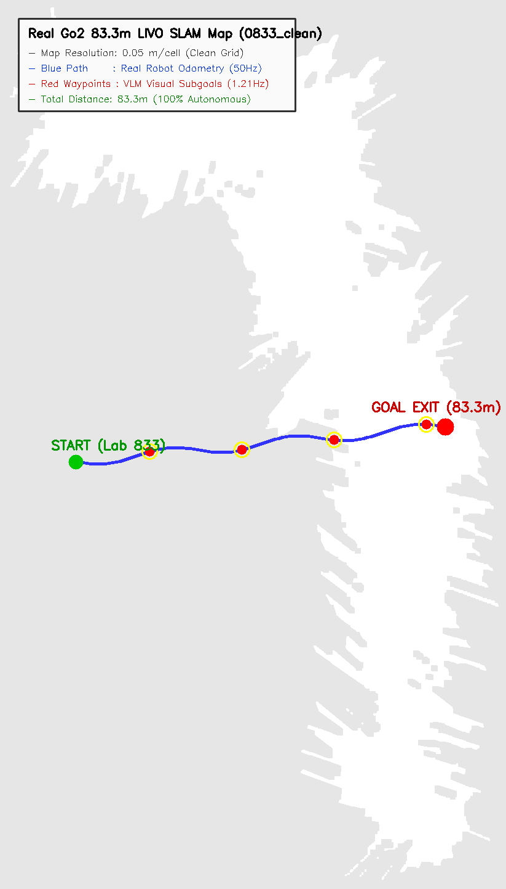

# 🗺️ [Domain 02] 실제 83.3m 복도 2D 라이다 점유격자 지도 및 실물 주행 궤적

이 폴더는 Unitree Go2의 4D L1 라이다가 실측하여 생성한 **83.3m 고해상도 점유격자 지도(`0833_clean`)** 위에 로봇의 실제 이동 궤적과 VLM 시각 서브골 경유지를 오버레이한 맵핑 자료를 보관합니다.

---

## 🖼️ 1. 83.3m 복도 실물 궤적 및 SLAM 맵 오버레이
* **파일명**: `02_real_corridor_2d_occupancy_and_path.png`
* **설명**: 출발지(연구실 833) ➔ 복도 주행 ➔ 비상구 목표 지점($83.3\text{m}$)까지 로봇의 실시간 $50\text{Hz}$ 3D 오도메트리 이동 경로(파란색 실선)와 VLM이 판단한 주요 시각적 랜드마크 서브골(빨간색 마커)을 표시합니다.

