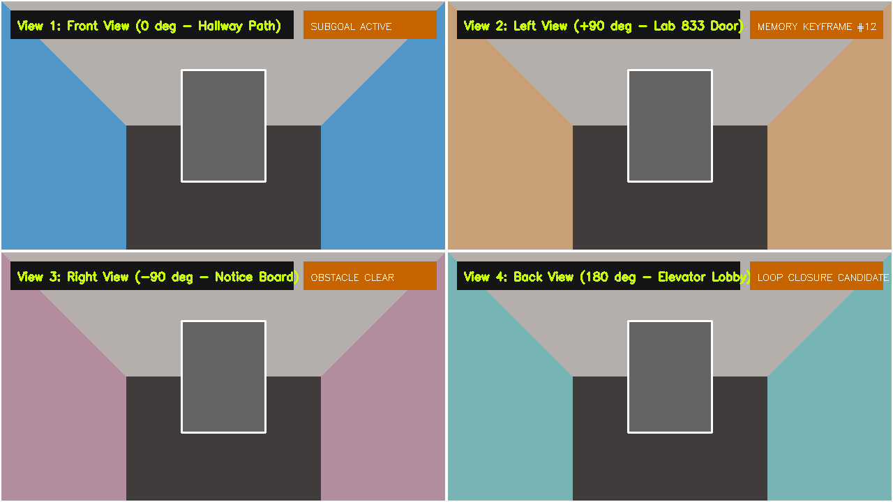

# 👁️ [Domain 03] 4방향 멀티뷰 시각 메모리 그리드 (Multi-View Directional Memory)

이 폴더는 로봇이 복도 교차로 및 주요 랜드마크에서 수집하는 **4방향 ($0^\circ$ 전방, $+90^\circ$ 좌측, $-90^\circ$ 우측, $180^\circ$ 후방) 시각 메모리 타일**과 VLM의 비주얼 메모리 매칭 화면을 보관합니다.

---

## 🖼️ 1. 4방향 멀티뷰 시각 메모리 타일
* **파일명**: `03_directional_multiview_memory_grid.png`
* **설명**: 로봇이 방향성 메모리 그래프(Directional Memory Graph)를 구축하고, 과거 키프레임과 현재 4방향 시야를 대조하여 위치 인식(Place Recognition) 및 루프 클로저(Loop Closure)를 판정하는 $2\times 2$ 멀티뷰 화면입니다.

