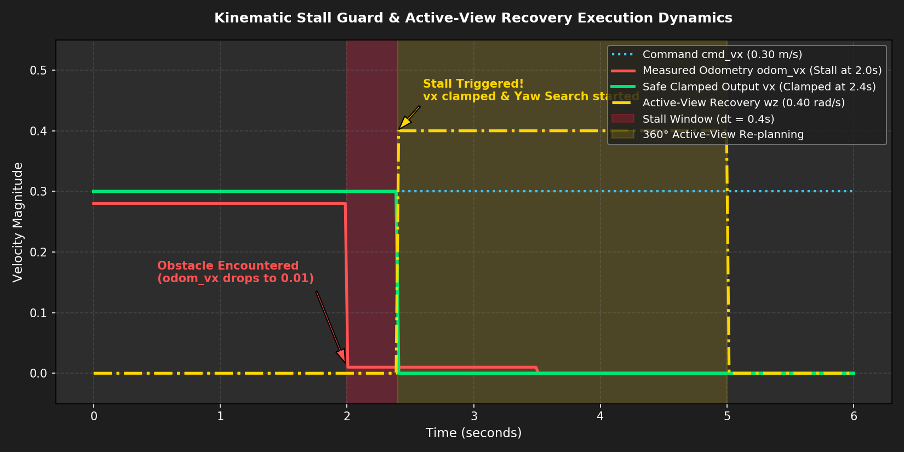
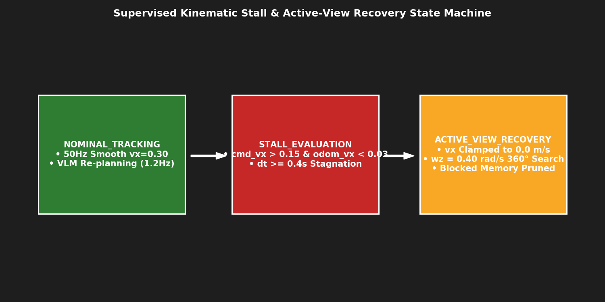

# 🛡️ [Domain 03] Kinematic Stall 정체 감지 및 360° 능동 회복 가드

이 폴더는 로봇이 막다른 골목(Dead-end)이나 장애물에 봉착했을 때 하드웨어 및 안전 사고를 방지하는 **Kinematic Stall 방어 가드**와 **Active-View 선회 탈출 메커니즘**을 시각화한 자료를 보관합니다.

---

## 📈 1. Kinematic Stall 속도 차단 및 회복 다이내믹스
* **파일명**: `kinematic_stall_velocity_clamping_dynamics.png`
* **설명**: $t=2.0\text{s}$에서 장애물에 막혀 실제 오도메트리 속도가 $0.01\text{m/s}$로 급락했을 때, $0.4\text{초}$ 감지 윈도우 후 $t=2.4\text{s}$에서 **전진 속도를 $0.0\text{m/s}$로 즉시 차단(초록색)**하고, **$0.40\text{rad/s}$의 제자리 360° 선회 탐색(노란색)**을 발동하는 동적 제어 그래프.

---

## 🔄 2. 능동 회복 상태 천이도 (State Machine)
* **파일명**: `active_view_recovery_state_machine.png`
* **설명**: `NOMINAL_TRACKING` ➔ `STALL_EVALUATION` ➔ `ACTIVE_VIEW_RECOVERY` 3단계 상태 천이 및 차단된 시각 메모리 간선(Edge) 페널티 부여 구조도.

