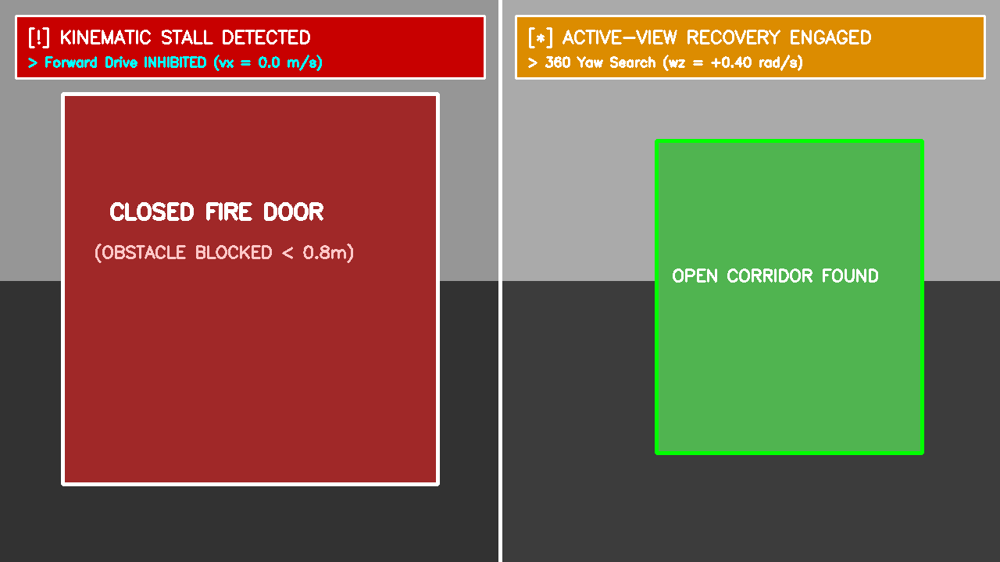

# 🛡️ [Domain 04] 장애물 봉착(Stall) 및 360° 능동 회복 실물 시야

이 폴더는 로봇이 복도 끝 막다른 벽이나 닫힌 방화문 등 물리적 장애물에 직면했을 때의 **1인칭 긴급 정체 감지 화면**과 **360° 제자리 선회 탈출 화면**을 보관합니다.

---

## 🖼️ 1. 장애물 정체 감지 및 능동 선회 탐색 분할 뷰
* **파일명**: `04_real_obstacle_stall_and_active_search.png`
* **설명**: 
  * **좌측 뷰 (Scene A)**: 닫힌 문 장애물에 가로막혀 $0.4\text{초}$ 내에 `KINEMATIC STALL DETECTED` 경고가 발동되고 전진 속도가 $0.0\text{m/s}$로 즉시 차단된 1인칭 화면.
  * **우측 뷰 (Scene B)**: 탈출을 위해 $\omega_z=+0.40\text{rad/s}$로 제자리 선회하며 새로운 열린 복도(Open Corridor)를 발견하는 능동 회복(Active-View Recovery) 시야 회전 화면.

